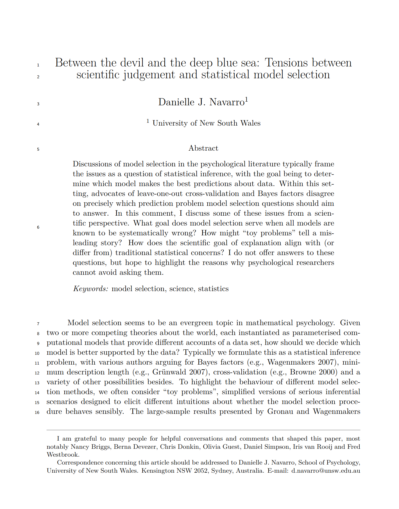

```{r include=FALSE}
hook_source <- knitr::knit_hooks$get('source')
knitr::knit_hooks$set(source = function(x, options) {
  x <- stringr::str_replace(x, "^[[:blank:]]?([^*].+?)[[:blank:]]*#<<[[:blank:]]*$", "*\\1")
  hook_source(x, options)
})
num_fmt <- scales::number_format(big.mark = ",")
```

```{r, echo=FALSE}

library(emo)


```
class: middle

## What are we going to cover?

- **Markdown:** a simple text-only format for writing documents
- **R markdown:** a tool for mixing R code with markdown 
- **Papaja:** Tool for writing APA style articles 

---

# Installing R Markdown

class: middle, inverse

- First things first

```{r, echo=TRUE, eval=FALSE}

install.packages("rmarkdown")

if(!requireNamespace("tinytex", quietly = TRUE)) install.packages("tinytex")

tinytex::install_tinytex()

```

---
# Installing R Markdown

```{r, echo=FALSE, out.width = "100%"}
knitr::include_graphics("open_rmd.png", dpi = 350)
```

--- 


## R markdown is a "chimera"

.pull-left[
```{r, echo=FALSE}
knitr::include_graphics("img/chimera.jpg", dpi = 350)
```
]

--

.pull-right[

<br>
### On the input side...

- Write text in markdown
- Insert code using R
- Write "metadata" with YAML
- Insert equation with LaTeX
]

---

## R markdown is a "chimera"

.pull-left[
```{r, echo=FALSE}
knitr::include_graphics("img/chimera.jpg", dpi = 350)
```
]

.pull-right[

<br>
### On the output side...

- Output to HTML
- Output to PDF
- Output to Word
- Many other variations too
]
---
lass: middle, inverse

.hand[Lots of little things to learn!<br>We'll start with markdown...]

---

class: middle, inverse

background-image: url("img/silhouette.jpg")
background-size: cover

.pull-left-narrow[
  .huge-bisque-number[1]
]
.pull-right-wide[
<br><br><br>
.larger[.embolden[Stating the problem...]]
```{r, echo=FALSE}
#knitr::include_graphics("img/blogdown.png", dpi = 1000)
```
]


---

class: middle

```{r, echo=FALSE}
knitr::include_graphics("img/word_document_surface.png", dpi = 300)
```


---

class: middle

```{r, echo=FALSE}
knitr::include_graphics("img/word_document_inside.png", dpi = 150)
```

---

class: middle

## Word documents are complicated

- A .docx file is a compressed folder with lots of files
- Your text is buried in with a lot of formatting information

---

class: middle

```{r, echo=FALSE, out.height="80%"}
knitr::include_graphics("img/html_document_surface.png")
```


---

class: middle

```{r, echo=FALSE}
knitr::include_graphics("img/html_document_inside.png", dpi = 150)
```


---

class: middle

## HTML documents are complicated

- Looks simple because I removed most formatting
- Still unpleasant to look at

---

class: middle, inverse

background-image: url("img/silhouette.jpg")
background-size: cover

.pull-left-narrow[
  .huge-bisque-number[2]
]
.pull-right-wide[
<br><br><br>
.larger[.embolden[Why markdown?]]
```{r, echo=FALSE}
#knitr::include_graphics("img/blogdown.png", dpi = 1000)
```
]


---

class: middle

## What do we want?

- Something that... you can write in **plain text**
- Something that... is **human readable**
- Something that... allows **formatting**
- Something that... can **build** to something pretty 

---


class: middle, inverse

.hand[Here's an example of a markdown document...]


---


.pull-left-wide[
```
# Introduction
Welcome to my **awesome** class. You will learn 
all kinds of useful things about R markdown. 
## Why should you care?
- Markdown is simple and reproducible
- You can make it pretty if you want to
- The R Markdown variant lets you add R code
```
]

---


class: middle, inverse

.hand[Here's what the output looks like...]


---

# Introduction

Welcome to my **awesome** class. You will learn 
all kinds of useful things about R markdown. 

## Why should you care?

- Markdown is simple and reproducible
- You can make it pretty if you want to
- The R Markdown variant lets you add R code


---

class: middle

## Notice the theme!

- My slides are written using markdown (...sort of)
- So the markdown output you see here matches the slides theme
- I'll talk about modifying themes later  

---
# What does this have to do with open science?

Using Markdown to generate publications, reports, websites, etc. will:
* Make dynamically updating them with new results easier
* Reduce errors from manually entering results 
* Create new venues for science communication

Using Markdown to organize your code will:
* Allow you to organize and annotate your analyses 
* Make it easier for others to tell what you did, aiding reproducibility 


---

class: middle, inverse

.hand[Okaaaay, but this seems really boring?]

---

class: middle, inverse

.hand[... hm, yeah, but let me show you where it takes you later!]


---

class: middle

## Professional websites

```{r, echo=FALSE, out.height="70%", out.width="50%"}
knitr::include_graphics("img/example_professional_site.png")
```

---

class: middle

## Visual blogs

```{r, echo=FALSE, out.height="70%", out.width="50%"}
knitr::include_graphics("img/example_visual_blog.png")
```

---

class: middle

## Books

```{r, echo=FALSE, out.height="70%", out.width="80%"}
knitr::include_graphics("img/example_book.png")
```


---

class: middle

## Academic papers

```{r, echo=FALSE, out.height="70%", out.width="60%"}

```

---

class: middle

## Slide decks

```{r, echo=FALSE, out.height="70%", out.width="80%"}

```

---

class: middle, inverse

background-image: url("img/silhouette.jpg")
background-size: cover

.pull-left-narrow[
  .huge-bisque-number[3]
]
.pull-right-wide[
<br><br><br>
.larger[.embolden[Getting ready]]
```{r, echo=FALSE}
#knitr::include_graphics("img/blogdown.png", dpi = 1000)
```
]

---


class: middle, inverse

background-image: url("img/silhouette.jpg")
background-size: cover

.pull-left-narrow[
  .huge-bisque-number[4]
]
.pull-right-wide[
<br><br><br>
.larger[.embolden[Starting markdown]]
```{r, echo=FALSE}
#knitr::include_graphics("img/blogdown.png", dpi = 1000)
```
]


---

class: middle, inverse

.hand[Okay, let's dive into the details...]


---
## Emphasising text

--
.pull-left[
<br><br>
### What you type...
<br>
```
this is *italics*
this is **bold**
this is ***bold italics***
```
]
--
.pull-right[
<br><br>
### What you get...
<br>

this is *italics*

this is **bold**

this is ***bold italics***
]

---

## Creating lists

--
.pull-left[
<br><br>
### What you type...
<br>
```
- unnumbered lists
- look like this
1. numbered lists
2. look like this
```
]
--
.pull-right[
<br><br>
### What you get...
<br>

- unnumbered lists
- look like this

1. numbered lists
2. look like this
]

---

## Creating headings

--
.pull-left[
<br><br>
### What you type...
<br>
```
# Level 1 heading
## Level 2 heading
### Level 3 heading
```
]
--
.pull-right[
<br><br>
### What you get...
<br>

# Level 1 heading
## Level 2 heading
### Level 3 heading
]


---

class: middle, inverse

.hand[Demonstration:<br>Write a markdown document]

---

class: middle, inverse

.hand[Do it yourself!]

- create your own RMD
- open a new plain markdown document
- save it as `my_first_markdown.md`
- write some markdown, build it to HTML file
- try to use all these markdown features


---

class: middle, inverse

background-image: url("img/silhouette.jpg")
background-size: cover

.pull-left-narrow[
  .huge-bisque-number[5]
]
.pull-right-wide[
<br><br><br>
.larger[.embolden[More markdown]]
```{r, echo=FALSE}
#knitr::include_graphics("img/blogdown.png", dpi = 1000)
```
]


---

## Inserting hyperlinks

--
.pull-left-wide[
<br><br>
### What you type...
<br>
```
https://placekitten.com
[Placekitten](https://placekitten.com)
```
]
--
.pull-right-narrow[
<br><br>
### What you get...
<br>
https://placekitten.com

[Placekitten](https://placekitten.com)
]


---

## Inserting local images

--
.pull-left[
### What you type...
```

```
]
--
.pull-right[
### What you get...

]


---

## Inserting images from the web

--
.pull-left[
### What you type...
```

```
]
--
.pull-right[
### What you get...

]


---

## Using blockquotes

--
.pull-left[
<br><br>
### What you type...
<br>
```
This is normal text
> This is a block quote
```
]
--
.pull-right[
<br><br>
### What you get...
This is normal text
> This is a block quote
]

---

## Using nested lists

--
.pull-left[
<br><br>
### What you type...
<br>
```
1. First item in list 
2. Second item in list
  - first item in sub-list
  - second item in sub-list
3. Third item in list
```
]
--
.pull-right[
<br><br>
### What you get...
<br>
1. First item in list 
2. Second item in list
  - first item in sub-list
  - second item in sub-list
3. Third item in list
]


---

class: middle, inverse

background-image: url("img/silhouette.jpg")
background-size: cover

.pull-left-narrow[
  .huge-bisque-number[6]
]
.pull-right-wide[
<br><br><br>
.larger[.embolden[R markdown]]
```{r, echo=FALSE}
#knitr::include_graphics("img/blogdown.png", dpi = 1000)
```
]

---

class: middle

## What do we want?

- Something that... lets you write text in **markdown**
- Something that... lets you include **R code** (e.g. for data vis)
- Something that... can **build** to HTML, PDF, Word, etc


---

class: middle, inverse

.hand[Demonstration:<br>Write an R markdown document]

---

class: middle

## Let's dissect the document we just wrote!

```{r, echo=FALSE, out.height="70%", out.width="60%"}
knitr::include_graphics("img/my_first_rmd_plain.png", dpi = 200)
```

---

## The part inside ` --- ` is the "YAML header"

```{r, echo=FALSE, out.height="70%", out.width="60%"}
knitr::include_graphics("img/my_first_rmd_yaml.png", dpi = 200)
```


---

class: middle

<h2>The part inside <code>&#96;&#96;&#96;{r}</code> is R code</h2>

```{r, echo=FALSE, out.height="70%", out.width="60%"}
knitr::include_graphics("img/my_first_rmd_r.png", dpi = 200)
```

---


## The rest is markdown 

```{r, echo=FALSE, out.height="70%", out.width="60%"}
knitr::include_graphics("img/my_first_rmd_markdown.png", dpi = 200)
```

---

class: middle, inverse

background-image: url("img/silhouette.jpg")
background-size: cover

.pull-left-narrow[
  .huge-bisque-number[7]
]
.pull-right-wide[
<br><br><br>
.larger[.embolden[Custom documents]]
```{r, echo=FALSE}
#knitr::include_graphics("img/blogdown.png", dpi = 1000)
```
]


---

## The YAML header is used for customisation

```{r, echo=FALSE, out.height="70%", out.width="60%"}
knitr::include_graphics("img/my_first_rmd_yaml.png", dpi = 200)
```


---

class: middle

## Wait... what's the YAML acronym?

- Originally: "Yet Another Markup Language"
- Later: "YAML Ain't Markup Language"
- ... it really doesn't matter `r emo::ji("face_with_rolling_eyes")`

---

## Output HTML only
```
---
title: "My First R Markdown Document"
author: "Danielle J. Navarro"
date: "10/02/2021"
output: html_document
---
```

---

## Output HTML and PDF

```
---
title: "My First R Markdown Document"
author: "Danielle J. Navarro"
date: "10/02/2021"
output:
  pdf_document: default
  html_document: default
---
```

--

<br>
- Notice the indentation
- YAML is *very* picky about this


---

class: middle, inverse

.hand[Demonstration!]


---

## Themes for HTML documents

```
---
output: 
  html_document:
    theme: readable
---
```

--

**Possible themes**: default, cerulean, journal, flatly, darkly, readable, spacelab, united, cosmo, lumen, paper, sandstone, simplex, yeti

---

## Table of contents

```
output:
  html_document:
    toc: true
    toc_float: true
```


---


class: middle, inverse

.hand[Do it yourself!]

- Practice editing the YAML header
- Try creating different outputs and themes
- Try creating a floating table of contents
- Try to get it to not float!


---

class: middle, inverse

background-image: url("img/silhouette.jpg")
background-size: cover

.pull-left-narrow[
  .huge-bisque-number[8]
]
.pull-right-wide[
<br><br><br>
.larger[.embolden[Inserting equations]]
```{r, echo=FALSE}
#knitr::include_graphics("img/blogdown.png", dpi = 1000)
```
]


---

## An overview

- Anything inside dollar signs `$` is treated as "inline" maths
- Anything inside two dollar `$$` is a standalone equation
- Whitespace matters: `$x$` is an equation, `$x $` is not
- Equations follow "LaTeX" rules

---

## Equations are special

.pull-left[
```
This $x^2$ is inline
This equation is standalone
$$
a^2 + b^2 = c^2
$$
```
]
--
.pull-right[
This $x^2$ is inline

---
# Hiding the Mess

- Options for code chunks

- At the start of your document in a code chunk or within each chunk `{r}`

```{r, echo=FALSE, out.width = "100%"}
knitr::include_graphics("cleanup_code.jpeg", dpi = 1000)
```

---

# Visual Editor

-One fairly new feature (and one reason we're using RStudio today!) is their new [visual markdown editor](https://rstudio.github.io/visual-markdown-editing/). It's basically an ultra powerful hybrid of Markdown and Microsoft Word. But be warned, it's a little buggy if you frequently switch editing modes. 

-People write whole books in Markdown, and this may make that seem a little more achievable. For example, the new visual editor allows [easy citation management with a Zotero library](https://www.rstudio.com/blog/rstudio-1-4-preview-citations/) (if we have time, I'll show you this on my computer). 
---


# Cheat Sheet


- https://www.markdownguide.org/cheat-sheet/


---

# The Future

- [Quarto](https://quarto.org/) is a sequel to RMarkdown developed by RStudio. 

- While they are still maintaining RMarkdown, a lot of new development will probably happen in Quarto.

- The differences between RMarkdown and Quarto are not huge for R users ([overview here](https://yihui.org/en/2022/04/quarto-r-markdown/)), and there is much more RMarkdown documentation available, which is why I taught it today. 

I encourage you to keep tabs on Quarto's development and try it out, especially if you're not an R user. 

---
class: middle, inverse

# Papaja

.pull_right[
```{r, echo=FALSE, out.width = "100%"}
knitr::include_graphics("papaja_hex.png", dpi = 1000)
```
]

---

# Installing Papaja

--

```{r}

# Install latest CRAN release
#install.packages("papaja")

# Install remotes package if necessary
#if(!requireNamespace("remotes", quietly = TRUE)) install.packages("remotes")

# Install the stable development version from GitHub
#remotes::install_github("crsh/papaja")

# Install the latest development snapshot from GitHub
#emotes::install_github("crsh/papaja@devel")


```

---

# Open Papaja

```{r, echo=FALSE, out.width = "100%"}
knitr::include_graphics("open_papaja.png", dpi = 1000)
```

