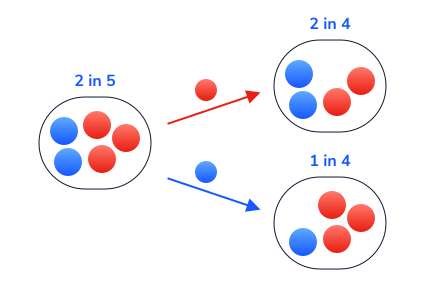

```{r setup, include=FALSE}

library(tidyverse)
options(htmltools.dir.version = FALSE)
knitr::opts_chunk$set(
  fig.width=9, fig.height=3.5, fig.retina=3,
  out.width = "36%",
  cache = FALSE,
  echo = TRUE,
  message = FALSE, 
  warning = FALSE,
  fig.show = TRUE,
  hiline = TRUE
)

hook_source <- knitr::knit_hooks$get('source')
knitr::knit_hooks$set(source = function(x, options) {
  x <- stringr::str_replace(x, "^[[:blank:]]?([^*].+?)[[:blank:]]*#<<[[:blank:]]*$", "*\\1")
  hook_source(x, options)
})
```

```{r xaringan-themer, include=FALSE, warning=FALSE}
library(xaringanthemer)
library(tidyverse)

style_solarized_dark(
  header_font_google = google_font("Aleo"),
  header_h1_font_size = "36px",
  header_color = "black",
  text_font_google = google_font("Aleo"),
  text_font_size = "28px",
  text_color = "black", 
  background_color = "orange", 
  code_font_google = google_font("Share Tech Mono"),
  extra_css = list(
    ".remark-slide-content h2" = list(
      "margin-top" = "2em",
      "margin-bottom" = "2em"
    ),
    .big = list("font-size" = "150%"),
    .small = list("font-size" = "75%"),
    .subtle = list(opacity = "0.6"),
    ".countdown-has-style h3, .countdown-has-style h3 ~ p, .countdown-has-style h3 ~ ul" = list(
      "margin" = "0"
    ),
    ".countdown-has-style pre" = list(
      "margin-top" = "-10px"
    ),
    "p .remark-inline-code" = list(
      "background-color" = "orange",
      "padding" = "2px 2px",
      "margin" = "0 -2px"
    ),
    blockquote = list("margin-left" = 0),
    "em" = list(color = "#2aa198")
  ),
)

```

# Probability Warm-up

1. What is probability of drawing the ace of spades from a fair deck of cards?

2. What is the probability of drawing an ace of any suit?

3. You are going to roll some dice twice. What is the chance you roll double 1s?

4. What is the chance that a live specimen of New Jersey Devil will be found?

5. Who is more likely to be a victim of a street robbery, a young man or an old lady?

6. Yesterday the whether forecaster said that there was a 30% chance of rain today, and it rained today. Was she right or wrong?
---
class: center, inverse

background-image: url("weather.png")

---
# Different Ways of Thinking About Probability

<br>
<br>

> Classical probability is based on information we have

 - Coin tosses
  
- Dice
---
```{r, fig.align='center', echo=FALSE, warning=FALSE,  out.heigh="10%", out.width = "50%"}


```

$$ P(death) = \frac{P(number of deaths)}{P(total)} $$
---
# Different Ways of Thinking About Probability

-  Frequentist 

  - Relative frequency -> Proportion of times an event occurs out of all occasions it could have occurred
  
  - Over the long-run (many repetitions) what is the probability of X event?

---
# Coin Flips

```{r, fig.align='center', echo=FALSE, warning=FALSE,  out.heigh="100%", out.width = "100%"}

knitr::include_url("https://seeing-theory.brown.edu/basic-probability/index.html")
```
---
# Frequentist and Bayesian Views of Probability

-  Bayesian (Personal belief)

  - In what realistic setting would we actually perform the same experiment infinite times?
  
  - Many probability questions concern the outcome of a singular trial rather than hypothetical repeated trials, and decision makers with the same information may differ
  
      - What is the likelihood that Russia will use a nuclear weapon against Ukraine?

---
# What is Probability Theory? 

```{r, fig.align='center', echo=FALSE, warning=FALSE,  out.height="20%", out.width = "80%"}

knitr::include_graphics("prob.JPG")
```
---
# What is Probability Theory

<br>
<br> 

Probability theory is the study of __random processes__

- Is used to characterize events that are uncertain in advance


```{r, fig.align='center', echo=FALSE, warning=FALSE,  out.width = "50%"}


```

---
# Random Processes: Intuition

.pull-left[

- Let's flip a fair coin  

```{r}

set.seed(973)

coinflips <- function(x) {
    flip <- rbinom(x, 1, 0.5)
    flip <- ifelse(flip==1, "Tails", "Heads")
    return(flip)
}


```

  1.   Can you tell me what the outcome will be?   

  2.  If we were to flip a fair coin many many times, would you be able to tell the proportion of times that we would obtain heads?  
]
--
.pull-right[
- If answer to first question is "NO" 


AND

- Answer to second question is "YES"   


THEN  

- You are dealing with a random process  
]
---
# Definition

<br>
<br>

> Random processes are __mechanisms__ that produce (probabilistic) outcomes...  from __a world of possible__ outcomes...  with some degree of __uncertainty__ but with __regularity__.  
---
# Probability Terminlogy  

- __Experiment__ or __Trial__:
    - Any activity that produces or observes an outcome

- __Sample space:__ $\Omega$ 

  - The set of all possible outcomes

- __Outcome:__ $\omega$  

  - Possible realization of the random process  

- __Event:__ $A$, $B$, $C$, etc. 

  - A given outcome or set of outcomes  

---
# Examples of Random Processes

- Random assignment of $N$ individuals to an experimental condition    

<br>

- Random draw of a sample of $n$ individuals from a population of $N$ individuals  

<br>

- Rolling a die  

---
# Illustration: Random Assignment 

- We randomly assigned an individual to a Treatment (T) vs. Control (C)  

- Sample space?   We could express $\Omega$ in the following ways:   

  - $\Omega = \{\mathrm{Treatment, \: Control\}}$  
  
  - $\Omega = \{\mathrm{T, \: C\}}$  

- What if we assigned two individuals to Treatment (T) vs. Control (C)   

  - $\Omega = \{\mathrm{TT, \:TC, \:CT, \:CC}\}$   
---
# Events  

An _event_ is a subset of the sample space $\Omega$ and corresponds to the realization of one or more than one outcomes $\omega$   

# Example  


- Let $\Omega = \{\mathrm{TT, \:TC, \:CT, \:CC}\}$   


- We could let $A$ be __event__ that both individuals are assigned to the same experimental condition  

- We could write:  

  - $A = \{TT, \: CC\}$ 

- Another example?  

---
# Notations   

```{r echo=FALSE,out.width="100%",fig.cap="",fig.show='hold',fig.align='center'}

knitr::include_graphics('images/prob_notation.png')

``` 
---
# Practice with Events  

- We randomly assign 8 participants to T vs. C  

  - Possible outcome:  $\omega =  \mathrm{TTTTCCTC}$
  
  - Sample space: Set of all possible strings of length 8 of T's and C's  
---
# Practice with Events  

- Let's __randomly__ generate a possible outcome $\omega_j$ in R \vspace{.40cm}

```{r comment = NA}
sample(c("T", "C"), 
       size = 8, 
       replace = TRUE)
```

- In the background, does R draw from this sample space?     

- NO: Keep in mind that R draws an outcome $\omega_j$ from $\Omega = \{T, C\}$ 8 times in a row with replacement  

---
# Random Sampling With and Without Replacement

A __simple random sample__ requires that each individual in the population has an equal chance of being selected.

An __independent random sample__ requires that each individual has an equal chance of being selected and that the probability of being selected stays constant from one selection to the next if more than one individual is selected.

__Random sampling__: A sampling process/technique where both the requirements of equal chance and constant probability are met.
---
# More practice with events  

- Let $C_1$ be the event that the first participant is assigned to the control condition  

  - e.g., $\{\mathrm{CTCTCTTT}\}$, $\{\mathrm{CTTTTTTC}\}$, or $\{\mathrm{CCCCCTTC}\}$   
  

- We could express this more generally:  

  - $C_1 = \{(C, \: \omega_2, \: ..., \: \omega_8) : \omega_j \in \{\mathrm{T, C\}} \: \mathrm{for} \: 2 \leq j \leq 8\}$  
---
# More practice with events   

- Let $C_i$ be the event that the $i$th participant is assigned to the control condition, for $i = 1, \:2,\: 3,\: ...,\: 8$, and use $C_i$ to define other events.   

- Let $A$ be the event, that at least one participant was assigned to control condition. We can write:   

\begin{equation}
A = C_1 \cup C_2 \cup ... \cup C_8
\end{equation}

i.e., Participant 1 or participant 2 or ... or participant 8 was assigned to control   

- We could have written:  

\begin{equation}
A = \bigcup^8_{i = 1} C_i  
\end{equation}
---
# More practice with events    

\begin{equation}
B = \bigcap^8_{i = 1} C_i
\end{equation}

In plain English?  

---
# Naive probability of an event  

Let $A$ be an event with a finite sample space $\Omega$. The _naive probability_ of $A$ is 
\begin{equation}
P(A) = \frac{|A|}{|\Omega|} 
\end{equation}

in which |A| is the number of possible outcomes $\omega$ that satisfy A, and |$\Omega$| is the total number of possible outcomes $\omega$ within $\Omega$.   

# Wait, why is this naive?  

- Requires $\Omega$ to be finite   

- Requires each possible outcome $\omega$ to have the same weight    

  - This can be misleading!  

  - e.g., polls, attrition
---
# Probability model: Definition  

- The __probability model__ of a random phenomenon is the mathematical representation of this phenomenon. It includes:      

  - All of the possible outcomes included in the sample space  
  
  - The probability of each possible probabilistic outcome $\omega$ included in the sample space  

- This is all that there is to know about a random phenomenon  

- Very powerful: Contain enough information to predict with certainty the percentage of times that an outcome $\omega$ will happen if we repeat the random generative process many (many, many, many) times   
---
# Probability model: Intuition  

Overall, the probability of an outcome $\omega$ is the percentage of times that this outcome will happen if we repeat the random generative process: 

- Over and over again  

- Independently  

- Under the exact same conditions  
---
# Probability Model: Example  

- The probability model of rolling a fair die includes:   

  - Its sample space: $\Omega = \{1,\:2,\:3,\:4,\:5,\:6\}$  
  
  - The probability of each possible outcome $\omega_j$ is: $\mathrm{P}(w_j) = \frac{1}{6}$   


If we wonder what are the possible outcomes of rolling a fair die, we simply need to look at the probability model to realize that there are 6 possible outcomes. 

If we wonder how likely it is that we will get a 6 after rolling a fair die, again, we can look at its probability model and learn that the probability of getting a 6 is $\frac{1}{6}$   
---
class: center, inverse

background-image: url("fightclub.jpeg")

# Rules of Probability

---
# Probability Rule # 1  

- Probabilities take values between 0 and 1 (inclusive)   

  - For some event $A$: $$0 \leq P(A) \leq 1$$

- Probability cannot be negative    

- Probability cannot be greater than 1
---
# Probability Rule# 2  

- Since $\Omega$ is the entire sample space, $$P(\Omega) = 1$$  

- e.g., What is the probability of getting an even or an odd number after rolling a fair die?  

---
# Probability Rule #3  

## Complement

- The complement of event $A$ is referred to as $A^c$  

- By definition $$ P(A) + P(A^c) = 1$$  

- This implies $$ P(A^c) = 1 - P(A)$$

```{r, fig.align='center', echo=FALSE, warning=FALSE,  out.width = "50%"}

knitr::include_graphics("union-venndiagram.svg")
```

---
#Probability Rule # 4

 Probability Rule #4

- Addition Rule

  > If there are two events, A and B, the addition rule states that the probability of event A or B occurring is the sum of the probability of each event minus the probability of the intersection:

.pull-left[

- Mutually Exclusive

P(A or B) = P(A) + P(B)
```{r, fig.align='center', echo=FALSE, warning=FALSE,  out.width = "50%"}

knitr::include_graphics("union-venndiagram.svg")
```

.pull-right[
## Non-mutually Exclusive
```{r, fig.align='center', echo=FALSE, warning=FALSE,  out.width = "50%"}


```
]

---
# Union

> The union of two sets encompasses any element that exists in either one or both of them. We can represent this visually as a venn diagram as shown.
>
> 

---
# Intersection

> The intersection between two sets encompasses any element that exists in BOTH sets and is often written out as:

```{r, fig.align='center', echo=FALSE, warning=FALSE,  out.width = "50%"}


```

---
# Multiplication Rule

# The multiplication rule is used to find the probability of two events, *A* and *B*, happening simultaneously. 

```{r, fig.align='center', echo=FALSE, warning=FALSE,  out.width = "50%"}

knitr::include_graphics("coin-tree-diagram.svg")
```

---
# Independent Events

> Two events are *independent* if the occurrence of one event does not affect the probability of the other one occurring.

.pull-left[

```{r, fig.align='center', echo=FALSE, warning=FALSE,  out.width = "60%"}

knitr::include_graphics("marble-diagram-2-IE.svg")
```
]

.pull-right[

```{r, fig.align='center', echo=FALSE, warning=FALSE,  out.width = "60%"}


```
]
---
class: middle center

# Probability Rules 

---
# Probability Rule # 1  

- Probabilities take values between 0 and 1 (inclusive)   

  - For some event $A$: $$0 \leq P(A) \leq 1$$

- Probability cannot be negative    

- Probability cannot be greater than 1
---
# Probability Rule# 2  

- Since $\Omega$ is the entire sample space, $$P(\Omega) = 1$$  

- e.g., What is the probability of getting an even or an odd number after rolling a fair die?  


# Probability Rule #4

- Addition Rule

  - Probability that either one or both events occur
---
# Mutually Exclusive Events  

- Two events $A_i$ and $A_j$ are __mutually exclusive__ (or __disjoint__) if they cannot happen at the same time 
    
```{r echo=FALSE,out.width="55%",fig.cap="",fig.show='hold',fig.align='center'}


``` 

\neq j$, we have: $$A_i \: \cap \: A_j = \emptyset$$  
---
# Mutually Exclusive Events  

- Given any number of _mutually exclusive_ events $A_1, \: A_2, \: ..., \: A_n$, the probability that one of these events will occur is the sum of their individual probabilities: 

  - $P(A_1 \: \cup \: A_2 \: \cup \: ... \: \cup \:A_n) = P(A_1) \: + P(A_2) \: + ... + \: P(A_n)$  
---
# Non-Mutually Exclusive Events  

```{r echo=FALSE,out.width="70%",fig.cap="",fig.show='hold',fig.align='center'}


```
- Under the addition rule: $$P(A \cup B) = P(A) + P(B) - P(A \cap B)$$  

- But what is $P(A \cap B)$?  $P(A \cap B) = 0$  

- Therefore, $$P(A \cup B) = P(A) + P(B)$$  
---

# Probablity #5

- Multiplication Rule

  - Probability both events occur

- Dependent

P(A ∩ B) = P(B) P(A|B)

- Independent

P(A and B) = P(A)*P(B)

---
# Conditional Probablity

$$ P(A|B) = \frac{P(A\: \cap \: B)}{P(B)}  $$


Three probabilities 𝑝(𝐴├|𝐵┤) is a conditional probability, while 𝑝(𝐴∩𝐵) is a joint probability and 𝑝(𝐵) is a marginal probability

- Marginal probability: Likelihood that a randomly sampled outcome has 𝐴

- Joint probability;  intersection, or the likelihood that a randomly sampled outcome has both 𝐴 and 𝐵 together (e.g., it is where 𝐴 and 𝐵 overlap in a Venn diagram)

- Conditional probability

  - Likelihood that an outcome randomly sampled from the subset with 𝐵 has 𝐴 (i.e., conditional is opposed to marginal)
  
  - We would say “𝐴 given 𝐵” or “𝐴 conditional on 𝐵” 

---
# Independence

$A$ and $B$ are independent if the occurrence of $A$ does not influence the occurrence of $B$, and if the occurrence of $B$ does not influence the occurrence of $A$. 

If two events $A$ and $B$ are independent, knowing that $A$ occurred does not inform the chances that $B$ occurred. We have:  

\begin{equation}
P(A|B) = P(A)
\end{equation}

\begin{equation}
P(B|A) = P(B)
\end{equation}
---
# Conditional probability is everywhere 

- Examples?   

- Causal effects   

    - If a treatment $d_i$ has an effect on $Y_i$, knowing that $d_i$ occurred tells us something about the probability that $Y_i$ occurs.   
  <br>
    - If a training improves performance at a test, knowing that an individual took that drug before the test provides information about the probability that this individual passed vs. failed.  
---

#  Conditional Probability 

- The likelihood of an event or outcome __based__ on the occurrence of a previous event or outcome

If $A$ and $B$ are events with $P(B) > 0$, the _conditional probability_ of A given B is 

\begin{equation}
P(A|B) = \frac{P(A\: \cap \: B)}{P(B)}
\end{equation}
---
# Illustration  

$$ P(A|B) = \frac{P(A\: \cap \: B)}{P(B)}  $$

```{r, fig.show='hold', out.width="30%", echo = FALSE, fig.cap = ''}

knitr::include_graphics('images/cond_prob.png')

```

- Conditional probabilities allow us to update the probability of an event $A$ based on the occurrence of another event  

- $P(A)$ is called the _prior probability_  

- $P(A|B)$ is called the _posterior probability_  
---
# Multiplication rule  

\begin{equation}
P(A|B)P(B) = P(A\: \cap \: B)
\end{equation}


The multiplication rule follows directly from Equation (3).  

---
# Implication  

If $A$ and $B$ are independent events, we have: 

\begin{equation}
P(A\: \cap \: B) = P(A)P(B)
\end{equation}  

---
# Practice with grant proposal

You are about to send a grant proposal to an organization. While you read about the grant, you realize that your grant proposal will be sent to 5 different referees, who can be either social or cognitive psychologists. Imagine that for each grant proposal, the committee flips a coin five times and assigns the proposal to a social psychologist every time the flip returns heads, and to a cognitive psychologist every time the flip returns tails.  

Assume an infinite pool of social and cognitive psychologists. What are the chances that your grant proposal is assigned to 5 cognitive psychologists?   
---
# Practice with grant proposal

Let $C_i$ be the event that your grant proposal is assigned to a cognitive psychologist. Since the events are independent from each other, we have:

\small
$$
    \begin{split}
P(C_1 \: \cap C_2\: \cap C_3\: \cap C_4\: \cap C_5) &= P(C_1) \times P(C_2) \times P(C_3) \times P(C_4) \times P(C_5) \\
&= (\frac{1}{2})^5 \\
&= \frac{1}{32} \\
    \end{split}
$$
---
# Law of Total Probability (LTP)

Let $\{A_1, \: A_2, \: ..., \: A_n\}$ be a partition of $\Omega$. This means that the $A_i$ events are mutually exclusive and their union is $\Omega$. If $P(A_i) > 0$ for all $i$, then  

\begin{equation}
P(B) = \sum_{i = 1}^n P(B \cap A_i) 
\end{equation}  

```{r ltp, fig.show='hold', out.width="40%", echo = FALSE, fig.cap = ''}


```
---
# LTP: Two events

In the special case of two events, we have:  

$$P(B) = P(B \: \cap \: A) +  P(B \: \cap \: A^C)$$  

---
# Bayes' Rule  

- Reversing a conditional probability allows us to find $P(A|B)$ if we know $P(B|A)$: 

- Bayes' rule: 
\begin{equation}
P(A|B) = \frac{P(B|A)P(A)}{P(B)}
\end{equation}  

---
# Monty Hall Problem

- On the 1980s gameshow, Let’s Make a Deal, a contestant chooses 1 of 3 doors to win a prize (1 door conceals a car, the other 2 doors conceal goats), and after the contestant makes their choice, the host (who knows what is behind the doors) opens 1 of the remaining 2 doors they did not choose but that has a goat, and then offers the contestant the opportunity to change their choice to the only remaining door

- If you were the contestant, what would you do? Would you stick with your original choice? Or would you switch?

---
# Monty Hall

```{r echo=FALSE,out.width="70%",fig.cap="",fig.show='hold',fig.align='center'}


```

- The winning strategy is to switch, but how is this possible?
  - Our intuition tells us our chance of winning the car increases from 1∕3 to 1∕2 when there are only two doors to choose from
  - In reality, our chance of winning the car remains 1∕3 if we stick with our original choice, but increases to 2∕3 if we switch

---
#Monty Hall Simulations

```{r}
set.seed(973)

monty <- function() {
    prize <- sample(x = 1:3, size = 1, replace = TRUE)
    choice <- sample(x = 1:3, size = 1, replace = TRUE)
    monty <- sample(x = c(1:3)[-c(choice, prize)], size = 1, replace = TRUE)
    return(ifelse(prize != choice, yes = "Switch", no = "Stick"))
}

monty()

monty()

```

---

```{r}
run <- rep(NA, 100000)

for (i in 1:100000) {
    run[i] <- monty()
}

prop.table(table(run))
## strategy
##   Stick  Switch 
## 0.33147 0.66853 

```

---
# Illustration: Covid-19  

If you tested positive for Covid-19, what is the chance you actually have it?

  1.  85% of the people who have Covid-19 test positive (sensitivity) 
  
  2.  96% of the people who do not have Covid-19 test negative  (specificity)
  
  3.  3%  of the population has Covid

---
# Illustration: Covid-19

- Let:   

  - $Covid$ be the event of having Covid-19   
  
  - $Pos$ be the event of testing positive 
  
  
  - $Neg$ be the event of testing negative  


- We know that:  

  - $P(Covid) = \frac{1}{30}$    
  
  - $P(Pos|Covid) = .85$  
  
  - $P(Neg|Covid^C) = .96$   


- We need to calculate: 

  - $P(Covid|Pos)$     

# Illustration: Covid-19

- Bayes' Rule: 

\small
$$ P(Covid|Pos) = \frac{P(Pos|Covid)P(Covid)}{P(Pos)} $$

- $P(Pos)$?   
  - Use Law of Total Probability  
---
# Illustration: Covid-19  

$$
    \begin{split}
P(Pos) &= P(Pos \: \cap \: Covid) + P(Pos \: \cap \: Covid^C) \\
&= P(Pos|Covid)P(Covid) + P(Pos|Covid^C)P(Covid^C) \\ 
&= 0.85\times \frac{1}{130} + (1-0.96)\times (1-\frac{1}{130}) \\
&= 0.0462
    \end{split}
$$

We can now derive $P(Covid|Pos)$ using Bayes' rule:   

$$P(Covid|Pos) = \frac{.85 * \frac{1}{130}}{.0462} = .142$$

# Lessons from Bayes' rule 

- Based on the results of this test, the probability that your friend actually has covid-19 is .142   

  - That's a 14.2% chance of actually having covid-19.   
  
- Bayes' rule often yields counter-intuitive results!  

- Importance of base rates  
---
class: center middle

# Probability Theory vs. Statistical Inference 

---
# Probability Theory  

- We know the probability model of the random generative process    

- We ask: given the data generative process, what data is likely?  
---  
# Probability Theory  

- For any given random phenomenon, probability theory is a set of tools that
assume prior knowledge of:  

  - The sample space   
  
  - The probability of a set of events defined on that sample space   
  
- Allows you to find the probability of any other possible event from that sample space  

---
# Problem 

- We usually don't know the probability model  

- OK, we can find the probability of every outcome in the sample space by observing many many repetitions   

  - BUT most random phenomena cannot be repeated again, again, and again   

- We generally need to infer the probability of each possible outcome using information on a few realizations of the random phenomenon of interest     

---
# Probability and Statistics

- By knowing your population makeup, you have a better idea of the probability of obtaining certain samples.

- Probability links population with samples.

- Inferential statistics rely on this connection when they use sample data as the basis for making conclusions about populations.	

```{r, fig.align='center', echo=FALSE, warning=FALSE,  out.width = "50%"}

knitr::include_graphics("unnamed.png")
```
---
# Statisical Inference

- For any given random phenomenon, statistical inference is a set of tools that
uses knowledge of:  

  - A finite number of realizations of a random phenomenon   
  
- ... to tell you how to make educated guesses about:  

  - The sample space  
  
  - The probability of events defined on that sample space   
---
# Probability Theory vs. Statistical Inference 

- Probability theory asks:  

  - Assuming that the probability of observing heads in a coin flip is 0.5  
    - What is the probability of observing HHTT if we flip a coin four
times?  

- Statistical inference asks:   

  - Suppose that you flip a coin four times and observe HHTT  
  
     - What is your best guess for the probability of observing heads when flipping that coin? How confident are you in your guess?

---
# Typical Probability Theory Question 

- In the 2012 US presidential elections, 51.1% of voters voted in favor of Barack Obama     

- If you were to randomly select 1,000 people that voted in this election, what is the probability that at least 500 of them voted in favor of Barack Obama?  

- In other words, if you were to take many many random samples of 1000 people from the population of voters, in which fraction of these samples would you have at least 500 people that voted in favor of Barack Obama?  

# Typical Statistical Inference Question

- Before the ellection, FiveThirtyEight listed the [results](http://projects.fivethirtyeight.com/2016-election-forecast/national-polls/) for multiple election polls:  
  
- Using the information from Ipsos, what is your best guess on the total fraction of voters that would vote for Clinton if the elections were to happen now? How confident are you in your guess?  
  
- Would your guess be different if you were to use information from the ABC News/Washington Post poll? What if you were to combine information from both?  

- Example relevant to psychology research?  
---
# Law of Small Numbers 

## Example

---
# Law of Small Numbers

- The typical probability theory and statistical inference questions are very hard to answer intuitively    

- Kahneman and Tversky showed that humans tend to make a cognitive error that they called the _Law of Small Numbers_  
- This cognitive error has a probability theory manifestation:  

  - People underestimate the probability of sequential streaks occurring by chance

- and a statistical inference manifestation:  

  - People overestimate the information about underlying probabilities contained in short sequences of outcomes from a random phenomenon. Even worse, they suggest theories to explain these regularities!    
---
# Law of Small Numbers: Illustration  

In the 2010 NBA finals between the Boston Celtics and the LA Lakers, Celtic guard Ray Allen made seven three-point shots in a row. This is an example of what journalists call "hot streak". Observers usually tend to theorize about the reasons underlying hot streaks and cold streaks.
---

class: middle center

#In-Class Analysis

---
# Data

- Florida voter registration data

```{r}
library(here)

voter=read.csv(here::here("static","slides","05-Probability","data", "florida-voters.csv"))

voter %>% 
  glimpse()

voter <- na.omit(voter) 

voter %>% 
  glimpse()

dim(voter)
```

---
# Data: Setup

```{r}

head(voter) %>%
  flextable::flextable()


```
---
# Marginal Probabilties

What are these again?

--

```{r}
library(knitr)
marg.race <- voter %>%
  count(race)%>%
  mutate(prop=prop.table(n)) %>%
  kable()

marg.race

```

---
# Gender


```{r}
marg.gender <- voter %>%
  group_by(gender) %>%
  summarise(n=n())%>%
  mutate(freq=n/sum(n)) %>%
  kable()

marg.gender

```
---
# Conditional Probability


$$ P(black|male) =  $$
```{r}
library(janitor)
cond_racegender <- voter %>%
  filter(gender=="m") %>%
  tabyl(race)%>%
  kable()

cond_racegender

```
---
# 

$$ P(black \cap male) $$
```{r}
library(janitor)

joint <- voter %>%
  select(race, gender) %>%
  group_by(race, gender) %>%
  count(race, gender) %>%
  ungroup() %>% 
  mutate(total=sum(n), prop=n/total)

joint
```

# Data: Independance


```{r}

marg.race <- voter %>%
 group_by(race)%>%
  tabyl(race)

marg.gender <- voter %>%
   group_by(gender)%>%
  tabyl(gender)

marg.race

marg.gender
```


```{r}

0.13*0.464 


```

```{r}
library(kableExtra)

joint <- voter %>%
  select(race, gender) %>%
  group_by(race, gender) %>%
  count(race, gender) %>%
  ungroup() %>% 
  mutate(total=sum(n), prop=n/total) %>%
  kable() %>%
  kable_styling() %>%
  row_spec(4, bold = T, background = "black")

joint
```

