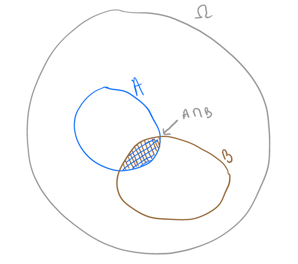

---
title: "PSY 503: Foundations of Psychological Methods"
subtitle: "Lecture 7: Conditional Probabilities and Independence"
author: "Robin Gomila"
institute: "Princeton"
date: "September 21, 2020"
output:
  beamer_presentation:
    includes:
      in_header: beamer_rgomila_theme_edits.tex
theme: CambridgeUS
colortheme: dove
fonttheme: "professionalfonts"
classoption: "handout"
--- 

# Independence of events  

\pause 

$A$ and $B$ are independent if the occurrence of $A$ does not influence the occurrence of $B$, and if the occurrence of $B$ does not influence the occurrence of $A$. 

\pause

If two events $A$ and $B$ are independent, knowing that $A$ occurred does not inform the chances that $B$ occurred. We have:  

\begin{equation}
P(A|B) = P(A)
\end{equation}

\begin{equation}
P(B|A) = P(B)
\end{equation}

# Conditional probability is everywhere 

- Examples?   

\pause 
- Causal effects   

  - If a treatment $d_i$ has an effect on $Y_i$, knowing that $d_i$ occurred tells us something about the probability that $Y_i$ occurs.   
  
  \vspace{.2cm}
    - If a training improves performance at a test, knowing that an individual took that drug before the test provides information about the probability that this individual passed vs. failed.  

# Definition

If $A$ and $B$ are events with $P(B) > 0$, the _conditional probability_ of A given B is 

\begin{equation}
P(A|B) = \frac{P(A\: \cap \: B)}{P(B)}
\end{equation}

# Illustration  

$$ P(A|B) = \frac{P(A\: \cap \: B)}{P(B)}  $$

```{r, fig.show='hold', out.width="30%", echo = FALSE, fig.cap = ''}



```

- Conditional probabilities allow us to update the probability of an event $A$ based on the occurrence of another event  

- $P(A)$ is called the _prior probability_  

- $P(A|B)$ is called the _posterior probability_  

# Multiplication rule  

\begin{equation}
P(A|B)P(B) = P(A\: \cap \: B)
\end{equation}

\vspace{.5cm} 

The multiplication rule follows directly from Equation (3).  


# Implication  

If $A$ and $B$ are independent events, we have: 

\begin{equation}
P(A\: \cap \: B) = P(A)P(B)
\end{equation}  

# Practice with grant proposal

You are about to send a grant proposal to an organization. While you read about the grant, you realize that your grant proposal will be sent to 5 different referees, who can be either social or cognitive psychologists. Imagine that for each grant proposal, the committee flips a coin five times and assigns the proposal to a social psychologist every time the flip returns heads, and to a cognitive psychologist every time the flip returns tails.  

Assume an infinite pool of social and cognitive psychologists. What are the chances that your grant proposal is assigned to 5 cognitive psychologists?   

# Practice with grant proposal

Let $C_i$ be the event that your grant proposal is assigned to a cognitive psychologist. Since the events are independent from each other, we have:

\small
$$
    \begin{split}
P(C_1 \: \cap C_2\: \cap C_3\: \cap C_4\: \cap C_5) &= P(C_1) \times P(C_2) \times P(C_3) \times P(C_4) \times P(C_5) \\
&= (\frac{1}{2})^5 \\
&= \frac{1}{32} \\
    \end{split}
$$

# Law of Total Probability (LTP)

Let $\{A_1, \: A_2, \: ..., \: A_n\}$ be a partition of $\Omega$. This means that the $A_i$ events are mutually exclusive and their union is $\Omega$. If $P(A_i) > 0$ for all $i$, then  

\begin{equation}
P(B) = \sum_{i = 1}^n P(B \cap A_i) 
\end{equation}  

```{r ltp, fig.show='hold', out.width="40%", echo = FALSE, fig.cap = ''}

knitr::include_graphics('images/ltp.png')

```

# LTP: Two events

In the special case of two events, we have:  

$$P(B) = P(B \: \cap \: A) +  P(B \: \cap \: A^C)$$  


# Bayes' Rule  

\pause 

- Bayes' rule allows us to find $P(A|B)$ if we know $P(B|A)$: 

\pause 

- Bayes' rule: 
\begin{equation}
P(A|B) = \frac{P(B|A)P(A)}{P(B)}
\end{equation}  

# Illustration: Covid-19  

Suppose your housemate just tested positive for Covid-19, and the following facts  

\pause

- Accuracy of test:  

  - 85% of the people who have covid-19 test positive 
  
  - 96% of the people who do not have covid-19 test negative  
  
  - These are actually optimistic estimates about the performance of covid-19 tests: more [here](https://www.health.harvard.edu/blog/which-test-is-best-for-covid-19-2020081020734) and [here](https://www.sciencedaily.com/releases/2020/05/200526173832.htm)

\pause 

- In your town, the probability of actually having Covid-19 is $\frac{1}{130}$  

  - This is realistic, based on the current number of active cases in the U.S. 

\pause

- What is the probability that your friend has Covid-19?  

# Illustration: Covid-19

- Let:   

  - $Covid$ be the event of having Covid-19   
  
  \pause
  
  - $Pos$ be the event of testing positive   
  
  \pause
  
  - $Neg$ be the event of testing negative   

\pause 

- We know that:  

  - $P(Covid) = \frac{1}{130}$    
  
  - $P(Pos|Covid) = .85$  
  
  - $P(Neg|Covid^C) = .96$   

\pause 

- We need to calculate: 

  - $P(Covid|Pos)$     

# Illustration: Covid-19

- Bayes' Rule: 

\small
$$ P(Covid|Pos) = \frac{P(Pos|Covid)P(Covid)}{P(Pos)} $$

- $P(Pos)$?   

\pause 

  - Use Law of Total Probability  


# Illustration: Covid-19  

$$
    \begin{split}
P(Pos) &= P(Pos \: \cap \: Covid) + P(Pos \: \cap \: Covid^C) \\
&= P(Pos|Covid)P(Covid) + P(Pos|Covid^C)P(Covid^C) \\ 
&= 0.85\times \frac{1}{130} + (1-0.96)\times (1-\frac{1}{130}) \\
&= 0.0462
    \end{split}
$$

We can now derive $P(Covid|Pos)$ using Bayes' rule:   

$$P(Covid|Pos) = \frac{.85 * \frac{1}{130}}{.0462} = .142$$

# Lessons from Bayes' rule 

- Based on the results of this test, the probability that your friend actually has covid-19 is .142   

  - That's a 14.2% chance of actually having covid-19.   
  
- Bayes' rule often yields counter-intuitive results!  

- Importance of base rates  

# 

\Huge \center \textcolor{rgomilablue}{\textbf{Probability Theory vs. Statistical Inference}}   

# Probability Theory  

- We know the probability model of the random generative process    

- We ask: given the data generative process, what data is likely?  
  
# Probability Theory  

- For any given random phenomenon, probability theory is a set of tools that
assume prior knowledge of:  

  - The sample space   
  
  - The probability of a set of events defined on that sample space   
  
- Allows you to find the probability of any other possible event from that sample space  


# Problem 

- We usually don't know the probability model  

- OK, we can find the probability of every outcome in the sample space by observing many many repetitions   

\pause

  - BUT most random phenomena cannot be repeated again, again, and again   

- We generally need to infer the probability of each possible outcome using information on a few realizations of the random phenomenon of interest     

# Statisical Inference

- For any given random phenomenon, statistical inference is a set of tools that
uses knowledge of:  

  - A finite number of realizations of a random phenomenon   
  
- ... to tell you how to make educated guesses about:  

  - The sample space  
  
  - The probability of events defined on that sample space   
  
# Probability Theory vs. Statisical Inference 

- Probability theory asks: \pause 

  - Assuming that the probability of observing heads in a coin flip is 0.5  
  
  - What is the probability of observing HHTT if we flip a coin four
times?  

\pause

- Statistical inference asks:   

  - Suppose that you flip a coin four times and observe HHTT  
  
  - What is your best guess for the probability of observing heads when flipping that coin? How confident are you in your guess?


# Typical Probability Theory Question 

- In the 2012 US presidential elections, 51.1% of voters voted in favor of Barack Obama     

- If you were to randomly select 1,000 people that voted in this election, what is the probability that at least 500 of them voted in favor of Barack Obama?  

- In other words, if you were to take many many random samples of 1000 people from the population of voters, in which fraction of these samples would you have at least 500 people that voted in favor of Barack Obama?  


# Typical Statistical Inference Question

- Before the ellection, FiveThirtyEight listed the [results](http://projects.fivethirtyeight.com/2016-election-forecast/national-polls/) for multiple election polls:  
  
- Using the information from Ipsos, what is your best guess on the total fraction of voters that would vote for Clinton if the elections were to happen now? How confident are you in your guess?  
  
- Would your guess be different if you were to use information from the ABC News/Washington Post poll? What if you were to combine information from both?  

- Example relevant to psychology research?  

# 

\Huge \center \textcolor{rgomilablue}{\textbf{Law of Small Numbers}}   

# Law of Small Numbers

- The typical probability theory and statistical inference questions are very hard to answer intuitively    

- Kahneman and Tversky showed that humans tend to make a cognitive error that they called the _Law of Small Numbers_  

\pause

- This cognitive error has a probability theory manifestation:  

  - People underestimate the probability of sequential streaks occurring by chance

\pause 

- and a statistical inference manifestation:  

  - People overestimate the information about underlying probabilities contained in short sequences of outcomes from a random phenomenon. Even worse, they suggest theories to explain these regularities!    

# Law of Small Numbers: Illustration  

In the 2010 NBA finals between the Boston Celtics and the LA Lakers, Celtic guard Ray Allen made seven three-point shots in a row. This is an example of what journalists call "hot streak". Observers usually tend to theorize about the reasons underlying hot streaks and cold streaks.

# Law of Small Numbers   

- Example of cognitive errors that justify the existence and the relevance of the theory of probability:   

  - [http://www.radiolab.org/story/91686-a-very-lucky-wind/](http://www.radiolab.org/story/91686-a-very-lucky-wind/)  
	(listen to fragment from 10:00 to 15:00)  


