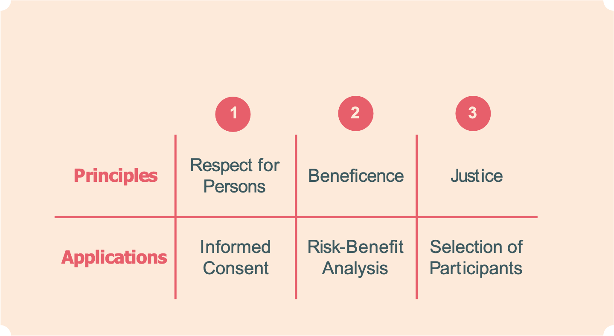

```{r setup, include=FALSE}
options(htmltools.dir.version = FALSE)
knitr::opts_chunk$set(
  fig.width=9, fig.height=3.5, fig.retina=3,
  out.width = "36%",
  cache = FALSE,
  echo = FALSE,
  message = FALSE, 
  warning = FALSE,
  fig.show = TRUE,
  hiline = TRUE
)
```

```{r xaringan-themer, include=FALSE, warning=FALSE}
library(xaringanthemer)

style_solarized_light(
  header_font_google = google_font("Arvo"),
  header_h1_font_size = "34px",
  text_font_google = google_font("Cabin"),
  text_font_size = "28px",
  code_font_google = google_font("Share Tech Mono"),
  extra_css = list(
    ".remark-slide-content h2" = list(
      "margin-top" = "2em",
      "margin-bottom" = "2em"
    ),
    .big = list("font-size" = "150%"),
    .small = list("font-size" = "75%"),
    .subtle = list(opacity = "0.6"),
    ".countdown-has-style h3, .countdown-has-style h3 ~ p, .countdown-has-style h3 ~ ul" = list(
      "margin" = "0"
    ),
    ".countdown-has-style pre" = list(
      "margin-top" = "-10px"
    ),
    "p .remark-inline-code" = list(
      "background-color" = "#6c71c41a",
      "padding" = "2px 2px",
      "margin" = "0 -2px"
    ),
    blockquote = list("margin-left" = 0),
    "em" = list(color = "#2aa198")
  )
)

```

# Housekeeping

- Last day to drop September 10th

- Team charter due on September 12th

- Sign up for our Slack channel `r emo::ji("smile")`

---
# Last class

<iframe src="https://app.sli.do/event/jlhxnmix" height="100%" width="100%" frameBorder="0" style="min-height: 560px;" title="Slido"></iframe>

---

# Outline

1. What is Ethics?

2. How does it apply to research?

3. Ethical Codes (e.g., Belmont Report, APA)

4. Ethical Groups (e.g., IRB)

---

background-image: url(milgram-experiment-man.jpeg)
background-position: center
background-size: cover
---


# Ethics

- A set of moral principles to describe how people **should** act and treat others 
  
  - Humans do not have perfect moral compasses esp. scientists/researchers 
  
    - History shows self-policing does not work
  
        - Tuskegee (1932-1972)
        
        - Milgram (1961)
        
---
# Monster Study

<div align="center">

<iframe width="700" height="500" align="middle" src="https://www.youtube.com/embed/h5yPwWybgD4" title="YouTube video player" frameborder="0" allow="accelerometer; autoplay; clipboard-write; encrypted-media; gyroscope; picture-in-picture" allowfullscreen></iframe>

---

background-image: url(recent.png)
background-position: center
background-size: cover

---
# Monster Study

<div align="center">

<iframe width="700" height="500" align="middle" src="https://www.youtube.com/embed/h5yPwWybgD4" title="YouTube video player" frameborder="0" allow="accelerometer; autoplay; clipboard-write; encrypted-media; gyroscope; picture-in-picture" allowfullscreen></iframe>

---
# Ethical Principles

- Four basic questions: 

  - Are benefits greater than the risk?

  - Are we acting responsibly and with integrity?

  - Are we acting judicially (fairly)?

  - Are we treating people with respect?

???

WE need to do a cost-benefit analysis.

Act responsibly and with integrity

Act judicially

and Treat people with respect

---
# Ethical Issues in Research

- Weigh risks against benefits (Beneficence)

  - BE GOOD TO PARTICIPANTS AND DO NOT HARM THEM 

- Act with integrity

  - Do not deceive 

- Be Judicial 

  - Treat participants fairly
      - Adequate compensation
  - Equal probability of selection
  
- Respect

  - Voluntary consent/participation
  - Privacy
  - Anonymity
---

# Ethical Codes (Medical Research)

- Before WWII no formal ethic codes in place

  - Horrific science experiments conducted by Germans necessitated need for code
  
      - Nuremberg Code (1947)

      - Declaration of Helsinki (1964)

???

Out of these informal principles came formal codes. It is hard to imagine this but before World War 2 there were no ethics codes in place. It is scary to think that researchers were going around doing whatever they wanted.


---
# Ethical Codes (Behavioral Research)
  
  - The Belmont Report (1978)
  
```{r, fig.align='center', echo=FALSE, warning=FALSE,  out.width = "70%"}


```

???

In the United States, concerns about the Tuskegee study and others led to the publication in 1978 of a set of federal guidelines called the belmont report. 
---

# APA Ethics Code

+ First code - 1953

	+ 2002 revision includes 10 general categories of ethical issues
	
	+ 5 general principles + 89 specific standards (not going over these)
	
	  1. Beneficence and Nonmaleficence
	  2. Fidelity and Responsibility (e.g., participate in activities enhance ethical compliance)
	  3. Integrity (i.e., do not steal, cheat, engage in fraud)
	  4. Justice
	  5. Respect

???

The APA has provided leadership in formulating ethical principals and standards for behavioral research
---
# Informed Consent

- What is in an informed consent document?

  - Description of the study

  - Description of the risks (exposure to danger) and benefits

     - Risks: psychological, physical harm, boredom
     - Benefits: educational, new skills, treatment, etc
     
  - Right to withdraw
  
  - Confidentiality

  - Request for consent
  
Example consent form: https://osf.io/6u2pv/

```{r, fig.align='center', echo=FALSE, warning=FALSE,  out.width = "40%"}


```

---

# Informed Consent - Vulnerable Populations

- For participants incapable (e.g., children, disabled) researcher must provide explanation and obtain consent from guardian

- Researchers need to be aware of vulnerable groups and ensure they are not abusing their position of power when gaining consent
---

# Deception

  - When used researchers must ensure no negative consequences arise from it
  
  - Must be justified
  
  - No other way of achieving the aims of the study

---
# Debriefing

- At the end of the study, participants are told more about the study 
  
- Participants given a chance to ask questions and researchers can correct any beliefs or attitudes the participants have about the research 

---
# Being an Ethical Researcher

- Integrity, Fidelity, and Responsibility 

- Accurate reporting

  -  Fraud  
    -The case of Diederik Stapel (https://www.youtube.com/watch?v=j-1iUY-9MFQ)
  
- Plagiarism

  - Word-for-word plagiarism
  - Paraphrasing plagiarism
  - Self-plagiarism
  
---
# IRB 

.pull-left[
- IRB = Institutional Review Board 

  - At least 5 members 
  
  - At least 1 must have a scientific background
  
  - At least 1 must be a non-scientist (this member must attend a meeting to achieve quorum)
  
  - At least 1 non-affiliated member (not affiliated with the institution)
  
  - Members should have expertise in the research that will be reviewed
]

.pull-right[

- Type of IRB Review
  - **Exempt**
      - Research done in education settings
      - Cognitive tests, surveys, interviews, or observations of public behavior
      - Benign behavioral interventions
      - Secondary data
 - **Expedited**
      -   Minimal risk 
        - Biological/medical (e.g., blood samples,hair samples, heart rate, etc.)
        - Data from voice, video, digital, or image recordings
        - Common behavioral/psychological research
 - **Full review**
  - More than minimal risk
]

---

# The Main Purpose of IRB Review

- To assess the risk/benefit ratio

- To ensure that informed consent is obtained in an appropriate manner

- To verify that the recruitment methods/materials are not misleading or coercive

- To ensure that the selection of subject is equitable and justified
---
# Assignment


