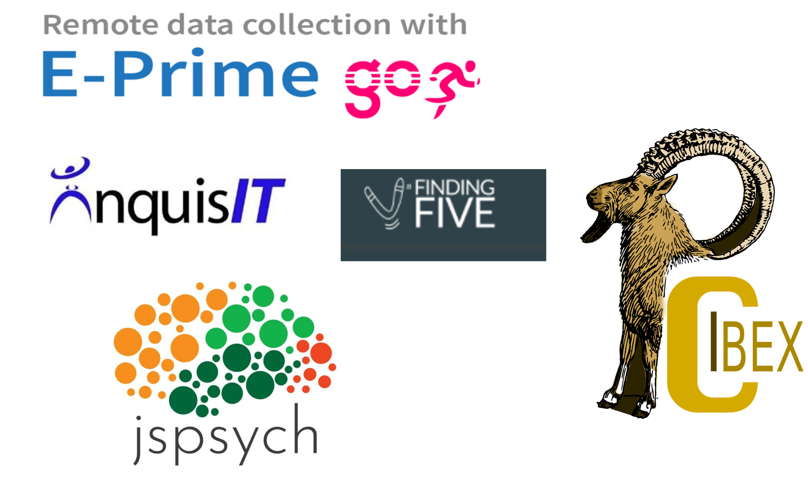

```{r setup, include=FALSE}
options(htmltools.dir.version = FALSE)
knitr::opts_chunk$set(
  fig.width=9, fig.height=3.5, fig.retina=3,
  out.width = "36%",
  cache = FALSE,
  echo = FALSE,
  message = FALSE, 
  warning = FALSE,
  fig.show = TRUE,
  hiline = TRUE
)
```

```{r xaringan-themer, include=FALSE, warning=FALSE}
library(xaringanthemer)

style_solarized_light(
  header_font_google = google_font("Arvo"),
  header_h1_font_size = "36px",
  text_font_google = google_font("Cabin"),
  text_font_size = "28px",
  code_font_google = google_font("Share Tech Mono"),
  extra_css = list(
    ".remark-slide-content h2" = list(
      "margin-top" = "2em",
      "margin-bottom" = "2em"
    ),
    .big = list("font-size" = "150%"),
    .small = list("font-size" = "75%"),
    .subtle = list(opacity = "0.6"),
    ".countdown-has-style h3, .countdown-has-style h3 ~ p, .countdown-has-style h3 ~ ul" = list(
      "margin" = "0"
    ),
    ".countdown-has-style pre" = list(
      "margin-top" = "-10px"
    ),
    "p .remark-inline-code" = list(
      "background-color" = "#6c71c41a",
      "padding" = "2px 2px",
      "margin" = "0 -2px"
    ),
    blockquote = list("margin-left" = 0),
    "em" = list(color = "#2aa198")
  )
)

```

# Housekeeping

- No class on Thursday (I am at a virtual conference)

- One more guest lecture (11/11)
  
- Extra credit

  - Participate in experiments
  
  - Record a 3-5 minute video (YouTube, TikTok, etc.) on method we have not discussed
  
- Late assignments

  - Turn them in when you can (full points)

---
# Outline

- Introduction to online research

- What are the ingredients to doing research online?

  - Task builders/experiment builders
  - Hosting/Servers
  - Recruitment

- Frequently asked questions about online research

- Future of online research 

---
# Business as Usual

```{r, fig.align='center', echo=FALSE, warning=FALSE,  out.width = "100%"}


```
        
---

background-image: url(covid.png)
background-position: center
background-size: cover

---
background-image: url(onlinemem.png)
background-position: center
background-size: cover

---
background-image: url(bob.png)
background-position: center
background-size: cover
---
background-image: url(booming.png)
background-position: center
background-size: cover
???

The new normal is running experiments online. This will result in folks participating in your experiments from a variety of different places using a variety of different equipment (computers, browsers, headphones, etc). 
---
# Advantages Of Online Data Collection?

- Efficiency

  - Faster data collection

--

- Economical

  - Reduced research and equipment costs
  - No one has to be in a physical lab
  
--

- Diversity

  - Non-WEIRD samples
--

- Greater power

  - More data

???

There are several reasons why you may opt to run experiments online compared to in-lab

1. Efficiency – You can collect many Ps in a matter of horus
2. Economical – No more time sending out recruitment emails scheduling and testing participants. It can also be cheaper!

3. 
It might shock you to know but the undergrads we relie are are
---
# Disadvantages

<iframe src="https://embed.polleverywhere.com/free_text_polls/TocvrwyuaQdzs1Xa6KVa7?controls=none&short_poll=true" width="800px" height="600px"></iframe>

---
# Disadvantages Of Online Data Collection?

- Data quality

--

  - No person to answer questions

--

  - No experimental control
--

  - Task-switching students :D
--


- Money


---

# Million Dollar Question

- How can we take the experiments we are conducting in the lab and adapt them to run online?
---
# Online Recipe

<br>
.pull-left[

```{r, fig.align='center', echo=FALSE, warning=FALSE,  out.width = "100%"}


```

]
.pull-right[
1. Experiment/task builders
  - How can I build online experiments that are equivalent to in-lab studies?

2. Hosting
  - How do I get my experiment online?

3. Online recruitment marketplace
  - How do I get Ps?

]
---
# Experiment/Task Builders

- In the lab, we might use a number of different tools to build our experiments

  - Experiment Builder (SR)
  - E-Prime
  - Psychtoolbox (Matlab)
  - PsychoPy (Python)

Most of these tools are not portable 

---
# Experiment/Task Builders

.pull-left[

<br>
<br>
<br>
- Experiments on-line must be run through a 
web browser

  - Gorilla
  - PsychoPy/psychoJS/JavaScript
  - Qualtrics
]

.pull-right[

```{r, fig.align='center', echo=FALSE, warning=FALSE,  out.width = "100%"}


```
]

---
# And Many More...

```{r, fig.align='center', echo=FALSE, warning=FALSE,  out.width = "100%"}


```


---
# Gorilla

<style type="text/css">
.tg  {border-collapse:collapse;border-color:#bbb;border-spacing:0;}
.tg td{background-color:#E0FFEB;border-color:#bbb;border-style:solid;border-width:1px;color:#594F4F;
  font-family:Arial, sans-serif;font-size:14px;overflow:hidden;padding:10px 5px;word-break:normal;}
.tg th{background-color:#9DE0AD;border-color:#bbb;border-style:solid;border-width:1px;color:#493F3F;
  font-family:Arial, sans-serif;font-size:14px;font-weight:normal;overflow:hidden;padding:10px 5px;word-break:normal;}
.tg .tg-97nx{border-color:inherit;font-family:Arial, Helvetica, sans-serif !important;;font-size:36px;text-align:center;
  vertical-align:top}
.tg .tg-1hcr{border-color:inherit;font-family:Arial, Helvetica, sans-serif !important;;font-size:36px;text-align:left;
  vertical-align:top}
.tg .tg-nene{font-family:Arial, Helvetica, sans-serif !important;;font-size:36px;text-align:left;vertical-align:top}
</style>
<table class="tg">
<thead>
  <tr>
    <th class="tg-97nx" colspan="2">Gorilla</th>
  </tr>
</thead>
<tbody>
  <tr>
    <td class="tg-1hcr">- All in one</td>
    <td class="tg-nene">- Closed-source</td>
  </tr>
  <tr>
    <td class="tg-1hcr">- Completely web-based (program from your browser) </td>
    <td class="tg-nene">- Free to build/pay to collect ($1.18)</td>
  </tr>
  <tr>
    <td class="tg-1hcr">- GUI</td>
    <td class="tg-nene"></td>
  </tr>
</tbody>
</table>

```{r, fig.align='center', echo=FALSE, warning=FALSE,  out.width = "20%"}


```
---
# PsychoPy


<style type="text/css">
.tg  {border-collapse:collapse;border-color:#bbb;border-spacing:0;}
.tg td{background-color:#E0FFEB;border-color:#bbb;border-style:solid;border-width:1px;color:#594F4F;
  font-family:Arial, sans-serif;font-size:14px;overflow:hidden;padding:10px 5px;word-break:normal;}
.tg th{background-color:#9DE0AD;border-color:#bbb;border-style:solid;border-width:1px;color:#493F3F;
  font-family:Arial, sans-serif;font-size:14px;font-weight:normal;overflow:hidden;padding:10px 5px;word-break:normal;}
.tg .tg-97nx{border-color:inherit;font-family:Arial, Helvetica, sans-serif !important;;font-size:36px;text-align:center;
  vertical-align:top}
.tg .tg-1hcr{border-color:inherit;font-family:Arial, Helvetica, sans-serif !important;;font-size:36px;text-align:left;
  vertical-align:top}
</style>
<table class="tg">
<thead>
  <tr>
    <th class="tg-97nx" colspan="2">PsychoPY</th>
  </tr>
</thead>
<tbody>
  <tr>
    <td class="tg-1hcr">- Downloadable software</td>
    <td class="tg-1hcr">- Costs money to collect data online</td>
  </tr>
  <tr>
    <td class="tg-1hcr">- GUI (Python and JS coding for more advanced experiments)</td>
    <td class="tg-1hcr"></td>
  </tr>
  <tr>
    <td class="tg-1hcr">- Free and open source</td>
    <td class="tg-1hcr"></td>
  </tr>
</tbody>
</table>


```{r, fig.align='center', echo=FALSE, warning=FALSE,  out.width = "40%"}

knitr::include_graphics("psychopy3.png")
```
---
# Install PsychoPy

- www.psychopy.org

---
# Pavlovia

- Create a Pavlovia account: https://pavlovia.org/

---
# Qualtrics

<style type="text/css">
.tg  {border-collapse:collapse;border-color:#bbb;border-spacing:0;}
.tg td{background-color:#E0FFEB;border-color:#bbb;border-style:solid;border-width:1px;color:#594F4F;
  font-family:Arial, sans-serif;font-size:14px;overflow:hidden;padding:10px 5px;word-break:normal;}
.tg th{background-color:#9DE0AD;border-color:#bbb;border-style:solid;border-width:1px;color:#493F3F;
  font-family:Arial, sans-serif;font-size:14px;font-weight:normal;overflow:hidden;padding:10px 5px;word-break:normal;}
.tg .tg-97nx{border-color:inherit;font-family:Arial, Helvetica, sans-serif !important;;font-size:36px;text-align:center;
  vertical-align:top}
.tg .tg-1hcr{border-color:inherit;font-family:Arial, Helvetica, sans-serif !important;;font-size:36px;text-align:left;
  vertical-align:top}
</style>
<table class="tg">
<thead>
  <tr>
    <th class="tg-97nx" colspan="2">Qualtrics</th>
  </tr>
</thead>
<tbody>
  <tr>
    <td class="tg-1hcr">- Survey/questionnaire builder</td>
    <td class="tg-1hcr">- Closed source</td>
  </tr>
  <tr>
    <td class="tg-1hcr"></td>
    <td class="tg-1hcr">- <span style="font-weight:400;font-style:normal">Costs money </span></td>
  </tr>
  <tr>
    <td class="tg-97nx" colspan="2"><span style="color:#FE0000">DO NOT USE IT IF YOU HAVE A COMPLEX DESIGN </span><br><span style="color:#FE0000">OR REALLY CARE ABOUT TIMING</span></td>
  </tr>
</tbody>
</table>


```{r, fig.align='center', echo=FALSE, warning=FALSE,  out.width = "30%"}

knitr::include_graphics("qual.jpeg")
```
---
class: inverse center middle
# Hosting
---
# Hosting

- Host the source code for your experiment yourself
  - Perform administration, data backup, and security
  - NO ONE HAS TIME FOR THAT!
- Use third-party hosting service
  - Mindprobe 
      - OpenSeasme
      - Free
  - Pavlovia/GitLab
      - PsychoPy
           - .20 per P; 1,500 university license 
  - Microsoft Azure
     - Gorilla
          - 1.18 per P and much more for team/department license
---

class: inverse center middle
# Recruitment and Payment

---

# Recruitment and Payment

> Recruitment and payment platforms do two important things:

1. Get the studies distributed to participants
2. Handle the money/credit

```{r, fig.align='center', echo=FALSE, warning=FALSE,  out.width = "90%"}


```

---
```{r, fig.align='center', echo=FALSE, warning=FALSE,  out.width = "90%"}


```
---

# Online Flow

```{r, fig.align='center', echo=FALSE, warning=FALSE,  out.width = "90%"}


```

---
# FAQ

> Q: How good are the data?

A: Some evidence to suggest that you can get good data (e.g., Crump et al., 2013; Zwann et al., 2017)


---

# Zwann et al. (2018)

.pull-left[
- Simon task
- Flanker task
- Motor priming
- Spacing effect
- False memories
- Serial position
- Repetition priming
- Shape simulation
]

.pull-right[

```{r, fig.align='center', echo=FALSE, warning=FALSE,  out.width = "90%"}


```
]

---

# Slote and Strand (2016)

```{r, fig.align='center', echo=FALSE, warning=FALSE,  out.width = "90%"}


```


---
# FAQ

> Q: How good are the data?

A: Some evidence to suggest that you can get good data (e.g., Crump et al., 2013; Zwann et al., 2017)

- **Keep experiment short (ideally 20 minutes or less) and entertaining**
---

# FAQ

> Q: How good is the timing?

A: Timing is reasonable (I would probably not present anything for less than 50 ms)

---
# Anwyl-Irvine et al. (2020)
```{r, fig.align='center', echo=FALSE, warning=FALSE,  out.width = "90%"}


```
---
# Anwyl-Irvine et al. (2020)

```{r, fig.align='center', echo=FALSE, warning=FALSE,  out.width = "90%"}


```
---
# Anwyl-Irvine et al. (2020)

```{r, fig.align='center', echo=FALSE, warning=FALSE,  out.width = "90%"}


```

---
```{r, fig.align='center', echo=FALSE, warning=FALSE,  out.width = "90%"}

knitr::include_url("https://psychopy.org/timing/2020/table3.html")
```
---

# Group Discussion

- Are there any areas where you think online data collection can be extremely useful? How about impossible or hard?
---
# Future of Online Research

- Online Eye-tracking 

  - https://www.youtube.com/watch?v=NRLlRh2apA8&feature=youtu.be

---
# Eye-tracking Demo

- https://farm.pcibex.net/r/hQzkGV/

---
# Future of Online Research

- Online eye-tracking 

- MouseView

  - https://www.youtube.com/watch?v=ozxSla0eNh8

---
# For Next Time

- Assignment: Online Participant For A Day 

---


