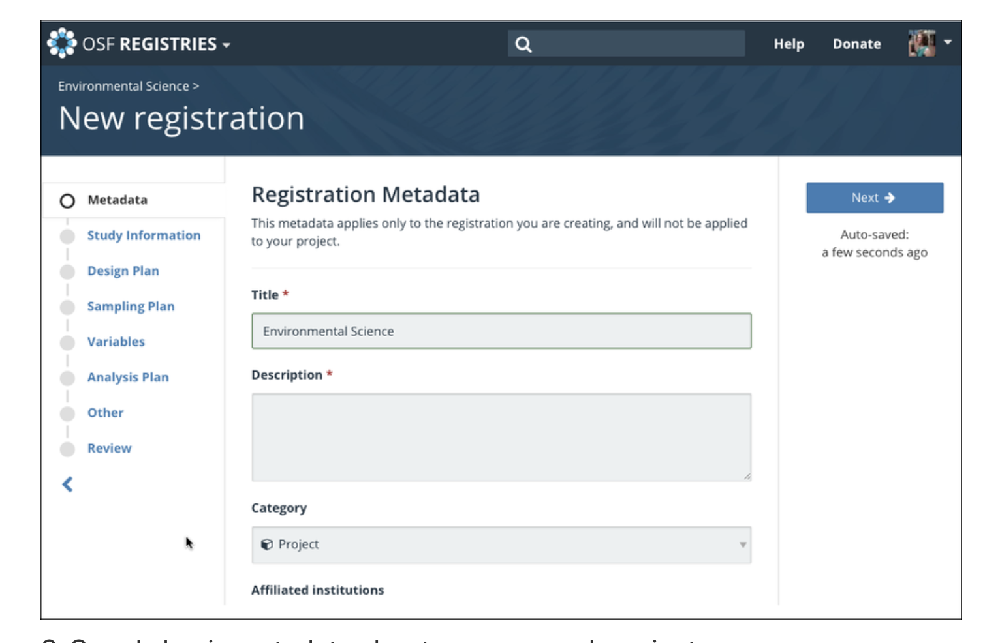

```{r setup, include=FALSE}
options(htmltools.dir.version = FALSE)
knitr::opts_chunk$set(
  fig.width=9, fig.height=3.5, fig.retina=3,
  out.width = "36%",
  cache = FALSE,
  echo = FALSE,
  message = FALSE, 
  warning = FALSE,
  fig.show = TRUE,
  hiline = TRUE
)
```

```{r xaringan-themer, include=FALSE, warning=FALSE}
library(xaringanthemer)

style_solarized_light(
  header_font_google = google_font("Arvo"),
  header_h1_font_size = "32px",
  text_font_google = google_font("Cabin"),
  text_font_size = "26px",
  code_font_google = google_font("Share Tech Mono"),
  extra_css = list(
    ".remark-slide-content h2" = list(
      "margin-top" = "2em",
      "margin-bottom" = "2em"
    ),
    .big = list("font-size" = "150%"),
    .small = list("font-size" = "75%"),
    .subtle = list(opacity = "0.6"),
    ".countdown-has-style h3, .countdown-has-style h3 ~ p, .countdown-has-style h3 ~ ul" = list(
      "margin" = "0"
    ),
    ".countdown-has-style pre" = list(
      "margin-top" = "-10px"
    ),
    "p .remark-inline-code" = list(
      "background-color" = "#6c71c41a",
      "padding" = "2px 2px",
      "margin" = "0 -2px"
    ),
    blockquote = list("margin-left" = 0),
    "em" = list(color = "#2aa198")
  )
)

```

exclude: True
# Quiz

- To see if you read, if you get the question right you will get 2 extra credit points

<iframe src="https://app.sli.do/event/bsh4bmza" height="100%" width="100%" frameBorder="0" style="min-height: 560px;" title="Slido"></iframe>

---
# Outline

- The crisis in science 

  - Last Week Tonight with John Oliver
  - Warning: Language and Foul Humor

- What is replication?

- The history of the replication crisis in psychology

- The issues that lead to the crisis

  - Simmons et al. (2011)

- Potential Solutions 

- Open Science 
  - Open Science Framework
  - Preregistration
  - ORCID
---
exclude: true
# Poll

<iframe src="https://app.sli.do/event/fi6lqizt" height="100%" width="100%" frameBorder="0" style="min-height: 560px;" title="Slido"></iframe>
---
# Is Science Fucked?

https://www.youtube.com/watch?v=0Rnq1NpHdmw&t=666s

---
# Replication

<br> 
<br>

```{r, fig.align='center', echo=FALSE, warning=FALSE,  out.width = "70%"}

```
--

- Replication can be successful 

--

- Replication can be unsuccessful 
---

```{r, fig.align='center', echo=FALSE, warning=FALSE,  out.width = "50%"}

knitr::include_graphics("failed.png")
```

---
# The Replication Crisis: A Timeline

- A little history

  - 2011: Daryl Bem published a paper in JPSP (top journal) claiming to have found evidence that ESP exists

      - PsychoPy Demo 
  
  - 2011: Diederik Stapel busted for fabricating data (**58 papers retracted to date**)

  - 2011-present: Major findings (psychology) not replicated
  
     - E.g., Ego depletion, embodied cognition, power posing, social priming

  - 2015: Open Science Collaboration tried to replicate 100 psychology studies
---
# Open Science Collaboration (2015)

.pull-left[- Open Science Collaboration attempted to replicate 100 studies published in 3 top psychology journals in 2008

- Replications used materials supplied by original authors and were high-powered 

    - Results: 39% of the original studies were successfully replicated

      - 25% of social psychology studies replicated
      - 50% of cognitive psychology studies replicated
          - Effect sizes overestimated in original studies
]

.pull-right[

<br> 
<br>

```{r, fig.align='center', echo=FALSE, warning=FALSE,  out.width = "100%"}


```


]

---
# Why?

```{r, fig.align='center', echo=FALSE, warning=FALSE,  out.width = "50%"}

knitr::include_graphics("type12.png")
```


# Do we have a problem?

```{r, fig.align='center', echo=FALSE, warning=FALSE,  out.width = "80%"}

knitr::include_graphics("iscrisis.png")
```

---
# False Positive Psychology (Simmons, Nelson, & Simonsohn, 2011)

- False positives are Type 1 errors 

  - Claim an effect exists when it actually does not
  
- Simmons, Nelson, & Simonsohn (2011) demonstrated that it’s easy to statistically support a hypothesis that is actually false (i.e., find a false positive)

---
# The Dangers of False Positives

- Can be dangerous
  - E.g., health research: claim that a treatment is effective when actually it isn’t, or even has negative side effects
  
- Wastes resources

  - Researchers waste time, effort, and money conducting research on effects that don’t actually exist
  
- Hard to exercise false positives from the literature

- Not enough incentives for researchers to conduct replications that debunk the false positives

- Erodes the credibility of psychological science
---
class: inverse center middle

# Why do we have a problem?
---
# Researcher Degrees of Freedom

- Researchers may engage in questionable research practices (QPRs) not because they intend to be dishonest.
Rather, they are motivated to make decisions that support their hypotheses

  - Make decisions so that p-value will be below .05 and can claim statistical significance

```{r, fig.align='center', echo=FALSE, warning=FALSE,  out.width = "50%"}

knitr::include_graphics("fork.png")
```
---

# Researcher Degrees of Freedom

- Which DV do you focus on?
- Measure the mean or the median?
- Which participants do you exclude?
- When do you stop collecting data?
- What analyses do you do?
- What covariates do you include?

**Making each decision increases the false positive rate (Type 1 error)**
---
# Covariates

> Covariate: a variable in a statistical analysis that was typically not controlled or manipulated during data collection but was measured

- Listening effort and pupil size 
  - covariate: Time
---
# Researcher Degrees of Freedom

```{r, fig.align='center', echo=FALSE, warning=FALSE,  out.width = "80%"}


```

---

class: inverse center middle

# How many ways are there to analyze this data?

---

- Include people who dropped out
- Exclude people who dropped out
- Had to change plans
- Self-reported improvement
- Moderate headaches
- Severe headaches
- Under 50 
- Over 50 
- number of days with pain
- Average pain rating, all days
- Average pain rating, headaches
- Self-reported improvement
- Certain medications
- Stress 
- Hormonal
---
# Where do false p values come from?

> P-hacking: trying lots of analyses until you get a desired outcome

```{r, fig.align='center', echo=FALSE, warning=FALSE,  out.width = "80%"}

knitr::include_graphics("torture.png")
```

---
# QPRs: P-hacking

```{r, fig.align='center', echo=FALSE, warning=FALSE,  out.width = "50%"}


```

---
# Check this out

```{r, fig.align='center', echo=FALSE, warning=FALSE,  out.width = "100%"}

knitr::include_url("https://projects.fivethirtyeight.com/p-hacking/")
```

---
# QPRs: HARKing

> Hypothesizing After Results are Known (HARKing): Presenting exploratory findings as confirmatory

```{r, fig.align='center', echo=FALSE, warning=FALSE,  out.width = "50%"}

knitr::include_graphics("TexasSharpShooter.png")
```

---
# QPRs: HARKing

> Hypothesizing After Results are Known (HARKing): Presenting exploratory findings as confirmatory

```{r, fig.align='center', echo=FALSE, warning=FALSE,  out.width = "70%"}


```
???
harking is bad because never can be falsified. 

---

# QRP: Optional Stopping

- Data peeking

  - Run some participants, look at data (stop if desired threshold is reached)
  
- **do not do this unless you correct for it**

- Inflates Type 1 error

---
# Peeking Simulations
```{r, fig.align='center', echo=FALSE, warning=FALSE,  out.width = "100%"}

knitr::include_url("https://shiny.psy.gla.ac.uk/debruine/peek/")
```

---
# Publication bias

- Traditionally, journals were biased in favor of publishing:

1. Significant findings

    - Non-significant findings relegated to a researcher's “file drawer”
    
2. Novel findings

    - Counterintuitive, surprising findings more likely to be published in top journals
---

# Interim Summary

1. Researcher degrees of freedom lead to flexibility in how we analyze our results

2. Publication bias makes it hard to get findings that are not statistically significant published

3. Scientists are incentivized to publish

---

class: inverse center middle

# Does this really mean we are f**ked?

---
```{r, fig.align='center', echo=FALSE, warning=FALSE,  out.width = "70%"}


```

---
# Credibility Revolution

```{r, fig.align='center', echo=FALSE, warning=FALSE,  out.width = "70%"}


```

---
# Potential Solutions

```{r, fig.align='center', echo=FALSE, warning=FALSE,  out.width = "70%"}


```

---
# 21 word solution

“We report how we determined our sample size, all data exclusions (if any), all manipulations, and all measures in the study.”

```{r, fig.align='center', echo=FALSE, warning=FALSE,  out.width = "70%"}


```

---
# Potential Solutions

- Preregistration

.pull-left[

- A formalized (time-stamped) document that specifies all hypotheses & methodological choices in writing prior to data collection

  - Reduces RDoF
  
  - Can’t p-hack
  
  - Can’t HARK
]

.pull-right[
```{r, fig.align='center', echo=FALSE, warning=FALSE,  out.width = "100%"}


```
]

---
# Potential Solutions

.pull-left[

- Preregistration
  
    - OSF
    
    - Aspredicted.org
]

.pull-right[
```{r, fig.align='center', echo=FALSE, warning=FALSE,  out.width = "100%"}


```

]
---
# Potential Solutions

- Registered Reports

  - Review and acceptance prior to data collection

```{r, fig.align='center', echo=FALSE, warning=FALSE,  out.width = "80%"}

knitr::include_graphics("rrr.png")
```
---
# Potential Solutions

.pull-left[- Registered Reports

      - Reduces RDoF
      
      - Can’t p-hack
      
      - Can’t HARK
      
      - Reduces publication bias 
]

.pull-right[
```{r, fig.align='center', echo=FALSE, warning=FALSE,  out.width = "100%"}


```
]

---
# Last Class
<iframe src="https://app.sli.do/event/oudumzcz" height="50%" width="50%" frameBorder="0" style="min-height: 560px;" title="Slido"></iframe>

```{r, echo=FALSE}

countdown::countdown(5)

```

---
# Potential Solutions

- Sharing

  - Posting all data and code on OSF
  
  - Sharing stimulus materials, lists, etc
---
# Potential Solutions

- Increased power/increased sample size

  - Effect sizes in psychology are **smallish** 
  
> Small effect sizes can only be accurately detected with high statistical power

    - Simmons et al. (2011) suggest at least N = 20 per group, but this isn’t large enough
  
- Use of within-participants designs affords more power

- More online studies?
---
# Open Science

  - What is it?
  
> The movement to make scientific research, data, and dissemination accessible to all levels of an inquiring society

.pull-left[

```{r, fig.align='center', echo=FALSE, warning=FALSE,  out.width = "80%"}


```
]

.pull-right[
- Transparency 
  - Preregistration
      - **OSF**
      - Aspredicted.org
- Openness
      - Papers but also data
- Integrity
]
---
# Open Science Framework

> OSF is a free and open source project management tool that supports researchers throughout their entire project lifecycle. 

```{r, fig.align='center', echo=FALSE, warning=FALSE,  out.width = "60%"}

knitr::include_graphics("osf.png")
```
---

# ORCID

- Go to https://orcid.org/register 

---
# Preregistration

1. Create an OSF account (with ORCID ID)

2. Start a preregistration
  -  First, sign in to the OSF, and go to https://osf.io/prereg/.
  
  -  You will be taken to the "OSF Preregistration" landing page.

```{r, fig.align='center', echo=FALSE, warning=FALSE,  out.width = "50%"}


```
---

# Preregistration

- Click start a new preregistration

```{r, fig.align='center', echo=FALSE, warning=FALSE,  out.width = "70%"}


```

---
# Preregistration

- A textbox will appear

  - Enter a title for your preregistration into the textbox, then click **Continue** 
```{r, fig.align='center', echo=FALSE, warning=FALSE,  out.width = "70%"}


```


---
# Preregistration

- An OSF project will be created, and you will be taken to the project's **Registrations** page.
- Click the **New registration** button

```{r, fig.align='center', echo=FALSE, warning=FALSE,  out.width = "70%"}


```

---
# Preregistration

- Select OSF Preregistration from the list, then click the **Create Draft** button.

```{r, fig.align='center', echo=FALSE, warning=FALSE,  out.width = "70%"}


```
---
# Preregistration

- The preregistration form will appear

```{r, fig.align='center', echo=FALSE, warning=FALSE,  out.width = "70%"}


```


---
# Preregistration

- The preregistration form will appear

```{r, fig.align='center', echo=FALSE, warning=FALSE,  out.width = "70%"}


```
---
