```{r setup, include=FALSE}
options(htmltools.dir.version = FALSE)
knitr::opts_chunk$set(
  fig.width=9, fig.height=3.5, fig.retina=3,
  out.width = "36%",
  cache = FALSE,
  echo = FALSE,
  message = FALSE, 
  warning = FALSE,
  fig.show = TRUE,
  hiline = TRUE
)
```

```{r xaringan-themer, include=FALSE, warning=FALSE}
library(xaringanthemer)

style_solarized_light(
  header_font_google = google_font("Arvo"),
  header_h1_font_size = "36px",
  text_font_google = google_font("Cabin"),
  text_font_size = "28px",
  code_font_google = google_font("Share Tech Mono"),
  extra_css = list(
    ".remark-slide-content h2" = list(
      "margin-top" = "2em",
      "margin-bottom" = "2em"
    ),
    .big = list("font-size" = "150%"),
    .small = list("font-size" = "75%"),
    .subtle = list(opacity = "0.6"),
    ".countdown-has-style h3, .countdown-has-style h3 ~ p, .countdown-has-style h3 ~ ul" = list(
      "margin" = "0"
    ),
    ".countdown-has-style pre" = list(
      "margin-top" = "-10px"
    ),
    "p .remark-inline-code" = list(
      "background-color" = "#6c71c41a",
      "padding" = "2px 2px",
      "margin" = "0 -2px"
    ),
    blockquote = list("margin-left" = 0),
    "em" = list(color = "#2aa198")
  )
)

```
# Goals

- Introduce you to PsychoPy 

- Make a basic experiment in PsychoPy

- Put that experiment online using Pavlovia

---
# What is PsychoPy

- Software for behavioral studies

- Written in Python

- Free and open source

- Now with capability to put studies online
---
# What is Pavlovia?

- Secure server to run studies online

- Powerful web interface built around git

- Huge repository of public experiments

---
# What is Pavlovia?
```{r, fig.align='center', echo=FALSE, warning=FALSE,  out.width = "90%"}

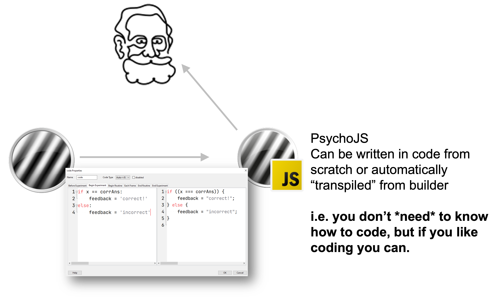
```

---
# What Else Is Pavlovia?

- An online repository for experiments:

  - Public sharing 
  
  - Collaboration
  
  - Git-based
  
	  - version control
---
# How do we use Pavlovia?

1. Check if the task we want already exists

2. Make/adapt task for our needs

3. Launch online

4. Recruit! 

---
# PsychoPy Overview

- Builder

```{r, fig.align='center', echo=FALSE, warning=FALSE,  out.width = "100%"}

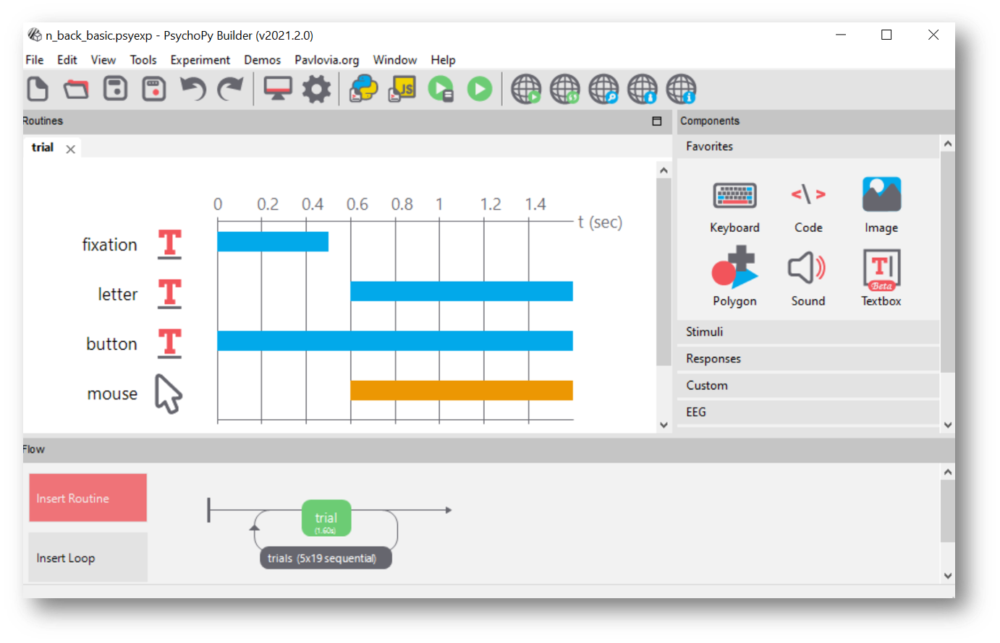
```

---
# PsychoPy Overview

- GUI Buttons

```{r, fig.align='center', echo=FALSE, warning=FALSE,  out.width = "80%"}

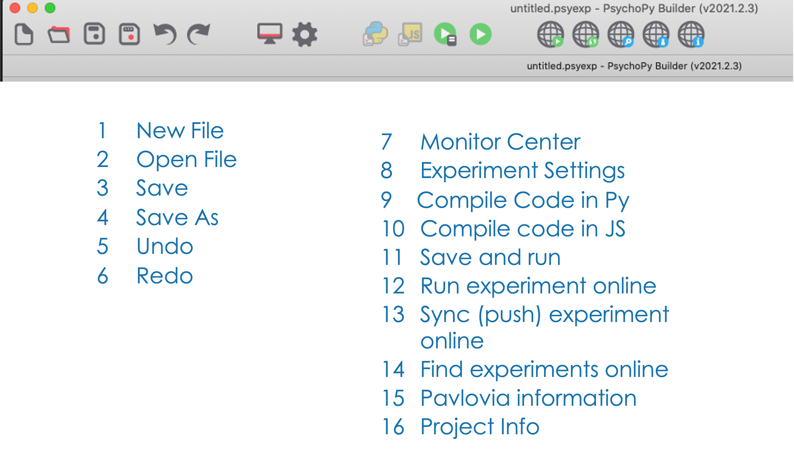
```


---
# Components
```{r, fig.align='center', echo=FALSE, warning=FALSE,  out.width = "70%"}

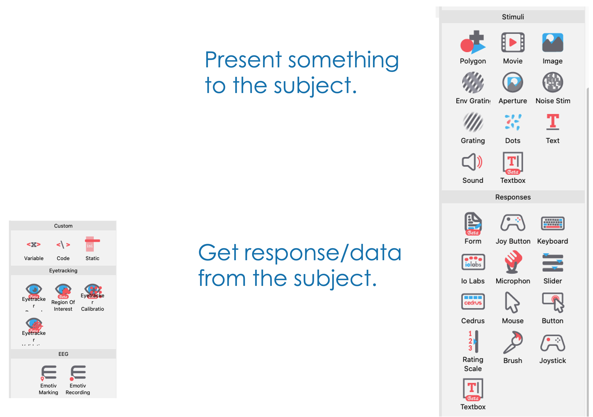
```

---
# Components

- Text

```{r, fig.align='center', echo=FALSE, warning=FALSE,  out.width = "70%"}

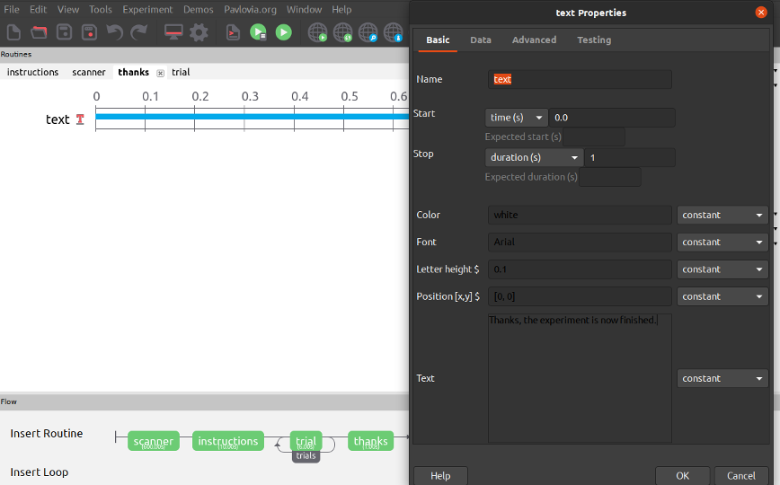
```
---
# Components

- Movie

```{r, fig.align='center', echo=FALSE, warning=FALSE,  out.width = "70%"}

knitr::include_graphics("movie.gif")
```

---
# Components

- Textbox

```{r, fig.align='center', echo=FALSE, warning=FALSE,  out.width = "70%"}

knitr::include_graphics("textbox.gif")
```

---
# Components

- Image

> Make your images approximately the size (in  pixels) that you want them to be presented in. PsychoPy will resize your images for you,  but it can take up a lot of working memory

```{r, fig.align='center', echo=FALSE, warning=FALSE,  out.width = "70%"}

knitr::include_graphics("image.gif")
```

---
# Components

- Polygon

> Draw shapes onto your display.The number of vertices determines the shape

```{r, fig.align='center', echo=FALSE, warning=FALSE,  out.width = "70%"}

knitr::include_graphics("polygon.gif")
```
---
# Response Components

- Keyboard

```{r, fig.align='center', echo=FALSE, warning=FALSE,  out.width = "70%"}

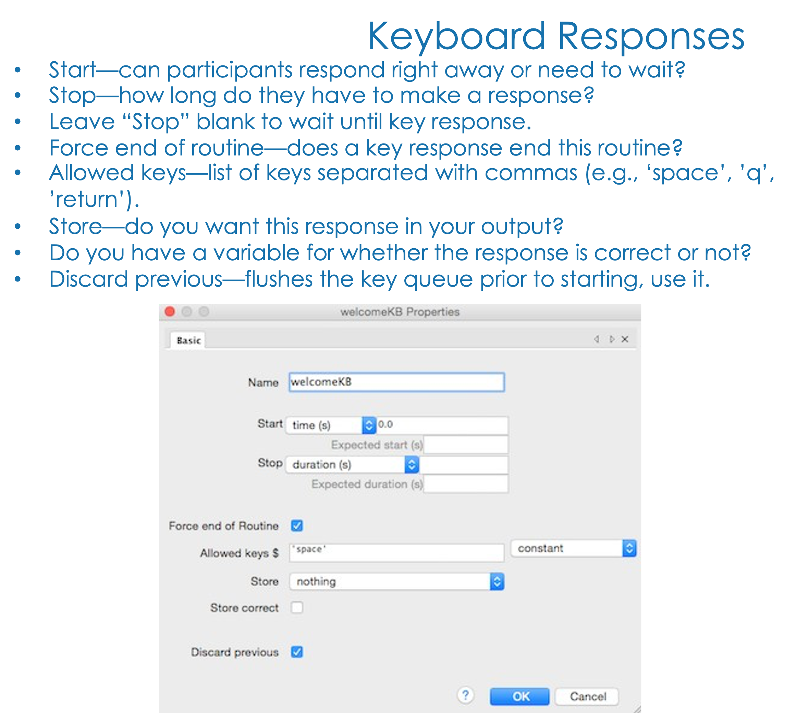
```

---
# Response Components

- Button

> Text that is clickable

```{r, fig.align='center', echo=FALSE, warning=FALSE,  out.width = "70%"}

knitr::include_graphics("button.gif")
```
---
# Response Components

- Mouse

```{r, fig.align='center', echo=FALSE, warning=FALSE,  out.width = "70%"}

knitr::include_graphics("mouse.gif")
```

---
# Response Components

- Slider

```{r, fig.align='center', echo=FALSE, warning=FALSE,  out.width = "70%"}

knitr::include_graphics("slider.gif")
```

---
class: inverse center middle
# Let's make a simple experiment
---
# Hello World

- Create an experiment that displays "hello world" for 3 seconds

---
```{r, fig.align='center', echo=FALSE, warning=FALSE,  out.width = "30%"}

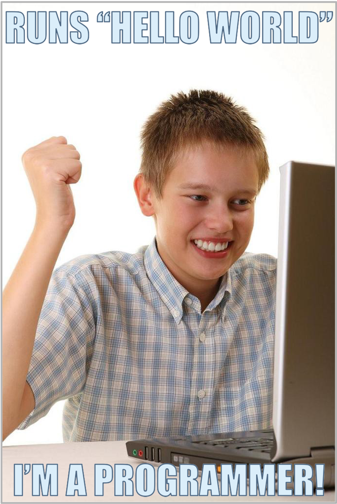
```

---
class: inverse center middle
# Recognition Memory
---
```{r, fig.align='center', echo=FALSE, warning=FALSE,  out.width = "70%"}

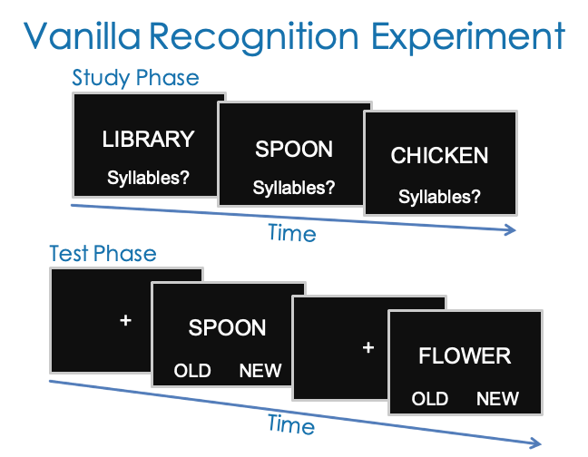
```
---
# Flow

- Routines

  - Combined to form an experiment
  
  - Can be standalone **things that are not repeated multiple times**

        - e.g., instructions 
    
  - These do not have loops around them

```{r, fig.align='center', echo=FALSE, warning=FALSE,  out.width = "70%"}

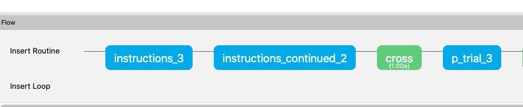
```

---

# Flow

- Loops and Trials

```{r, fig.align='center', echo=FALSE, warning=FALSE,  out.width = "100%"}

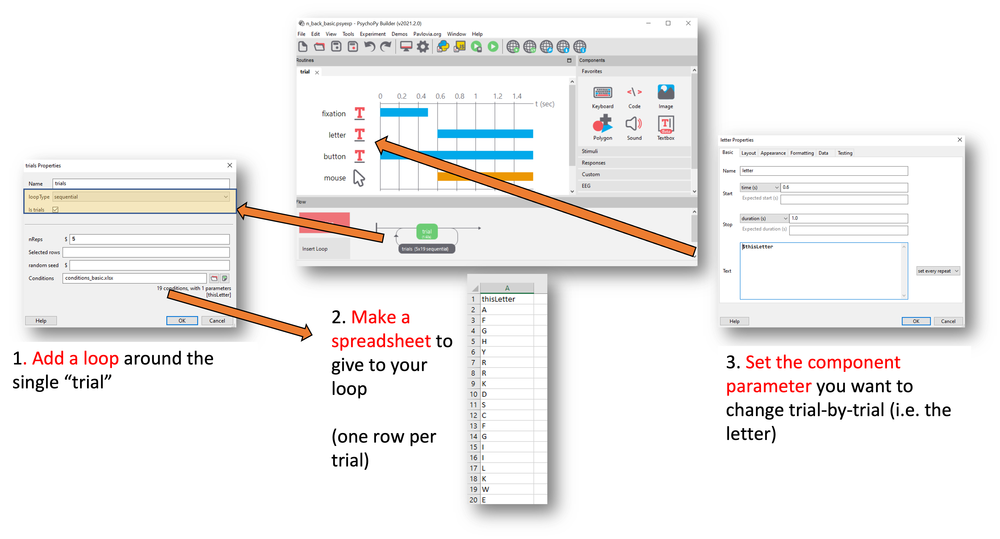
```

---
# Conditions List

.pull-left[

- A conditions list MUST be created for each experiment in either csv or xlsx format
- The column headers (variable names) CAN NOT have any spaces
- Include variable names that will be used to identify components in the trial presentation
- The correct path to the image file (or audio file or any stimulus file) MUST be used
- Include the correct answers to responses to make accuracy calculations easier

]

.pull-right[

```{r, fig.align='center', echo=FALSE, warning=FALSE,  out.width = "100%"}

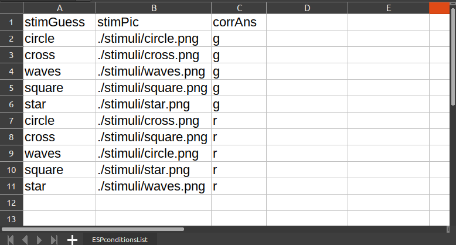
```
]

---
# Loops

```{r, fig.align='center', echo=FALSE, warning=FALSE,  out.width = "100%"}

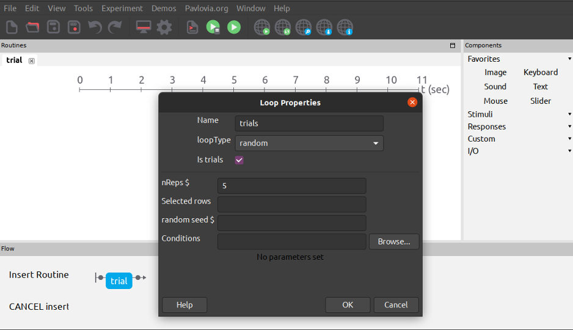
```
---
# Output: Response

```{r, fig.align='center', echo=FALSE, warning=FALSE,  out.width = "100%"}

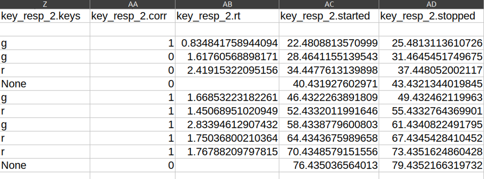
```

---
# Output: Participant

```{r, fig.align='center', echo=FALSE, warning=FALSE,  out.width = "100%"}

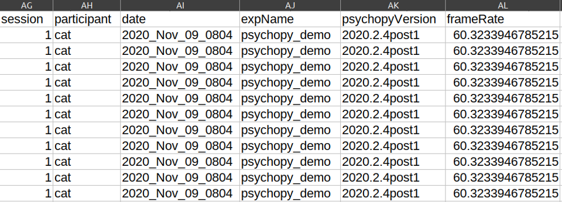
```

---
# Sync to Pavlovia

```{r, fig.align='center', echo=FALSE, warning=FALSE,  out.width = "100%"}

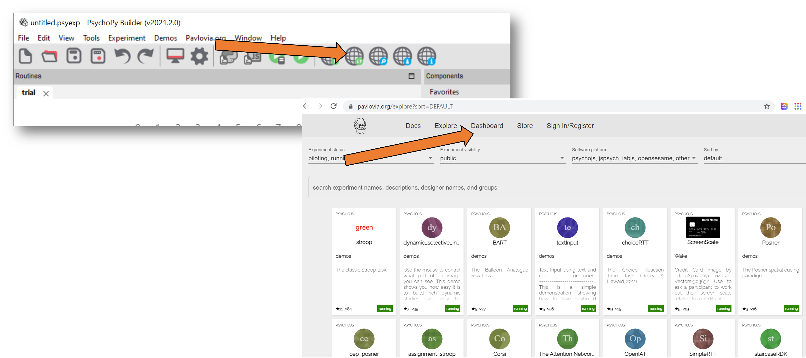
```
---
# Piolting and Running on Pavlovia
```{r, fig.align='center', echo=FALSE, warning=FALSE,  out.width = "100%"}

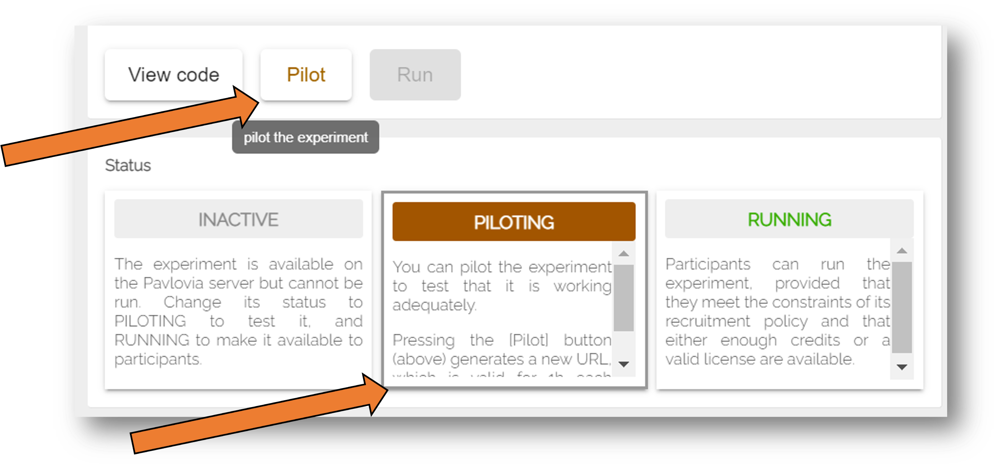
```

---
# Viewing Results on Pavlovia

```{r, fig.align='center', echo=FALSE, warning=FALSE,  out.width = "100%"}

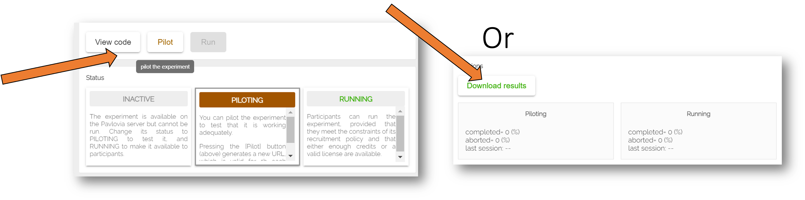
```


