```{r setup, include=FALSE}
options(htmltools.dir.version = FALSE)
knitr::opts_chunk$set(
  fig.width=9, fig.height=3.5, fig.retina=3,
  out.width = "36%",
  cache = FALSE,
  echo = FALSE,
  message = FALSE, 
  warning = FALSE,
  fig.show = TRUE,
  hiline = TRUE
)
```

```{r xaringan-themer, include=FALSE, warning=FALSE}
library(xaringanthemer)

style_solarized_light(
  header_font_google = google_font("Arvo"),
  header_h1_font_size = "34px",
  text_font_google = google_font("Cabin"),
  text_font_size = "24px",
  code_font_google = google_font("Share Tech Mono"),
  extra_css = list(
    ".remark-slide-content h2" = list(
      "margin-top" = "2em",
      "margin-bottom" = "2em"
    ),
    .big = list("font-size" = "150%"),
    .small = list("font-size" = "75%"),
    .subtle = list(opacity = "0.6"),
    ".countdown-has-style h3, .countdown-has-style h3 ~ p, .countdown-has-style h3 ~ ul" = list(
      "margin" = "0"
    ),
    ".countdown-has-style pre" = list(
      "margin-top" = "-10px"
    ),
    "p .remark-inline-code" = list(
      "background-color" = "#6c71c41a",
      "padding" = "2px 2px",
      "margin" = "0 -2px"
    ),
    blockquote = list("margin-left" = 0),
    "em" = list(color = "#2aa198")
  )
)

```

# Housekeeping

- Groups

   - Team 1: Awab, Anthony, Nish, Aniz 
   - Team 2: Pratiyush, Veda, Samah, Harsh
   - Team 3: Cynthia, Cyann, Sachi, Cheyenne
   - Team 4: Nina, Nia, Divya, Cristina
   - Team 5: Paige, Justin, Franklin, Shahil, Max 

- Team charter due on Sunday at 11:59 P.M.: https://osf.io/zshc7/

- Last day to drop is September 10th 
---

# Truth or Fiction?

<iframe src="https://app.sli.do/event/adtrnqnw" height="100%" width="100%" frameBorder="0" style="min-height: 560px;" title="Slido"></iframe>

---
# Truth or Fiction?

- Most people use only about 10% of their brain capacity

- Student's learn best when teaching styles match their learning styles (e.g., visual, auditory, etc.)

- In general, it’s better to express anger that to hold it in

- The lie detector (polygraph) test is 90-95 % accurate at detecting falsehoods

- Standing in a power pose with your hands on your hips and your feet apart makes you more confident

---

# Truth or Fiction?

- People tend to be romantically attracted to individuals who are opposite to them in personality and attitude

- The more people present at an emergency, the more likely it is that at least one of them will help

- All effective psychotherapies require clients to get the root of their problems in childhood

- Napping just after learning new information will help you remember it better

- Studying material many times in short chunks (“spaced practice”) will lead to better test performance than cramming in one session just before the test

---
class: inverse center middle

# For the statements marked as true, how did you acquire that information?

---
# Types of Knowledge

- Intuition/Anecdote

--

  - Acquire knowledge without proof, evidence, or conscious reasoning, or without understanding how the knowledge was acquired 
--

- Authority

--
  - We acquire knowledge through authority (e.g., parents)
--

- Rationalism

--
  - We acquire knowledge through logic and reason
    - All people are mortal. You are a person. Conclusion: You are mortal.
--

- Empiricism

--
  - We acquire knowledge through experience and observation
---

# The Scientific Method

```{r, fig.align='center', echo=FALSE, warning=FALSE}

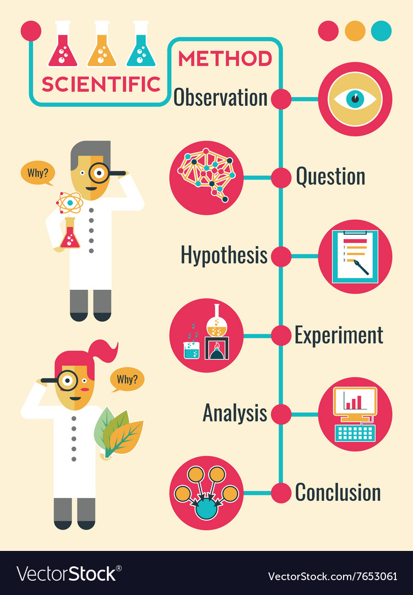
```
---

# Asking Questions

- Finding inspiration

  - Observations

  - Practical problem

  - Previous research

--

```{r, fig.align='center', echo=FALSE, warning=FALSE, out.width = "50%"}

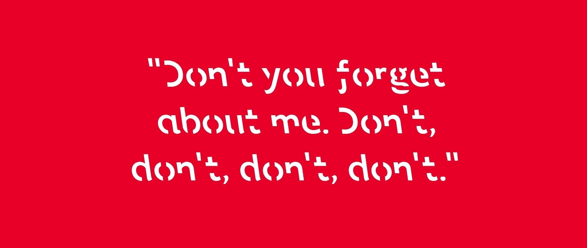
```
--

> Does Sans Forgetica enhance memory?

???

The first step is to come up with a question. A question should be not be too general. This is probably the hardest part of the process. We all like to be too general. How do we acquire language?


Examples: 

practical problems: how certain drugs affect disorders? 

Want to tell you about a time I was inspired
---

# Hypothesis

> A simple, specific prediction about a phenomeonon


- Should be driven by past studies in that area
  - Could be an exploratory question

- Must be testable and falsifiable (Popperian logic)

- Positive

  > Hypothesis: Reading materials in Sans Forgetica typeface enhances memory
  

---

# Experiment

- Geller, Davis, & Peterson (2020)

  - Had participants study word pairs in Sans Forgetica and Arial (**independent variable**) 

  - Measure performance on final test (**dependent variable**)

---

# Name Those Variables!


> An organizational psychologist is interested in whether lowering the temperature in a factory will increase productivity (i.e., number of products assembled). At the factory, there are three rooms in which products are assembled. Each room is set at one of the following temperatures: 60 degrees, 70 degrees, or 80 degrees. 

> A psychologist is studying the effects of steroids on the aggressive behavior of male rats. Thirty rats receive twice-daily injections of a placebo, whereas another set of 30 rats receive twice-daily injections of a steroid. For one hour a day, the rats are placed in a cage together and all aggressive behaviors are recorded. For one week, lab assistants count the number of aggressive behaviors recorded to determine whether or not there is difference between the two groups of rats. 

???

One independent variable – temperature in the room
	Three levels/conditions (60, 70, vs. 80 degrees)
Dependent variable – productivity (number of products assembled)

One independent variable – substance in injections
	Two levels/conditions (placebo vs. steroid)
Dependent variable –frequency aggressive behaviors

---
# Analyze Data and Draw Conclusions

<iframe src="https://app.sli.do/event/j7kl3yvo" height="100%" width="100%" frameBorder="0" style="min-height: 560px;" title="Slido"></iframe>

---
# Analyze Data and Draw Conclusions

- Is there a difference between Sans Forgetica and Arial typefaces?

  - Is this meaningful or **statistically significant**?

    - Inferential Statistics 
  
     - Allows one to draw conclusions from our **sample** (small subset) to **population** (large group we are interested in) 
    
    - Bayesian Statistics
---
# Type 1 and 2 Errors

```{r, fig.align='center', echo=FALSE, warning=FALSE, out.width = "60%"}

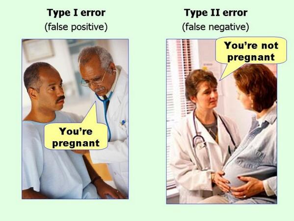
```
---

# Replication

.pull-left[

```{r, fig.align='center', echo=FALSE, warning=FALSE, out.width = "100%"}

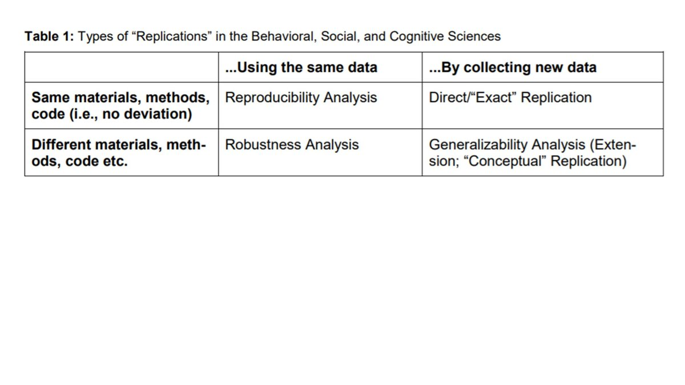
```
]

.pull-right[

```{r, fig.align='center', echo=FALSE, warning=FALSE, out.width = "100%"}

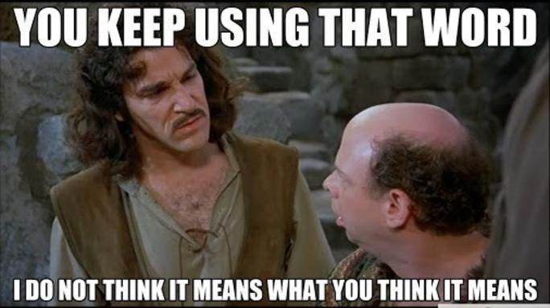
```
]
---
# Features of Science

- Systematic empiricism

  - Design controlled studies to observe behavior and draw conclusions
--

- Empirically solvable

  - Questions can be answered
  
  - Falsifiability
--

- Public Knowledge

 - Present research in journals and at conferences so it can be observed, replicated, criticized, and tested 

???

Underlying the scientific approach or method are three fundamental features
---
# Goals of Science

1. Describe 

2. Predict 

3. Explain

---

# Scientific Norms

- Mertonian Norms (1942)

1. Universalism
    - Knowledge is knowledge regardless who comes up with it
    
2. Disinterestedness
    - Our goal as scientists is to make advancements--not cash in
  
3. Communality (communism)

    - Science belongs to all of us
    - Openly share knowledge - remove the paywall
      - https://www.youtube.com/watch?v=L5rVH1KGBCY
  
4. Organized Skepticism
    - Accept nothing at face value!

???

What I wanted to talk about now is the norms underlying good scientific research. The 
Mertonian norms are the four norms of good scientific research first introduced by the American sociologist, Robert K. Merton. These norms are communism, universalism, disinterestedness, and organized skepticism. [1

Universalism is the idea that everyone can do science, regardless of race, nationality, gender or any other differences, and that everyone’s scientific claims should be scrutinized equally. In science, it’s all about your arguments, line of evidence and methodology, regardless of who you are;

Communism (sometimes referred to as communalism) addresses common ownership of scientific discoveries and the need for scientists to publicly share their discoveries. This could be seen as a precursor to modern initiatives such as open science;

Disinterestedness expresses the idea that scientists should work only for the benefit of science;

Organized skepticism expresses the idea that the acceptance of all scientific work should be conditional on assessments of its scientific contribution, objectivity and rigor. [2]

---
# Psuedoscience

```{r, fig.align='center', echo=FALSE, warning=FALSE, out.width = "60%"}

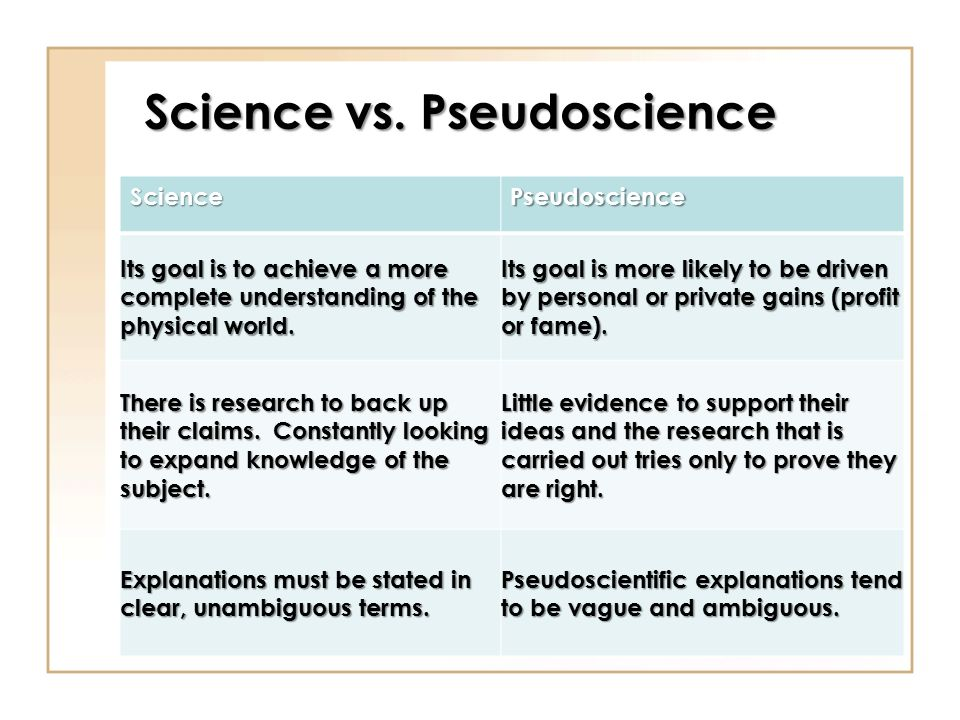

```

---

#  What Is Cognitive Science? 

- “The interdisciplinary study of mind and intelligence” 
- “Study of cognitive processes involved in the acquisition, representation, and use of human knowledge” 
- “Scientific study of the mind, the brain, and intelligent behavior, whether in humans, animals, machines or the abstract”

**Cognitive Science is the interdisciplinary (scientific) study of the mind as an information processor**

  + Goal of Cognitive Science: to understand the mind and how it works.
---

# Cognitive

**Cognitive** Science is the interdisciplinary (scientific) study of the mind as an information processor

- Cognition – from Latin base cognitio – “know together”

- The collection of mental processes and activities used in perceiving, learning, remembering, thinking, and understanding and the act of using those processes

---
# What is a mind?

+ Cognitive Science is the interdisciplinary  (scientific) study of the **mind** as an information processor

  - What would an answer to this question look like?

--
+ Is it identical to the physical matter of the brain?

+ Is it the organization or structure of physical matter?
	
+ Is it equivalent to the operations the brain performs?
	
+ Is it completely outside or beyond the physical brain?

---

#  Mind 

+ Do animals have minds?
	
+ Do computers have minds?
	
+ Does mind mean consciousness?
	
+ Can a mind be distributed?

  + Working definition : a mind is a set of mental processes and cognitive capacities.

---
#  Disciplines in Cognitive Science 

+ Cognitive Science is the **interdisciplinary** (scientific) study of the mind as an information processor

.pull-left[

+ Anthropology
	+ Study of human life and culture
+ Psychology
	+ Study of human behavior
+ Neuroscience
	+ Study of the brain
+ Linguistics
	+ Study of language
+ Education
	+ Study of Human learning and development
]

.pull.right[
```{r, fig.align='center', echo=FALSE, warning=FALSE}

knitr::include_graphics("cogsci.png")
```
]

---
#  Information Processing 

+ Cognitive Science is the interdisciplinary (scientific) study of the mind as an **information processor**

+ What is information?

	+ Claude Shannon defined the bit as an atomic piece of information for computing
	
  	+ For computation, anything can be represented as information.
  	
+ Information processing

```{r, fig.align='center', echo=FALSE, warning=FALSE, out.width = "70%"}

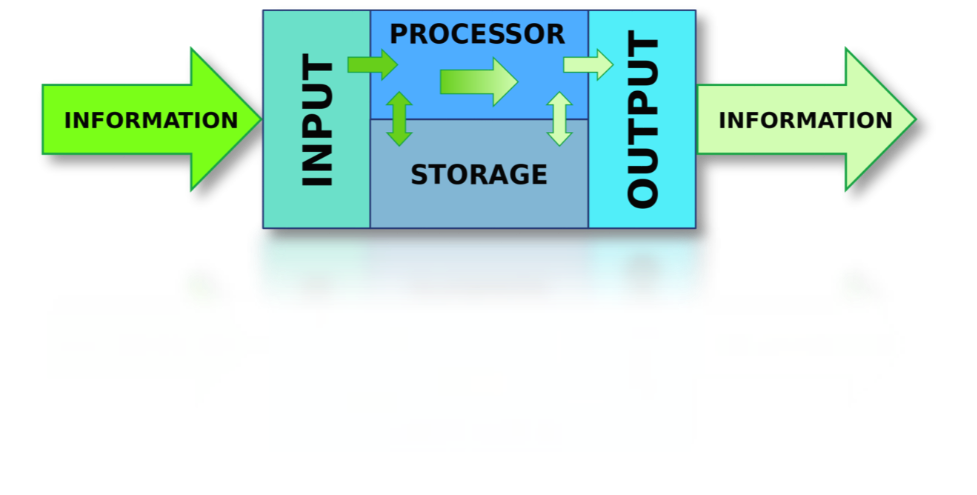
```

---

#  Computer Metaphor 

We can think of the mind like a computer

.pull-left[

+ Input : perception (mouse, keyboard)

	+ Processing : thought (CPU)
	
	+ Storage : memory (hard disk)
	
	+ Output : behavior (monitor, printer)
]

.pull-right[

```{r, fig.align='center', echo=FALSE, warning=FALSE, out.width = "70%"}


```
]

---
#  Methods of Cognitive Science

+ Computational modeling (artificial intelligence, computational neuroscience, cognitive psychology)

+ Correlation

+ Experimentation (psychology, linguistics, neuroscience)

+ Introspection, Argumentation, Formal Logic (philosophy, linguistics)

+ Ethnography (cognitive anthropology) 

---
# Methods of Cognitive Science

+ Computational modeling (artificial intelligence, computational neuroscience, cognitive psychology)

+ Correlation

+ **Experimentation (psychology, linguistics, neuroscience)**

+ Introspection, Argumentation, Formal Logic (philosophy, linguistics)

+ Ethnography (cognitive anthropology) 

---

background-image: url(comingsoon.jpg)
background-position: center
background-size: cover

---
# Eye-tracking

https://www.youtube.com/watch?v=Y5KAxnFE2CI

---
# Cognitive Pupillometry

```{r, fig.align='center', echo=FALSE, warning=FALSE, out.width = "40%"}

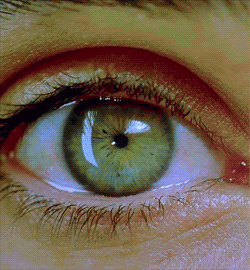
```
---
# EEG

```{r, fig.align='center', echo=FALSE, warning=FALSE, out.width = "50%"}

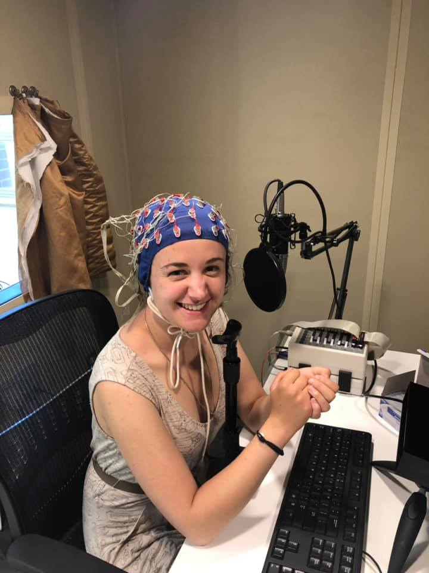
```


---
# fMRI

```{r, fig.align='center', echo=FALSE, warning=FALSE, out.width = "90%"}

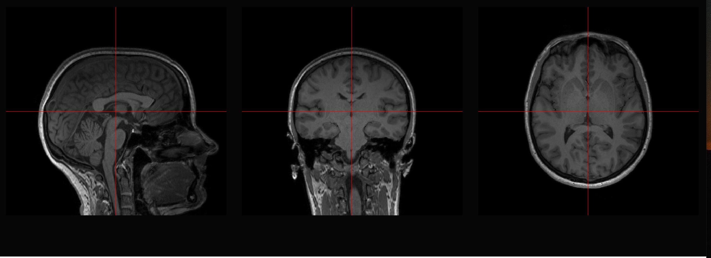
```

---
# MouseView

```{r, fig.align='center', echo=FALSE, warning=FALSE, out.width = "70%"}


```

---

# VR

```{r, fig.align='center', echo=FALSE, warning=FALSE, out.width = "70%"}


```
---
# RTs

https://app.gorilla.sc/task/4553682

---
# TMS

https://www.youtube.com/embed/FMR_T0mM7Pc
---

# fNIRs
```{r, fig.align='center', echo=FALSE, warning=FALSE, out.width = "70%"}

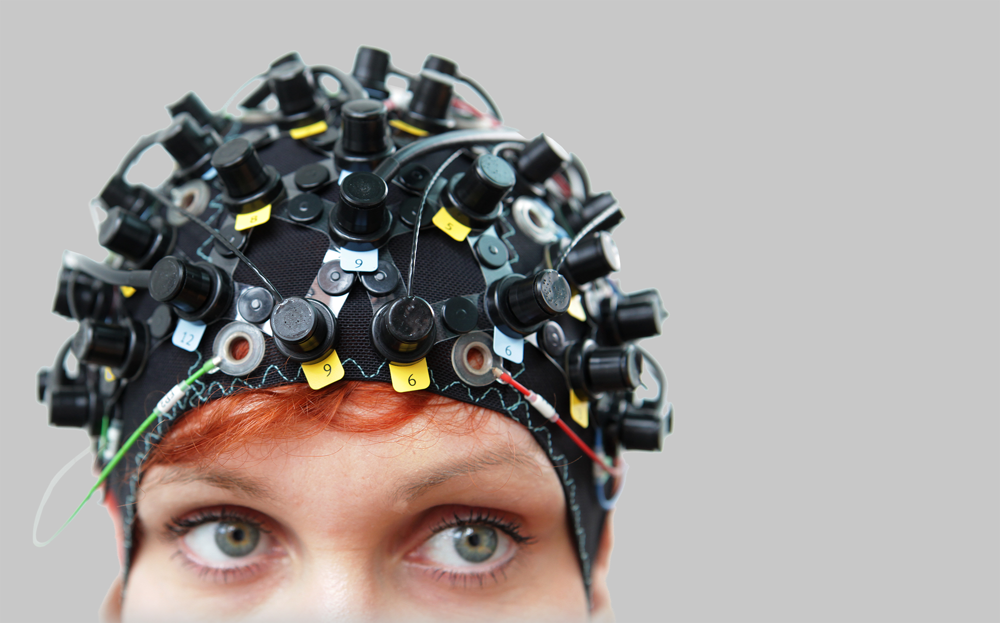
```

---
# MEG

```{r, fig.align='center', echo=FALSE, warning=FALSE, out.width = "70%"}


```

---

