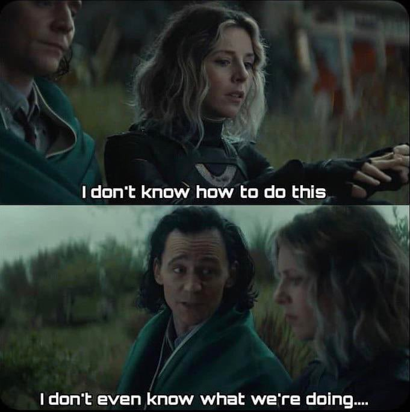
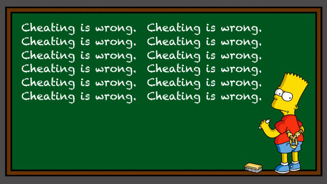

class: inverse center middle

<style type="text/css">
.remark-slide-content {
    font-size: 22px;
    padding: 1em 4em 1em 4em;
}
</style>

```{r setup, include=FALSE}
options(htmltools.dir.version = FALSE)
knitr::opts_chunk$set(
  fig.width=9, fig.height=3.5, fig.retina=3,
  out.width = "40%",
  cache = FALSE,
  echo = FALSE,
  message = FALSE, 
  warning = FALSE,
  fig.show = TRUE,
  hiline = TRUE
)
```

```{r xaringan-themer, include=FALSE, warning=FALSE}
library(xaringanthemer)
style_duo_accent(
  primary_color = "#1381B0",
  secondary_color = "#FF961C",
  inverse_header_color = "#FFFFFF"
)
```

# About Me


```{r, fig.align='center', echo=FALSE, warning=FALSE}


```


---
# Timeline

```{r echo=FALSE, message=FALSE, warning=FALSE}

library(cronologia)
batman_data <- data.frame(

  
   date_release = c("M.S. DePaul University",
                  "Ph.D. Iowa State University",
                  "Post-doc at University of Alabama-Birmingham", 
                  "Post-doc at University of Iowa", 
                  "Research Scientist at RuCCS"), 

  title = c("2012",
                   "2017",
                   "2017",
                   "2019", 
                   "2020")
)


```

<div class="chronologia-wrapper">
  <div class="chronologia-detail-wrapper">
    <details>
      <summary style="color: blue; background: orange;">2012</summary>
      <p style="color: white; background: black; font-size: 24px;">M.S. DePaul University</p>
    </details>
  </div>
  <div class="chronologia-detail-wrapper">
    <details>
      <summary style="color: blue; background: orange;">2017</summary>
      <p style="color: white; background: black; font-size: 24px;">Ph.D. Iowa State University</p>
    </details>
  </div>
  <div class="chronologia-detail-wrapper">
    <details>
      <summary style="color: blue; background: orange;">2017</summary>
      <p style="color: white; background: black; font-size: 24px;">Post-doc at University of Alabama-Birmingham</p>
    </details>
  </div>
  <div class="chronologia-detail-wrapper">
    <details>
      <summary style="color: blue; background: orange;">2019</summary>
      <p style="color: white; background: black; font-size: 24px;">Post-doc at University of Iowa</p>
    </details>
  </div>
  <div class="chronologia-detail-wrapper">
    <details>
      <summary style="color: blue; background: orange;">2020</summary>
      <p style="color: white; background: black; font-size: 24px;">Research Scientist at RuCCS</p>
    </details>
  </div>
</div>

---
# Research Interests

- Language processing

  - Mechanisms and representations
  
      - Auditory and visual word recognition
    
      - Semantics
          
          - **Under ambiguity**
--

- Learning and memory

    - Metamemory
    
    - Desirable difficulties
--

- Meta-research (philosophy of science)

  - Replication issues in psychology and neuroscience
---
# Skills

- Eye-tracking

- EEG

- fMRI

- Data Analysis/visualization

- Online data collection

---
class: inverse center middle
# John
```{r, fig.align='center', echo=FALSE, warning=FALSE}


```

---

# Ice Breaker

- Name

- Year 

- Major

- What is a boring fact about you?
--
  
```{r, fig.align='center', echo=FALSE, warning=FALSE}


```


---
background-image: url(syllabus.jpg)
background-position: center
background-size: cover

---

# Instructor Contact: 

- Office: RuCCS A121

- Email: `jason.geller@ruccs.rutgers.edu`

- Cell: 515-520-3464

- Twitter: jgeller_phd

---
# Office Hours:

- MW: 1:00 P.M. - 3:00 P.M. 

- By appointment

---

# Course Content:

- https://cogscimethods.netlify.app/
---

# Required Text:

- Jhangiani, R. S., Chiang, I.-C. A., Cuttler, C., & Leighton, D. C. (2019). Research Methods in Psychology. https://doi.org/10.17605/OSF.IO/HF7DQ https://kpu.pressbooks.pub/psychmethods4e/. 
  
- Peirce, J., & MacAskill, M. (2018). Building Experiments in PsychoPy (1st edition). SAGE Publications Ltd.         (https://drive.google.com/file/d/1JVPM8aRq9d1xuQutJgg8klmUO0PEf8Yd/view?usp=sharing)

*Handful of articles I will put up on the course website (and Canvas)*

---

# Learning Goals:

1. Be able to evaluate a broad range of methods in cognitive science and consider how they suit various research questions

2. Understand basic principles of experimental design 

3. Consider ethical questions and the role of the Institutional Review Board

4. Design and conduct your own experiment in Python/PsychoPy and take your research online

5. Practice writing and presenting scientific research


---
# Assessment Components: 

- **60%** (Group Project)

  - Team Charter (5 points) (Team)
  
  - Team Proposal (5 points) (Team)
    
  - CITI Training and Institutional Review Board (IRB) Forms (5 points) (Individual)
  
        - CITI certificate 
        - Research protocol form
        - Consent form 
    
  - Preregistration (5 points) (Team)

  - Programmed Experiment (5 points) (Team)
     
  - Method and Data Analysis Write Up (5 points)(Team)
    
  - Team presentation (15 points ) (Team)
  
  - Project Write Up (15 points) (Individual)
  
---
# Assessment Components:  

- **25%** (Assignments/Labs)

- **15%** (Presentation Reflections) (individual)

<style type="text/css">
.tg  {border-collapse:collapse;border-spacing:0;}
.tg td{border-color:black;border-style:solid;border-width:1px;font-family:Arial, sans-serif;font-size:14px;
  overflow:hidden;padding:10px 5px;word-break:normal;}
.tg th{border-color:black;border-style:solid;border-width:1px;font-family:Arial, sans-serif;font-size:14px;
  font-weight:normal;overflow:hidden;padding:10px 5px;word-break:normal;}
.tg .tg-7zrl{text-align:left;vertical-align:bottom}
.tg .tg-0lax{text-align:left;vertical-align:top}
</style>
<table class="tg" style="undefined;table-layout: fixed; width: 658px">
<colgroup>
<col style="width: 193px">
<col style="width: 144px">
<col style="width: 164px">
<col style="width: 157px">
</colgroup>
<thead>
  <tr>
    <th class="tg-7zrl">Great</th>
    <th class="tg-7zrl">Proficient</th>
    <th class="tg-7zrl">Developing</th>
    <th class="tg-7zrl">Unsatisfactory</th>
  </tr>
</thead>
<tbody>
  <tr>
    <td class="tg-7zrl">3</td>
    <td class="tg-7zrl">2</td>
    <td class="tg-7zrl">1</td>
    <td class="tg-7zrl">0</td>
  </tr>
  <tr>
    <td class="tg-0lax">The response is well developed. It indicates<br>that the presentation and the material was<br>understood. It<br>expands on, elaborates,<br>or offers a unique<br>insight on the material.</td>
    <td class="tg-0lax">The response is<br>adequate. There is<br>evidence that the<br>material was read and<br>understood. Elaboration<br>or unique insights may be less developed.</td>
    <td class="tg-0lax">The response is not<br>adequate. There may be<br>little evidence that the<br>material was read or<br>understood. There is no<br>elaboration</td>
    <td class="tg-0lax">The response was not<br>submitted properly to<br>Canvas by the deadline.</td>
  </tr>
</tbody>
</table>

---

# Group Project

```{r, fig.align='center', echo=FALSE, warning=FALSE}



```
---
# Schedule

https://cogscimethods.netlify.app/

---
# Masks

```{r, fig.align='center', echo=FALSE, warning=FALSE, out.width="80%"}


```

---

# Absences:

- No attendance for this class. **Please let me know if you will be absent** 

---
# Cheating and Plagiarism

```{r, fig.align='center', echo=FALSE, warning=FALSE, out.width="80%"}


```
    
---

# Disability Services:

- I am committed to the creation of an inclusive and safe learning environment for all students 

- If you need accomdatios please reach out to The Office of Disability Services (ODS)
  - More information can be found at www.ods.rutgers.edu. 
  - You can contact ODS at (848)445-6800 or via email at dsoffice@echo.rutgers.edu.

---

# Diversity and Inclusion Statement: 

I would like to create a learning environment for my students that supports a diversity of thoughts, perspectives and experiences, and honors your identities (including race, gender, class, sexuality, religion, ability, SES, etc. ) To help accomplish this:

 - If you have a name and/or set of pronouns that differ from those that appear in your official Rutgers records, please let me know!
- If you feel like your performance in the class is being impacted by your experiences outside of class, please don't hesitate to come and talk with me. I want to be a resource for you. Remember that you can also submit anonymous feedback (which will lead to me making a general announcement to the class, if necessary to address your concerns). 
- I (like many people) am still in the process of learning about diverse perspectives and identities. If something was said in class (by anyone) that made you feel uncomfortable, please talk to me about it. (Again, anonymous feedback is always an option).

---

class: class: inverse center middle

# Survey (https://forms.gle/9YG32UKzirUmqLu1A)


```{r, fig.align='center', echo=FALSE, warning=FALSE}


```
