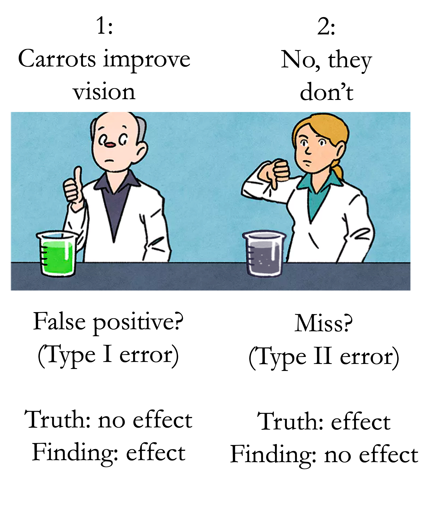
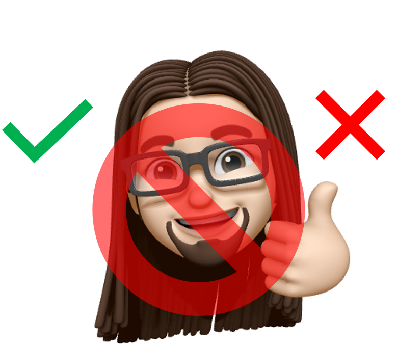
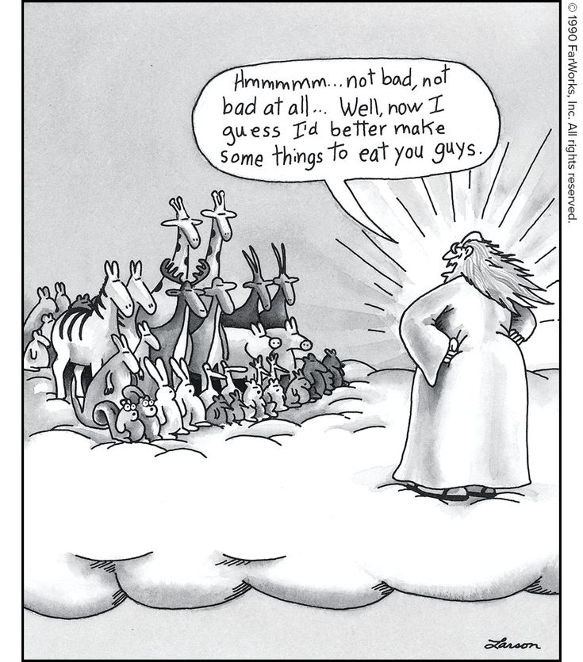

```{r setup, include=FALSE}
options(htmltools.dir.version = FALSE)
knitr::opts_chunk$set(
  fig.width=9, fig.height=3.5, fig.retina=3,
  out.width = "36%",
  cache = FALSE,
  echo = FALSE,
  message = FALSE, 
  warning = FALSE,
  fig.show = TRUE,
  hiline = TRUE
)
```

```{r xaringan-themer, include=FALSE, warning=FALSE}
library(xaringanthemer)

style_solarized_light(
  header_font_google = google_font("Arvo"),
  header_h1_font_size = "36px",
  text_font_google = google_font("Cabin"),
  text_font_size = "26px",
  code_font_google = google_font("Share Tech Mono"),
  extra_css = list(
    ".remark-slide-content h2" = list(
      "margin-top" = "2em",
      "margin-bottom" = "2em"
    ),
    .big = list("font-size" = "150%"),
    .small = list("font-size" = "75%"),
    .subtle = list(opacity = "0.6"),
    ".countdown-has-style h3, .countdown-has-style h3 ~ p, .countdown-has-style h3 ~ ul" = list(
      "margin" = "0"
    ),
    ".countdown-has-style pre" = list(
      "margin-top" = "-10px"
    ),
    "p .remark-inline-code" = list(
      "background-color" = "#6c71c41a",
      "padding" = "2px 2px",
      "margin" = "0 -2px"
    ),
    blockquote = list("margin-left" = 0),
    "em" = list(color = "#2aa198")
  )
)

```

# Outline

- Types of replication

  - Close
  - Conceptual

- Evaluating Replications

- The replication recipe (Brandt et al. 2014)

- Why teaching replication is important

- Replication Activity

---
# Why?

```{r, fig.align='center', echo=FALSE, warning=FALSE,  out.width = "30%"}


```
- **Influential difference between the two experiments?**

---

```{r, fig.align='center', echo=FALSE, warning=FALSE,  out.width = "70%"}

knitr::include_graphics("cookiefail.png")
```
---

# Types of Replication

- Direct/exact/close replication

  - New experiment/study matches the original as closely as possible
  
- Conceptual replication

  - New study attempts to test the same idea as the original, but may differ significantly in implementation
---
class: inverse center middle

Replications are not strictly "successes" or "failures"

```{r, fig.align='center', echo=FALSE, warning=FALSE,  out.width = "57%"}


```

---

- Not all studies provide equally strong evidence


.pull-left[

- Study 1

  - N = 20, two groups
  - Not-preregistered
  - Reports novel, unexpected finding

]

.pull-right[
- Study 2 (close replication)
  - N = 200
  - Preregistered
  - Does not demonstrate novel, unexpected finding
]

---
```{r, fig.align='center', echo=FALSE, warning=FALSE,  out.width = "100%"}


```

---
background-image: url(guide.png)
background-position: center
background-size: cover
---
# Brandt et al. (2014)

- A 36-question guide to conducting convincing (good) replications

- 5 main ingredients 

---
# Ingredient 1

- Carefully define the effects and methods that the researcher intends to replicate

```{r, fig.align='center', echo=FALSE, warning=FALSE,  out.width = "57%"}


```
    

---
# Ingredient 2

- Follow the methods of the original study as closely as possible

  - Sometimes not possible
  
      - Authors do not provide enough detail
      - Authors do not share their materials
  
  - Contact them (for projects you may have to do this :))
  

```{r, fig.align='center', echo=FALSE, warning=FALSE,  out.width = "70%"}


```

---
# Ingredient 3

-  High statistical power

  - Rule of thumb: collect 2.5 times the original sample size
  
     - This is what we are shooting for here

---
# Ingredient 4

- Make complete details about the replication publically available

  - Publicly posting protocols, stimuli, and other materials on OSF

---

# Ingredient 5 

- Evaluate replication results and compare them to the results of the original study

  - Not enough to say success/failed based on significant result


```{r, fig.align='center', echo=FALSE, warning=FALSE,  out.width = "70%"}


```

  - Note important methodological differences: 
  
    - Online vs. lab
    - Equipment (CRT vs. LCD)
    - Cultural differences
    
```{r, fig.align='center', echo=FALSE, warning=FALSE,  out.width = "70%"}


```
---
# Teaching Replication Is Important

- Educational benefits: 

 - Fits the needs of the full range of students
 - Learn to read an article closely
 - Trace the steps of the experts
  - Gather relevant materials
  - Plan logistics of carrying out protocol
  - Create an analysis plan
  - Recruit participants and collect data
  - Analyze data and write up results
  - Compare results to original findings
- Scientific benefits: 

  - Addresses replication crisis
  - Employs best practices
---
# Replication Activity

.pull-left[

- Strak, Martin, & Stepper (1988): Facial Feedback Hypothesis

  - Our facial expressions can trigger emotional reaction

<iframe width="560" height="315" src="https://www.youtube.com/embed/MtV5kfH4lXs" title="YouTube video player" frameborder="0" allow="accelerometer; autoplay; clipboard-write; encrypted-media; gyroscope; picture-in-picture" allowfullscreen></iframe>
]

.pull-right[

```{r, fig.align='center', echo=FALSE, warning=FALSE,  out.width = "90%"}


```

```{r, fig.align='center', echo=FALSE, warning=FALSE,  out.width = "50%"}


```

]

---
# Group Discussion

1. Do you think this study replicated?

2. Why/Why not?

3. How much are you willing to bet on it?

3. What are the potential issues with this study (i.e., has anything changed since this study?) Would findings replicate in different cultures?

---
# RRR (Wagenmakers et al. 2016)

- 17 labs with over 1000 participants from different countries


```{r, fig.align='center', echo=FALSE, warning=FALSE,  out.width = "90%"}


```

---
# Concluding Message

- Replication is important! 

- Science is a continual process of updating what we know (self-correcting)

- Psychology has changed in the last decade

  - Open science is becoming the norm (I hope)
  
- Science/Psychology/Cognitive Science is not fucked :) 


