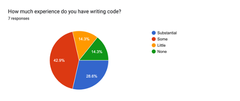
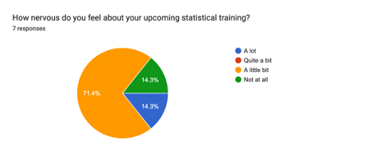
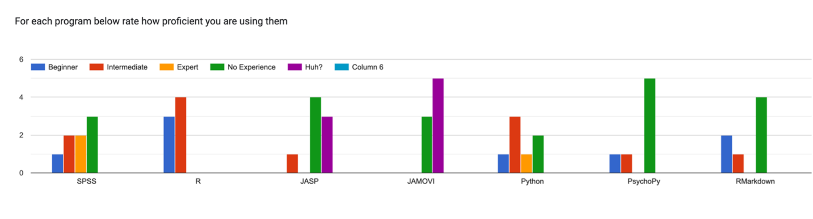

```{r setup, include=FALSE}
options(htmltools.dir.version = FALSE)
knitr::opts_chunk$set(
  fig.width=9, fig.height=3.5, fig.retina=3,
  out.width = "80%",
  cache = FALSE,
  echo = TRUE,
  message = FALSE, 
  warning = FALSE,
  fig.show = TRUE,
  hiline = TRUE
)

hook_source <- knitr::knit_hooks$get('source')
knitr::knit_hooks$set(source = function(x, options) {
  x <- stringr::str_replace(x, "^[[:blank:]]?([^*].+?)[[:blank:]]*#<<[[:blank:]]*$", "*\\1")
  hook_source(x, options)
})
```

```{r xaringan-themer, include=FALSE, warning=FALSE}
library(xaringanthemer)
library(tidyverse)

style_solarized_dark(
  header_font_google = google_font("Aleo"),
  header_h1_font_size = "36px",
  header_color = "black",
  text_font_google = google_font("Aleo"),
  text_font_size = "28px",
  text_color = "black", 
  background_color = "orange", 
  code_font_google = google_font("Share Tech Mono"),
  extra_css = list(
    ".remark-slide-content h2" = list(
      "margin-top" = "2em",
      "margin-bottom" = "2em"
    ),
    .big = list("font-size" = "150%"),
    .small = list("font-size" = "75%"),
    .subtle = list(opacity = "0.6"),
    ".countdown-has-style h3, .countdown-has-style h3 ~ p, .countdown-has-style h3 ~ ul" = list(
      "margin" = "0"
    ),
    ".countdown-has-style pre" = list(
      "margin-top" = "-10px"
    ),
    "p .remark-inline-code" = list(
      "background-color" = "black",
      "padding" = "2px 2px",
      "margin" = "0 -2px"
    ),
    blockquote = list("margin-left" = 0),
    "em" = list(color = "#2aa198")
  ),
)

```
class: center, middle

# Welcome to PSY 503!

---
# Questionaire

```{r echo=FALSE,out.width="75%",fig.cap="",fig.show='hold',fig.align='center'}

knitr::include_graphics("q1.png")

``` 
---
# Questionaire

```{r echo=FALSE,out.width="75%",fig.cap="",fig.show='hold',fig.align='center'}



``` 
---
# Questionaire

```{r echo=FALSE,out.width="75%",fig.cap="",fig.show='hold',fig.align='center'}

knitr::include_graphics("q3_feels.png")

``` 
---
# Questionaire

```{r echo=FALSE,out.width="75%",fig.cap="",fig.show='hold',fig.align='center'}



``` 
---
# Questionaire

```{r echo=FALSE,out.width="95%",fig.cap="",fig.show='hold',fig.align='center'}



``` 
---
# Questionnaire Responses

- What statistical methods do you use/plan to use in your research?

  - Computational modeling
  
  - Linear Regression
  
  - Logistic Regression
  
  - PCA/EFA/CFA 
  
  - Multilevel Modeling/MLM 
  
  - ANOVA
---
# Questionnaire Responses

- What topics would you like to see discussed?

  - Bayesian Modeling

  - MLM 

  - How to use R 

  - Non-parametric analyses

  - Power Analysis/Determination
---
# Instructor Contact: 

- Office: PSH 325

- Email: jg9120@princeton.edu

- Cell: 515-520-3464

- Twitter: jgeller_phd

---
# Office Hours

- M 1:00 P.M.- 3:00 P.M.; W 1:00 P.M. - 2:00 P.M. 🪑

- By appointment

  - Calendly: **https://calendly.com/jg9120/30min**

---
# Course Content

- Readings, Assignments, and Schedule: 
  
  - https://psy503-found-stats.netlify.app
  
- I will use Canvas to: 

  - Send announcements  
  
  - Retrieve assignments
  
  - Answer and send emails
  
- I will post html versions of slides day of class (on website). PDFs will be added to the OSF page after class. 
  
---

# Required Text:

- None

**I am going to use a combination of articles and textbook chapters that I will post links to all readings on the course website.**
---
# Precept Time

- Tuesdays: 11-1

## **PSY 505 is required**

---
# Course Objectives

- Understand the role and philosophy of hypothesis testing

- Rationale and limitations of statistical tests

- Identify the appropriate statistical tests to use

- Perform basic to advanced statistical models

- Build a stronger understanding of probability by using sampling and resampling techniques

- Develop an ability to write and communicate statistical results.

---
# Assignments

- 50% Problem Sets (10 x 5) 

- 20% Final Project

- 20% Final Exam 

- 10% Participation
---

# Grades

```{r assignments-grades, echo=FALSE}

library(knitr)

assignments <- tribble(
  ~Points,  ~Assignment, 
  10*5      , "Problem Sets",
  30, "Final Project",
  20, "Final Exam", 
  10, "Participation"
)

reactable::reactable(assignments, bordered = TRUE, striped = TRUE, highlight = TRUE)
```
---
# Lectures

- I’ll highlight main concepts

- My role is to introduce you to the basics of each topic and get you started with
examples

-  It is your responsibility to dig deeper when you need and / or want to

-  Graduate studies – learning to be independent and thinking on your own!
---

background-image: url("nomath.png")
background-position: 100% 100%
background-size: 100% 100%

---
# My Statistical Goals for You

- Understand the logic and rationale behind statistical approaches

- Build a statistical repertoire

- Use the appropriate test

- Learn a high-level program to execute stats (i.e.,R)
---
class: center middle main-title section-title-7
# Questions?


