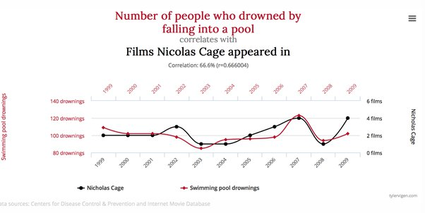
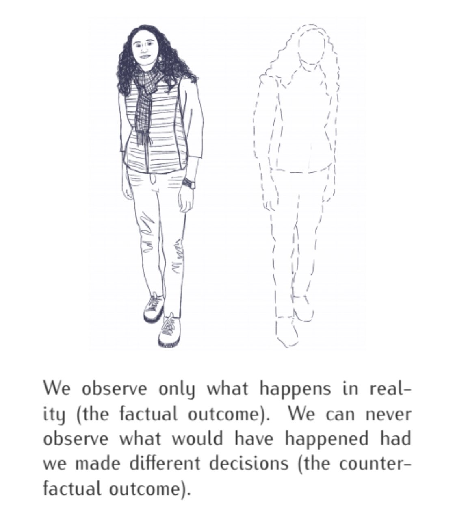

```{r setup, include=FALSE}
options(htmltools.dir.version = FALSE)
knitr::opts_chunk$set(
  fig.width=9, fig.height=3.5, fig.retina=3,
  out.width = "36%",
  cache = FALSE,
  echo = TRUE,
  message = FALSE, 
  warning = FALSE,
  fig.show = TRUE,
  hiline = TRUE
)

hook_source <- knitr::knit_hooks$get('source')
knitr::knit_hooks$set(source = function(x, options) {
  x <- stringr::str_replace(x, "^[[:blank:]]?([^*].+?)[[:blank:]]*#<<[[:blank:]]*$", "*\\1")
  hook_source(x, options)
})


```

```{r xaringan-themer, include=FALSE, warning=FALSE}
library(xaringanthemer)

style_solarized_dark(
  header_font_google = google_font("Open Sans"),
  header_h1_font_size = "36px",
  header_color = "black",
  text_font_google = google_font("Open Sans"),
  text_font_size = "28px",
  text_color = "black", 
  background_color = "orange", 
  code_font_google = google_font("Share Tech Mono"),
  extra_css = list(
    ".remark-slide-content h2" = list(
      "margin-top" = "2em",
      "margin-bottom" = "2em"
    ),
    .big = list("font-size" = "150%"),
    .small = list("font-size" = "75%"),
    .subtle = list(opacity = "0.6"),
    ".countdown-has-style h3, .countdown-has-style h3 ~ p, .countdown-has-style h3 ~ ul" = list(
      "margin" = "0"
    ),
    ".countdown-has-style pre" = list(
      "margin-top" = "-10px"
    ),
    "p .remark-inline-code" = list(
      "background-color" = "orange",
      "padding" = "2px 2px",
      "margin" = "0 -2px"
    ),
    blockquote = list("margin-left" = 0),
    "em" = list(color = "#2aa198")
  ),
)

```
# Today

.blockquote[
## `r icons::fontawesome("location-arrow")` Aim

- Working definition of causality

- Look at a method to formally explain causation 

- Better understand the role causality in psychology

]
---
# Heider and Simmel (1944)

- What is going on here?
<br>
<br>

<center>
<iframe width="600" height="400" src="https://www.youtube.com/embed/VTNmLt7QX8E" title="YouTube video player" frameborder="0" allow="accelerometer; autoplay; clipboard-write; encrypted-media; gyroscope; picture-in-picture" allowfullscreen></iframe>
<center>
---
# Causal Relationships?

--

- Lighting fireworks causes noise
--

- Rooster crows cause the sunrise
--

- Getting a Ph.D. from Princeton increases your earnings

--
- Colds go away a few days after you take vitamin C

--
- Hurricanes with female names cause more deaths

---

class: middle center


 How do we know if **X** causes **Y**?

--

.box-inv-3.medium[**X** causes **Y** if…]

--

.box-inv-3.medium[…we intervene and change **X**<br>without changing anything else…]

--

.box-inv-3.medium[…and **Y** changes]

---
# **Y** "listens to" **X**

<br>
<br>

> "A variable **X** is a cause of a variable **Y** if **Y** in any way relies on **X** for its value.… **X** is a cause of **Y** if **Y** listens to **X** and decides its value in response to what it hears"  <br>-Pearl, Glymour, and Jewell 2016, 5–6

---
class: middle center 

> __Causation = Correlation + time order + nonspuriousness__
--
---
# Disclaimer: Causality is NOT Correlation?

 > Associations:

  - Describes the world as it happened
  
  - No meaningful directionality

```{r echo=FALSE,out.width="75%",fig.cap="",fig.show='hold',fig.align='center'}



``` 
---

<br>
<br>
<br>
```{r echo=FALSE,out.width="75%",fig.cap="",fig.show='hold',fig.align='center'}


``` 
---
# Causality in Psychology 

<br>
<br>

- Psychology and social sciences: 

    - Generally interested in __identifying__ and __quantifying__ causal relationships  
    
    - What does this mean?
---
# "Causes of Effects" or "Effects of Causes"? 

--
- Psychology studies generally focus on the __"effects of causes"__  
--

- __Effects__ have __many causes__   

  - Brain chemistry  
  - Hormones  
  - Sensory cues  
  - Prenatal environment  
  - Early experiences  
  - Genes  
--

**list goes on and on**

---

# What do we learn from studies of the effects of causes? 

- Causal relationships   

  - Manipulating $X$ 💥  $Y$   

- Direction of effects  

  - Manipulating $X$ ⬆️/ ⬇️ $Y$ 
  - Manipulating $X$  ⬆️/ ⬇️ the probability of $Y$   
  
- Magnitude of effects

---
class: middle center


# .blockquote[
### `r icons::fontawesome("comment-dots")`
]

## Take a few minutes and think about causality in your research 

```{r, echo=FALSE}
library(countdown)

countdown(minutes = 5, seconds = 00)


```
---
class: center middle

# The Rubin Causal Model: A Powerful Framework to Study Causal Effects and Threats to Causal Inference

---
# Rubin Causal Model

- Framework developed by Donald Rubin (Rubin, 1974, 1975)   

- Mathematical definition of causal effects at the individual level 

- Establishes the impossibility of measuring causal effects for an individual 


.footnote[[1].Other Theories: Judea Pearl's **The Book of Why**]


---
# What is Causality (Formally)? 

- Notion of causality is tied to an __action__ applied to a __unit__

--

- In Psychology: 

  - __Unit__: Target of study (__individual__ , __classrooms__)
  
      - **i**  
  
  - __Treatment__: Intervention received by one group of units but not the other
  
      - **d** or **z** 
  
  - __Response__: Outcome of study
  
      - **Y** 

---
What is Causality (Formally)? 

- Let $d_i$ be a treatment (e.g., testing)  

- Let $Y_i$ be an outcome (e.g., performance on  test)  

<br>
<br>

> A treatment $d_i$ has a causal effect on an outcome $Y_i$   for individual $i$ (e.g., student) if the action of $d_i$ on  individual $i$ impacts $Y_i$ (i.e., the extent to which a student using quizzing affects performance)

---
# Core Concept: Potential Outcomes (Counterfactuals) 

- Each individual has different __potential outcomes__ in alternative environments 

- To measure the causal effect of a treatment $d_i$ for individual $i$:  

  - Measure the outcome of interest $Y_i$ for individual $i$ in two environments $E_0$ and $E_1$ that differ on one aspect: $d_i$  
--

- Example: 

  - Does the minimum wage increase with the unemployment rate?
    
      - Unemployment rate went up after the minimum wage increased
        
      - Would the unemployment rate have gone up, had the minimum wage increase not occurred?

---
# Potential Outcomes Notation

- $E_0$: $d_i = 0$, treatment was not applied to individual $i$        

- $E_1$: $d_i = 1$, treatment was applied to individual $i$ 

- Imagine we can observe both $Y_i(0)$ and $Y_i(1)$ for the exact same individual $i$ in $E_0$ and $E_1$, respectively.  

- For individual $i$, the causal effect $\tau_i$ of the treatment $d_i$ is defined as the difference between two potential outcomes:   

\begin{equation}    
\tau_i = Y_i(1) - Y_i(0)   
\end{equation}  

---
# Implications 

- If $\tau_i = 0$, using testing has no causal effect on $Y_i$  

- If $\tau_i \neq 0$, testing has a causal effect on $Y_i$  

- The _magnitude_ of the causal effect for individual $i$ is $\tau_i$, such that $$\tau_i = Y_i(1) - Y_i(0)$$      

---
class: middle center

# Anyone see a problem here?

---
# Fundamental Problem of Causal Inference (Holland, 1986) 

```{r echo=FALSE,out.width="40%", out.height="3%", fig.cap="",fig.show='hold',fig.align='center'}



``` 

--
- Prediction problem (do we care about this at individual level?)

---
class: center middle main-title section-title-7

# Causal Effects in Populations (ATE)
---
# Population

<br>
<br>

- A **population** is a set of units defined a priori by the researcher
 
 > The term population refers to the entire group of individuals from a specified group
 
---
# Average Treatment Effect

.box-inv-7.medium[Solution: Use averages instead]

$$
\text{ATE} = E(Y_1 - Y_0) = E(Y_1) - E(Y_0)
$$

 > .box-7[Difference between average/expected value when<br>program is on vs. expected value when program is off]

$$
\delta = (\bar{Y}\ |\ P = 1) - (\bar{Y}\ |\ P = 0)
$$
---
# Hypothetical Scenario: Set Up

- Let our _population of interest_ be students in this class (**N** = 8) 

--

- Let $Y_i$ be performance on test for a student $i$ 

--

- Let $\tau_i$ be the effect of quizzing or testing for individual $i$  
---
# Hypothetical schedule of potential outcomes

```{r echo=FALSE, message=FALSE, warning=FALSE, set.seed=666}

library(tidyverse)
library(knitr)
library(kableExtra)
library(flextable)

set.seed(666)

df <- data.frame(student=1:8, Y_i0=sample(0:100, 8),Y_i1=(sample(0:100,8))) %>%
                  mutate(t=Y_i1-Y_i0)

avg<-mean(df$t)

colnames(df) <- c("Student", "$Y_i$(0)", "$Y_i$(1)", "$\\tau_i$")

  knitr::kable(df, escape=FALSE, align="cccc")

```

---
# Average Treatment Effect (ATE) in the population 

- ATE in this population? 

- Take the average of the last column 

.pull-left.small[
$\delta = (\bar{Y}\ |\ P = 1) - (\bar{Y}\ |\ P = 0)$
]

--
```{r}

avg

```

- __Conclusion:__ on average in this population, the use of quizzing increases test performance by 18.25 points.

---
# ATE: Formal Defintion  

\begin{equation} 
  \mathrm{ATE} = \frac{1}{N} \sum_{i=1}^{N} \tau_i
\end{equation} 

- Population ATE is defined as the sum of $\tau_i$ divided by N, the number of individuals $i$ the population  

- Describes how the outcome of interest $Y_i$ would change on average in the population if the treatment was applied to every single individual in the population. 

- It is an extremely important concept in psychology   

  - Identify and quantify average effects of treatments in populations  
---
# Problems? 

<br>

<br>

- $\tau_i$ is forever unknown    

- We generally don't have access to the entire population of interest  

- How do we __estimate__ population average treatment effects?
---
class: middle center

# Experimental Design
---
# Experimental Design

- What is an experiment?

  > __Experiment__: Any study conducted under controlled conditions to measure the impact of a novel treatment or other manipulation

  > __Randomized experiment__: Chance process determines assignment of units to treatment conditions (e.g., coin flip, random number generator)


---
# Random?

<br>
<br>

- Every person (or unit) has some chance (i.e., a non-zero probability) of being selected into the treatment or control group

- The selection is based upon a random process (e.g., names out of a hat, a random number generator, rolls of dice, etc.)
---
# Experimental Design

-  Why randomized experiments? 

    - Random assignment ensures that outcomes of the untreated (control) group are an appropriate counterfactual for the treated (experimental) group
    
    - Randomization ensures groups are identical (on average) and thus there is no selection bias in the estimate of the ATE
    
    - Balances all observed variables as well as unobserved variables

---
# Experimental Design

- Helps us: 

    - Identify the presence of causal effects  
  
        - Does a causal effect exist at all? 
  
  - Statistical significance 

      - Estimate the magnitude of causal effects   
      - What is the direction of the causal effect? 

  - Practical significance  
  
      - Is the causal effect relevant?  
  
---
# Random Porcesses in R

- Sampling without replacement

```{r}
# set.seed?
#sample(x, size, replace = FALSE, prob = NULL)

sample(1:10, 5)

```

- Sampling with  Replacement
```{r}

sample(1:10, 5, replace = TRUE)

```
---
# Randomization Magic

- Simulation in R

  - Randomly assigns individuals from a population of size $N = 500$ to one of two groups 

  - Repeat this many many times: 100,000 times 

  - Compare the average characteristics of the individuals that are assigned to each group  

**Open R Studio**
---
# Randomization Magic

<br>
<br>

```{r}
library(tidyverse)

# Simulate age of 500 participants (range: 18-99)
# store in an object called: age_vector

age_vector <- sample(18:99, 
                     size = 500, 
                     replace = TRUE)

head(age_vector)

```
---
```{r}
# Randomly assign each individual to an experimental group
# store in an object called: random_assign
# experimental groups are called: "treatment" vs. "control"

condition <- c("control", "treatment")

random_assign <- sample(condition, 
                        size = 500, 
                        replace = TRUE)

head(random_assign)


```
---
```{r}

 #Put these two vectors into a dataset (tibble) 
# call this dataset: assignment_tibble

assignment_tibble <- tibble(age_vector, 
                            random_assign)

# Calculate mean for each experimental group 

assignment_tibble %>%
  group_by(random_assign) %>%
  summarise(mean = mean(age_vector))


```
---
```{r}
#################################################################
### simulate characteristics of group for 100,000 experiments ###
#################################################################

control_container <- rep(NA, 100000)
# create container in which we will store each of the 100,000 average age of treatment
treatment_container <- rep(NA, 100000)
# write for loop
for (i in 1:100000){
  
  age_vector <- sample(18:99, 
                       size = 500, 
                       replace = TRUE)
  
  random_assign <- sample(c("control", "treatment"), 
                          size = 500, 
                          replace = TRUE)
  
  control_container[i] <- mean(age_vector[random_assign == "control"])
  
  treatment_container[i] <- mean(age_vector[random_assign == "treatment"])
  
}

mean(control_container)

mean(treatment_container)

```
---
# Sample Practice


```{r}

# imagine you are writing paper and need to decide the author order of 5 authors. How would you do this?

#Find 10 random numbers between 0 and 100

# Draw 5 random letters from uppercase alphabets
```

---
# Randomization Magic

```{r}

ed_data <- read_csv("https://docs.google.com/spreadsheets/d/e/2PACX-1vTQ9AvbzZ2DBIRmh5h_NJLpC_b4u8-bwTeeMxwSbGX22eBkKDt7JWMqnuBpAVad6-OXteFcjBY4dGqf/pub?gid=300215043&single=true&output=csv")

glimpse(ed_data)

```
---

```{r}
ed_data %>% 
  group_by(Trt_rand) %>% 
  summarise_if(is.numeric, mean) %>% 
  select(-c(ID, Trt_non_rand))

# Experimental set up  
```

---
# Example 

- Let our population of interest be all students in this class (**N** = 8)  

- Let's imagine that we can run an experiment on the entire population of interest  

- __Random assignment:__  

  - Control (restudy) vs. Treatment condition (testing)

- Let $z_i$ indicate assignment of student $i$ to an experimental condition  
  - $z_i = 0$ if student $i$ was assigned to the control condition  
  - $z_i = 1$ if student $i$ was assigned to the treatment condition  
  - Assume _two sided compliance_: $d_i = z_i$  
  
---
# Hypothetical Experimental Dataset 

```{r echo=FALSE, message=FALSE, warning=FALSE, set.seed=666, echo=FALSE}

library(tidyverse)
library(knitr)
library(kableExtra)

set.seed(666)

df_i <- data.frame(student=1:10, Z_i = sample(0:1, 10, replace=TRUE), Y_i=sample(0:100, 10))

colnames(df_i) <- c("Student", "$Z_i$", "$Y_i$")

knitr::kable(df_i, align = "ccc") %>%
  kable_material_dark()


```
---
# Hypothetical Experimental Dataset with Potential Outcomes

```{r, echo=FALSE}
set.seed(666)

df_i_out <- df_i %>% 
  pivot_wider(names_from = `$Z_i$`, values_from =`$Y_i$`) %>%
  mutate(t="?")

colnames(df_i_out) <- c("Student", "$Y_i$(1)", "$Y_i$(0)", "$\\tau_i$")

knitr::kable(df_i_out, escape=FALSE, align="cccc") %>%
  kable_material_dark()
```

---
# Potential and Observed Outcomes : Switching Equation

- Causal inference is a missing data problem! 

- Observed outcome $Y_i$ -> Underlying potential outcomes

\begin{equation} 
  Y_i = Y_i(1)z_i + Y_i(0)(1-z_i)
\end{equation} 

- Treatment Applied: $$Y_i = 1 * Y^1_i  + 0 * Y^0_i$$
  $$Y_i = Y^1_i$$
- Treatment Not Applied: $$Y_i = 0 * Y1_i + 0 * Y_i0$$
  $$Y_i = Y^0_i$$

???
The switching equation works a lot like Schrodinger’s cat paradox. Schrodinger’s cat is placed in a sealed box and receives a dose of poison when an atom emits a radiation. As long as the box is sealed, there is no way we can know whether the cat is dead or alive. When we open the box, we observe either a dead cat or a living cat, but we cannot observe the cat both alive and dead at the same time. The switching equation is like opening the box, it collapses the observed outcome into one of the two potential ones.
---
# Urn Example

---
# Estimation of the ATE: Samples

First, let's work in previous equation to express the ATE with regards to $Y_i(0)$ and $Y_i(1)$: 

\begin{equation}
    \begin{split}
\mathrm{ATE} &= \frac{1}{N} \sum_{i=1}^{n}{\tau_i} \\
&= \frac{1}{N} \sum_{i=1}^{n}{(Y_{i}(1) - Y_{i}(0))} \\
&= \frac{1}{N} \sum_{i=1}^{n}{Y_{i}(1)} - \frac{1}{N} \sum_{i=1}^{n}{Y_{i}(0)} \\
&= \mu_{Y(1)} - \mu_{Y(0)}
    \end{split}
\end{equation}

in which $\mu_{Y(1)}$ is the average value of $Y_i(1)$ for all individuals and $\mu_{Y(0)}$ is the average value of $Y(0)$ for all subjects.
---
# Estimation of the ATE in Experiments   

In experimental studies, researchers estimate $\mu_{Y_i(1)}$ using the mean $\widehat{\mu}_{Y(1)}$ of all observed $Y_i(1)$ and $Y_i(0)$ using the mean $\widehat{\mu}_{Y(0)}$ of observed $Y_i(0)$. We have:  

\begin{equation}
\widehat{\mathrm{ATE}} = \widehat{\mu}_{Y(1)} - \widehat{\mu}_{Y(0)}
\end{equation}

in which $\widehat{\mathrm{ATE}}$ is the estimated ATE, $\widehat{\mu}_{Y(1)}$ is the estimated $\mu_{Y(1)}$, and $\widehat{\mu}_{Y(0)}$ is the estimated $\mu_{Y(0)}$.  
---
# ATT and ATU

- Average treatment on the treated

  - Effect for those with treatment

--
- Average treatment on the untreated

  - Effect for those without treatment

```{r po-table, echo=FALSE}
po <- tibble(
  Person = 1:8,
  Age = c("Old", "Old", "Old", "Old", "Young", "Young", "Young", "Young"),
  Treated = c(TRUE, TRUE, TRUE, FALSE, TRUE, FALSE, FALSE, FALSE),
  Y1 = c(80, 75, 85, 70, 75, 80, 90, 85),
  Y0 = c(60, 70, 80, 60, 70, 80, 100, 80)
) %>% 
  mutate(delta = Y1 - Y0) %>% 
  mutate(actual = ifelse(Treated, Y1, Y0)) %>% 
  mutate(`Outcome with program` = ifelse(Treated, paste0("**", Y1, "**"), Y1),
         `Outcome without program` = ifelse(!Treated, paste0("**", Y0, "**"), Y0),
         Effect = paste0("**", delta, "**"))

```
---

.smaller.sp-after[
```{r basic-po-att, echo=FALSE}
po %>% 
  select(Person, Age, Treated, starts_with("Outcome"), Effect) %>% 
  knitr::kable(align = "cccccc")
```
]

.pull-left.small[
$\delta = (\bar{Y}_\text{T}\ |\ P = 1) - (\bar{Y}_\text{T}\ |\ P = 0)$

$\delta = (\bar{Y}_\text{U}\ |\ P = 1) - (\bar{Y}_\text{U}\ |\ P = 0)$
]

.pull-right.small[
$\text{CATE}_\text{Treated} = \frac{20 + 5 + 5 + 5}{4} = 8.75$

$\text{CATE}_\text{Untreated} = \frac{10 + 0 - 10 + 5}{4} = 1.25$
]

---

# Knowledge Check 1

- Designing an experiment: Suppose you are interested in the effect of the presence of vending machines in schools on childhood obesity. What controlled experiment would you want to do to evaluate this question?
---
# Knowledge Check 2

- Give the average treatment effect in the population and the estimated treatment effect based on a simple comparison of treatment and control

```{r, echo=FALSE}

df=tibble::tribble(
     ~names,  ~x, ~z, ~y0, ~y1,
     "Cody",  3L, 0L,  5L,  5L,
    "Henna",  5L, 0L,  8L, 10L,
    "Jamie",  2L, 1L,  5L,  3L,
  "Branson",  8L, 0L, 12L, 13L,
   "Nicole",  5L, 0L,  4L,  2L,
    "Sarah", 10L, 1L,  8L,  9L,
    "Karen",  2L, 1L,  4L,  1L,
   "Claire", 11L, 1L,  9L, 13L
  ) %>%
knitr::kable(align = "cccccc") %>%
   kable_material_dark()

df
```

