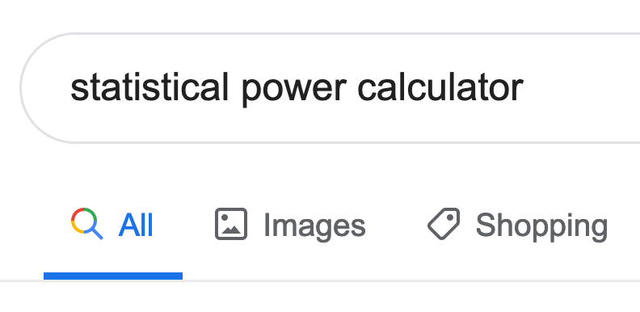
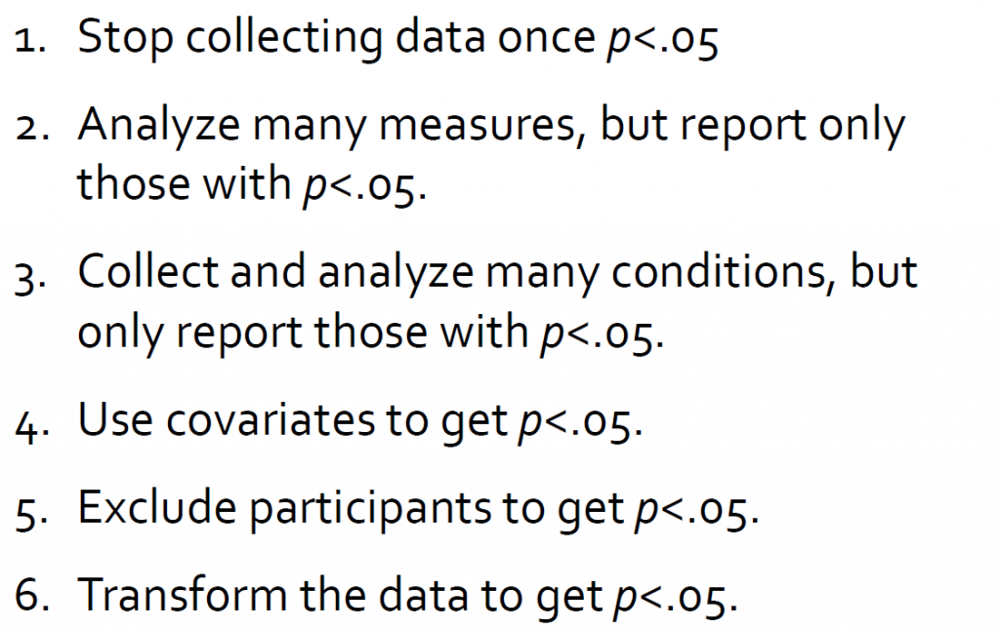
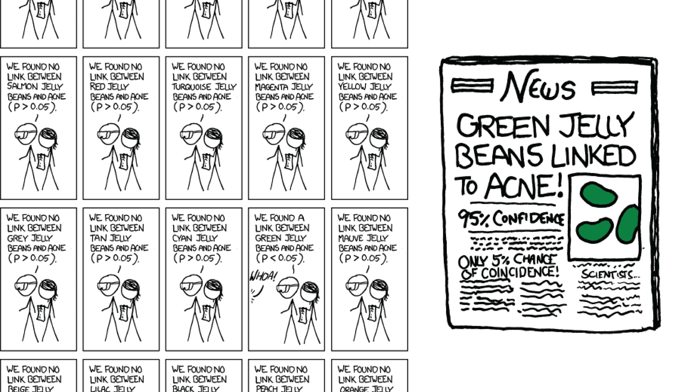

```{r setup, include=FALSE}
options(htmltools.dir.version = FALSE)
knitr::opts_chunk$set(
  fig.width=9, fig.height=3.5, fig.retina=3,
  out.width = "36%",
  cache = FALSE,
  echo = TRUE,
  message = FALSE, 
  warning = FALSE,
  fig.show = TRUE,
  hiline = TRUE
)

hook_source <- knitr::knit_hooks$get('source')
knitr::knit_hooks$set(source = function(x, options) {
  x <- stringr::str_replace(x, "^[[:blank:]]?([^*].+?)[[:blank:]]*#<<[[:blank:]]*$", "*\\1")
  hook_source(x, options)
})
```

```{r xaringan-themer, include=FALSE, warning=FALSE}
library(xaringanthemer)

style_solarized_dark(
  header_font_google = google_font("Aleo"),
  header_h1_font_size = "36px",
  header_color = "black",
  text_font_google = google_font("Aleo"),
  text_font_size = "28px",
  text_color = "black", 
  background_color = "orange", 
  code_font_google = google_font("Share Tech Mono"),
  extra_css = list(
    ".remark-slide-content h2" = list(
      "margin-top" = "2em",
      "margin-bottom" = "2em"
    ),
    .big = list("font-size" = "150%"),
    .small = list("font-size" = "75%"),
    .subtle = list(opacity = "0.6"),
    ".countdown-has-style h3, .countdown-has-style h3 ~ p, .countdown-has-style h3 ~ ul" = list(
      "margin" = "0"
    ),
    ".countdown-has-style pre" = list(
      "margin-top" = "-10px"
    ),
    "p .remark-inline-code" = list(
      "background-color" = "orange",
      "padding" = "2px 2px",
      "margin" = "0 -2px"
    ),
    blockquote = list("margin-left" = 0),
    "em" = list(color = "#2aa198")
  ),
)

```

- Give the average treatment effect in the population, and the estimated treatment effect based on a simple comparison of treatment and
control

```{r, echo=FALSE}
library(tidyverse)
library(kableExtra)
df=tibble::tribble(
     ~names,  ~x, ~z, ~y0, ~y1,
     "Cody",  3L, 0L,  5L,  5L,
    "Henna",  5L, 0L,  8L, 10L,
    "Jamie",  2L, 1L,  5L,  3L,
  "Branson",  8L, 0L, 12L, 13L,
   "Nicole",  5L, 0L,  4L,  2L,
    "Sarah", 10L, 1L,  8L,  9L,
    "Karen",  2L, 1L,  4L,  1L,
   "Claire", 11L, 1L,  9L, 13L
  )

  df %>%
    kable() %>%
 kable_styling(full_width = FALSE)
```
- Inferring causality requires 3 things. What are they?

- What is the fundamental problem of causal inference? How can we solve it?

---
# Notation

- _Indexing experimental individuals/units:_ the subscript $i$ refers to
unit 1 to N  

--

- _Defining treatment assignment:_ The variable $z_i$ indicates whether the ith individual is assigned to receive the treatment  

--

- _Defining treatment:_ The variable $d_i$ indicates whether the ith subject is treated 

--

- $z_i = 1$ means the ith subject was assigned to receive the treatment 

--

- $z_i = 0$ means the ith subject was not assigned to receive the treatment 

--

- $d_i = 1$ means the ith subject receives the treatment  

--

- $d_i = 0$ means the ith subject does not receive the treatment  

---
# Potential and Observed Outcomes : Switching Equation

- Causal inference is a missing data problem! 

- Observed outcome $Y_i$ -> Underlying potential outcomes

\begin{equation} 
  Y_i = Y_i(1)z_i + Y_i(0)(1-z_i)
\end{equation} 

- Treatment Applied: $$Y_i = 1 * Y^1_i  + 0 * Y^0_i$$
  $$Y_i = Y^1_i$$
- Treatment Not Applied: $$Y_i = 0 * Y^1_i + 1 * Y_i^0$$
  $$Y_i = Y^0_i$$
---
# Potential Outcomes 

- Regardless of which treatment an individual receives, all individuals have a potential response in the event that treatment is or is not received  

- Potential outcomes are written $Y_i(d)$, where the argument $d$ indexes the treatment 
    - $Y_i(1)$ is the potential outcome if the ith individual was treated  

    - $Y_i(0)$ is the potential outcome if the ith individual was not treated  

- Potential outcomes are fixed attributes of each individual and represent the outcome that would be observed hypothetically if that individual were treated or untreated  
---
# Conditional Potential Outcomes  

- Potential outcomes for a subset of subjects   

  - $Y_i(d) | X = x$ denotes potential outcomes when the condition $X = x$ holds for individual $i$  

  - $Y_i(0) | d_i = 0$: untreated potential outcome for individuals who do not receive the treatment  

  - $Y_i(0) | d_i = 1$: untreated potential outcome for individuals who do receive the treatment  

  - $Y_i(1) | d_i = 0$: treated potential outcome for individuals who do not receive the treatment  

  - $Y_i(1) | d_i = 1$: treated potential outcome for individuals who do receive the treatment   
---
# Estimation of the ATE

\begin{equation}
    \begin{split}
\mathrm{ATE} &= \frac{1}{N} \sum_{i=1}^{n}{\tau_i} \\
&= \frac{1}{N} \sum_{i=1}^{n}{(Y_{i}(1) - Y_{i}(0))} \\
&= \frac{1}{N} \sum_{i=1}^{n}{Y_{i}(1)} - \frac{1}{N} \sum_{i=1}^{n}{Y_{i}(0)} \\
&= \mu_{Y(1)} - \mu_{Y(0)}
    \end{split}
\end{equation}

in which $\mu_{Y(1)}$ is the average value of $Y_i(1)$ for all individuals and $\mu_{Y(0)}$ is the average value of $Y(0)$ for all subjects.
---
# Estimation of the ATE in Experiments   

In experimental studies, researchers estimate $\mu_{Y_i(1)}$ using the mean $\widehat{\mu}_{Y(1)}$ of all observed $Y_i(1)$ and $Y_i(0)$ using the mean $\widehat{\mu}_{Y(0)}$ of observed $Y_i(0)$. We have:  

\begin{equation}
\widehat{\mathrm{ATE}} = \widehat{\mu}_{Y(1)} - \widehat{\mu}_{Y(0)}
\end{equation}

in which $\widehat{\mathrm{ATE}}$ is the estimated ATE, $\widehat{\mu}_{Y(1)}$ is the estimated $\mu_{Y(1)}$, and $\widehat{\mu}_{Y(0)}$ is the estimated $\mu_{Y(0)}$.  
---
# Precision of Individual Experiments

- Do experiments inevitably provide precise estimates of the ATE?   

- An estimate from just one experiment is only a best guess about the true value of the ATE  

- ATE is often too high or too low   

- Our dataset is just one of many possible data sets that could have been created via random assignment. If we would redo the exact same random assignment procedure, different units would be allocated to treatment and control groups!  

- So what is the point?  
---
# Bias 

- What is bias?  

 > Estimates are __unbiased__ if they yield the correct estimate of the ATE __in expectation__ (i.e., on average)  

  - The average estimated ATE across all possible random assignments is equal to the true ATE 
  
- Assumptions: necessary conditions for experimental estimates of the ATE to be unbiased   
---
# ATT and ATU

- Average treatment on the treated

  - Effect for those with treatment
--

- Average treatment on the untreated

  - Effect for those without treatment

```{r po-table, echo=FALSE}
po <- tibble(
  Person = 1:8,
  Age = c("Old", "Old", "Old", "Old", "Young", "Young", "Young", "Young"),
  Treated = c(TRUE, TRUE, TRUE, FALSE, TRUE, FALSE, FALSE, FALSE),
  Y1 = c(80, 75, 85, 70, 75, 80, 90, 85),
  Y0 = c(60, 70, 80, 60, 70, 80, 100, 80)
) %>% 
  mutate(delta = Y1 - Y0) %>% 
  mutate(actual = ifelse(Treated, Y1, Y0)) %>% 
  mutate(`Outcome with program` = ifelse(Treated, paste0("**", Y1, "**"), Y1),
         `Outcome without program` = ifelse(!Treated, paste0("**", Y0, "**"), Y0),
         Effect = paste0("**", delta, "**"))

```
---

.smaller.sp-after[
```{r basic-po-att, echo=FALSE}
po %>% 
  select(Person, Age, Treated, starts_with("Outcome"), Effect) %>% 
  knitr::kable(align = "cccccc")
```
]

.pull-left.small[
$\delta = (\bar{Y}_\text{T}\ |\ P = 1) - (\bar{Y}_\text{T}\ |\ P = 0)$

$\delta = (\bar{Y}_\text{U}\ |\ P = 1) - (\bar{Y}_\text{U}\ |\ P = 0)$
]

.pull-right.small[
$\text{CATE}_\text{Treated} = \frac{20 + 5 + 5 + 5}{4} = 8.75$

$\text{CATE}_\text{Untreated} = \frac{10 + 0 - 10 + 5}{4} = 1.25$
]
---
class:middle center
# Conditions, Assumptions, and Threats to Causal Identification 

---
# Independence: A Necessary Condition    

Treatment status is statistically independent of potential outcomes and background attributes $(X)$:  

$$ D_i \perp\!\!\!\perp Y_i(0), \: Y_i(1), \: X $$
This means that knowing whether an individual is treated provides no information about the individual’s potential outcomes or background attributes.
---
# Random Assignment

- __In expectation:__ proper randomization of participants into experimental conditions creates groups that are similar on every single dimension except for the treatment   

- __In expectation:__ Random assignment of individuals to different environments $E_0$ and $E_1$ creates subpopulations that have the exact same characteristics at the moment they enter these environments. 
  - Same heart rate, amount of sleep, age, income, or level of stress, etc.
---
# Lessons from R Simulations

- Groups are comparable!

- This demonstration is true for every possible characteristic of
participants

**The only difference between treatment and control is the
presence vs. absence of treatment (in expectation)**

---
# Causal Inference Assumption 1: Excludability (A.K.A. Exclusion Restriction)

- The _only_ relevant causal agent is receipt of the treatment   

- The exclusion restriction breaks down if: 

  - Treatment assignment $z_i$ sets in motion causes of $Y_i$ other than the treatment $d_i$   
  
  - Asymmetries in measurement between conditions  
  
  - Noncompliance to the treatment  
---
# Treatment Assignment Brings in Other Causes  

- Study causal effect of writing fiction on students' creativity.  

- Treatment group: invitation to "enroll in a writing program that will increase their creativity"  

---
# Asymmetries in Measurement  

- Experimenter in charge of measuring the outcome of interest knows treatment status  

- Participants know their treatment status and hypotheses

--
- **Double blind procedure**

---
# Noncompliance to the Treatment    

- Assumption that participants _comply_ (or _adhere_) to their randomly assigned experimental condition  

- Why would participants not comply? 
--

- How can noncompliance introduce bias in estimates of the population ATE? 

  - Invalidates treatment assignment   
  
  - Participants self-select into or select out from their assigned condition   
  
  - Participants who do not comply often have different potential outcomes schedules   
  
---
# Assumption 2: SUTVA

- Stable Unit Treatment Value Assumption
  
  - Consistency: Well-defined treatment

    - E.g., Exercise

<center>
<iframe width="560" height="315" src="https://www.youtube.com/embed/JB2di69FmhE" title="YouTube video player" frameborder="0" allow="accelerometer; autoplay; clipboard-write; encrypted-media; gyroscope; picture-in-picture" allowfullscreen></iframe>
---

# Assumption 2: SUTVA

- No interference - $Y_i$ treatment has no effect on outcome any other person $Y_j$
  
  - E.g., Tutoring and grades
  
  - Is this realistic? 

---
class:middle center

# Threats to Internal Validity

---
# Internal Validity

<br>
<br>
<br>

>  Extent to which you can be confident that a cause-and-effect relationship established in a study cannot be explained by other factors 
---
# Selection
<br>
<br>

- If people can choose to enroll in a program, those who enroll will be different from those who do not

--
- How to fix

  - Randomization into treatment and control groups
---
# Maturation
<br>
<br>

- Growth is expected naturally

- E.g. programs targeted at childhood development contend with the fact that children develop on their own too 

--

- How to fix

  - Use a comparison group to remove the trend

---
# Attrition

<br>
<br>

- If the people who leave a program or study are different than those who stay the effects will be biased 

--

- How to fix

  - Check characteristics of those who stay and those who leave

---
# History

<br>
<br>


- An event intervenes to change participants 

--

- How to fix

  - Rule out by using a control/comparison group.

---
# Instrumentation

<br>
<br>

- The meaning of a measuring instrument changes over repeated use. Changes are not due to the treatment.

--
- How to fix 

  - Solve by using masked coders
  - Randomly assigning coders to stimuli
  - Training
---
# Testing

<br>
<br>

- Repeated exposure to questions or tasks will make people improve naturally

--

- How to fix

  - Change tests 
  - Maybe don't offer pre-tests
  - Use a control group that receives the test 

---
# Regression to the mean
<br>
<br>

- People in the extreme have a tendency to become less extreme over time

--

- How to fix

  - Don't select super high or super low performers

???

This isn’t because the universe trends toward some average; an extreme value is because of systematic and random extremes, which are rare. Luck goes away
---
# Hawthorne effect

<br>
<br>

- Observing people makes them behave differently

--

- How to fix

  - Hide? 
  - Use completely unobserved control groups

???

Experiments in 1924-1932 at Hawthorne Works

---

# John Henry effect

<br>
<br>

- Control group works hard to prove they're as good as the treatment group

--

How to fix

  - Keep two groups separate
---
# Statistical Conclusion Validity

- Are the statistics correct?

---
# Power

```{r fake-income-program, include=FALSE}
set.seed(1234)
library(tidyverse)
library(infer)
fake_income_t <- tibble(Person = 1:200, 
                        Group = "Treatment",
                        Before = rnorm(200, mean = 200, sd = 70),
                        After = rnorm(200, mean = 250, sd = 70))
fake_income_c <- tibble(Person = 201:400, 
                        Group = "Control",
                        Before = rnorm(200, mean = 200, sd = 70),
                        After = rnorm(200, mean = 220, sd = 70))
fake_income <- bind_rows(fake_income_t, fake_income_c) %>% 
  mutate(Difference = After - Before) %>% 
  sample_frac(1)
fake_income_small <- fake_income %>% 
  group_by(Group) %>% 
  sample_n(5) %>% 
  ungroup()
diff_small <- fake_income_small %>% 
  specify(Difference ~ Group) %>% 
  calculate("diff in means", order = c("Treatment", "Control"))
boot_small <- fake_income_small %>% 
  specify(Difference ~ Group) %>% 
  hypothesize(null = "independence") %>% 
  generate(reps = 1000, type = "permute") %>% 
  calculate("diff in means", order = c("Treatment", "Control"))
p_small <- boot_small %>% 
  get_p_value(obs_stat = diff_small$stat, direction = "both") %>% 
  mutate(p_value_clean = scales::pvalue(p_value))
diff_big <- fake_income %>% 
  specify(Difference ~ Group) %>% 
  calculate("diff in means", order = c("Treatment", "Control"))
boot_big <- fake_income %>% 
  specify(Difference ~ Group) %>% 
  hypothesize(null = "independence") %>% 
  generate(reps = 1000, type = "permute") %>% 
  calculate("diff in means", order = c("Treatment", "Control"))
p_big <- boot_big %>% 
  get_p_value(obs_stat = diff_big$stat, direction = "both") %>% 
  mutate(p_value_clean = scales::pvalue(p_value))
```


.box-inv-1[A training program causes incomes to rise by $40]

.center.small[
```{r fake-income-example, echo=FALSE}
fake_income %>% 
  head(6) %>% 
  mutate(across(where(is.numeric), ~round(., 2))) %>% 
  knitr::kable(align = "llccc")
```
]

---

# Power

.pull-left[
.box-1.small[Survey 10 participants]

```{r power-small, echo=FALSE, fig.width=6, fig.height=4.5, out.width="100%"}
boot_small %>% 
  visualize() +
  geom_vline(xintercept = diff_big$stat, color = "#FF4136", size = 1) +
  labs(x = "Average treatment − Average control",
       y = "Count",
       title = "Simulated world with no difference",
       subtitle = paste0("N = 10; p = ", p_small$p_value_clean))
```

]

--

.pull-right[
.box-1.small[Survey 200 participants]

```{r power-big, echo=FALSE, fig.width=6, fig.height=4.5, out.width="100%"}
boot_big %>% 
  visualize() +
  geom_vline(xintercept = diff_big$stat, color = "#FF4136", size = 1) +
  labs(x = "Average treatment − Average control",
       y = "Count",
       title = "Simulated world with no difference",
       subtitle = paste0("N = 200; p = ", p_big$p_value_clean))
```

]

---

# What's the right sample size?

.box-inv-1[Use a statistical power calculator to<br>make sure you can potentially detect an effect]

.center[
<figure>
  
</figure>
]

---
# Test assumptions

- Every statistical test has certain assumptions

--

- For instance, for OLS:

.center.float-left.smaller[
.box-1[Linearity]&ensp;.box-1[Homoscedasticity]&ensp;.box-1[Independence]&ensp;.box-1[Normality]
]

--

.box-inv-1.medium.sp-before[Make sure you're doing the stats correctly]

---

# Fishing and p-hacking

- Wouldn't it be awesome to run thousands of models with different combinations of variables until you find coefficients that are statistically significant?
--
.center[
<figure>
  
</figure>
]

???

<https://projects.fivethirtyeight.com/p-hacking/>

---
# Spurious statistical significance

- If *p* threshold is 0.05 and you measure 20 outcomes, 1 will likely be significant

.center[
<figure>
  
</figure>
]
---
# Observational Design

- Relative to the experimental design, observational designs have weaker internal validity (less control) but stronger external validity (more naturalistic)

  - Observational design usually requires longitudinal data that comprise both pretest and post-test time periods
  - Key to a good observational design is high-quality comparison, so one must think really hard about the control group and document equivalence

---
# Observational Design

 - __Natural experiment__: Naturally occurring event with pseudo-random variation in treatment status
    - Unplanned intervention (“shock”): Mother Nature and government policy changes are frequently the source of natural experiments
    - Assignment is outside the control of the investigator, but also of the participants

- __Quasi-experiment__: Units “choose” whether they receive treatment, but that choice can sometimes be controlled via design and statistical adjustments
      - Assignment is fully controlled by the participants
      - Chief threat to internal validity is selection bias (i.e., endogenous treatment assignment)
---
# Problem Set 1 

- On all platforms

- Due September 23

  - Turn in rmd and pdf  
