```{r setup, include=FALSE}
options(htmltools.dir.version = FALSE)
knitr::opts_chunk$set(
  fig.width=9, fig.height=3.5, fig.retina=3,
  out.width = "36%",
  cache = FALSE,
  echo = TRUE,
  message = FALSE, 
  warning = FALSE,
  fig.show = TRUE,
  hiline = TRUE
)

hook_source <- knitr::knit_hooks$get('source')
knitr::knit_hooks$set(source = function(x, options) {
  x <- stringr::str_replace(x, "^[[:blank:]]?([^*].+?)[[:blank:]]*#<<[[:blank:]]*$", "*\\1")
  hook_source(x, options)
})
```

```{r xaringan-themer, include=FALSE, warning=FALSE}
library(xaringanthemer)

style_solarized_dark(
  header_font_google = google_font("Aleo"),
  header_h1_font_size = "36px",
  header_color = "black",
  text_font_google = google_font("Aleo"),
  text_font_size = "28px",
  text_color = "black", 
  background_color = "orange", 
  code_font_google = google_font("Share Tech Mono"),
  extra_css = list(
    ".remark-slide-content h2" = list(
      "margin-top" = "2em",
      "margin-bottom" = "2em"
    ),
    .big = list("font-size" = "150%"),
    .small = list("font-size" = "75%"),
    .subtle = list(opacity = "0.6"),
    ".countdown-has-style h3, .countdown-has-style h3 ~ p, .countdown-has-style h3 ~ ul" = list(
      "margin" = "0"
    ),
    ".countdown-has-style pre" = list(
      "margin-top" = "-10px"
    ),
    "p .remark-inline-code" = list(
      "background-color" = "red",
      "padding" = "2px 2px",
      "margin" = "0 -2px"
    ),
    blockquote = list("margin-left" = 0),
    "em" = list(color = "#2aa198")
  ),
)

```

# Knowledge Check

<div style='position: relative; padding-bottom: 56.25%; padding-top: 35px; height: 0; overflow: hidden;'><iframe sandbox='allow-scripts allow-same-origin allow-presentation' allowfullscreen='true' allowtransparency='true' frameborder='0' height='315' src='https://www.mentimeter.com/app/presentation/995a62ea234cc70ab56a19bb84d67b9c/b01330d9e101/embed' style='position: absolute; top: 0; left: 0; width: 100%; height: 100%;' width='420'></iframe></div>

---

```{r, echo=FALSE, fig.align='center'}


```
---
# Today

- What is measurement?

- Scales of measurement

  - Visualizing data on different scales 
      - bar graphs
      - histograms
      - rain cloud plots

- Reliability and validity

- Measurement in practice: listening effort
---
class: inverse center middle

> "Whatever exists at all exists in some amount. To know it thoroughly involves knowing its quantity as well as its quality.”
  -Edward L. Thorndike
  
???

Welcome back, gang. Today we are going to talk about measurement. Measurement is probably the most fundamental part of doing science. For instance, as a cognitive scientist I am interested in learning and memory. If I wanted to know how learning increased over time or how many items are stored in memory and for how long I would have measure it. Knowing how to measure them is critical knowing about the thing itself. 

---
# What is measurement?

> The assignment of scores so that the scores represent some characteristic of the individuals

```{r, fig.align='center', echo=FALSE, warning=FALSE,  out.width = "50%"}

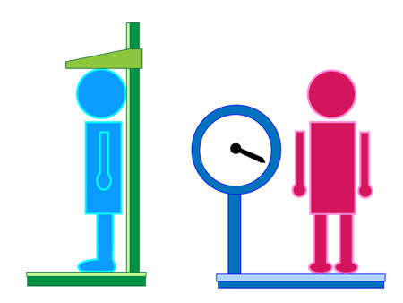
```

???

A formal definition from your book is: 
---
# What things do we want to measure?

--

.pull-left[

- Depression
- Effort
- Intelligence
- Memory
- Social support
- Extroversion
- Eating behavior
- Parent child relationships
- Attention
- Burn out
- Hopelessness

]

.pull-right[
```{r, fig.align='center', echo=FALSE, warning=FALSE,  out.width = "50%"}

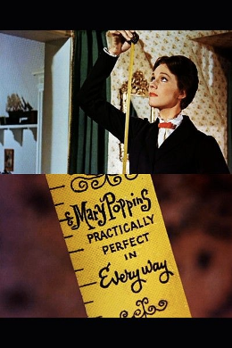
```
]

???

A lot of what we want to study in the cognitive sciences cannot be measured easily--they defy direct observation. So we could use a measuring tape to get our heights but we could not use it to measure personality, unless we are Mary poppins. To examine constructs, psychologists do many things. They observe, they get ratings, ask people to fill out surveys. 

There are multiple ways to do this. We usually give them tasks to do or we ask them to fill out surveys. 

---
# Constructs ≠ Variables

```{r, fig.align='center', echo=FALSE, warning=FALSE,  out.width = "70%"}

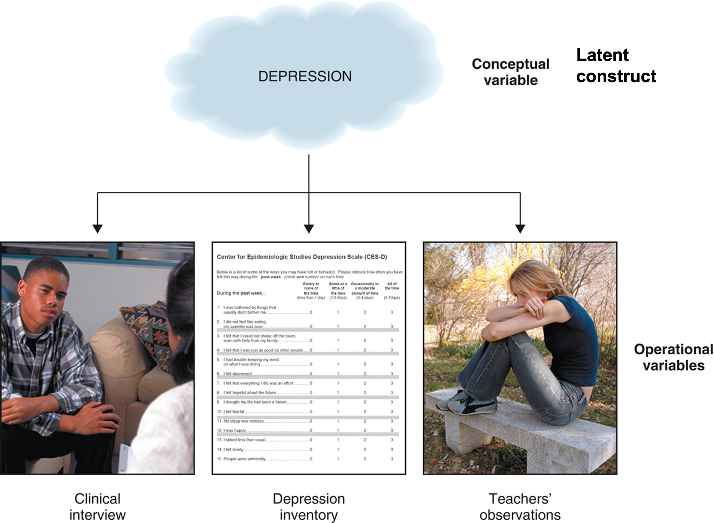
```

???

constructs are these big broad mental abstractions

we call these latent constructs

To study them we need ways to operationalize them by turning them into numbers. For depression we can base it on a score or rating  ore self-reported. We care about the scores bc we think they tell us about the construct. 

Important to know here. Super important
constructs are not variables. We use variables to get at the constructs. It is hard to understand this bc the media talks about constructs all the time.   
---
```{r, fig.align='center', echo=FALSE, warning=FALSE,  out.width = "100%"}

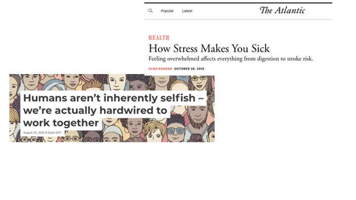
```
---
# Scales of Measurement

- Variables are defined and categorized four ways: 

  1. *N*ominal
  
  2. *O*rdinal
  
  3. *I*nterval
  
  4. *R*atio

---
# Nominal

- Nominal ≈ name ≈ categorical

--

- Arbitrary numbers assigned to categories

--

- No rank order

--

- Presented as frequency counts

--

- Gender/sex, eye color, department, class names
---
# Ordinal
--

- Nominal plus:

--

  – Scores indicate rank
--

  - Increase/decrease is meaningful

--

  - Comparative information (1 > 2 > 3)

--

  - No magnitude information (1 > 2 != 2 > 3)

--

- **Most statistical techniques inappropriate**

---
# Likert Scales
```{r, fig.align='center', echo=FALSE, warning=FALSE,  out.width = "70%"}

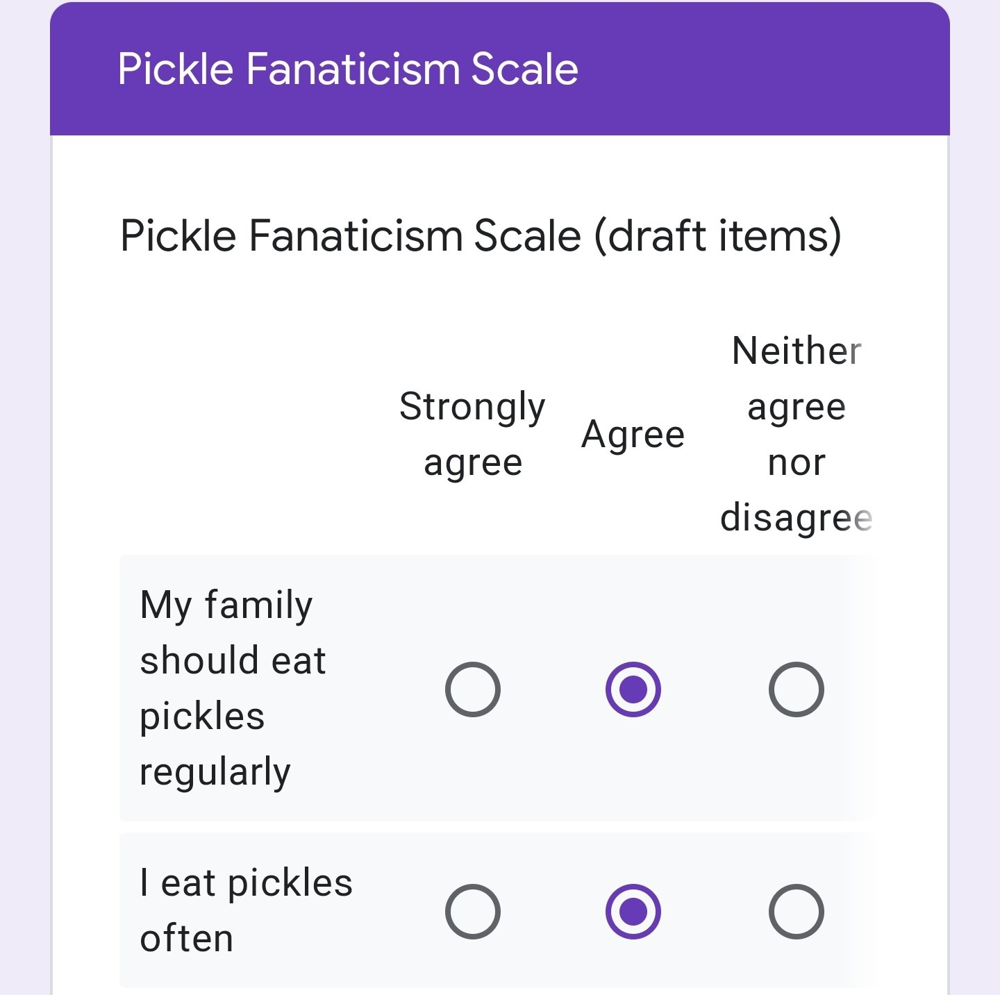
```
---
# Olympic Example
```{r, fig.align='center', echo=FALSE, warning=FALSE,  out.width = "70%"}

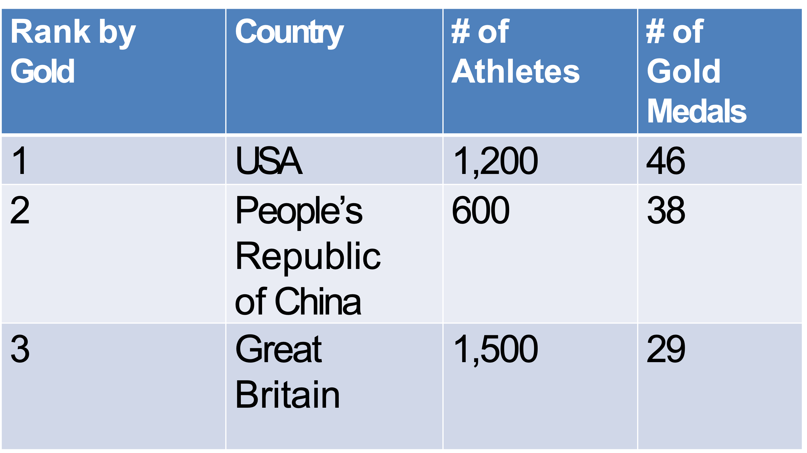
```
---
# Interval

--

- Differences in adjacent intervals are equal $(2-1)=(4-3)=(21-22)$

--

- Numeric, but lacks true 0

--

- Lacks multiplicative properties

--

- Examples: 
  - Temperature
  
  - Time
---
# Ratio
--

- All properties of interval plus: 

--

  – True zero

--

  – Ratios are meaningful
  
--

- Examples: 
  - Reaction times
  - Test Performance
  - Other examples?

---
# Olympic Example
```{r, fig.align='center', echo=FALSE, warning=FALSE,  out.width = "70%"}


```
---
# Considerations for Scaling

--

- Information content

  - Nominal -> Ordinal -> Interval -> Ratio
  
  - Can always go backwards but never forward
  
  - Higher level = higher sensitivity = higher power
---
# Visualizing Scales of Measurement

--

- Bar charts

  - Nominal
  
```{r, out.width="90%", echo=FALSE}
library(ggplot2)
library(introdataviz)
ldt_data$language<-as.factor(ldt_data$language)
ggplot(data = ldt_data, mapping = aes(x = language)) +
  geom_bar()
```
---
# Visualizing Scales of Measurement

--

- Bar charts
  - Ordinal
  
```{r, out.width="90%", echo=FALSE, fig.align='center'}
library(dplyr)
library(sjPlot)
library(sjmisc)
library(parameters)
data(efc)
# find all variables from COPE-Index, which all have a "cop" in their
# variable name, and then plot that subset as likert-plot
mydf <- find_var(efc, pattern = "cop", out = "df")
plot_likert(mydf)
```
---
# Visualziation

- Histograms 

  - Continuous variables
  
      - Distribution of data in terms of frequency count
```{r, fig.align='center', out.width="100%", out.height="100%", echo=FALSE}

library(tidyverse)
ggplot(data = ldt_data, mapping = aes(x = age)) +
  geom_histogram()
```
---
# Visualization

- Density plots

--

  - Alternative to histogram

  - Helps visualize distribution of data
  
```{r, fig.align='center', out.width="100%", out.height="100%", echo=FALSE}

library(tidyverse)
ggplot(data = ldt_data, mapping = aes(x = age)) +
  geom_density()
```
---
# Boxplot

```{r, fig.align='center', echo=FALSE, warning=FALSE,  out.width = "70%"}

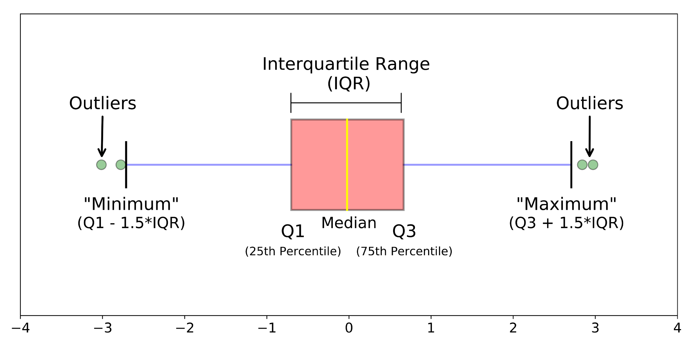
```
---
# Boxplot

```{r, echo=FALSE, fig.align="center", out.width="100%", out.height="100%"}
library(palmerpenguins)
flipper_box <- ggplot(data = penguins, aes(x = species, y = flipper_length_mm)) +
  geom_boxplot(aes(color = species), width = 0.3, show.legend = FALSE) +
 # geom_jitter(aes(color = species), alpha = 0.5, show.legend = FALSE, position = position_jitter(width = 0.2, seed = 0)) +
  scale_color_manual(values = c("darkorange","purple","cyan4")) +
  labs(x = "Species",
       y = "Flipper length (mm)")

flipper_box
#> Warning: Removed 2 rows containing non-finite values (stat_boxplot).
#> Warning: Removed 2 rows containing missing values (geom_point)
```
---
```{r, fig.align='center', echo=FALSE, warning=FALSE,  out.width = "50%"}

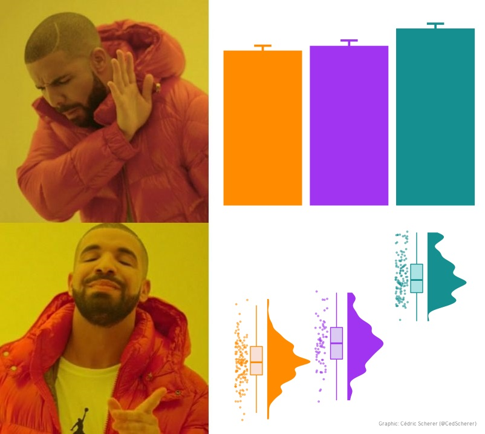
```
---
# Rain Cloud Plots

- Plots a density plot, box plot, raw data point .ft1[https://wellcomeopenresearch.org/articles/4-63]
```{r, echo=FALSE, fig.align="center", out.width="100%", out.height="100%"}
library(tidyverse)

# how to install the introdataviz package to get split and half violin plots
#devtools::install_github("psyteachr/introdataviz")

rain_height <- .1

ggplot(ldt_long, aes(x = "", y = rt, fill = language)) +
  # clouds
  introdataviz::geom_flat_violin(trim=FALSE, alpha = 0.4,
    position = position_nudge(x = rain_height+.05)) +
  # rain
  geom_point(aes(colour = language), size = 2, alpha = .5, show.legend = FALSE, 
              position = position_jitter(width = rain_height, height = 0)) +
  # boxplots
  geom_boxplot(width = rain_height, alpha = 0.4, show.legend = FALSE, 
               outlier.shape = NA,
               position = position_nudge(x = -rain_height*2)) +
  # mean and SE point in the cloud
  stat_summary(fun.data = mean_cl_normal, mapping = aes(color = language), show.legend = FALSE,
               position = position_nudge(x = rain_height * 3)) +
  # adjust layout
  scale_x_discrete(name = "", expand = c(rain_height*3, 0, 0, 0.7)) +
  scale_y_continuous(name = "Reaction time (ms)",
                     breaks = seq(200, 800, 100), 
                     limits = c(200, 800)) +
  coord_flip() +
  facet_wrap(~factor(condition, 
                     levels = c("word", "nonword"), 
                     labels = c("Word", "Non-Word")), 
             nrow = 2) +
  # custom colours and theme
  scale_fill_brewer(palette = "Dark2", name = "Language group") +
  scale_colour_brewer(palette = "Dark2") +
  theme_minimal() +
  theme(panel.grid.major.y = element_blank(),
        legend.position = c(0.8, 0.8),
        legend.background = element_rect(fill = "white", color = "white"))
```
---
# Reliability

> How consistent or how precise a measure/method is

  - Test-Retest (over time)
  
  - Internal (across items)
  
  - Inter-rater  (between different researchers)
  
---
# Reliability

> Consistency of a measure: 

  - Test-Retest (across time)
  
```{r, fig.align='center', echo=FALSE, warning=FALSE,  out.width = "50%"}

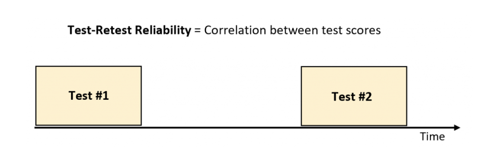
```
---
# Reliability

> Consistency of a measure: 

  - Test-retest (across time)

```{r, fig.align='center', echo=FALSE, warning=FALSE,  out.width = "100%"}

knitr::include_url("https://www.buzzfeed.com/mccarricksean/which-disney-princes-are-you")
```
---
# Reliability

> Consistency of a measure:
  
  - Internal (across items)
  
  1. I love Halloween. **Agree**
  2. I feel happy when I decorate my house for Halloween. **Agree**
  3. I feel angry when the Halloween season is approaching. **Disagree**
  
- Go here: https://forms.gle/x53hpZWhUwDmRW3M8
---
# Cronbach's Alpha
<center>
$\alpha = \frac{N \bar{c}}{\bar{v} + (N-1) \bar{c}}$
Where: 

$N$ = the number of items.
$c̄$ = average covariance between item-pairs.
$v̄$ = average variance.
<end>

```{r, eval=FALSE}
library(ltm)

#enter survey responses as a data frame
data <- data.frame(Q1=c(1, 2, 2, 3, 2, 2, 3, 3, 2, 3),
                   Q2=c(1, 1, 1, 2, 3, 3, 2, 3, 3, 3),
                    Q3=c(1, 1, 2, 1, 2, 3, 3, 3, 2, 3))

#calculate Cronbach's Alpha
cronbach.alpha(data)

```
---
# Cronbach Alpha
```{r, echo=FALSE}
library(flextable)
df=tibble::tribble(
  ~`Cronbach’s.Alpha`, ~Internal.consistency,
            "0.9 ≤ α",           "Excellent",
      "0.8 ≤ α < 0.9",                "Good",
      "0.7 ≤ α < 0.8",          "Acceptable",
      "0.6 ≤ α < 0.7",        "Questionable",
      "0.5 ≤ α < 0.6",                "Poor",
            "α < 0.5",        "Unacceptable"
  )
df %>%
  flextable::flextable()

```
---
# Reliability

> Consistency of a measure:
  
  - Inter-rater (across different researchers)
---
---
# Bank Robbery

- Eyewitness memory plays an important role in helping police solve crimes. However, people’s abilities to accurately recall what they saw can substantially impact whether a criminal is convicted—and equally, if an innocent person is wrongfully convicted. So, it’s important to get it right. 

- First, let’s find out how well you can remember what happens during a bank robbery
<center>
<iframe width="560" height="315" src="https://www.youtube.com/embed/1TkSy_e5WTg" title="YouTube video player" frameborder="0" allow="accelerometer; autoplay; clipboard-write; encrypted-media; gyroscope; picture-in-picture" allowfullscreen></iframe>

---
# Viewing #1

- You have now viewed a clip of a simulated bank robbery.

Take a few minutes to write down your description of the main offender

---
# Work with partner

Take a few minutes to write down your description of the main offender

- Inter-observer agreement = `# agreements X 100 / # agreements + # disagreements`
For example: if there were 5 agreements and 3 disagreements… 

1. [a] 5 x 100 = 500
2. [b] 5 + 3 = 8
3. [c] 500/8 = 62.5% inter-observer agreement

```{r, echo=FALSE}
library(countdown)
countdown(minutes = 5)
```

---
# Group Discussion

- What sort of percentage agreements did we get?
- What do you think these percentages tell us about the reliability of the instructions you were given?
---
# Viewing #2

- We will watch the video again. 
- Then you will get new instructions for describing the offender. 
- Then you will work with your partner to calculate inter-rater reliability again

<center>
<iframe width="560" height="315" src="https://www.youtube.com/embed/1TkSy_e5WTg" title="YouTube video player" frameborder="0" allow="accelerometer; autoplay; clipboard-write; encrypted-media; gyroscope; picture-in-picture" allowfullscreen></iframe>
<center>
---
# Viewing #2

Using the checklist below, describe the main offender: 

- Were they male or female?
- What was their hair colour?
- What was their skin colour?
- What colour were their eyes?
- What was the colour of their shirt?
- Were they wearing a jacket? If so, what colour was it?
- Were they wearing long pants, jeans, or shorts?
- What colour was their pants/jeans/shorts?
- Were they wearing glasses?
- Were they wearing a hat? 
- Were they wearing a balaclava?
- Did he/she have a gun?
- Did he/she have a knife?
- Were they carrying anything? If yes, what was it?

---
# Work with partner
Take a few minutes to write down your description of the main offender

- Inter-observer agreement = `# agreements X 100 / # agreements + # disagreements`

- What percentage agreement did you end up with? What do you think it says about the reliability of the instructions you were given?

> For example: if there were 5 agreements and 3 disagreements
 [a] 5 x 100 = 500
 [b] 5 + 3 = 8
 [c] 500/8 = 62.5% inter-observer agreement
 
```{r, echo=FALSE}
library(countdown)
countdown(minutes = 5)
```

---
# Viewing #3
<center>
<iframe width="560" height="315" src="https://www.youtube.com/embed/1TkSy_e5WTg" title="YouTube video player" frameborder="0" allow="accelerometer; autoplay; clipboard-write; encrypted-media; gyroscope; picture-in-picture" allowfullscreen></iframe>
<center>
---
Using the checklist below, describe the main offender
- Were they male or female?
- What was their hair colour?
- What was their skin colour?
- What colour were their eyes?
- What was the colour of their shirt?
- Were they wearing a jacket? If so, what colour was it?
- Were they wearing long pants, jeans, or shorts?
- What colour was their pants/jeans/shorts?
- Were they wearing glasses?
- Were they wearing a hat? 
- Were they wearing a balaclava?
- Did he/she have a gun?
- Did he/she have a knife?
- Were they carrying anything? If yes, what was it?

---
# On your own this time

Now, using the same formula, calculate how well you agree within yourself (test-retest reliability). That is, what is the level of correspondence between your observations at Viewing #2 and your observations at Viewing #3?

- Inter-observer agreement = `# agreements X 100 / # agreements + # disagreements`

```{r, echo=FALSE}
library(countdown)
countdown(minutes = 5)
```

---
# Group Discussion

How do these results compare with the results for the inter-rater reliability calculations, i.e., are they different? In what way? Any ideas why or why not?

---
# Validity

- Construct Validity

> Are you measuring what you want to measure?

--

  - Teaching evaluations

---
# Validity

- Face validity
  
>  The extent to which a measurement method appears “on its face” to measure the construct of interest

- Criterion or convergent validity
  
> The extent to which people’s scores on a measure are correlated with other variables (known as criteria) that one would expect them to be correlated with.

- Discriminate or divergent validity
  
> The extent to which scores on a measure of a construct are not correlated with measures of other, conceptually distinct, constructs and thus discriminate between them.
---
background-image: url(listeningeffort.png)
background-position: center
background-size: cover
---
# Listening Effort

- Conceptual definition

> The deliberate allocation of mental resources to overcome obstacles in goal pursuit when carrying out a listening task

```{r, fig.align='center', echo=FALSE, warning=FALSE,  out.width = "70%"}

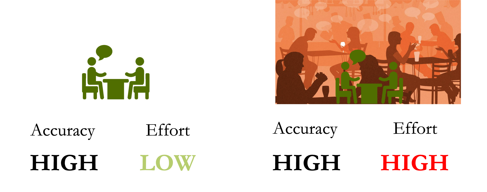
```
---
# Operationalization

- How do we measure "accuracy"?

```{r, fig.align='center', echo=FALSE, warning=FALSE,  out.width = "70%"}


```
---
# Operationalization

- How do we measure "effort"

  - Self-report:

“how hard did you have to work mentally to accomplish your level of performance?”

```{r, fig.align='center', echo=FALSE, warning=FALSE,  out.width = "70%"}

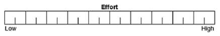
```

---
# How do we measure "effort"

.pull-left[

- Physiological measures

  - Pupil size
  - Skin conductance (GSR)
  - Heart rate
]

--
.pull-right[
```{r, fig.align='center', echo=FALSE, warning=FALSE,  out.width = "70%"}

knitr::include_graphics("pupil.png")
```
]
---
# How do we measure "effort"

.pull-left[

- Behavioral measures

  - Recall
]
.pull-right[
```{r, fig.align='center', echo=FALSE, warning=FALSE,  out.width = "100%"}


```
]

---
# How do we measure "effort"?

.pull-left[

- Behavioral measures

  - dual-task
]

.pull-right[
```{r, fig.align='center', echo=FALSE, warning=FALSE,  out.width = "100%"}


```
]
---
# How many measures of listening effort in the literature?

- 27!
---
# Measuring Listening Effort (Strand et al., 2018)

```{r, fig.align='center', echo=FALSE, warning=FALSE,  out.width = "100%"}

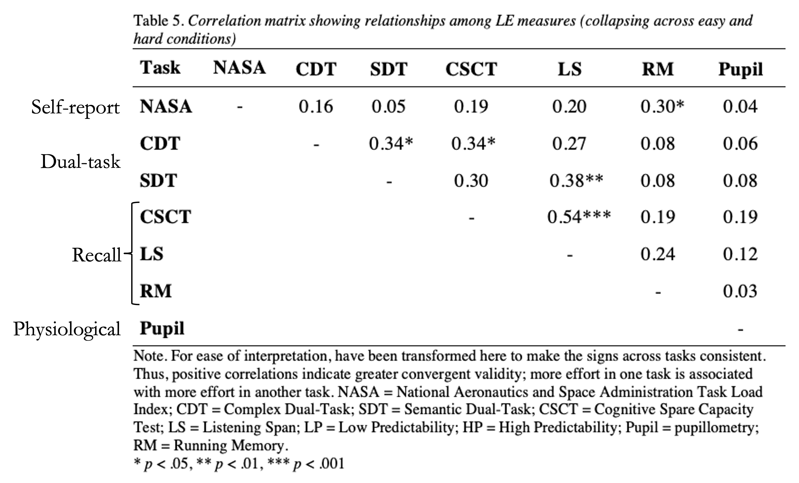
```

--

- *r* - .2 
---
# Jingle and Jangle Fallacy (Thorndike, 1904; Kelley, 1927; Flake & Fried, 2020)


- Jingle 

> Falsely assuming that two tasks measure the same construct because they have the same name

---
# Measuring Listening Effort (Strand et al., 2018)

```{r, fig.align='center', echo=FALSE, warning=FALSE,  out.width = "100%"}

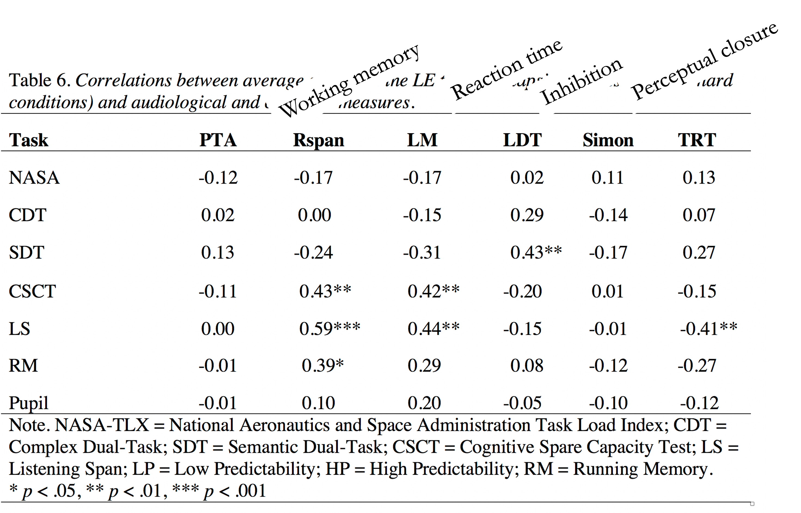
```

--


---
# Jingle and Jangle Fallacy (Thorndike, 1904; Kelley, 1927; Flake & Fried, 2020)

- Jingle 

> Falsely assuming that two tasks measure the same construct because they have the same name

- Jangle 

> Falsely assuming that two tasks measure different constructs because they have different names
---

# Key Points

- Constructs ≠ variables

- Constructs are measured multiple ways, which may lead to different outcomes

- Thinking carefully about measurement is fundamental to research! 
---
```{r, fig.align='center', echo=FALSE, warning=FALSE,  out.width = "100%"}

knitr::include_graphics("timeline.jpeg")
```

