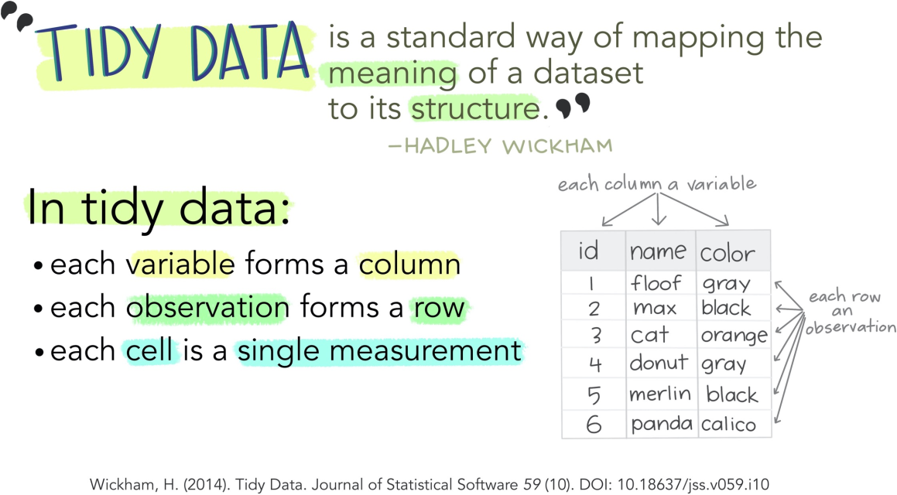
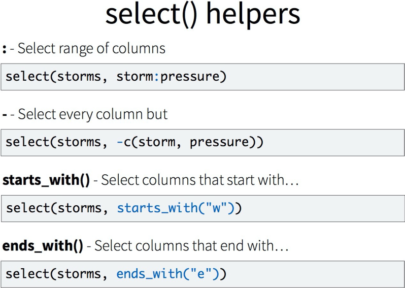
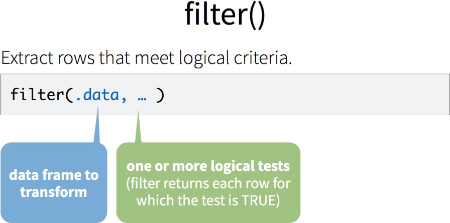
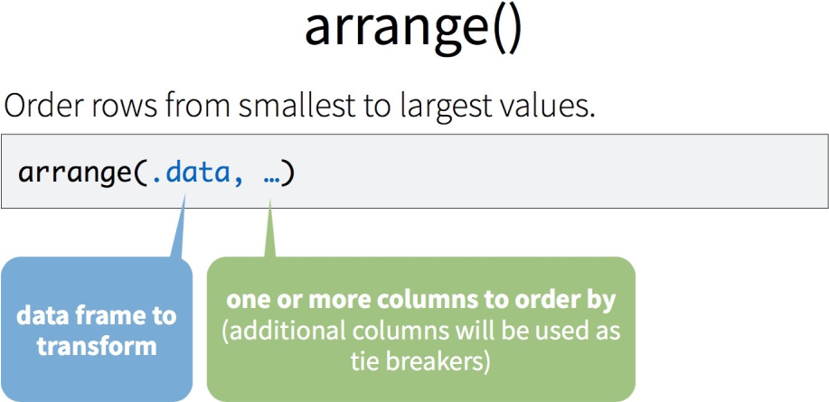
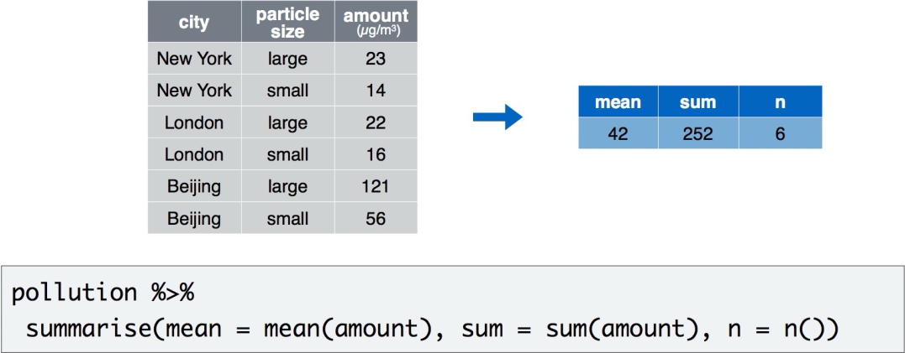
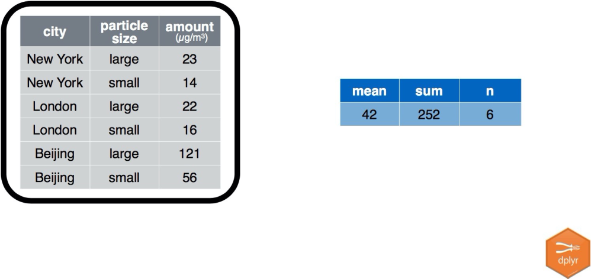
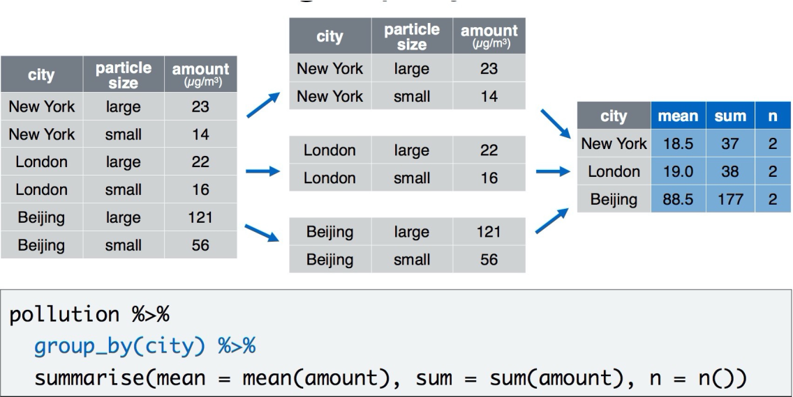
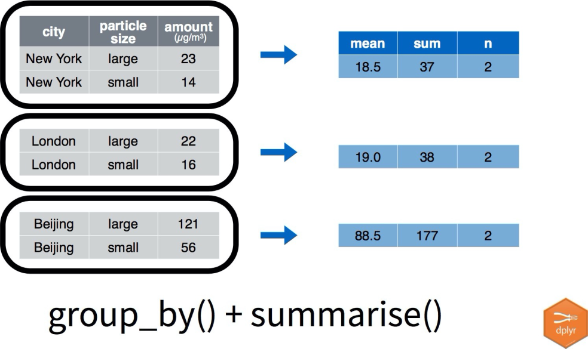
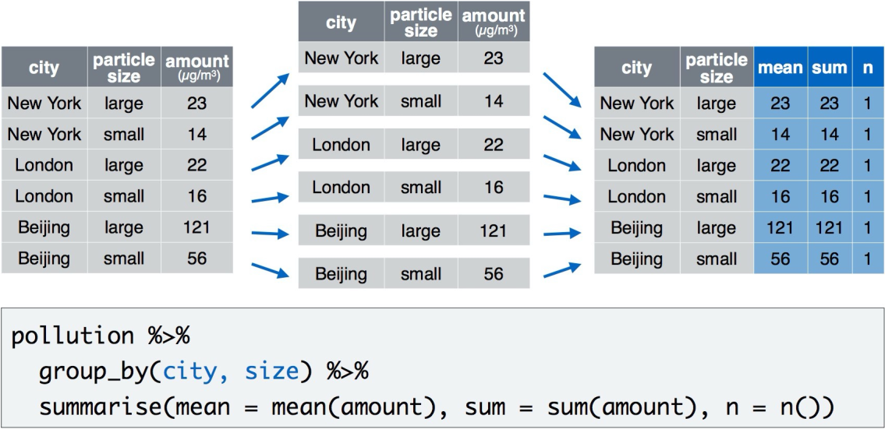

```{r setup, include=FALSE}
options(htmltools.dir.version = FALSE)
knitr::opts_chunk$set(
  fig.width=9, fig.height=3.5, fig.retina=3,
  out.width = "36%",
  cache = FALSE,
  echo = TRUE,
  message = FALSE, 
  warning = FALSE,
  fig.show = TRUE,
  hiline = TRUE
)

hook_source <- knitr::knit_hooks$get('source')
knitr::knit_hooks$set(source = function(x, options) {
  x <- stringr::str_replace(x, "^[[:blank:]]?([^*].+?)[[:blank:]]*#<<[[:blank:]]*$", "*\\1")
  hook_source(x, options)
})
```

```{r xaringan-themer, include=FALSE, warning=FALSE}
library(xaringanthemer)

style_solarized_dark(
  header_font_google = google_font("Aleo"),
  header_h1_font_size = "36px",
  header_color = "black",
  text_font_google = google_font("Aleo"),
  text_font_size = "28px",
  text_color = "black", 
  background_color = "orange", 
  code_font_google = google_font("Share Tech Mono"),
  extra_css = list(
    ".remark-slide-content h2" = list(
      "margin-top" = "2em",
      "margin-bottom" = "2em"
    ),
    .big = list("font-size" = "150%"),
    .small = list("font-size" = "75%"),
    .subtle = list(opacity = "0.6"),
    ".countdown-has-style h3, .countdown-has-style h3 ~ p, .countdown-has-style h3 ~ ul" = list(
      "margin" = "0"
    ),
    ".countdown-has-style pre" = list(
      "margin-top" = "-10px"
    ),
    "p .remark-inline-code" = list(
      "background-color" = "orange",
      "padding" = "2px 2px",
      "margin" = "0 -2px"
    ),
    blockquote = list("margin-left" = 0),
    "em" = list(color = "#2aa198")
  ),
)

```


# What is Tidy Data?

```{r, fig.align='center', echo=FALSE, warning=FALSE,  out.width = "100%"}


```


---


background-image: url(isolate.svg)
background-position: center
background-size: 100%

---

# Tools

- `dplyr` is organized around verbs that manipulate data frames

- Isolating data: 
  - select()
  - filter()
  - arrange()

.pull_right[

```{r,fig.align='center', echo=FALSE, warning=FALSE,  out.width = "30%"}


```
]

---
# Overview

I showed one way to read data into R using `read_csv` and `read.csv`.  In this module, we will show you how to:

1. Select specific elements of an object by an index or logical condition
2. Renaming columns of a `data.frame`
3. Subset rows of a `data.frame`
4. Subset columns of a `data.frame`
5. Add/remove new columns to a `data.frame`
6. Order the columns of a `data.frame`
7. Order the rows of a `data.frame`
8. Joining different `data.frame`

---

# Loading in dplyr and tidyverse

```{r}
library(tidyverse)
library(janitor)
```

Note, when loading `dplyr`, it says objects can be "masked"/conflicts.  That means if you 
use a function defined in 2 places, it uses the one that is loaded in **last**.
---
# Loading in dplyr and tidyverse

For example, if we print `filter`, then we see at the bottom `namespace:dplyr`, which
means when you type `filter`, it will use the one from the `dplyr` package.

```{r, eval=FALSE}
filter
```
---
# Loading in dplyr and tidyverse

- A `filter` function exists by default in the `stats` package, however.  If you want
to make sure you use that one, you use `PackageName::Function` with the colon-colon 
("`::`") operator. 

```{r}
head(stats::filter,2)
```

- This is important when loading many packages, and you may have
some conflicts/masking.

---
# Select

```{r,echo=FALSE, warning=FALSE,  out.width = "100%"}

knitr::include_graphics("select.svg")
```

---
# Titanic Data

- Load in the Titanic data that comes in `R`  called `Titanic`.


```{r}
#install.packages("titanic") # get titanic data
library(titanic) #install and load df

data("titanic_train")
df = titanic_train# df is a copy of mtcars
head(df) 
```
---
# Exercise 1

- Alter the code to select just the name column

```{r,eval=FALSE}

select(df, Survived, Sex) %>%
  head()

```
---
- Alter the code to select just the name column

```{r, eval=FALSE}

select(df, name))

```
---
# Select Helpers

```{r,echo=FALSE, warning=FALSE,  out.width = "100%"}


```
---
# Subset columns

If you wanted it to be a single vector (not a `tibble`), use `pull`:
```{r}
pull(select(df, Name))
```

# Select Columns

The `select` command from `dplyr` allows you to subset columns matching strings:
```{r}
select(df, Name, Sex, Age)
select(df, starts_with("S"))
```
---
# See the Select "helpers"

Run the command:

```{r, eval = FALSE}
??tidyselect::select_helpers
```

Here are a few:

```{r, eval = FALSE}
one_of()
last_col()
ends_with()
contains() # like searching
matches() # Matches a regular expression 
```
---
# Filter

```{r,echo=FALSE, warning=FALSE,  out.width = "100%"}


```

---
# Filter

- Subsetting Rows

The command in `dplyr` for subsetting rows is `filter`.  Try `?filter`

```{r}
head(filter(df, Survived==1, Age < 20))
```
Note, no `$` or subsetting is necessary
---

# Filter

`==` (tests if equal)


```{r}
head(filter(df, Survived==1, Age < 20))
```


`=` (returns error)

```{r, eval=FALSE}
head(filter(df, Survived=1, Age < 20))
```

---
# Subset Rows

You can have multiple logical conditions using the following:

* `==` : equals to
* `!` : not/negation
* `>` / `<`: greater than / less than
* `>=` or `<=`: greater than or equal to / less than or equal to
* `&` : AND
* `|` : OR
* `is.na(x)`: is NA
* `!is.na(x)`: is not NA
---
# Exercise

> See if you can use the logical operators to manipulate our Titanic data

- All of the names where age is less than 30 

- All of the children less than 10 and in 3rd class. 

- All of names where age is `NA`

---

# Common Mistakes

- Using `=` instead of `==`

```{r}

filter(df, Survived==1)

```

- Forgetting quotes

```{r, eval=FALSE}

filter(df, Name==John)

filter(df, Name=="John")

```
---
# Arrange

```{r,echo=FALSE, warning=FALSE,  out.width = "100%"}


```
---
# Arrange

The `arrange` function can reorder rows  By default, `arrange` orders in ascending order:
```{r}
arrange(df, Survived) %>%
  head()
```
---
# Ordering Rows
Use the `desc` to arrange the rows in descending order:
```{r}
arrange(df, desc(Age)) %>%
  head()

select(df, Age) %>%
  head()
```
---
# Ordering Rows
It is a bit more straightforward to mix increasing and decreasing orderings:
```{r}
df %>% 
  select(Survived, Age) %>%
  arrange(desc(Age)) %>%
  head()

```

---
# Exercise

- Arrange the Titanic data set by `Age`. Add `Pclass` as a second variable to arrange on. 

- What is the smallest value of `Age`?

---

```{r}

arrange(df, Age, Pclass) %>%
  head()

```
---
# Pipes Again

Using the `pipe` (comes with `dplyr`):

Recently, the pipe `%>%` makes things such as this much more readable.  It reads left side "pipes" into right side.  RStudio `CMD/Ctrl + Shift + M` shortcut. Pipe `df` into `filter`, then pipe that into `select`:


```{r}
df %>% 
  filter(Survived==1, Age < 10) %>%
  select(Survived, Age)
```

- What is this doing?

---
# Renaming

To rename columns in `dplyr`, you use the `rename` command

```{r}
df = dplyr::rename(df, died = Survived)
head(df)
df = rename(df, Survived = died) # reset - don't need :: b/c not masked
```
---
# Renaming

## Renaming All Columns

To rename all columns you use the `rename_all` command (with a function)

```{r}
df_upper = dplyr::rename_all(df, toupper)
head(df_upper)
```
---
# Lab

---

# Combining `filter` and `select`

You can combine `filter` and `select` to subset the rows and columns, respectively, of a `data.frame`:

```{r}
select(filter(df, Survived==1 & Age < 10), Survived, Age)
```

In `R`, the common way to perform multiple operations is to wrap functions around each other in a nested way such as above 
---
# Assigning Temporary Objects

One can also create temporary objects and reassign them:

```{r}
df2 <- select(filter(df, Survived==1, Age < 10), Survived, Age)

df2 = select(df2, Survived, Age)
```

---
background-image: url(mutate.svg)
background-position: center
background-size: cover

---

# Adding Columns

- The `mutate` function in `dplyr` allows you to add or replace columns of a `data.frame`:
```{r}
df = mutate(df, newcol = Sex)
```

```{r, echo = FALSE}
print(head({df = mutate(df, newcol = Sex)}, 2))
```
---
# Creating Conditional (If-Else) Variables

One frequently-used tool is creating variables with conditions.

A general function for creating new variables based on existing variables is the `ifelse()` function, which "returns a value with the same shape as test which is filled with elements selected from either yes or no depending on whether the element of test is `TRUE` or `FALSE`."

```
ifelse(test, yes, no)

# test: an object which can be coerced
    to logical mode.
# yes: return values for true elements of test.
# no: return values for false elements of test.
```

---
# Adding Columns

Combined with `ifelse(condition, TRUE, FALSE)`, it can give you:

```{r}
df = mutate(df, 
            ticket_type = ifelse(
              Pclass==1,
              "First Class", ifelse(
              Pclass== 2, "Business Class", 
              "Economy")
            )
)
head(df$money)
```
---
# Adding Columns

Alternatively, `case_when` provides a clean syntax as well:

```{r}
df = mutate(df, 
            ticket_type = case_when(
              Pclass==1 ~ "First CLass",
              Pclass==2 ~ "Buiness Class",
              TRUE ~ "Economy"
            ))
head(df$ticket_type)
```
---
# Removing Columns

The `select` function can remove a column with minus (`-`):
```{r, eval = FALSE}
select(df, -newcol)
```

---
# Removing Columns 

Remove `newcol`

```{r, eval = FALSE}
select(df, -one_of("newcol"))
```

```{r, echo = FALSE}
head(select(df, -one_of("newcol")))
```
---
# Ordering columns

The `select` function can reorder columns.  Put `newcol` first, then select the rest of columns:
```{r, eval = FALSE}
select(df, newcol, everything())
```

---
# Ordering Columns 

Put `newcol` at the end ("remove, everything, then add back in"):

```{r, eval = FALSE}

head(relocate(df, newcol, .after = Survived))
head(relocate(df, newcol, .before = Survived))
```

```{r, echo = FALSE}
relocate(df, newcol, .after = last_col())

```
---

# Transmutation

The `transmute` function in `dplyr` combines both the `mutate` and `select` functions. One can create new columns and keep the only the columns wanted:

```{r}
transmute(df, newcol2 = Age, Age, Survived)
```
---
# Lab Part 4

---
# Reshaping Data 

I will show you how to:

1. Reshaping data from wide (fat) to long (tall)
2. Reshaping data from long (tall) to wide (fat)
3. Merging Data/Joins
4. Perform operations by a grouping variable

---
# What is wide/long data?


```{r, echo = FALSE}
ex_wide = tibble(id = 1:2,
                     visit1 = c(10, 5),
                     visit2 = c(4, 6),
                     visit3 = c(3, NA)
                     )
ex_long = tibble(id = c(rep(1, 3), rep(2, 2)),
                     visit = c(1:3, 1:2),
                     value = c(10, 4, 3, 5, 6))
```

See http://www.cookbook-r.com/Manipulating_data/Converting_data_between_wide_and_long_format/

- Wide - multiple columns per observation 
    - e.g. visit1, visit2, visit3
```{r, echo = FALSE}
ex_wide
```

- Long - multiple rows per observation
```{r, echo = FALSE}
ex_long
```
---
# What is wide/long data?

<div style="font-size:40pt">
More accurately, data is wide or long **with respect** to certain variables.
</div>
---
# Data used: `Billboard` rank of songs in 2000

```{r, message = FALSE}
head(billboard, 4)

```
---
# Reshaping data from wide (fat) to long (tall): base R

The `reshape` command exists.  It is a **confusing** function.  Don't use it.

# tidyr package

`tidyr` allows you to "tidy" your data.  We will be talking about:

- `pivot_longer` - make multiple columns into variables, (wide to long)
- `pivot_wider` - make a variable into multiple columns, (long to wide)

- All the "join" functions for merging are in `dplyr`

---
# Reshaping data from wide (fat) to long (tall): tidyr 

`tidyr::gather` - puts column data into rows.

We want the column names into "`var`" variable in the output dataset and the value in "`number`" variable. We then describe which columns we want to "gather:" 

```{r}
long = billboard %>% 
  pivot_longer(
    cols = starts_with("wk"), 
    names_to = "week", 
    values_to = "rank",
    values_drop_na = TRUE
  )

  
head(long, 4)
```
---
# Reshaping data from long (tall) to wide (fat)

```{r}
wide = long %>% 
  
   pivot_wider(names_from = week, values_from = rank)

  
head(wide, 4)
```
---
# Lab
---
# Summarize Data


- Summarise() - summarise variables
- Group_by() - group cases
- Mutate - create new variable

---

# Summarize 


```{r}

df %>%
  summarise(total=sum(Fare), max=max(Fare), min=min(Fare))

```

---
# Summarize

- `n()`: number of rows in a dataset

```{r}

df %>%
  summarise(n=n())

```

---
# Summary Functions

- Take a vector as input
- Return a single value as output


---
# Grouping Cases

##  group_by()

```{r}

df %>%
  group_by(Sex) # groups by sex


```


---
# Grouping Cases

```{r}
df %>%
  group_by(Sex) %>% # groups by sex
  summarise(total=sum(n())) # get total number of women and men

```

---
# Grouping Cases

## ungroup()

- Removed grouping variables (Very important)

```{r}
df %>%
  group_by(Sex) %>% # groups by sex
summarise(total=sum(n())) %>%
  ungroup()#  ungroup()


```

---
# Summary

```{r,echo=FALSE, warning=FALSE,  out.width = "100%"}


```

---
# Summary

```{r,echo=FALSE, warning=FALSE,  out.width = "100%"}


```
---
# Summary

```{r,echo=FALSE, warning=FALSE,  out.width = "100%"}


```
---


# Summary

```{r,echo=FALSE, warning=FALSE,  out.width = "100%"}


```

---
# Summary

```{r,echo=FALSE, warning=FALSE,  out.width = "100%"}

knitr::include_graphics("sketch4.svg")
```

---
# Summary 
```{r,echo=FALSE, warning=FALSE,  out.width = "100%"}


```
---
# Summary 
```{r,echo=FALSE, warning=FALSE,  out.width = "100%"}


```
---

# Extra Slides
# Merging: Simple Data

`base` has baseline data for ids `1` to `10` and Age

```{r merging}
base <- tibble(id = 1:10, Age = seq(55,60, length=10))
head(base, 2)
```
`visits` has ids 1 to 8, then 11 (new id), and 3 visits and outcome

```{r}
visits <- tibble(id = c(rep(1:8, 3), 11), visit= c(rep(1:3, 8), 3),
                    Outcome = seq(10,50, length=25))
tail(visits, 2)
```
---

# Joining in `dplyr`

* Merging/joining data sets together - usually on key variables, usually "id"
* `?join` - see different types of joining for `dplyr`
* Let's look at https://www.rstudio.com/wp-content/uploads/2015/02/data-wrangling-cheatsheet.pdf
* `inner_join(x, y)` - only rows that match for `x` and `y` are kept
* `full_join(x, y)` - all rows of `x` and `y` are kept 
* `left_join(x, y)` - all rows of `x` are kept even if not merged with `y`
* `right_join(x, y)` - all rows of `y` are kept even if not merged with `x`
* `anti_join(x, y)` - all rows from `x` not in `y` keeping just columns from `x`.
---
# Inner Join

```{r inner_join}
ij = inner_join(base, visits)
dim(ij)
tail(ij)
```
---

# Left Join

```{r left_join}
lj = left_join(base, visits)
dim(lj)
tail(lj)
```

# Logging the joins

The `tidylog` package can show you log outputs from `dplyr` (newly added).  You will need to install to use.

```{r, include=FALSE}
library(tidylog)
```

```{r left_join_log}
library(tidylog)
left_join(base, visits)
```
---
# Right Join

```{r right_join}
rj = right_join(base, visits)
tail(rj, 3)
```
---
#  Right Join: Switching arguments

```{r right_join2}
rj2 = right_join(visits, base)
tail(rj2, 3)
```
```{r right_join_arrange, echo = FALSE}
rj2 = arrange(rj2, id, visit) %>% select(id, visit, Outcome, Age)
lj = arrange(lj, id, visit) %>% select(id, visit, Outcome, Age)
```
```{r right_join_arrange_out}
identical(rj2, lj) # after some rearranging
```
---
# Full Join

```{r full_join}
fj = full_join(base, visits)
tail(fj, 4)
```
---
# Using the `by` argument

By default - uses intersection of column names.  If `by` specified, then uses that, but if other columns with same name, adds `suffix`.

```{r use_by}
base = base %>% mutate(x = 5)
visits = visits %>% mutate(x = 4)
head(full_join(base, visits))
head(full_join(base, visits, by = "id"))
head(full_join(base, visits, by = "id", suffix = c("_base", "_visit")))
```
---
# Duplicated

- The `duplicated` command can give you indications if there are duplications in a **vector**:

```{r}
duplicated(1:5)
duplicated(c(1:5, 1))
fj %>% 
  mutate(dup_id = duplicated(id))
```
`
```{r}
fj %>%
  janitor::get_dupes(id)
```
---
# Lab Part 4


