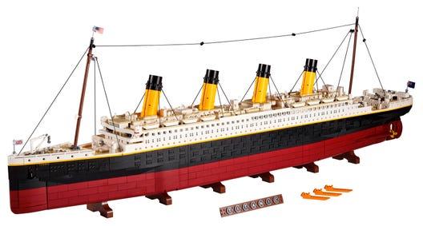
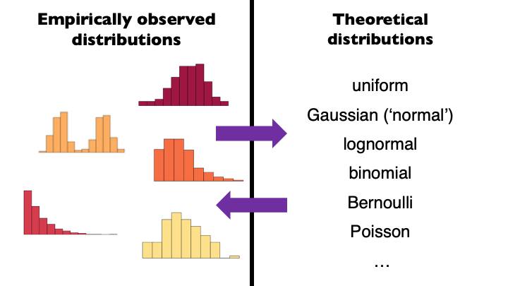
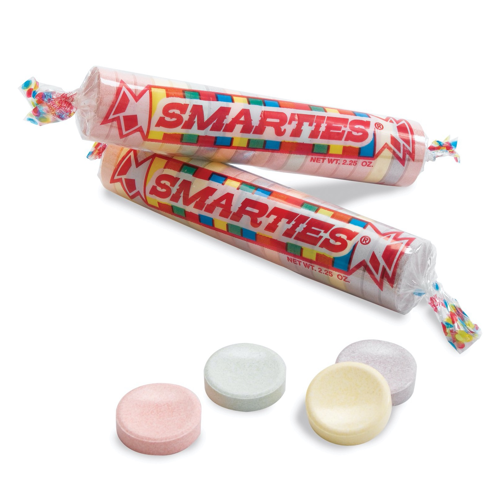

```{r setup, include=FALSE}
options(htmltools.dir.version = FALSE)
knitr::opts_chunk$set(
  fig.width=9, fig.height=3.5, fig.retina=3,
  out.width = "36%",
  cache = FALSE,
  echo = TRUE,
  message = FALSE, 
  warning = FALSE,
  fig.show = TRUE,
  hiline = TRUE
)

hook_source <- knitr::knit_hooks$get('source')
knitr::knit_hooks$set(source = function(x, options) {
  x <- stringr::str_replace(x, "^[[:blank:]]?([^*].+?)[[:blank:]]*#<<[[:blank:]]*$", "*\\1")
  hook_source(x, options)
})
```

```{r xaringan-themer, include=FALSE, warning=FALSE}
library(xaringanthemer)

style_solarized_dark(
  header_font_google = google_font("Aleo"),
  header_h1_font_size = "36px",
  header_color = "black",
  text_font_google = google_font("Aleo"),
  text_font_size = "28px",
  text_color = "black", 
  background_color = "orange", 
  code_font_google = google_font("Share Tech Mono"),
  extra_css = list(
    ".remark-slide-content h2" = list(
      "margin-top" = "2em",
      "margin-bottom" = "2em"
    ),
    .big = list("font-size" = "150%"),
    .small = list("font-size" = "75%"),
    .subtle = list(opacity = "0.6"),
    ".countdown-has-style h3, .countdown-has-style h3 ~ p, .countdown-has-style h3 ~ ul" = list(
      "margin" = "0"
    ),
    ".countdown-has-style pre" = list(
      "margin-top" = "-10px"
    ),
    "p .remark-inline-code" = list(
      "background-color" = "orange",
      "padding" = "2px 2px",
      "margin" = "0 -2px"
    ),
    blockquote = list("margin-left" = 0),
    "em" = list(color = "#2aa198")
  ),
)

```

# What is a Model?

 > Models are simplifications of things in the real world 

```{r echo=FALSE,out.height="15%", out.width="75%",fig.cap="",fig.show='hold',fig.align='center'}



```
---
class:middle center
> __statistical modeling__ = "making models of distributions"

---
# Distributions


```{r echo=FALSE,out.height="25%", out.width="75%",fig.cap="",fig.show='hold',fig.align='center'}




```
---
# Basic Structure of a Model

<br>
<br>

data = model + error

1. Model 
2. Error (predicted - observed)

 - $\widehat{data_i}$ = model_i

 - error_i = data_i - \widehat{data_i}


???

The “hat” over the data denotes that it’s our prediction rather than the actual value of the data.This means that the predicted value of the data for observation is equal to the value of the model for that observation. Once we have a prediction from the model, we can then compute the error:

That is, the error for any observation is the difference between the observed value of the data and the predicted value of the data from the model.

---
# The Golem of Prague

.pull-left[

- The golem was a powerful clay robot
--
- Brought to life by writing emet (“truth”) on its forehead
--
- Obeyed commands literally
--
- Powerful, but no wisdom
--
- In some versions, Rabbi Judah Loew ben Bezalel built a golem to protect
--
- But he lost control, causing innocent deaths
]

.pull-left[
```{r echo=FALSE,out.height="50%",out.width="70%",fig.cap="",fig.show='hold',fig.align='center'}

knitr::include_graphics('golem.jpg')

```
]
---
# Statitsical Golems

- Statistical (and scientific) models are our golems
- We build them from basic parts
- They are powerful—we can use them to understand the world and make predictions
- They are animated by “truth” (data), but they themselves are neither true nor false
-The model describes the golem, not the world
- They are mindless automatons that simply run their programs
- The model doesn’t describe the world or tell us what scientific conclusion to draw—that’s on us
- We need to be careful about how we build, interpret, and apply models
---
# Simple Example

.pull-left[
- Experiment
    - Take 200 7-year-olds
    
    - Randomly assign to 2 groups
    
    - Control: Normal breakfast
    
    - Treatment: Normal breakfast + 1 packet of Smarties
    
    - Outcome: Age-appropriate general reasoning test
    
           - Norm scores: Mean 100, SD 15

- What statistical analysis do I run?

]

.pull-right[

```{r echo=FALSE,out.height="50%", out.width="100%",fig.cap="",fig.show='hold',fig.align='center'}



```

]
---

# Choosing a Statitsical Model


.pull-left[

- Cookbook approach

  -  My data are ordinal, what type of test do I use?
]

.pull-right[

```{r echo=FALSE,out.height="50%", out.width="100%",fig.cap="",fig.show='hold',fig.align='center'}

knitr::include_graphics('test_selection.png')

```
]

.footnote[[1]Figure from Statistical Rethinking.]


---
# Choosing a Statistical Model

.pull-left[

- Cookbook approach

  -  My data are ordinal, what type of test do I use?

  - Every one of these tests is the same model
  
      - The general linear model (__GLM__)
]

.pull-right[

```{r echo=FALSE,out.height="50%", out.width="100%",fig.cap="",fig.show='hold',fig.align='center'}

knitr::include_graphics('test_selection.png')

```
]
---
# Choosing a Statistical Model

.pull-left[

- Cookbook approach

  -  My data are ordinal, what type of test do I use?

  - Every one of these tests is the same model
  
      - The general linear model (__GLM__)

  - This approach makes it hard to think clearly about relationship between our question and the statistics
    
]

.pull-right[

```{r echo=FALSE,out.height="50%", out.width="100%",fig.cap="",fig.show='hold',fig.align='center'}

knitr::include_graphics('test_selection.png')

```
]
---
# The GLM
<br>
<br>
- Model comparison approach

- Think in terms of models, not tests

- Your model is determined by your question, not by the data
--
<br>
<br>
- __Let’s build a model for the candy experiment__

---
# The Data


```{r}
library(tidyverse)
control_group= c(92, 97, 123, 101, 102, 126, 107, 81, 90, 93, 118, 105, 106, 102, 92, 127, 107, 71, 111, 93, 84, 97, 85, 89, 91, 75, 113, 102, 83, 119, 106, 96, 113, 113, 112, 110, 108, 99, 95, 94, 90, 97, 81, 133, 118, 83, 94, 93, 112, 99, 104, 100, 99, 121, 97, 123, 77, 109, 102, 103, 106, 92, 95, 85, 84, 105, 107, 101, 114, 131, 93, 65, 115, 89, 90, 115, 96, 82, 103, 98, 100, 106, 94, 110, 97, 105, 116, 107, 95, 117, 115, 108, 104, 91, 120, 91, 133, 123, 96, 85)


treat_group= c(99, 114, 106, 105, 96, 109, 98, 85, 104, 124, 101, 119, 86, 109, 118, 115, 112, 100, 97, 95, 112, 96, 103, 106, 138, 100, 114, 111, 96, 109, 132, 117, 111, 104, 79, 127, 88, 121, 139, 88, 121, 106, 86, 87, 86, 102, 88, 120, 142, 91, 122, 122, 115, 95, 108, 106, 118, 104, 125, 104, 126, 94, 91, 159, 104, 114, 120, 103, 118, 116, 107, 111, 109, 142, 99, 94, 111, 115, 117, 103, 94, 129, 105, 97, 106, 107, 127, 111, 121, 103, 113, 105, 111, 97, 90, 140, 119, 91, 101, 92)

df <- tibble(treatment=treat_group, control=control_group)

df <- df %>%
  pivot_longer(treatment:control, names_to = "cond", values_to = "values")


```

---
# The Data

```{r, out.width="100%", out.height="100%", fig.align="center", echo=FALSE}
library(ggdist)

  df %>%
  ggplot(aes(x=values, y = cond, fill=cond)) +
  geom_dotsinterval() + 
    theme_dark()

```

---
# Bulding a Model - Notation

.pull-left[

Small Roman letter

- Individual observed data points

  - $y_1$, $y_2$, $y_3$, $y_4$, …, $y_n$

          - The scores for person 1, person 2, person 3, etc.
          
  - $y_i$
  
          - The score for the “ith” person

]

.pull-right[

Big Roman Letters

- A “random variable”
- The model for data we could observe, but haven’t yet

- $Y_i$

  - The model for person 1
  - The yet-to-be-observed score of person 1
  
]
---
# Bulding a Model - Notation

.pull-left[

Greek letters

- Unobservable parameters   
      
      - Use to describe features of the model
- μ
      - mu
      - Pronounced “mew”
      - Used to describe means
- σ
      - Sigma
      - Pronounced “sigma”
      - Used to describe a standard deviation
]

.pull-right[


```{r echo=FALSE,out.height="50%", out.width="100%",fig.cap="",fig.show='hold',fig.align='center'}

knitr::include_graphics('mew.png')

```
]


---
# Building a Model - Normal Distribution

.pull-left[

- Normal(μ, σ)

- Parameters:
    - μ		Mean
    - σ		Standard deviation

- Mean is the center of the distribution

    - Technically, the point with smallest squared distance from all the data points
]

---
# Building a Model - Normal Distribution

.pull-left[

- Normal(μ, σ)

- Parameters:
    - μ		Mean
    - σ		Standard deviation
    
- Variance is average squared deviation from the mean
Standard deviation
    - 𝜎=√𝑉𝑎𝑟𝑖𝑎𝑛𝑐𝑒
    - On average, how far is each point from the mean (spread)?

]
.pull-right[

```{r echo=FALSE,out.height="50%", out.width="100%",fig.cap="",fig.show='hold',fig.align='center'}


```

]
---
#  A Simple Model

.pull-right[]

- $Y_1$ ∼ Normal(100, 15)


- $Y_2$ ∼ Normal(100, 15)

- $Y_n$ ∼ Normal(100, 15)
	
- Or for all observations, 

      - $Y_i$ ∼ Normal(100, 15)
   
- What does this model say?
]
--

.pull-right[

1. Everyone’s score comes from the same distribution

2. The average score should be around 100

3. Scores should be spread out by 15

4. Scores should follow bell-shaped curve
]
---
# A Good Model?


```{r, echo=FALSE,out.height="50%", out.width="100%",fig.cap="",fig.show='hold',fig.align='center'}
  df %>%
  ggplot(aes(x=values, y = cond, fill=cond)) +
  #geom_dotsinterval()+

 stat_halfeye() 


```
---
# A More Complex Model

- Allow the groups to have different means

- Add an unknown parameter

  - Something that the model will estimate

	    - $Y_i$ ,control ∼	Normal(100, 15)
    	- $Y_i$ ,treatment ∼	Normal($μ_t$, 15)

- What does this model say?

---
# A More Complex Model

.pull-left[

```{r echo=FALSE,out.height="50%", out.width="100%",fig.cap="",fig.show='hold',fig.align='center'}


```
]

.pull-right[

1. Control and treatment scores come different distributions
2. The average control group score should be around 100
3. The average treatment group score is unknown
      - Freely estimated
4. Scores should spread out by about 15 in both groups
5. Scores should follow a bell-shaped curve in both groups
]

---
# Unknown Paramters


.pull-left[

- We dont know what they are

- We need to __estimate__ them

- Denote estimates with a hat: 

    - μ̂t  → our estimate of μt

]
--
.pull-right[

It turns out that, for a normal distribution, the best estimate of the population mean is sample mean

    - μ̂t = (∑_𝑖▒𝑦_𝑖 )/𝑁

- This is both the “least squares” and “maximum likelihood” estimator

]

---
# Treatment Group Sample Mean


```{r}
library(flextable)

mean(treat_group)


```
---
# Inference

- What is the evidence that Smarties make children smarter?

- What do we mean by evidence?
- What can we generalize? 

- What are some alternative explanations for our results?
---
# Let's Streamline Our Notation

.pull-left[

- Simple Model:
      - $Y_i$ ∼ Normal(100, 15)

- A More Typical Simple Model
      - $Y_i$ ∼ Normal(μ, σ)
      - μ = $β_0$

      - One common mean μ
      - One common SD σ
]


.pull-right[

```{r}
library(knitr)
library(broom)
#intercept only
lm(df$values~1)  %>%
  tidy() %>%
  kable()


```

]

---
# More Complex Model

$Y_i$ ∼ Normal($μ_i$, σ)
$μ_i$ = $β_0$ + $β_1$ $X_i$
  
  - $μ_i$ = $μ_control$ + diff× $group_i$
  - Control group mean $β_0$
  - Group mean difference $β_1$
  - One common SD σ

```{r}
#cond in model
lm(df$values~df$cond)
 tidy() %>%
  kable()

```

---
# General Linear Model

```{r echo=FALSE,out.height="50%", out.width="100%",fig.cap="",fig.show='hold',fig.align='center'}


```


