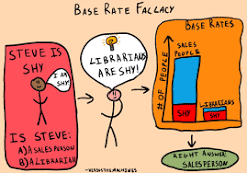
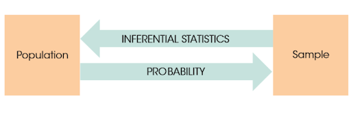

```{r setup, include=FALSE}

library(tidyverse)
options(htmltools.dir.version = FALSE)
knitr::opts_chunk$set(
  fig.width=9, fig.height=3.5, fig.retina=3,
  out.width = "36%",
  cache = FALSE,
  echo = TRUE,
  message = FALSE, 
  warning = FALSE,
  fig.show = TRUE,
  hiline = TRUE
)

hook_source <- knitr::knit_hooks$get('source')
knitr::knit_hooks$set(source = function(x, options) {
  x <- stringr::str_replace(x, "^[[:blank:]]?([^*].+?)[[:blank:]]*#<<[[:blank:]]*$", "*\\1")
  hook_source(x, options)
})
```

```{r xaringan-themer, include=FALSE, warning=FALSE}
library(xaringanthemer)
library(tidyverse)

style_solarized_dark(
  header_font_google = google_font("Aleo"),
  header_h1_font_size = "36px",
  header_color = "black",
  text_font_google = google_font("Aleo"),
  text_font_size = "28px",
  text_color = "black", 
  background_color = "orange", 
  code_font_google = google_font("Share Tech Mono"),
  extra_css = list(
    ".remark-slide-content h2" = list(
      "margin-top" = "2em",
      "margin-bottom" = "2em"
    ),
    .big = list("font-size" = "150%"),
    .small = list("font-size" = "75%"),
    .subtle = list(opacity = "0.6"),
    ".countdown-has-style h3, .countdown-has-style h3 ~ p, .countdown-has-style h3 ~ ul" = list(
      "margin" = "0"
    ),
    ".countdown-has-style pre" = list(
      "margin-top" = "-10px"
    ),
    "p .remark-inline-code" = list(
      "background-color" = "orange",
      "padding" = "2px 2px",
      "margin" = "0 -2px"
    ),
    blockquote = list("margin-left" = 0),
    "em" = list(color = "#2aa198")
  ),
)


```

# Knowledge Check

<div style='position: relative; padding-bottom: 56.25%; padding-top: 35px; height: 0; overflow: hidden;'><iframe sandbox='allow-scripts allow-same-origin allow-presentation' allowfullscreen='true' allowtransparency='true' frameborder='0' height='315' src='https://www.mentimeter.com/app/presentation/a545260831446a899d989a08b7445b38/34954ecab6bd/embed' style='position: absolute; top: 0; left: 0; width: 100%; height: 100%;' width='420'></iframe></div>

---

# Last Class

- Measurement is hard, but so important

- Make sure you understand different types of reliability: 
  - Test-retest
  - Internal
  - Inter-rater
  
- Make sure you understand different types of validity:
 - Construct
    - Face
    - Convergent
   - Divergent
---
# Today

- What is Probability?

- Different ways of thinking about probability

- Rules of probability

---
# Probability Warm-up

1. What is probability of drawing the ace of spades from a fair deck of cards?

2. What is the probability of drawing an ace of any suit?

3. You are going to roll some dice twice. What is the chance you roll double 1s?

4. What is the chance that a live specimen of New Jersey Devil will be found?

5. Who is more likely to be a victim of a street robbery, a young man or an old lady?

6. Yesterday the whether forecaster said that there was a 30% chance of rain today, and it rained today. Was she right or wrong?
---
# What is Probability Theory? 

```{r, fig.align='center', echo=FALSE, warning=FALSE,  out.height="20%", out.width = "80%"}
library(flextable)

```
---
# What is Probability Theory?

<br>
<br> 

Probability is the study of __random processes__

- Probability is used to characterize uncertainty/randomness

```{r, fig.align='center', echo=FALSE, warning=FALSE,  out.width = "50%"}

knitr::include_graphics("probability-line.svg")
```

---
# Random Processes: Intuition

.pull-left[

- Let's flip a fair coin  

```{r}

set.seed(973)

coinflips <- function(x) {
    flip <- rbinom(x, 1, 0.5)
    flip <- ifelse(flip==1, "Tails", "Heads")
    return(flip)
}


```

  1.   Can you tell me what the outcome will be?   

  2.  If we were to flip a fair coin many many times, would you be able to tell the proportion of times that we would obtain heads?  
]
--
.pull-right[
<br>
<br>
- If answer to first question is "NO" 

AND
- Answer to second question is "YES"   

THEN  

- You are dealing with a random process  
]

---
# Definition

<br>
<br>

> Random processes are __mechanisms__ that produce outcomes...  from __a world/set of possible__ outcomes...  with some degree of __uncertainty__ but with __regularity__.  

---
# Probability Terminlogy  

- __Experiment__ or __Trial__:
    - Any activity that produces or observes an outcome

- __Sample space:__ $\Omega$ 

  - The set of all possible outcomes

- __Outcome:__ $\omega$  

  - Possible realization of the random process
      - heads

- __Event:__ $A$, $B$, $C$, etc. 

  - A given outcome or set of outcomes
  
- __Probability__: Proportion of outcomes favoring an event  
---
# Examples of Random Processes

- Random assignment of $N$ individuals to an experimental condition    

--

<br>

- Random draw of a sample of $n$ individuals from a population of $N$ individuals  

--

<br>

- Rolling a die  

---
# Illustration: Random Assignment 

- We randomly assigned an individual to a Treatment (T) vs. Control (C)  

  - Sample space?  

--

  - We could express $\Omega$ in the following ways:   

  - $\Omega = \{\mathrm{Treatment, \: Control\}}$  
  
  - $\Omega = \{\mathrm{T, \: C\}}$  
  
--

- What if we assigned two individuals to Treatment (T) vs. Control (C)

--

  - $\Omega = \{\mathrm{TT, \:TC, \:CT, \:CC}\}$   
---
# Events  

- An _event_ is a subset of the sample space $\Omega$ and corresponds to the realization of one or more than one outcomes $\omega$   
 
 
  - Let $\Omega = \{\mathrm{TT, \:TC, \:CT, \:CC}\}$   

- We could let $A$ be __event__ that both individuals are assigned to the same experimental condition  

- We could write:  

  - $A = \{TT, \: CC\}$ 

- Another example?  

---
# Notations   

```{r echo=FALSE,out.width="100%",fig.cap="",fig.show='hold',fig.align='center'}


``` 
---
# Practice with Events  

- We randomly assign 8 participants to T vs. C
  
  - Possible outcome:

--

- $\omega =  \mathrm{TTTTCCTC}$

--

- Sample space: 

--

  - Set of all possible strings of length 8 of T's and C's  

---
# Practice with Events  

- Let's __randomly__ generate a possible outcome $\omega_j$ in R \vspace{.40cm}

```{r eval=FALSE}
sample(c("T", "C"), 
       size = 8, 
       replace = TRUE)
```

- In the background, does R draw from this sample space? 

--

- NO: Keep in mind that R draws an outcome $\omega_j$ from $\Omega = \{T, C\}$ 8 times in a row with replacement  

---
# Probability Warm-up

- What is probability of drawing the ace of spades from a fair deck of cards?

```{r}

ace=1/52

ace

```


- What is the probability of drawing an ace of any suit?

```{r}

ace=4/52

ace

```
---
-  You are going to roll some dice twice. What is the chance you roll double 1s?

```{r}
dice1s <- 1/6*1/6
dice1s

```
---
- What is the chance that a live specimen of New Jersey Devil will be found?
  - 0%

-  Who is more likely to be a victim of a street robbery, a young man or an old lady?

  - old lady
- 
Yesterday the whether forecaster said that there was a 30% chance of rain today, and it rained today. Was she right or wrong?

  - Depends
---

class: center, inverse

background-image: url("weather.png")
---
# Different Ways of Thinking About Probability

- Classic/Naive

  - **All outcomes are equally likely**

Let $A$ be an event with a finite sample space $\Omega$. The _naive probability_ of $A$ is 
\begin{equation}
P(A) = \frac{|A|}{|\Omega|} 
\end{equation}

in which |A| is the number of possible outcomes $\omega$ that satisfy A, and |$\Omega$| is the total number of possible outcomes $\omega$ within $\Omega$.  

---
# Dice Rolls
```{r, fig.align='center', out.width="100%", out.height="100%", echo=FALSE}

i <- 1:6
j <- sample(i, 1e6, replace = TRUE)
dice_roll <- tibble("Roll" = j, "Outcome" = j) %>%
  ggplot() +
  geom_bar(aes(x = Outcome), color = "blue", fill = "white") + labs(title = "Dice Rolls")
dice_roll
```
---
# Wait, why is this naive?  

- Requires $\Omega$ to be finite   

- Requires each possible outcome $\omega$ to have the same weight    

  - This can be misleading!  

---
# Wait, why is this naive?

Is the assumption of equal probability realistic? 

--

- $d_1$: Watching a horror movie

- $d_0$: Watching a neutral movie

- $Y$: Fear response measured 

  - Is their an equal probability of attrition in this study?
  
--

- Online data collection
---

# Different Ways of Thinking About Probability

-  Frequentist view

  -  **Past Performance**
  
  - Relative frequency -> Proportion of times an event occurred out of all occasions it could have occurred
  
<center>
$P(A) = \frac{|f|}{*N*}$
<center>

- Where $f$ = frequency of outcome and $N$ = Total # 

- Over the long-run (many repetitions) what is the probability of X event?
  
---
# Different Ways of Thinking About Probability

- Empirical probability

  - Should we cross the bridge?

```{r, fig.align='center', echo=FALSE, warning=FALSE,  out.heigh="5%", out.width = "25%"}

knitr::include_graphics("bridge.png")
```

$$ P(death) = \frac{P(number of deaths)}{P(total)} $$
---
# Coin Flips

```{r, fig.align='center', echo=FALSE, warning=FALSE,  out.heigh="100%", out.width = "100%"}

knitr::include_url("https://seeing-theory.brown.edu/basic-probability/index.html")
```
---
# Globe Toss 

---
# Different Ways of Thinking About Probability

-  Bayesian (Personal belief)

  - In what realistic setting would we actually perform the same experiment infinite times?
  
  - Many probability questions concern the outcome of a singular trial rather than hypothetical repeated trials, and decision makers with the same information may differ
---
class: center, inverse

background-image: url("fightclub.jpeg")

# Rules of Probability

---
# Probability Rules 

- Probabilities take values between 0 and 1 (inclusive)   

  - For some event $A$: $$0 \leq P(A) \leq 1$$

- Probability cannot be negative    

- Probability cannot be greater than 1
---
# Probability Rule # 2  

- Since $\Omega$ is the entire sample space, $$P(\Omega) = 1$$  

- e.g.,If you belong to one of three political parties then the sum of P(R), P(D) and P(I) = 1

---
# Probability Rule #3 (Subtraction) 

.pull-left[
- Complement

  - By definition $$ P(A) + P(A^c) = 1$$  

  - This implies $$ P(A^c) = 1 - P(A)$$
]

.pull-right[
```{r, fig.align='center', echo=FALSE, warning=FALSE,  out.width = "100%"}

knitr::include_graphics("complement-venndiagram.svg")
```
]

---
# Probability Rule # 4 (Addition)

- Addition Rule: If A and B are two events in a probability experiment, then the probability that either one of the events will occur is:

.pull-left[

- Mutually Exclusive

P(A or B) = P(A) + P(B)

```{r, fig.align='center', echo=FALSE, warning=FALSE,  out.width = "50%"}

knitr::include_graphics("mutually-exclusive-venndiagram.svg")
```
]
.pull-right[

- Non-Mutually Exclusive

P(A or B) = P(A) + P(B)-(A and B)
```{r, fig.align='center', echo=FALSE, warning=FALSE,  out.width = "50%"}

knitr::include_graphics("addition-rule-independent-venndiagram.webp")
```
]
---
# Practice

```{r, echo=FALSE}
m<-data.frame(
  stringsAsFactors = FALSE,
             Color = c("Brown", "Red", "Yellow", "Green", "Orange", "Blue"),
             Count = c(13L, 13L, 14L, 16L, 20L, 24L)
)

m %>%
  flextable()
```

*p*(blue or green)
---
```{r, echo=FALSE}
m<-data.frame(
  stringsAsFactors = FALSE,
             Color = c("Brown", "Red", "Yellow", "Green", "Orange", "Blue"),
             Count = c(13L, 13L, 14L, 16L, 20L, 24L)
)

m %>%
  flextable()
```

*p*(blue or green)
```{r, echo=FALSE}

24/100 + 16/100

```
---
# Union

> The union of two sets encompasses any element that exists in either one or both of them. We can represent this visually as a venn diagram as shown.

```{r, fig.align='center', echo=FALSE, warning=FALSE,  out.width = "50%"}
knitr::include_graphics("union-venndiagram.svg")
```
---
# Intersection

> The intersection between two sets encompasses any element that exists in BOTH sets and is often written out as


```{r, fig.align='center', echo=FALSE, warning=FALSE,  out.width = "50%"}
knitr::include_graphics("intersection-venndiagram.svg")
```
 - Joint probability

---
# Multiplication Rule

- The multiplication rule is used to find the probability of two events, *A* and *B*, happening simultaneously. 

Dependent: 
\begin{equation}
P(A and B) = P(A)*P(B|A)
\end{equation}

Independent: 

\begin{equation}
P(A and B) = P(A)*P(B)
\end{equation}

---
# Independent Events

- $A$ and $B$ are independent if the occurrence of $A$ does not influence the occurrence of $B$, and if the occurrence of $B$ does not influence the occurrence of $A$. 

If two events $A$ and $B$ are independent, knowing that $A$ occurred does not inform the chances that $B$ occurred. We have:  

\begin{equation}
P(A|B) = P(A)
\end{equation}

\begin{equation}
P(B|A) = P(B)
\end{equation}
---
# M&Ms

```{r, echo=FALSE}
m<-data.frame(
  stringsAsFactors = FALSE,
             Color = c("Brown", "Red", "Yellow", "Green", "Orange", "Blue"),
             Count = c(13L, 13L, 14L, 16L, 20L, 24L)
)

m %>%
  flextable()
```
What is the *p*(blue and blue)?

```{r}

24/100*24/100

```
---
# Knowledge Check
<div style='position: relative; padding-bottom: 56.25%; padding-top: 35px; height: 0; overflow: hidden;'><iframe sandbox='allow-scripts allow-same-origin allow-presentation' allowfullscreen='true' allowtransparency='true' frameborder='0' height='315' src='https://www.mentimeter.com/app/presentation/b31b2cd73fb1be1d91a21e800d2acdf0/973e8e360a76/embed' style='position: absolute; top: 0; left: 0; width: 100%; height: 100%;' width='420'></iframe></div>
---
# Practice with grant proposal

You are about to send a grant proposal to an organization. While you read about the grant, you realize that your grant proposal will be sent to 5 different referees, who can be either social or cognitive psychologists. Imagine that for each grant proposal, the committee flips a coin five times and assigns the proposal to a social psychologist every time the flip returns heads, and to a cognitive psychologist every time the flip returns tails.  

Assume an infinite pool of social and cognitive psychologists. What are the chances that your grant proposal is assigned to 5 cognitive psychologists?   
---
# Practice with grant proposal

Let $C_i$ be the event that your grant proposal is assigned to a cognitive psychologist. Since the events are independent from each other, we have:

$$\begin{split}
P(C_1 \: \cap C_2\: \cap C_3\: \cap C_4\: \cap C_5) &= P(C_1) \times P(C_2) \times P(C_3) \times P(C_4) \times P(C_5) \\
&= (\frac{1}{2})^5 \\
&= \frac{1}{32} \\
    \end{split}$$
---
# Today

- More fun with probability

  - Conditional probability
  
  - Bayes' Rule
  
- Probability and Statistics

  - Probability density function (PDF)
  - Cumulative distribution function (CDF)
  
- Computing conditional probabilities from data

---
# Conditional Probablity

- The likelihood of an event or outcome occurring, based on the occurrence of a previous event or outcome

$$P(B|A) = \frac{P(A\: \cap \: B)}{P(A)}  $$

- 𝑝(B|A) ->  Conditional probability
- 𝑝(A ∩ B)-> Joint probability
- 𝑝(A) ->  Marginal probability
---
# Conditional Probability

- __Marginal probability__: Probability of single event occurring independent of other events

- __Joint probability__: Intersection (overlap) of A and B

- __Conditional probability__: Likelihood that an outcome randomly sampled from the subset with 𝐵 has 𝐴 (i.e., conditional is opposed to marginal)
  
  - We would say “B given A” or B conditional on A” 
  
---
# Conditional Probability Practice

 A math teacher gave her class two tests. 25% of the class passed both tests and 42% of the class passed the first test. What percent of those who passed the first test also passed the second test?
<center>
$p(second ∣ first)$

--

- 𝑝(A ∩ B): .25
- 𝑝(A): .42

$p(second ∣ first)$ = .6

---
# Conditional Probability Practice

I just got accepted to graduate school. The acceptance rate is 30%. Not everyone gets funding if they have been accepted (only 13% do). What is the probability I receive funding given that I was accepted?

<center>

$p(funding|accepted)$

--


- 𝑝(A ∩ B): .13

- 𝑝(A): .3

--

$p(funding ∣ accepted)$ = .43

<center>
---
# Bayes' Rule  

- Reversing a conditional probability allows us to find $P(A|B)$ if we know $P(B|A)$: 

  - Bayes' rule: 

\begin{equation}
P(A|B) = \frac{P(B|A)P(A)}{P(B)}
\end{equation}

\begin{equation}
P(A|B) = \frac{P(B|A)*P(A)}{P(B|A)*P(A) + P(B|\neg A)*P(\neg A)}
\end{equation}

---
# Bayes' Rule

- Allows us to update the probability of an event $A$ based on the occurrence of another event  

- $P(A)$ is called the _prior probability_  

- $P(A|B)$ is called the _posterior probability_ 
---
# Monty Hall Problem

<center>
<iframe width="600" height="400" src="https://www.youtube.com/embed/AD6eJlbFa2I" title="YouTube video player" frameborder="0" allow="accelerometer; autoplay; clipboard-write; encrypted-media; gyroscope; picture-in-picture" allowfullscreen></iframe>
---
# Monty Hall

```{r echo=FALSE,out.width="70%",fig.cap="",fig.show='hold',fig.align='center'}

knitr::include_graphics('images/monty.png')

```

- The winning strategy is to switch, but how is this possible?

  - Our intuition tells us our chance of winning the car increases from 1∕3 to 1∕2 when there are only two doors to choose from
  
  - In reality, our chance of winning the car remains 1∕3 if we stick with our original choice, but increases to 2∕3 if we switch

---
# Monty Hall Simulations

```{r}

monty <- function() {
    prize <- sample(x = 1:3, size = 1, replace = TRUE)
    choice <- sample(x = 1:3, size = 1, replace = TRUE)
    monty <- sample(x = c(1:3)[-c(choice, prize)], size = 1, replace = TRUE)
    return(ifelse(prize != choice, yes = "Switch", no = "Stick"))
}

monty
```
---

```{r}
run <- rep(NA, 100000)

for (i in 1:100000) {
    run[i] <- monty()
}

prop.table(table(run))
## strategy
##   Stick  Switch 
## 0.33147 0.66853 

```

---
# Illustration: Bayes' Rule 

Doctors recommend getting a PSA test after 50 to screen for prostate cancer 

- If you tested positive for prostate cancer, what is the chance you actually have it?

  1.  80% of the people who test positive have prostate cancer $(\text{sensitivity} = P(\text{positive test| disease}))$
  
  2.  70% of the people who have a negative test do not have cancer $(\text{specificity} = P(\text{negative test|no disease}))$
  
  3.  5%  of individuals over 60 have prostate cancer

---
# Illustration: Prostate Cancer
<br>
<br>
<br>
<center>
$P(\text{cancer|test}) = \frac{P(\text{test|cancer})*P(\text{cancer})}{P(\text{test|cancer})*P(\text{cancer}) + P(\text{test|}\neg\text{cancer})*P(\neg\text{cancer})}$
<br>
<br>
--
= $\frac{0.8*0.058}{0.8*0.058 +0.3*0.942 }=$

--

0.14

<center>
---
# Class Activity
```{r, echo=FALSE}
library(countdown)

countdown(minutes = 3)
```

Suppose there is a disease outbreak in an enclosed population. It is turning folks into zombies. 

- Your friend tested positive. How likely is it that  they are a zombie?

  1.  99% of the people who test positive have Zombie Virus  $(\text{sensitivity} = P(\text{positive test| zombie}))$
  
  2.  85% of the people who have a negative test do not have Zombie virus $(\text{specificity} = P(\text{negative test|not zombie}))$
  
  3.  15% of individuals are zombies


---
# Bayes' Rule: Zombie Outbreak
<br>
<br>
<br>
<center>
$P(\text{zombie|test}) = \frac{P(\text{test|zombie})*P(\text{zombie})}{P(\text{test|zombie})*P(\text{zombie}) + P(\text{test|}\neg\text{zombie})*P(\neg\text{zombie})}$

--

<br>
<br>
= $\frac{0.99*0.15}{0.99*0.15 +0.15*0.85 } = 0.54$

<center>
---
# Lessons from Bayes' rule 

- Based on the results of this test, the probability that your friend actually is a zombie is .54   

  - That's a 54% chance of being zombie
  
    - What would you do?

- Bayes' rule often yields counter-intuitive results!

- Importance of base rates  
---
# Base-rate neglect

```{r echo=FALSE,out.width="70%",fig.cap="",fig.show='hold',fig.align='center'}



```
---
class: center middle

# Probability Theory vs. Statistical Inference 

---
# Probability Theory  

- For any given random phenomenon, probability theory is a set of tools that assume prior knowledge of:  

  - The sample space   
  
  - The probability of a set of events defined on that sample space   
  
- Allows you to find the probability of any other possible event from that sample space  

---
# Problem 

- We usually don't know the probability model  

- OK, we can find the probability of every outcome in the sample space by observing many many repetitions 

  - BUT most random phenomena cannot be repeated again, again, and again   

- We generally need to infer the probability of each possible outcome using information on a few realizations of the random phenomenon of interest     

---
# Probability and Statistics

- By knowing your population makeup, you have a better idea of the probability of obtaining certain samples.

- Probability links population with samples.

- Inferential statistics rely on this connection when they use sample data as the basis for making conclusions about populations.	

```{r, fig.align='center', echo=FALSE, warning=FALSE,  out.width = "100%"}


```
---
# Probability Distributions

.pull-left[
- Probability density function (PDF)

  - Indicates the probability of observing a measurement with specific value 
  
    $$\Pr(a < X \leq b) = \int_a^b f(x)\;dx = \bigl[ F(x) \bigr]_a^b$$
  - e.g., What is likelihood that person has an IQ of 140?
]
.pull-right[
```{r, fig.align='center', echo=FALSE, warning=FALSE,  out.width = "100%"}
sample.range <- 50:150
iq.mean <- 100
iq.sd <- 15
iq.dist <- dnorm(sample.range, mean = iq.mean, sd = iq.sd)
iq.df <- data.frame("IQ" = sample.range, "Density" = iq.dist)
library(ggplot2)
ggplot(iq.df, aes(x = IQ, y = Density)) + geom_point()
```
]

???
discreate= fin
cont=infin
---
# Probability Distributions

- Cumulative distribution function (CDF)

  - $X <= x$ (less than or equal)
  - E.g., IQ less than or equal given value

```{r, fig.align='center', echo=FALSE, warning=FALSE,  out.width = "80%"}
cdf <- pnorm(sample.range, iq.mean, iq.sd)
iq.df <- cbind(iq.df, "CDF_LowerTail" = cdf)
ggplot(iq.df, aes(x = IQ, y = CDF_LowerTail)) + geom_point()
```
---
# R

- PDF 
```{r, eval=FALSE}
dnorm(x,           # X-axis values (grid)
      mean = 0,    # Integer or vector representing the mean/s
      sd = 1,      # Integer or vector representing the standard deviation/s
)

```

- CDF

```{r, eval=FALSE}
pnorm()
```

---
class: middle center

# In-Class Analysis

---
# Data

- Florida voter registration data

```{r}
library(here)

voter=read.csv(here::here("static","slides","05-Probability","data", "florida-voters.csv"))
voter <- na.omit(voter) 
voter %>% 
  glimpse()
```

---
# Data: Setup

```{r}
library(kableExtra)

head(voter) %>%
kable(align = "cccccc")%>%
   kable_material_dark()

```
---
# Marginal Probabilties

- What are these again?

  - The probability of an event irrespective of the outcomes 

--


```{r}
marg.race <- voter %>%
  count(race)%>%
  mutate(prop=prop.table(n))


```
---
```{r, echo=FALSE}
marg.race %>%
  kable(align = "cccccc")%>%
   kable_material_dark()
```

---
# Gender

```{r}
marg.gender <- voter %>%
  group_by(gender) %>%
  summarise(n=n())%>%
  mutate(freq=n/sum(n))

marg.gender %>%
  kable(align = "cccccc")%>%
   kable_material_dark()

```
---
# Conditional Probability

$$ P(black|male) =  $$

```{r}
library(janitor)
cond_racegender <- voter  %>%
  dplyr::filter(gender=="m")%>%
  dplyr::count(race, gender) %>% 
  dplyr::mutate(prop=n / sum(n))%>%
  kable(align = "cccccc")%>%
   kable_material_dark()

cond_racegender
```
---
# Joint Probability

$$ P(black \cap male) $$
```{r}
library(janitor)
joint <- voter %>%
  select(race, gender) %>%
  group_by(race, gender) %>%
  count(race, gender) %>%
  ungroup() %>% 
  mutate(total=sum(n), prop=n/total)
```
---

```{r, echo=FALSE}
joint %>% 
    kable(align = "cccccc") %>%
  kable_material_dark()
```
---
# Data: Independance

$$ P(black \cap male) $$
$p(black∩male)=p(black)×p(male)$ 

```{r}
#Are race and gender independent? Recall that two #events are independent if and only if, for example:

marg.race <- voter %>%
 group_by(race)%>%
  tabyl(race)

marg.gender <- voter %>%
   group_by(gender)%>%
  tabyl(gender)
```

---
```{r, echo=FALSE}
marg.race %>% 
kable() %>%
  kable_material_dark()

```
---
```{r}
marg.gender %>% 
kable() %>%
 kable_material_dark()
```

```{r}
0.13*0.464 

```
---
```{r}
 voter %>%
  select(race, gender) %>%
  group_by(race, gender) %>%
  count(race, gender) %>%
  ungroup() %>% 
  mutate(total=sum(n), prop=n/total) %>%
  kable(align = "cccccc") %>%
  kable_material_dark()

```

---
# Your Turn

1. What is the conditional probability: $(P(black|female))

```{r, eval=FALSE}
library(tidyverse)
data <- read_csv("https://raw.githubusercontent.com/jgeller112/psy503-psych_stats/master/static/slides/05-Probability/data/florida-voters.csv")


```

--
```{r}
cond_racegender <- voter  %>%
  dplyr::filter(gender=="f")%>%
  dplyr::count(race, gender) %>% 
  dplyr::mutate(prop=n / sum(n))%>%
  kable(align = "cccccc")%>%
   kable_material_dark()

cond_racegender
```
