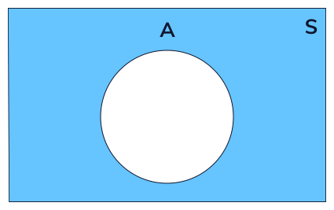

# Rules of Probability

# Union

> The union of two sets encompasses any element that exists in either one or both of them. We can represent this visually as a venn diagram as shown.
>
> 

------------------------------------------------------------------------

# Intersection

> The intersection between two sets encompasses any element that exists in BOTH sets and is often written out as:

# Addition Rule

> If there are two events, A and B, the addition rule states that the probability of event A or B occurring is the sum of the probability of each event minus the probability of the intersection:

## Mutually Exclusive

P(A or B) = P(A) + P(B)

## Non-mutually Exclusive

# Multiplication Rule

# The multiplication rule is used to find the probability of two events, *A* and *B*, happening simultaneously. 

# Complement

> All possible outcomes outside of the set.

Write it as *A^C^*

# Independent Events

> Two events are *independent* if the occurrence of one event does not affect the probability of the other one occurring.

# Dependent Events

# 
