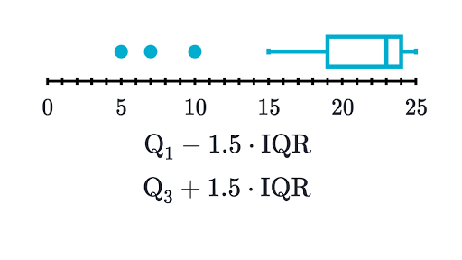
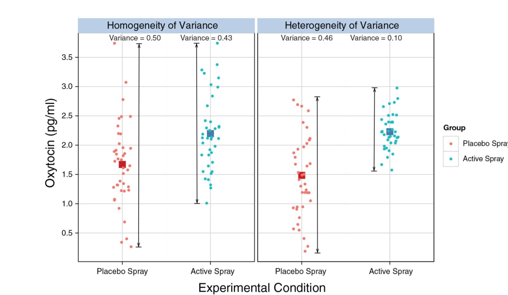
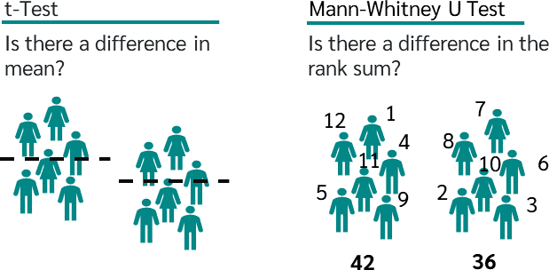
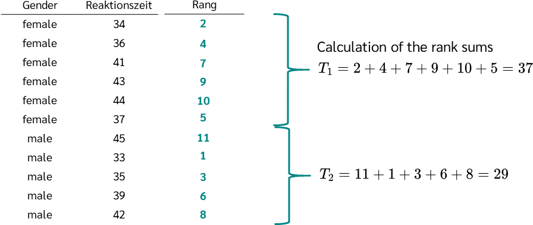
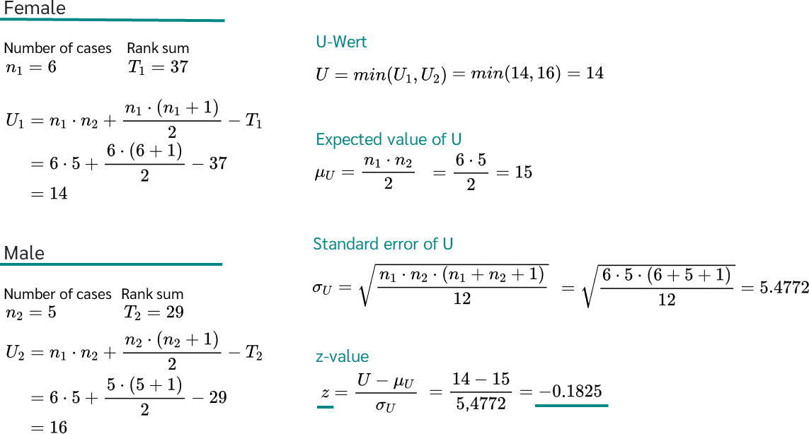
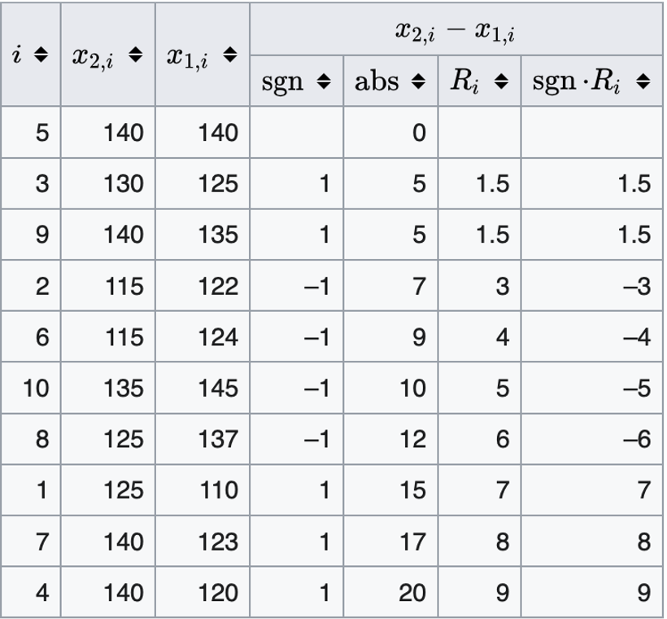

# Knowledge Check

<div style='position: relative; padding-bottom: 56.25%; padding-top: 35px; height: 0; overflow: hidden;'><iframe sandbox='allow-scripts allow-same-origin allow-presentation' allowfullscreen='true' allowtransparency='true' frameborder='0' height='315' src='https://www.mentimeter.com/app/presentation/albq5t8sdsywzksffdf41bbsdokvznw3/1sft3c41192c/embed' style='position: absolute; top: 0; left: 0; width: 100%; height: 100%;' width='420'></iframe></div>
---
# Last Class

- NHST

  - We can only falsify a theory
  
     - *p*-value = likelihood of the observed data given the null is true
     
  - One- and two-sided hypotheses
  
  - One sample tests
---
# Today

- Two sample *t*-tests

  - Independent
  
  - Dependent (paired)
  
- Non-parametric

- Multiple Comparisons

---
# Experiments

- **Simple experiments:**

    - One IV that's binary with two options
    - One DV that's interval/ratio/continuous

- **For example:** manipulation of the independent variable involves having an experimental condition and a control

    - This situation can be analyzed with a *t*-test
    
    - We can also use *t*-tests to analyze any binary independent variable
    
    - The *t*-test is a simple regression model with one categorical predictor
---
# Experiments

- Don't make a continuous variable categorical just so you can do a *t*-test

- People used to split variables into high versus low or simply split down the middle
      
    - You separate the people who are close together and lump them with people who are not really like them
    
    - Effect sizes get smaller
    
    - You will also decrease power and see Type II errors
---
# Experiments

- Between subjects / Independent designs

    - Expose different groups to different experimental manipulations

- Repeated measures / within subjects / dependent designs

    -  Take a single group of people and expose them to different experimental manipulations at different points in time
---
# The *t*-test 

- **Independent *t*-test:**

    - Compares two means based on independent data
    
    - Used when different participants were assigned to each condition of the study
    
- **Dependent *t*-test:**

    - Compares two means based on related data
    
    - Used when the same participants took part in both conditions of the study
---
# *t* distribution

.pull-left[

- William Gosset discovered it while working for Guinness

  - Often called student's *t* distribution
  
- Small samples: more conservative test

- *t*-distribution has fatter tails 
]

.pull-right[
```{r, echo=FALSE, fig.align='center', out.width="100%", out.height="50%"}

# Generate a vector of 100 values between -6 and 6
x <- seq(-6, 6, length = 100)
  
# Degrees of freedom
df = c(1,4,10,30)
colour = c("red", "orange", "green", "yellow","black")
  
# Plot a normal distribution
plot(x, dnorm(x), type = "l", lty = 2, lwd=4, xlab = "t-value", ylab = "Density", 
     main = "Comparison of t-distributions", col = "black")
  
# Add the t-distributions to the plot
for (i in 1:4){
  lines(x, dt(x, df[i]), col = colour[i])
}
  
# Add a legend
legend("topright", c("df = 1", "df = 4", "df = 10", "df = 30", "normal"), 
       col = colour, title = "t-distributions", lty = c(1,1,1,1,2))
```
]

???

N-1 is non-biased (not going to concern ourselves with the proof). We are taking sample SD instead of pop SD. It is going to be biased if we dont. 

---
# Independent: Example

- Are invisible people mischievous?

- Manipulation

    - Placed participants in an enclosed community riddled with hidden cameras
    
    - 12 participants were given an invisibility cloak
    
    - 12 participants were not given an invisibility cloak

- Outcome measured how many mischievous acts participants performed in a week

---
```{r echo=TRUE, message=FALSE, warning=FALSE}
library(rio)
library(tidyverse)
library(easystats)
library(kableExtra)

longdata <- read_csv("https://raw.githubusercontent.com/doomlab/statsofdoom-files/master/graduate/R%20Flip/11_ttests/data/invisible.csv")

head(longdata)
```
---
# Independent: Understanding the NHST

- $H_0$: The no cloak and cloak groups would have the same mean 

- $H_1$: The no cloak and cloak groups would have different means

--


```{r}
M <- tapply(longdata$Mischief, longdata$Cloak, mean)
STDEV <- tapply(longdata$Mischief, longdata$Cloak, sd)
N <- tapply(longdata$Mischief, longdata$Cloak, length)
M;STDEV;N
```

---
# Independent: Understanding the NHST

- Our means appear slightly different. What might have caused those differences? 

--

  - Variance created by our manipulation: The cloak **(systematic variance)**
    
--

  - Variance created by unknown factors **(unsystematic variance)**
---
# Independent: Understanding the NHST

- If the samples come from the same population, then we expect their means to be roughly equal

- Although it is possible for their means to differ by chance alone, here, we would expect large differences between sample means to occur very infrequently

- We compare the difference between the sample means that we collected to the difference between the sample means that we would expect to obtain if there were no effect **(i.e. if the null hypothesis were true)**

---
# Independent: Understanding the NHST

- We use the standard error as a gauge of the variability between sample means

- If the difference between the samples we have collected is larger than what we would expect based on the standard error then we can assume one of two interpretations: 
     
    - There is no effect and sample means in our population fluctuate a lot and we have, by chance, collected two samples that are atypical of the population from which they came *(Type 1 error)*
    
    - The two samples come from different populations but are typical of their respective parent population. In this scenario, the difference between samples represents a genuine difference between the samples *(and so the null hypothesis is incorrect)*
    
---
# Independent: Understanding the NHST

- As the observed difference between the sample means gets larger, the more confident we become that the second explanation is correct (i.e., that the null hypothesis should be rejected)

- If the null hypothesis is incorrect, then we gain confidence that the two sample means differ because of the different experimental manipulation imposed on each sample
---
# Independent: Formulas

$$\begin{align*}
t&=\frac{(\overline{X}_1-\overline{X}_2)-(\mu_2-\mu_2)}{\sqrt{\dfrac{s_1^2}{n_1}+\dfrac{s_2^2}{n_2}}}\\
t&=\frac{\overline{X}_1-\overline{X}_2}{\sqrt{\dfrac{s_1^2}{n_1}+\dfrac{s_2^2}{n_2}}}\\
\end{align*}$$

$$ s^2_p = \frac {(n_1-1)s^2_1 + (n_2-1)s^2_2} {n_1+n_2-2}$$
---
# Independent: Data Screening

- Assumptions:

  - No missingness (NAs)
  - No outliers
  - Independence
  - Normality (each group should be approximately normally distributed)
  - Homogeneity: equal variances between groups
---
# Independent: Data Screening

- Missingness

```{r}

longdata %>%
  drop_na()

```

---
# Independent: Data Screening

- Outliers

.pull-left[
```{r}
library(rstatix)

longdata %>%
  group_by(Cloak) %>%
  identify_outliers(Mischief)

```
]

.pull-right[
```{r, echo=FALSE, fig.align='center', out.width="100%"}



```


]
---
# Independent: Data Screening

- Normality

```{r}
longdata %>%
  group_by(Cloak) %>%
  shapiro_test(Mischief)


```

---
# Independent: Data Screening

- Normality

  - qqplot

.pull-left[

<br>
<br>
```{r, fig.align='center', out.width="40%"}
library(ggpubr)
# Draw a qq plot by group

g=ggqqplot(longdata, x = "Mischief", facet.by = "Cloak")


```
]
.pull-right[
```{r, echo=FALSE, fig.align='center', out.width="100%"}
library(ggpubr)
# Draw a qq plot by group
ggqqplot(longdata, x = "Mischief", facet.by = "Cloak")


```

]

---
# Independent: Homogeneity


.pull-left[
- The most common problem is lack of homogeneity 

  - where the group variance is not equal between groups


```{r}
longdata %>%
  levene_test(Mischief~Cloak)
```

]

.pull-right[

- if the *p*-value of the Levene’s test is not-significant,   we can use that as satisfying our variance assumption

```{r, echo=FALSE, fig.align='center', out.width="100%"}



```


]

---
# 2 Sample Welch’s *t*-test

- Welch’s *t*-test gives gives equivalent answer to traditional *t*-test when there is an  equal sample size or variances, BUT can also handle unequal sample size and  variance

  - http://daniellakens.blogspot.com/2015/01/always-use-welchs-*t*-test-instead-of.html
  
- Same t-statistic calculation and t-distribution, just have to apply correction for  degrees of freedom (df)
---
# 2 Sample Welch’s *t*-test
$$\text{df}=\frac{\left(\dfrac{\sigma_1^2}{n_1}+\dfrac{\sigma_2^2}{n_2}\right)^2}{\dfrac{\left(\dfrac{\sigma_1^2}{n_1}\right)^2}{n_1-1}+\dfrac{\left(\dfrac{\sigma_2^2}{n_2}\right)^2}{n_2-1}}$$
$$A=\frac{s_1^2}{n1}\qquad\text{and}\qquad B=\frac{s_2^2}{n_2}$$
$$\text{df}=\frac{(A+B)^2}{\dfrac{A^2}{n_1-1}+\dfrac{B^2}{n_2-1}}$$
---
# Independent: Analysis 

```{r echo=TRUE, message=FALSE, warning=FALSE}
library(report)
d_ind <- t.test(Mischief ~ Cloak, 
       data = longdata, 
       var.equal = TRUE, #assume equal variances
       paired = FALSE) #independent

d_ind <- t.test(Mischief ~ Cloak, 
       data = longdata, 
       var.equal = FALSE, #assume unequal variances
       paired = FALSE) #independent

```
---
Independent:Reporting

- No differences between groups was found: $t(22) = 1.71, p = .101$

- `Easystats` package in R can help write this up for you :) 
- `r report(d_ind)`

```{r, eval=FALSE}


report(d_ind)

```


---
# The *t*-test as linear model

- Can be viewed through regression framework: 

$$\operatorname{Mischief} = \beta_0 + \beta_{1}(\operatorname{Cloak}_{\operatorname{No\ }}) + \epsilon$$

- Categorical variables are *dummy coded* or *treatment coded*

  - In R, levels of categorical variable transformed to 0 and 1
  
  - By default, 0 is attached to whatever variable comes first in alphabet
  
- $\beta_1$ = difference between the two groups
---
# The *t*-test as linear model

```{r}
library(tidyverse)
library(broom)

d=lm(Mischief ~ Cloak,data = longdata)

broom::tidy(d)

```
---
# *t*-test: Visualization

- Bar charts in ggplot2 with only one x variable (the different levels of your IV) and one y variable.
   
.pull-left[ 
```{r echo=TRUE, fig.align='center', message=FALSE, warning=FALSE, out.width="50%"}
library(ggplot2)
library(ggpubr)
df.summary <- longdata %>%
  group_by(Cloak) %>%
  summarise(
    sd = sd(Mischief, na.rm = TRUE),
    Mischief = mean(Mischief)
  )

d=ggplot(longdata, aes(Cloak, Mischief)) +
  geom_bar(stat = "identity", data = df.summary,
           fill = NA, color = "black") +
  geom_jitter( position = position_jitter(0.2),
               color = "black") + 
  geom_errorbar(
    aes(ymin = Mischief-sd, ymax = Mischief+sd),
    data = df.summary, width = 0.2)  +
  xlab("Invisible Cloak Group") +
  ylab("Average Mischief Acts")
```
]

.pull-right[

```{r echo=FALSE, message=FALSE, warning=FALSE, fig.align='center', out.width="100%"}
ggplot(longdata, aes(Cloak, Mischief)) +
  geom_bar(stat = "identity", data = df.summary,
           fill = NA, color = "black") +
  geom_jitter( position = position_jitter(0.2),
               color = "black") + 
  geom_errorbar(
    aes(ymin = Mischief-sd, ymax = Mischief+sd),
    data = df.summary, width = 0.2)  +
  xlab("Invisible Cloak Group") +
  ylab("Average Mischief Acts")
```
]
---
# *t*-test: Visualization

```{r, fig.align='center', out.width="50%"}

ggstatsplot::ggbetweenstats(
  data = longdata,
  x = Cloak,
  y = Mischief)

```
---
# 2 Sample *t*-test Independant (Practice Example 1)

An educator believes that new directed reading activities in the classroom will help elementary school students improve some aspects of their reading ability. She arranges for a third grade class of 21 students to take part in these activities for an 8-week period. A control classroom of 23 third graders follows the same curriculum without the activities. At the end of 8 weeks, all students are given a Degree of Reading Power (DRP) test, which measures the aspects of reading ability that the treatment is designed to improve.

```{r}
treatment=c(24,43,58,71,43,49,61,44,67,49,53,56,59,52,62,54,57,33,46,43,57)

control=c(42,43,55,26,62,37,33,41,19,54,20,85,46,10,17,60,53,42,37,42,55,28,48)

```
---
# NHST Steps

1. State hypotheses

2. Check assumptions

3. Run `t.test`

4. Decision/conclusion

5. Visualize

---
# 2 Sample Welch’s *t*-test (Practice Example 2)

A math test was given to 300 17 year old students in 1978 and again to another 17  year old students in 1992.

Group 1: X1 = 300.4, S1 = 34.9, n = 300
Group 2: X2 = 306.7, S2 = 30.1, n = 350

- Use α = 0.01 

---
# NHST Steps

1. State hypotheses

2. Simulate Data (`rnorm`)

2. Check assumptions

3. Calculate t and DF correction

3. Run `t.test`

4. Decision/conclusion

---
# Calculating Scores

--

Group 1: X1 = 300.4, S1 = 34.9, n = 300
Group 2: X2 = 306.7, S2 = 30.1, n = 350

```{r}
n1=300
n2=350

t.stat=(300.4-306.7)/sqrt(34.9^2/300+30.1^2/350)

#df correction Welsch

#A=s1^2/n1
#B=s2^2/n2

A=34.9^2/300
B=30.1^2/350

df=(A+B)^2/(A^2/(n1-1)+B^2/(n2-1))

df
```
---
# R Calculation
```{r}
t4 =((306.7	- 300.4)-(0-0))/(34.9^2 / 300 + 30.1^2 / 350)^(1/2)

v4 =(34.9 ^2 / 300 + 30.1^2 / 350)^2 / (34.9^4 / (300^2 * (300 - 1)) + 30)

alpha4 =0.01

tcrit4 = qt(alpha4/2, v4)

pval4 =2 *pt(-abs(t4),v4) 

abs(t4)

```
---
# In R: Welch's *t*-test
```{r}

group1 <- rnorm(300,mean =300.4,sd=34.9)
group2 <- rnorm(350,mean =306.7,sd=30.1)

c=t.test(group1, group2,alternative ="two.sided")
```

`r report(c)`
---
class: middle 
# Dependent (paired *t*-test)

---
# Dependent: Example

- Are invisible people mischievous?

- Manipulation

    - Placed participants in an enclosed community riddled with hidden cameras 
    - For first week participants normal behavior was observed 
    - For the second week, participants were given an invisibility cloak

- Outcome: We measured how many mischievous acts participants performed in week 1 and week 2
    
- **Note:** Same data, but instead the study is dependent. Let's see what happens to our *t*-test

---
# Dependent: Understanding the NHST

$$t = \frac {\bar{D} - \mu_D}{S_D/\sqrt N}$$

$${S_D}\ =\ \sqrt{\cfrac{(d_1\ -\ \overline{d})^2\ +\ (d_2\ -\ \overline{d})^2\ +\ \cdots\ +\ (d_n\ -\ \overline{d})^2}{n\ -\ 1}}$$
- We are going to use the standard error of the differences rather than standard error

- The standard error of the differences is calculated by subtracting the two sets of scores and calculating standard deviation on that difference score
---
# Dependent: Data Screening

- The data screening can be treated in the same fashion

  - Normality
  - Missingness
  - Outliers
  
- However, homogeneity between groups is not examined, because you do not have separate groups!

- The variance is calculated on **one difference** score, so there is not a homogeneity concern 

---
# Dependent: Analysis

- The cloak and no cloak conditions were different: $t(11) = 3.80, p = .003$

- Why is this result different than independent t? 

```{r echo=TRUE, message=FALSE, warning=FALSE}
d_pair <-t.test(Mischief ~ Cloak, 
       data = longdata, 
       var.equal = TRUE, #ignored in dependent t
       paired = TRUE) #dependent t
```

---
# Dependent: Reporting

- `r report(d_pair)`
---
# Dependent GLM

- Use the lm to test for significance

- Calculate the t value

--

  - Why is there a discrepancy?

--

```{r, echo=TRUE}
library(lme4)
library(sjPlot)

longdata$id<-rep(1:12, length(longdata))

d_reg<-lme4::lmer(Mischief~Cloak + (1|id),  data=longdata)

```

---
```{r, echo=FALSE}
tab_model(d_reg, d_pair, p.val = "kr", show.df = TRUE, CSS = list(
    css.depvarhead = 'color: white;',
    css.centeralign = 'text-align: left;', 
    css.firsttablecol = 'font-weight: bold;', 
    css.summary = 'color: black;')) 
```

---
# *t*-test: Visualization

.pull-left[

```{r, echo=TRUE, fig.align='center', out.width="40%"}
library(ggstatsplot)
## parametric t-test
p1 <- ggwithinstats(
  data = longdata,
  x = Cloak,
  y = Mischief,
  type = "p",
  effsize.type = "d",
  conf.level = 0.95,
  title = "Cloaks vs. No Cloaks",
  package = "ggsci",
  palette = "nrc_npg"
)

```

]

.pull-right[

```{r, echo=FALSE, fig.align='center', out.width="100%"}
library(ggstatsplot)
## parametric t-test
p1 <- ggwithinstats(
  data = longdata,
  x = Cloak,
  y = Mischief,
  type = "p",
  effsize.type = "d",
  conf.level = 0.95,
  title = "Cloaks vs. No Cloaks",
  package = "ggsci",
  palette = "nrc_npg"
)

p1

```
]

---
# *t*-test: Visualization


.pull-left[

```{r, echo=TRUE, fig.align='center', out.width="100%"}
library(raincloudplots)

wide <- longdata %>% 
    pivot_wider(names_from = "Cloak", values_from ="Mischief")

df_1x1 <- data_1x1(
  array_1 = wide$Cloak,
  array_2 = wide$`No Cloak`)

raincloud_2 <- raincloud_1x1_repmes(
  data = df_1x1,
  colors = (c('dodgerblue', 'darkorange')),
  fills = (c('dodgerblue', 'darkorange')),
  line_color = 'gray',
  line_alpha = .3,
  size = 1,
  alpha = .6,
  align_clouds = FALSE) +
 
scale_x_continuous(breaks=c(1,2), labels=c("Cloak", "No Cloak"), limits=c(0, 3)) +
  xlab("Invisibility") + 
  ylab("Mischief") +
  theme_classic()

raincloud_2

```
]

.pull-right[

```{r, echo=FALSE, fig.align='center', out.width="100%"}
df_1x1 <- data_1x1(
  array_1 = wide$Cloak,
  array_2 = wide$`No Cloak`)

raincloud_2 <- raincloud_1x1_repmes(
  data = df_1x1,
  colors = (c('dodgerblue', 'darkorange')),
  fills = (c('dodgerblue', 'darkorange')),
  line_color = 'gray',
  line_alpha = .3,
  size = 1,
  alpha = .6,
  align_clouds = FALSE) +
 
scale_x_continuous(breaks=c(1,2), labels=c("Cloak", "No Cloak"), limits=c(0, 3)) +
  xlab("Invisibility") + 
  ylab("Mischief") +
  theme_classic()

raincloud_2


```


]

# Paired *t* (Practice Problem 1)

A manufacturer claims it has developed an additive that increases gas mileage. But  you are not sure whether the additive will increase or decrease performance. They  recruit 10 drivers. Each driver drives a car on a well-conditioned track. They record  the gas mileage without any additive, then with additive. Assume $\alpha$ = .05

```{r}
data5a = c(22,25,17,24,16,29,20,23,19,20)  
data5b = c(18,21,16,22,19,24,17,21,23,18)
```
---
# NHST Steps

1. State hypotheses

2. Check assumptions

3. run `t.test`

5. Decision/conclusion

6. Visualize the data
---
# Paired *t* in R

```{r}
data5diff=data5a-data5b
t5 =( mean(data5diff) - 0) / (sd(data5diff) / (length(data5diff))^(1/2.))  
tcrit5 = qt(0.05/2, length(data5diff)-1)
pval5 =2 *pt(-abs(t5),length(data5diff)-1)  
abs(t5)
```

---
# Paired *t* in R
```{r}
t.test(data5a, data5b,paired =TRUE,alternative ="two.sided")
```
---
# Paired *t*(Practice Problem 2)

We know the weight of 10 mice before and after a treatment

```{r}
before <-c(200.1, 190.9, 192.7, 213, 241.4, 196.9, 172.2, 185.5, 205.2, 193.7)
# Weight of the mice after treatment
after <-c(392.9, 393.2, 345.1, 393, 434, 427.9, 422, 383.9, 392.3, 352.2)
```

We want to know, if there is any significant difference in the mean weights after treatment? Assume $\alpha$ .05

---
# NHST Steps

1. State hypotheses

2. Check assumptions

3. run `t.test`

5. Decision/conclusion

6. Visualize the data


---
# Non-parametric

- Sometimes data is non-normal (skewed, bimodal, etc.), or ordinal, so what do we  do?

  - Use Shapiro-Wilk normality test

  - Can transform data (e.g., log, sqrt, etc.), but these also make assumptions
  
  - Robust methods

- Mann-Witney U test (indep)

- Wilcoxon (paired)

  - Rank method based on calculating all possibilities to form distribution

---
# Mann-Witney U Example


.pull-left[


```{r, fig.align='center', echo=FALSE, warning=FALSE,  out.width = "100%"}


```


]

.pull-right[
$$U_1 = n_1n_2 + \frac{n_1(n_1+1)}{2}- R_1$$
$$U_2 = n_1n_2 + \frac{n_2(n_2+1)}{2}- R_2$$
$$U = min(U_1, U_2)$$
]
- If U < Ucrit we reject the null (opposite from *t*-test; always reject if t > tcrit )
---
.pull-left[
<br>
<br>
```{r, fig.align='center', echo=FALSE, warning=FALSE,  out.width = "100%"}


```
]

.pull-right[
<br>
<br>
```{r, fig.align='center', echo=FALSE, warning=FALSE,  out.width = "100%"}


```
]
---
```{r}
female = c(34,36, 41, 43, 44, 37)
male = c(45, 33, 35, 39, 42)

wilcox.test(male, female, paired = FALSE)
```
---
# Wilcoxon Signed-Rank (Paired)

$$W=\sum_{i=1}^{N_r}sgn(x_2-x_1, i) R_i$$

- Where sgn is an indicator variable with if  is negative and if  is positive

- R = Rank

- W is then the sum of the positive signed ranks

- Exclude pairs where difference equals zero, Nr is the reduced sample size

- If W < Wcrit we reject the null (opposite from *t*-test; always reject if t > tcrit)

---
# Wilcoxon Signed-Rank (Paired)

```{r}
G1 = c(125,115,130,140,140,115,140,125,140,135)
G2 = c(110,122,125,120,140,124,123,137,135,145)
```

```{r, fig.align='center', echo=FALSE, warning=FALSE,  out.width = "40%"}

```

---
# Paired, Wilcoxon signed-rank: R 

- V = the sum of (W+) ranks 

```{r}
G1 = c(125,115,130,140,140,115,140,125,140,135)
G2 = c(110,122,125,120,140,124,123,137,135,145)
wilcox.test(G1, G2,paired =TRUE,alternative ="two.sided")
```
---
class: middle 

# Multiple Comparisons

---
# Multiple Comparisons

- We want our tests to find true positives and true negatives

- Multiple comparisons

  - Type I error (false positive)
  
    - $\alpha$-inflation 

  - Testing each new pairwise comparison is costly
---
# Bonferroni

- simplest

$$\alpha / m$$
 - *m* = number of comparisons
 
- Controls for false positives (Type I errors)

- Overly conservative

  - Leads to false negatives (Type II errors)
  
```{r}
pvals = c(0.01,0.02,0.04)

p.adjust(pvals,method ="bonferroni", n = length(pvals))

```

---
# Holm-Bonferroni

- Strikes a balance between Type I and Type II errors

1. Sort p-values from smallest to largest

2. Test whether  *p* < $\frac {\alpha} {m+ 1-k}$

  - *m* = number of comparisons
  - *k* = rank

- If so, reject and move to the next

- Typically you report the adjusted p-value. Just multiply your p-value by the adjusted alpha’s denominator

```{r}
pvals = c(0.01,0.02,0.04)
```

---
```{r}

pvals = c(0.01,0.02,0.04)

p.adjust(pvals,method ="holm",n = length(pvals))
```
---
# Many Multiple Comparison Corrections

- Tukey - all possible comparisons: TukeyHSD()
- Scheffe
- Dunnett
- Fisher’s LSD (least significant difference)
- Newman-Keuls
- Find what your field does and, more importantly, justify your decisions

---
# Summary

- In this lecture, you've learned:

    - All things *t*-tests
    - The logic of *t*-tests
    - Independent and dependent *t*-tests
---
Coming Up

- Effect size and power

- Regression 
