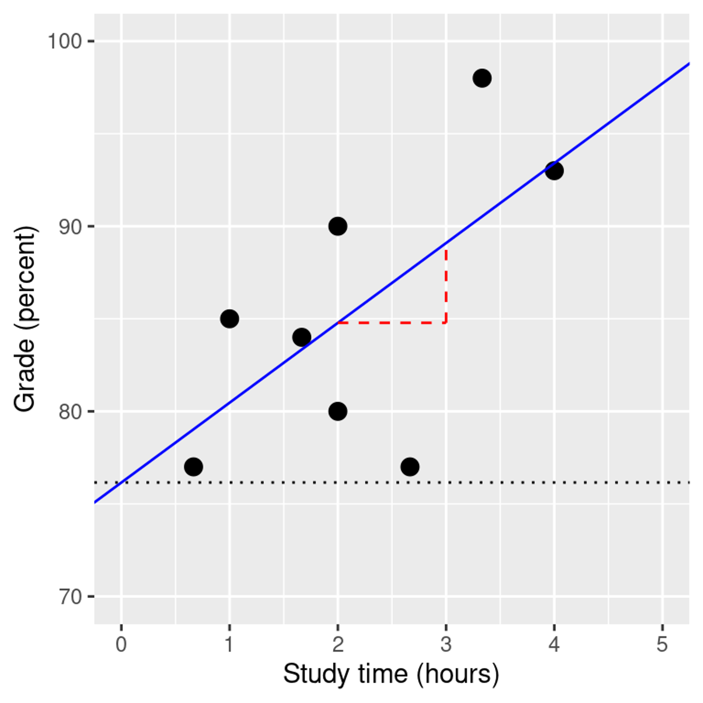

```{r setup, include=FALSE}
options(htmltools.dir.version = FALSE)
knitr::opts_chunk$set(
  fig.width=9, fig.height=3.5, fig.retina=3,
  out.width = "36%",
  cache = FALSE,
  echo = TRUE,
  message = FALSE, 
  warning = FALSE,
  fig.show = TRUE,
  hiline = TRUE
)

hook_source <- knitr::knit_hooks$get('source')
knitr::knit_hooks$set(source = function(x, options) {
  x <- stringr::str_replace(x, "^[[:blank:]]?([^*].+?)[[:blank:]]*#<<[[:blank:]]*$", "*\\1")
  hook_source(x, options)
})
```

```{r xaringan-themer, include=FALSE, warning=FALSE}
library(xaringanthemer)

style_solarized_dark(
  header_font_google = google_font("Aleo"),
  header_h1_font_size = "36px",
  header_color = "black",
  text_font_google = google_font("Aleo"),
  text_font_size = "28px",
  text_color = "black", 
  background_color = "orange", 
  code_font_google = google_font("Share Tech Mono"),
  extra_css = list(
    ".remark-slide-content h2" = list(
      "margin-top" = "2em",
      "margin-bottom" = "2em"
    ),
    .big = list("font-size" = "150%"),
    .small = list("font-size" = "75%"),
    .subtle = list(opacity = "0.6"),
    ".countdown-has-style h3, .countdown-has-style h3 ~ p, .countdown-has-style h3 ~ ul" = list(
      "margin" = "0"
    ),
    ".countdown-has-style pre" = list(
      "margin-top" = "-10px"
    ),
    "p .remark-inline-code" = list(
      "background-color" = "orange",
      "padding" = "2px 2px",
      "margin" = "0 -2px"
    ),
    blockquote = list("margin-left" = 0),
    "em" = list(color = "#2aa198")
  ),
)

```


```{r, echo=FALSE}
library(parameters)
library(tidyverse)
library(performance)
library(equatiomatic)
library(kableExtra)
library(broom)

# read in data
pitch=read_csv(here::here("static", "slides", "10-linear_modeling", "data", "age_pitch.csv"))
```
# Outline

- Quick recap of correlation

- Regression

  - Multiple Regression
---
# Correlation (*r*)

- How strong
- How big 

$$r = \frac{covariance}{s_xs_y} = \frac{\sum_{i=1}^n (x_i - \bar{x})(y_i - \bar{y})}{(N - 1)s_x s_y}$$

---
# Correlations

Range: 

-1 defines a perfectly negative correlation,

0 defines no correlation (completely random), and

1 defines a perfectly positive correlation.

```{r echo=FALSE,out.height="15%", out.width="75%",fig.cap="",fig.show='hold',fig.align='center'}

knitr::include_graphics('images/corr.png')
```
---
Example: 

- Is there a relationship between GPA and study hours?

```{r}

ggplot(gpa_study, aes(x=gpa, y=study_hours)) + 
  geom_point(color='#2980B9', size = 4)
```
---
# Statistical Test: Pearson

```{r}

cor(gpa_study$gpa, gpa_study$study_hours) %>%
  tidy()

```

$$\textit{t}_r =  \frac{r\sqrt{N-2}}{\sqrt{1-r^2}}$$

```{r}
cor.test(gpa_study$gpa, gpa_study$study_hours) %>%
  tidy()
```
---
# Effect Size

- r < 0.1	very small
- 0.1  ≤ r < 0.3	small
- 0.3   ≤ r < 0.5	moderate
- r ≥ 0.5	large

---
# Nonparamteric Correlation

- Spearman’s rank correlation coefficient (ρ):

$$r_s = \frac{6 \sum d_i^2}{n(n^2 - 1)}$$

- It assesses how well the relationship between two variables can be described using a  monotonic (increasing or decreasing) function

- Rank order method
- range [-1,+1]

---
# Statistical Test: Spearman

```{r}

cor(gpa_study$gpa, gpa_study$study_hours, *method="spearman") %>%
  tidy()

```

$$\textit{t}_r =  \frac{r\sqrt{N-2}}{\sqrt{1-r^2}}$$

```{r}
cor.test(gpa_study$gpa, gpa_study$study_hours, method = "spearman") %>%
  tidy()
```
---
# What is Regression?

- A way of predicting the value of one variable from other variables.

    - It is a hypothetical model of the relationship between two or more variables
    
    - The model used is a linear one, but doesn't always have to be! 
    
    - Therefore, we describe the relationship using the equation of a straight line

---
# Describing a Straight Line

$$Y_i = b_0 + b_1X_i + \varepsilon_i$$
.pull-left[
- What is $b_i$?  

    - Regression coefficient for the predictor
    - Gradient (slope) of the regression line
    - Tells us how much we would expect y to change given a one-unit change in  x
    - Direction/Strength of Relationship
    
- What is $b_0$?

    - Intercept (value of Y when X(s) = 0)
    - Point at which the regression line crosses the Y-axis
]

.pull-right[

```{r echo=FALSE,out.height="15%", out.width="75%",fig.cap="",fig.show='hold',fig.align='center'}



```

]
---
#The Best Fit Line and Least Squares

- The best fitting line is one that minimizes the squared difference between X and Y

- Ordinary least squares is most common

  - What do squares have to do with it? 
---
# Example

.pull-left[
```{r, echo=FALSE, message=FALSE, fig.align='center', out.width="100%"}
library(ggplot2)
library(gganimate)
library(dplyr)

d <- mtcars
fit <- lm(mpg ~ hp, data = d)
d$predicted <- predict(fit)   # Save the predicted values
d$residuals <- residuals(fit) # Save the residual values

coefs<-coef(lm(mpg ~ hp, data = mtcars))
coefs[1]
coefs[2]

x<-d$hp
move_line<-c(seq(-6,6,.5),seq(6,-6,-.5))
total_error<-length(length(move_line))
cnt<-0
for(i in move_line){
  cnt<-cnt+1
  predicted_y <- coefs[2]*x + coefs[1]+i
  error_y <- (predicted_y-d$mpg)^2
  total_error[cnt]<-sqrt(sum(error_y)/32)
}

move_line_sims<-rep(move_line,each=32)
total_error_sims<-rep(total_error,each=32)
sims<-rep(1:50,each=32)

d<-d %>% slice(rep(row_number(), 50))

d<-cbind(d,sims,move_line_sims,total_error_sims)

anim<-ggplot(d, aes(x = hp, y = mpg)) +
  geom_abline(intercept = 30.09886+move_line_sims, slope = -0.06822828, aes(linetype='d'), color= 'red')+
  lims(x = c(0,400), y = c(-10,40))+
  geom_segment(aes(xend = hp, yend = predicted+move_line_sims, color="red"), alpha = .5) + 
  geom_point() +
  geom_rect(aes(ymin=predicted+move_line_sims, ymax=mpg, xmin=hp, xmax=hp+abs(predicted)+abs(residuals)+abs(move_line_sims), fill = total_error_sims), alpha = .2)+
  scale_fill_gradient(low="lightgrey", high="red")+
  geom_smooth(method = "lm", se = FALSE, color = "blue") + 
  theme_classic()+
  theme(legend.position="none")+
  xlab("X")+ylab("Y")+
  transition_manual(frames=sims)+
  enter_fade() + 
  exit_fade()+
  ease_aes('sine-in-out')

animate(anim,fps=5)
```
]

.pull-left[

- Shows two concepts:

  1. Regression line is "best fit line"
  
  2. The “best fit line” is the one that minimizes the sum of the squared deviations between each point and the line
]
---
# Visualizing Error

```{r, echo=FALSE, fig.align='center', out.width="100%"}

some_data <- data.frame(Y= c(1,2,4,3,5,4,6,5),
                        X= c(3,5,4,2,6,7,8,9)) %>%
  mutate(Y_pred = predict.lm(lm(Y~X))) %>%
  mutate(Y_error = Y - Y_pred)

ggplot(some_data, aes(x=X, y=Y))+
  geom_point()+
  geom_smooth(method='lm', se=FALSE)+
  geom_point(aes(y=Y_pred), color='red') +
  geom_segment(aes(xend = X, yend = Y-Y_error), alpha = .5)
```
---
# Visualize Errors as Sqaures

.pull-left[

```{r,echo=TRUE}

some_data <- data.frame(Y= c(1,2,4,3,5,4,6,5),
                        X= c(3,5,4,2,6,7,8,9)) %>%
  mutate(Y_pred = predict.lm(lm(Y~X))) %>%
  mutate(Y_error = Y - Y_pred)

g=ggplot(some_data, aes(x=X, y=Y))+
  geom_point()+
  geom_smooth(method='lm', se=FALSE)+
  geom_point(aes(y=Y_pred), color='red') +
  geom_segment(aes(xend = X, yend = Y-Y_error), alpha = .5)+
  geom_rect(aes(ymin=Y, 
                ymax=Y_pred, 
                xmin=X,
                xmax=X+Y_error), 
            alpha = .2)
```

]

.pull-right[

```{r, fig.align='center', echo=FALSE, out.width="100%"}

some_data <- data.frame(Y= c(1,2,4,3,5,4,6,5),
                        X= c(3,5,4,2,6,7,8,9)) %>%
  mutate(Y_pred = predict.lm(lm(Y~X))) %>%
  mutate(Y_error = Y - Y_pred)

ggplot(some_data, aes(x=X, y=Y))+
  geom_point()+
  geom_smooth(method='lm', se=FALSE)+
  geom_point(aes(y=Y_pred), color='red') +
  geom_segment(aes(xend = X, yend = Y-Y_error), alpha = .5)+
  geom_rect(aes(ymin=Y, 
                ymax=Y_pred, 
                xmin=X,
                xmax=X+Y_error), 
            alpha = .2)+
  coord_cartesian(xlim=c(0,10),
                  ylim=c(0,10))
```

]
---
# Worse Fit Lines

```{r,echo=FALSE, out.width="100%"}
some_data <- data.frame(Y= c(1,2,4,3,5,4,6,5),
                        X= c(3,5,4,2,6,7,8,9)) %>%
  mutate(Y_pred = predict.lm(lm(Y~X)))

some_data <- rbind(some_data,
                   some_data,
                   some_data,
                   some_data) %>%
  mutate(step = rep(1:4,each = 8),
         Y_pred = Y_pred + rep(c(.5,1,1.5,2), each = 8)) %>%
  mutate(Y_error = Y - Y_pred)

ggplot(some_data, aes(x=X, y=Y))+
  geom_smooth(method='lm', se=FALSE)+
  geom_point(aes(y=Y_pred), color='red') +
  geom_line(aes(x=X,y=Y_pred), color='red')+
  geom_point()+
  geom_segment(aes(xend = X, yend = Y-Y_error), alpha = .5)+
  geom_rect(aes(ymin=Y, 
                ymax=Y_pred, 
                xmin=X,
                xmax=X+Y_error), 
            alpha = .2)+
  coord_cartesian(xlim=c(0,10),
                  ylim=c(0,10)) +
  facet_wrap(~step)
```
---
# Simple Regression Example

- Pitch perception and age 
  - As one ages, ability to hear certain pitch frequencies decreases

```{r, fig.align='center', echo=FALSE, out.width="100%"}

# Animation
# Change the point sizes manually
anim.1<- ggplot(pitch, aes(x=age, y=pitch))+
   geom_point()+
  theme(legend.position="top")

anim.1
```

---

```{r}

lm(pitch~age, data=pitch)

```

```{r, fig.align='center', out.width="100%", echo=FALSE}

#Animation
# Change the point sizes manually
anim.1<- ggplot(pitch, aes(x=age, y=pitch))+
   geom_point()+
  geom_smooth(method=lm, se=FALSE, fullrange=TRUE) + 
  theme(legend.position="top")

anim.1
```

---
```{r, fig.align='center', echo=FALSE,out.width="100%"}

#Animation
# Change the point sizes manually
anim.1<- ggplot(pitch, aes(x=age, y=pitch))+
   geom_point()+
  geom_smooth(method=lm, se=FALSE, fullrange=TRUE)+
  theme(legend.position="top") + 
  annotate("text",x=60,y=190,label=(paste0("slope==",coef(lm(pitch$pitch~pitch$age))[2])),parse=TRUE)

anim.1
```
---
```{r, fig.align='center', echo=FALSE, out.width="100%"}
#Animation
# Change the point sizes manually
anim.1<- ggplot(pitch, aes(x=age, y=pitch))+
   geom_point()+
  geom_smooth(method=lm, se=FALSE, fullrange=TRUE)+
  theme(legend.position="top") + 
  annotate("text",x=60,y=190,label=(paste0("slope==",coef(lm(pitch$pitch~pitch$age))[2])),parse=TRUE)+
  geom_vline(xintercept=0, linetype="dotted") + 
  geom_point(x=0, y=216, colour="red", size=5, shape=4)

anim.1
```
---
$$ pitch = 216 + (-.7)*age$$

```{r, fig.align='center', echo=FALSE, out.width="100%"}
library(ggpmisc)
#Animation
# Change the point sizes manually
anim.1<- ggplot(pitch, aes(x=age, y=pitch))+
   geom_point()+
  geom_smooth(method=lm, se=FALSE, fullrange=TRUE)+
  theme(legend.position="top") + 
  annotate("text",x=60,y=190,label=(paste0("slope==",coef(lm(pitch$pitch~pitch$age))[2])),parse=TRUE)+
  geom_vline(xintercept=0, linetype="dotted") + 
  geom_point(x=0, y=216, colour="red", size=5, shape=4)

anim.1
```
---
$$ \hat{pitch} = 216 + (-.7)*40$$
```{r, fig.align='center', echo=FALSE, out.width="100%"}

#Animation
# Change the point sizes manually
anim.1<- ggplot(pitch, aes(x=age, y=pitch))+
   geom_point()+
  geom_smooth(method=lm, se=FALSE, fullrange=TRUE)+
  theme(legend.position="top") + 
  annotate("text",x=60,y=190,label=(paste0("slope==",coef(lm(pitch$pitch~pitch$age))[2])),parse=TRUE)+
  geom_vline(xintercept=0, linetype="dotted") + 
  geom_point(x=0, y=216, colour="red", size=5, shape=4)

anim.1
```

---

$$ pitch = 216 - 28$$

```{r, fig.align='center', echo=FALSE, out.width="100%"}

#Animation
# Change the point sizes manually
anim.1<- ggplot(pitch, aes(x=age, y=pitch))+
   geom_point()+
  geom_smooth(method=lm, se=FALSE, fullrange=TRUE)+
  theme(legend.position="top") + 
  annotate("text",x=60,y=190,label=(paste0("slope==",coef(lm(pitch$pitch~pitch$age))[2])),parse=TRUE)+
  geom_vline(xintercept=0, linetype="dotted") + 
  geom_point(x=0, y=216, colour="red", size=5, shape=4) + geom_point(x=40, y=188, colour="red", size=5, shape=4)

anim.1
```
---
# Partitoning Variance

$$residual = y - \hat{y} = y - (x*\hat{\beta_x} + \hat{\beta_0})$$

$$SS_{error} = \sum_{i=1}^n{(y_i - \hat{y_i})^2} = \sum_{i=1}^n{residuals^2}$$
$$SS_{total}=\sum_{i=1}^{n}(Y_i-\bar{Y_{i}})^2$$

$$MS_{error} = \frac{SS_{error}}{df} = \frac{\sum_{i=1}^n{(y_i - \hat{y_i})^2} }{N - p}$$
$$SE_{model} = \sqrt{MS_{error}}SE_{model} = \sqrt{MS_{error}}$$

$$SE_{\hat{\beta}_x} = \frac{SE_{model}}{\sqrt{{\sum{(x_i - \bar{x})^2}}}}$$
---
# Regression Model

- Is my overall model *(i.e., the regression equation)* useful at predicting the outcome variable?

    - Use the model summary, F-test, and $R^2$

- How useful are each of the individual predictors for my model?

    - Use the coefficients, t-test, and $pr^2$
    
---
# Overall Model

 Our overall model uses an *F*-test
 
- However, we can think about the hypotheses for the overall test being:

    - H0: We cannot predict the dependent variable. 
    - H1: We can predict the dependent variable. 

- Generally, this form does not include one tailed tests because the math is squared, so it is impossible to get negative values in the statistical test
---
# F-Statistic, Explained Over Unexplained

- F-statistics use measures of variance, which are sums of squares divided by relevant degrees of freedom

$$F = \frac{SS_{Explained}/df1}{SS_{Unexplained}/df2} = \frac{MS_{Explained}}{MS_{Unexplained}}$$

- If explained = unexplained, then F=1

- If explained > then, F >1 

- If explained < unexplained, F < 1

---
# Individual Predictors

- We test the individual predictors with a t-test:
  
    - $t = \frac{b}{SE}$
    - Therefore, the model for each individual predictor is our coefficient b. 
    - Single sample t-test to determine if the b value is different from zero
    
---
# Individual Predictors: Standardization 

- b = unstandardized regression coefficient

    - For every one unit increase in X, there will be b units increase in Y.

- $\beta$ = standardized regression coefficient

    - b in standard deviation units.
    - For every one SD increase in X, there will be $\beta$ SDs increase in Y.
    
- b or $\beta$?:

    - b is more interpretable given your specific problem
    
    - $\beta$ is more interpretable given differences in scales for different variables.
---
# Individual Predictors: Understand the NHST

- Therefore, we might use the following hypotheses:

    - H0: age does not predict pitch loss.
    - H1: age  does predict pitch loss. 

- Or, we could use a directional test, since the test statistic *t* can be negative:

    - H0: Age  negatively or does not predict Y (b <= 0).
    - H1: Age  positively predicts Y (b > 0).

---
# Individual Predictors

 Unlike correlation, these statistics are often reported with *t*(df). 
- $df = N - k - 1$

    - N = total sample size
    - k = number of predictors
    - Correlation is technically N - 1 - 1 = N - 2
    - We can also find this value in our output by looking at the *F*-statistic.
---
# `broom` Regression 

tidy(): coefficent table
glance(): model summary
augment(): adds information about each observation

```{r}
library(broom)
library(report)

fit.pitch = lm(pitch~age, data=pitch)

```
---

```{r}

tidy(fit.pitch)

```

---
```{r}

tidy(fit.pitch) %>%
  select(term, estimate)


```

---
# Reporting

- `r report(fit.pitch)`

---
# Example: Overall Model

- Is the overall model significant? Yes!

```{r}
library(papaja)
apa_style <- apa_print(fit.pitch)
apa_style$full_result$modelfit
```

- `r apa_style$full_result$modelfit`
---
#  Example: Predictors

```{r}
apa_style$full_result$age
```
---

# Residuals, Fitted Values, and Model Fit

- If we want to make inferences about the regression parameter estimates, then we also need an estimate of their variability. 

---
# SS Unexplained (Sums of Sqaures Error)

$$residual = y - \hat{y} = y - (x*\hat{\beta_x} + \hat{\beta_0})$$

$$SS_{error} = \sum_{i=1}^n{(y_i - \hat{y_i})^2} = \sum_{i=1}^n{residuals^2}$$

```{r, echo=FALSE, fig.align='center', out.width="100%"}
some_data <- data.frame(Y= c(1,2,4,3,5,4,6,5),
                        X= c(3,5,4,2,6,7,8,9)) %>%
  mutate(Y_pred = predict.lm(lm(Y~X))) %>%
  mutate(Y_error = Y - Y_pred)

(res_plot <- ggplot(some_data, aes(x=X, y=Y))+
  geom_point()+
  geom_smooth(method='lm', se=FALSE)+
  geom_segment(aes(xend = X, yend = Y-Y_error), alpha = .5)+
  geom_rect(aes(ymin=Y, 
                ymax=Y_pred, 
                xmin=X,
                xmax=X+Y_error), 
            alpha = .5,
            fill = "red")+
  coord_cartesian(xlim=c(0,10),
                  ylim=c(0,10))+
  theme_classic()+
  ggtitle("SS Unexplained (residual)")
  )

```

---
# SST 

> squared differences between the observed dependent variable and its mean. 

$$SS_{total} = \sum{(Y_i - \bar{Y})^2}$$

```{r, echo=FALSE, out.width="100%"}

some_data <- data.frame(Y= c(1,2,4,3,5,4,6,5),
                        X= c(3,5,4,2,6,7,8,9)) %>%
  mutate(Y_pred = mean(Y)) %>%
  mutate(Y_error = Y - Y_pred)

(total_plot <- ggplot(some_data, aes(x=X, y=Y))+
  geom_point()+
  geom_line(aes(y=Y_pred), color='black')+
  geom_segment(aes(xend = X, yend = Y-Y_error), alpha = .5)+
  geom_rect(aes(ymin=Y, 
                ymax=Y_pred, 
                xmin=X,
                xmax=X+Y_error), 
            alpha = .2)+
  coord_cartesian(xlim=c(0,10),
                  ylim=c(0,10))+
  theme_classic()+
  ggtitle("SS Total")
  )

```


---
# Sums of Squares Regression (SS Explained)

> The sum of the differences between the predicted value and the mean of the dependent variable

$$SS_{Explained} = \sum (Y'_i - \bar{Y})^2$$

```{r, echo=FALSE, fig.align='center', out.width="100%"}

some_data <- data.frame(Y= c(1,2,4,3,5,4,6,5),
                        X= c(3,5,4,2,6,7,8,9)) %>%
  mutate(Y_pred = predict.lm(lm(Y~X)),
         Y_mean = mean(Y)) %>%
  mutate(Y_error = Y - Y_pred,
         Y_total = Y-Y_mean)

(exp_plot <- ggplot(some_data, aes(x=X, y=Y))+
  geom_point()+
  geom_line(aes(y=Y_mean), color='black')+
  geom_smooth(method='lm', se=FALSE)+
  geom_segment(aes(xend = X, y = Y_mean, yend = Y_pred), color='black')+
  geom_rect(aes(ymin=Y_mean, 
                ymax=Y_pred, 
               xmin=X,
                xmax=X+(Y_pred - Y_mean)), 
            alpha = .5,
            fill = "blue")+
  coord_cartesian(xlim=c(0,10),
                  ylim=c(0,10))+
  theme_classic()+
  ggtitle("SS Explained (by Regression of X)"))
```
---
# All Together

```{r}

library(patchwork)

(total_plot +plot_spacer())/(exp_plot+res_plot)+
  plot_annotation(title = 'SStotal = SSexplained + SSunexplained')


```
---
# Effect Size: $R^2$

$$R^2 = 1 - \frac{SS_{\text{error}}}{SS_{\text{tot}}}$$
$$R^2 = 1 - \frac{SS_{unexplained}}{SS_{Total}} = \frac{SS_{explained}}{SS_{Total}}$$

- Standardized effect size

  - Amount of variance explained
  
  - Range: 0-1
  
- Take *r* and $r^2$
---

```{r}
library(performance)
# run model and input into function

r2(fit.pitch)

```
---
# Statistical Tests

$$\begin{array}{c}
t_{N - p} = \frac{\hat{\beta} - \beta_{expected}}{SE_{\hat{\beta}}}\\
t_{N - p} = \frac{\hat{\beta} - 0}{SE_{\hat{\beta}}}\\
t_{N - p} = \frac{\hat{\beta} }{SE_{\hat{\beta}}}
\end{array}$$
---
# Standard Error

$$MS_{error} = \frac{SS_{error}}{df} = \frac{\sum_{i=1}^n{(y_i - \hat{y_i})^2} }{N - p}$$
$$SE_{model} = \sqrt{MS_{error}}SE_{model} = \sqrt{MS_{error}}$$

$$SE_{\hat{\beta}_x} = \frac{SE_{model}}{\sqrt{{\sum{(x_i - \bar{x})^2}}}}$$
---
```{r}
# get MSE
mse=performance_mse(fit.pitch)

SEM<-sqrt(mse)

ssr <- sum((pitch$age - mean(pitch$age))^2)

SE <- mse/sqrt(ssr)

```

```{r}
d=augment(fit.pitch)# residuals and fitted values
```
---
```{r}
d=augment(fit.pitch)# residuals and fitted values

```
---
# `broom` Regression 

tidy(): coefficent table
glance(): model summary
augment(): adds information about each observation

```{r}
library(broom)
library(report)

```
---

```{r}

tidy(fit.pitch)


```

---
```{r}

tidy(fit.pitch) %>%
  select(term, estimate)


```

# $R^2$
```{r}
library(performance)

r2(fit.pitch)


```

---
# Reporting

- "For each additional year, pitch dropped by 0.7 Hz (SE = 0.08)"

- “Age had a negative effect on pitch (estimate: -0.7, SE = 0.08, t = -8.4, p < 0.001).”

- `r report(fit.pitch)`
---
# Your turn

The dataset contains nutritional information on 77 Starbucks food items. Spend some time reading the help file of this dataset. For this problem, you will explore the relationship between the calories and carbohydrate grams in these items.

```{r}

starbucks <- read_csv()

```

1. Create a scatterplot of this data with calories on the x-axis and carbohydrate grams on the y-axis, and describe the relationship you see

2. In the scatterplot you made, what is the explanatory variable? What is the response variable? Why might you want to construct the problem in this way?

3. Fit a simple linear regression to this data, with carbohydrate grams as the dependent variable and the calories as the explanatory variable

4. Write the fitted model out using mathematical notation. Interpret the slope and the intercept parameters

5. Find and interpret the value of $R^2$ for this model

6.

---
class: middle
# Multiple Predictors
---

---
# Regression Assumptions

- Outliers
- Linearity
- Independence of residuals
- Normality of residuals
- Homogeneity of residual variance (“homoskedasticity”)
- Factors are not correlated with one another(multicollinearity)

---
# Assumptions

- Normality

- Applies to residuals and not the distribution of the data
 
```{r}

 ggplot(pitch, aes(age)) +
  geom_density(color = 4,
               fill = 4,
               alpha = 0.25)

```
---
# Example: Outliers 

- In this section, we will add a few new outlier checks:

    - Mahalanobis
    - Leverage scores
    - Cook's distance

- Because we are using regression as our model, we may consider using multiple checks before excluding outliers. 
---
# Example: Mahalanobis 

- The `mahalanobis()` function we have used previously.
- Since we are going to use multiple criteria, we are going to save if they are an outlier or not

- The table tells us: 0 (not outliers) and 1 (considered an outlier) for just Mahalanobis values

```{r echo=TRUE, message=FALSE, eval=FALSE, warning=FALSE}
mahal <- mahalanobis(nomiss, 
                    colMeans(nomiss), 
                    cov(nomiss))
cutmahal <- qchisq(1-.001, ncol(nomiss))
badmahal <- as.numeric(mahal > cutmahal) ##note the direction of the > 
table(badmahal)
```
---
# Example: Other Outliers

- To get the other outlier statistics, we have to use the regression model we wish to test. - We will use the `lm()` function with our regression formula.
- `Y ~ X + X`: Y is approximated by X plus X.
- So we will predict depression scores (CESD) with meaning, drugs, and alcohol.

---
# Example: Leverage 

- **Definition** - influence of that data point on the slope
- Each score is the change in slope if you exclude that data point
- How do we calculate how much change is bad?

    - $\frac{2K+2}{N}$
    - K is the number of predictors
    - N is the sample size 
---
#  Example: Leverage 

```{r echo=TRUE, message=FALSE, warning=FALSE}
k <- 3 ##number of IVs
leverage <- hatvalues(fit.pitch)
cutleverage <- (2*k+2) / nrow(pitch)
badleverage <- as.numeric(leverage > cutleverage)
table(badleverage)
```
---
# Example: Cook's Distance 

- Influence **(Cook's Distance)** - a measure of how much of an effect that single case has on the whole model 
- Often described as leverage + discrepancy 

- How do we calculate how much change is bad?
  
    - $\frac{4}{N-K-1}$

```{r echo=TRUE, message=FALSE, warning=FALSE}
cooks <- cooks.distance(fit.pitch)
cutcooks <- 4 / (nrow(pitch) - k - 1)
badcooks <- as.numeric(cooks > cutcooks)
table(badcooks)
```
---
# Example: Outliers Combined

- What do I do with all these numbers?

- Create a total score for the number of indicators a data point has

- You can decide what rule to use, but a suggestion is 2 or more indicators is an outliers

```{r echo=TRUE, eval=FALSE, message=FALSE, warning=FALSE}
##add them up!
totalout <- badmahal + badleverage + badcooks
table(totalout)
noout <- subset(pitch, totalout < 2)
```
---
# Example: Assumptions

- Now that we got rid of outliers, we need to run that model again, without the outliers

```{r echo=TRUE, message=FALSE, warning=FALSE}
fit.pitch <- lm(pitch~age, data=pitch)
```
---
# Check Assumptions

```{r}

check_normality(fit.pitch)
check_heteroscedasticity(fit.pitch)
check_autocorrelation(fit.pitch)
check_collinearity(fit.pitch)

# check_model(fit.pitch)
```
---
# Example: Assumption Alternatives

- If your assumptions go wrong:
    - Linearity - try nonlinear regression or nonparametric regression
    - Normality - more subjects, still fairly robust
    - Homogeneity/Homoscedasticity - bootstrapping
---


