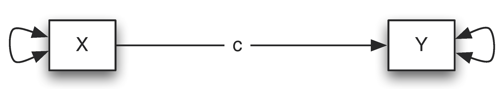
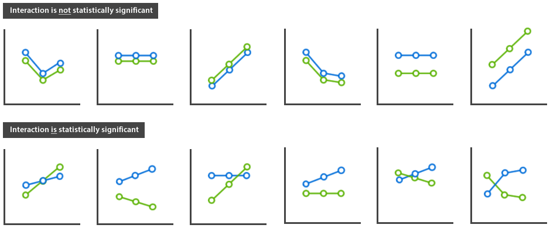
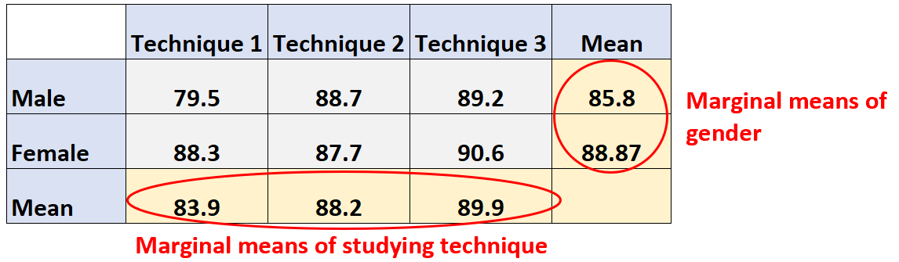

```{r xaringan-extra-styles, echo=FALSE}
library(xaringanExtra)
xaringanExtra::use_extra_styles(
  hover_code_line = TRUE,         #<<
  mute_unhighlighted_code = TRUE  #<<
)
```

```{html, echo=FALSE}
<div style = "position:fixed; visibility: hidden">
$$\require{color}\definecolor{yellow}{rgb}{1, 0.8, 0.16078431372549}$$
$$\require{color}\definecolor{orange}{rgb}{0.96078431372549, 0.525490196078431, 0.203921568627451}$$
$$\require{color}\definecolor{green}{rgb}{0, 0.474509803921569, 0.396078431372549}$$
</div>
<script type="text/x-mathjax-config">
MathJax.Hub.Config({
  TeX: {
    Macros: {
      yellow: ["{\\color{yellow}{#1}}", 1],
      orange: ["{\\color{orange}{#1}}", 1],
      green: ["{\\color{green}{#1}}", 1]
    },
    loader: {load: ['[tex]/color']},
    tex: {packages: {'[+]': ['color']}}
  }
});
</script>
<style>
.yellow {color: #FFCC29;}
.orange {color: #F58634;}
.green {color: #007965;}
</style>
```{r, echo=FALSE}
library(flair)
yellow <- "#FFCC29"
orange <- "#F58634"
green <- "#007965"
```


```{r setup, include=FALSE}
options(htmltools.dir.version = FALSE)
knitr::opts_chunk$set(
  fig.width=9, fig.height=3.5, fig.retina=3,
  out.width = "50%",
  tidy.opts=list(width.cutoff=60),tidy=TRUE, 
  cache = FALSE,
  echo = TRUE,
  message = FALSE, 
  warning = FALSE,
  fig.show = TRUE,
  hiline = TRUE
)
hook_source <- knitr::knit_hooks$get('source')
knitr::knit_hooks$set(source = function(x, options) {
  x <- stringr::str_replace(x, "^[[:blank:]]?([^*].+?)[[:blank:]]*#<<[[:blank:]]*$", "*\\1")
  hook_source(x, options)
})
```

<div style = "position:fixed; visibility: hidden">
$$\require{color}\definecolor{red}{rgb}{1, 0, 0}$$
$$\require{color}\definecolor{green}{rgb}{0, 1, 0}$$
$$\require{color}\definecolor{blue}{rgb}{0, 0, 1}$$
</div>

<script type="text/x-mathjax-config">
MathJax.Hub.Config({
  TeX: {
    Macros: {
      red: ["{\\color{red}{#1}}", 1],
      green: ["{\\color{green}{#1}}", 1],
      blue: ["{\\color{blue}{#1}}", 1]
    },
    loader: {load: ['[tex]/color']},
    tex: {packages: {'[+]': ['color']}}
  }
});
</script>

<style>
.red {color: #FF0000;}
.green {color: #00FF00;}
.blue {color: #0000FF;}
</style>


```{r flair_color, echo=FALSE}
library(flair)
red <- "#FF0000"
green <- "#00FF00"
blue <- "#0000FF"
```


```{r xaringan-themer, include=FALSE, warning=FALSE}
library(xaringanthemer)
style_solarized_dark(
  header_font_google = google_font("Work Sans"),
  header_h1_font_size = "36px",
  header_color = "black",
  text_font_google = google_font("Work Sans"),
  text_font_size = "30px",
  text_color = "black", 
  background_color = "white", 
  code_font_google = google_font("Share Tech Mono"),
  extra_css = list(
    ".remark-slide-content h2" = list(
      "margin-top" = "2em",
      "margin-bottom" = "2em"
    ),
    .big = list("font-size" = "150%"),
    .small = list("font-size" = "75%"),
    .subtle = list(opacity = "0.6"),
    ".countdown-has-style h3, .countdown-has-style h3 ~ p, .countdown-has-style h3 ~ ul" = list(
      "margin" = "0"
    ),
    ".countdown-has-style pre" = list(
      "margin-top" = "-10px"
    ),
    "p .remark-inline-code" = list(
      "background-color" = "white",
      "padding" = "2px 2px",
      "margin" = "0 -2px"
    ),
    blockquote = list("margin-left" = 0),
    "em" = list(color = "#2aa198")
  ),
)
```

```{r, echo=FALSE}
library(parameters)
library(effectsize) 
library(papaja)
library(tidyverse)
library(performance)
library(see)
library(equatiomatic)
library(kableExtra)
library(broom)
library(easystats)
library(interactions)
library(report)
library(emmeans)
library(flextable)
library(huxtable)
library(skimr)
library(papaja)
library(moderndive)
```
# Outline

- Testing interactions/moderation analysis

  - Categorical by Continuous
  - Continuous by Continuous
  - Categorical by Categorical (Monday)
    
---
# Interactions

```{r, eval=FALSE}

lm(plant_growth ~ sun_exposure + water)

```

---
# Interactions

```{r, eval=FALSE}

lm(plant_growth ~ sun_exposure +  water)

```

```{r, echo=FALSE, fig.align='center', out.width="100%"}

knitr::include_graphics("sun-water.bmp")
```
---
# Interactions
```{r, eval=FALSE}

lm(plant_growth ~ sun_exposure * water)

```

```{r, echo=FALSE, fig.align='center', out.width="100%"}


```
---
# Interactions

```{r, eval=FALSE}

lm(plant_growth ~ sun_exposure * water)

```

```{r, echo=FALSE, fig.align='center', out.width="100%"}


```
---
# What is a moderator?

```{r, echo=FALSE, fig.align='center', out.width="100%"}


```
$$Y=\beta_{0}+\beta_{1}*X+\epsilon$$
---
# What is a moderator?

- A moderator variable Z is a variable that alters the strength of the relationship between X and Y

```{r, echo=FALSE, fig.align='center', out.width="90%"}

knitr::include_graphics("moderation2.png")
```

---
# What Do Interactions Look Like?

```{r, echo=FALSE, fig.align='center', out.width="90%"}


```
---
class: middle

# Categorical x Continuous Interactions

---
# Today's Dataset

- Student evaluations for a sample of 463 courses taught by 94 professors from the University of Texas at Austin

- Six students rated the professors' physical appearance 

```{r}
evals_agegend=read_csv("https://raw.githubusercontent.com/jgeller112/psy503-psych_stats/master/evals.csv")
evals1= evals_agegend %>%
dplyr::select(ID, score, age, gender)
```

```{r, echo=FALSE}
summary(evals)
```
---
# Research Question

- Does Age and Sex (Males, Females) of the instructor influence instructor ratings?

    - DV: Evals
    - IV:
        - Age 
        - Gender
        - Age*Gender Interaction
---
# Scatterplot

```{r, fig.align='center', out.width="100%"}
ggplot(evals1, aes(x = age, y = score, color = gender)) +
  geom_point() +
  labs(x = "Age", y = "Teaching Score", color = "Gender") +
  geom_smooth(method = "lm", se = FALSE)
```

---
# How to Conduct Moderation Analysis?

- Moderation analysis can be conducted by adding one or multiple interaction terms in a regression analysis

Z is a moderator for the relation between  X and  Y, we can fit a regression model

$$\begin{eqnarray*} 
Y & = & \beta_{0}+\beta_{1}*X+\beta_{2}*Z+\beta_{3}*X*Z+\epsilon\\ & = & \begin{cases} \beta_{0}+\beta_{1}*X+\epsilon & \mbox{For females}(Z=0)\\ \beta_{0}+\beta_{2}+(\beta_{1}+\beta_{3})*X+\epsilon & \mbox{For males}(Z=1) \end{cases} \end{eqnarray*}$$

- When Z=0 (females),the effect of X on Y is β1+β3∗0=β1

- When Z=1 (males), the effect of X on Y is β1+β3∗1 

---
# Steps for Moderation Analysis

A moderation analysis typically consists of the following steps:

1. Compute the interaction term XZ=X*Z 

2.  Fit a multiple regression model with X, Z, and XZ as predictors

3.  Test whether the regression coefficient for XZ (interaction) is significant

4.  If so, interpret the moderation effect (ignore main effects)

5.  Display the moderation effect graphically
---
# Steps for moderation analysis

-  Compute the interaction term XZ=X*Z

  - Center continuous variables

    - Centering solves two problems: 
    
      - Interpretation
      
      - Multicollinearity

```{r}
evals_interact <- evals1 %>%
  mutate(age_c=datawizard::center(age),gender_trt=ifelse(gender=="female", 0, 1), inter=age_c*gender_trt)
```
---
# Steps for moderation analysis

-  Fit a multiple regression model with X, Z, and XZ as predictors

```{r}
lm(evals_interact$score~age_c*gender_trt, data=evals_interact) %>%
  tidy()
```
---
# Steps for moderation analysis

- Test whether the regression coefficient for XZ is significant

```{r}
lm(score~age_c*gender_trt, data=evals_interact) %>%
  tidy()
```
---
# Interpretation

$$\hat{Y}= b_0 + b_1 X + b_2 Z + b_3 X*Z$$

- $b_0$: the intercept, or the predicted outcome when  X = 0 and Z=0
- $b_1$: the simple effect or slope of $X$, for a one unit change in $X$ the predicted change in $Y$  at  $Z = 0$
- $b_2$: The offset/difference in the intercept for a one unit change in $Z$ the predicted change in Y  at X  = 0 
- $b_3$: The interaction of $X$ and $Z$, the offset in slope for $Z$ for a one-unit increase in $X$ (or vice versa)
---
# Interpretation

```{r}
lm(score~age_c*gender_trt, data=evals_interact) %>%
 tidy()
```
$b_0$ = 
$b_{age}$ = 
$b_{gender}$ = 
$b_{age}*{male}$ = 

???

Average Score for females is at average age 

age_c: slope of age for z = 0 (females) b0 + b1 + b2(0) + b3 (0)

gender M: slope offset for difference between males and females at average age

age_c*gender: the offset slope males

---
# Moderation: Simple Slopes

- If the interaction is significant, then you usually ignore the other individual effects (age and  gender)

- So what do I do if my interaction is significant? **A simple slope analysis**

---
# Main vs. Simple Effects (slopes)

- Main Effects

  - Coefficients that do no involve interaction terms
  
  - Comparison of marginal means

.pull-left[

```{r, echo=FALSE, fig.align='center', out.width="100%"}



```
]

.pull-right[
$$\hat{Y}= b_0 + b_1 X + b_2 Z$$

-$b_0$: The intercept, or the predicted outcome when  X and Z are 0
-$b_1$: The slope (or main effect) of X ; for a one unit change in  the predicted change in Y
-$b_2$: The slope (or main effect) of Y ; for a one unit change in  the predicted change in Y
]
---
# Main vs. Simple effects (slopes)

- Simple Effects

  - Comparison of cell means

$$\hat{Y}= b_0 + b_1 X + b_2 X + b_3 X*Z$$
- $b_0$: the intercept, or the predicted outcome when  X = 0 and Z=0
- $b_1$: the simple effect or slope of $X$, for a one unit change in $X$ the predicted change in $Y$  at  $Z = 0$
- $b_2$:The simple effect or slope of $Z$, for a one unit change in $Z$ the predicted change in Y  at X  = 0 
- $b_3$:The interaction of $X$ and $Z$, the change in the slope of $X$ for a one-unit increase in $Z$ (or vice versa)

---
# Steps for Moderation Analysis

- Obtain simple slopes

  - When a continuous independent variable interact with a moderating variable, its slope at a particular level of the moderating variable

  - Test if slope $\neq$ 0 

```{r}
#hello to our friend emmeans 
#library(emmeans)
d=lm(score~age_c*gender_trt, data=evals_interact)

emtrends(d, ~ gender_trt, var="age_c") #simple slopes
```
---
# Simple Slopes

```{r}

sim_slopes(d, pred=age_c, modx=gender_trt)

```
---
# Steps for Moderation Analysis

- Difference in slopes

  - *testing simple slopes is not the same thing as testing their difference*

```{r}
d=lm(score~age_c*gender_trt, data=evals_interact)

emtrends(d, pairwise ~ gender_trt, var="age_c")
```
---
# Interactions 

- You should only be following up interactions if significant! 

```{r, echo=FALSE, fig.align='center', out.width="80%"}

knitr::include_graphics("gelman.png")

```

---
# Visualize 

```{r, fig.align='center', out.width="90%"}
ggplot(evals1, aes(x = age, y = score, color = gender)) +
  geom_point() +
  labs(x = "Age", y = "Teaching Score", color = "Gender") +
  geom_smooth(method = "lm", se = FALSE)

```

---
# Parallel Slopes

- Parallel slopes models still allow for different intercepts but force all lines to have the same slope.

```{r, fig.align='center', out.width="80%"}
ggplot(evals1, aes(x = age, y = score, color = gender)) +
  geom_point() +
  labs(x = "Age", y = "Teaching Score", color = "Gender") +
  geom_parallel_slopes(se = FALSE)
```
---
# Parallel Slopes

```{r}
main<-lm(score~age_c + gender_trt, data=evals_interact) 
inter<- lm(score~age_c*gender_trt, data=evals_interact) 

anova(main, inter)

```
---
# Parallel Slopes

<br>
<br>

.pull-left[

```{r, echo=FALSE, fig.align='center', out.width="100%"}
ggplot(evals_interact, aes(x = age, y = score, color = gender)) +
  geom_point() +
  labs(x = "Age", y = "Teaching Score", color = "Gender") +
  geom_smooth(method = "lm", se = FALSE)
```

]
.pull-right[

```{r, echo=FALSE, fig.align='center', out.width="100%"}
ggplot(evals_interact, aes(x = age, y = score, color = gender)) +
  geom_point() +
  labs(x = "Age", y = "Teaching Score", color = "Gender") +
  geom_parallel_slopes(se = FALSE)
```
]
---
# Practice In-Class Activity

- Pick a new categorical and continuous variable to examine if they interact with teaching evals

- Go through the steps outlined in the lecture

- Be ready to talk as a group about what you ran and found

```{r}
library(countdown)
countdown(minutes = 5, seconds = 00)

```


```{r}

evals_agegend=read_csv("https://raw.githubusercontent.com/jgeller112/psy503-psych_stats/master/evals.csv")

```
---
class: middle 
# Continuous x Continuous Interactions
---
# Continuous x Continuous Interactions

- Do violent video games make people aggressive? 

    - DV: Aggression
    - IV:
    
        - Callous unemotional traits 
        - Number of hours spent playing video games per week
        - Callous unemotional traits*Number of hours spent playing video games per week

```{r}
# download dataset
moderation_vio=read_csv("https://raw.githubusercontent.com/jgeller112/psy503-psych_stats/master/moderation.csv")
```

---
# Continuous x Continuous  Model

```{r}
library(datawizard)
moderation_vio <- moderation_vio %>%
  mutate(vid_games_c=center(Vid_Games), caunts_c=center(CaUnTs))

```
---
# Continuous X Continuous

- If the Z variable was categorical, you are basically checking if the separate groups (levels) have different slopes for the non-categorical variable

- However, we cant do that with Continuous x Continuous interactions

---
# Interpretation Continuous x Continuous Interaction

- $b_0$: the intercept, or the predicted outcome when  X = 0 and Z=0
- $b_1$: the simple effect or slope of $X$, for a one unit change in $X$ the predicted change in $Y$  at  $Z = 0$
- $b_2$: The simple effect or slope of $Z$, for a one unit change in $Z$ the predicted change in Y  at X  = 0 
- $b_3$:The interaction of $X$ and $Z$, the change in the slope of $X$ for a one-unit increase in $Z$ (or vice versa)
---
# Continuous X Continuous Regression

```{r}
lm(Aggression~ vid_games_c*caunts_c,  data=moderation_vio) %>%
  tidy()
```

--

- How do we interpretate?

???

(Intercept): the intercept, or the predicted outcome when hours = 0 and traits = 0.
 hours: the simple slope of Hours, for a one unit change in Hours, the predicted change in weight loss at Effort=0. 
triat: the simple slope of trait, for a one unit change in vio the predicted change in trait at Hours=0.
 hours:effort: the interaction of Hours and Effort, the change in the slope of Hours for every one unit increase in Effort (or vice versa).
 
---
# Decomposing Continuous X Continuous Interaction: Spotlight Analysis

- For continuous moderator variables, you "create" low, average, and high groups

    - Low groups are people who are one SD below the mean
    - Average groups are people are at the mean
    
    - High groups are people who are one SD above the mean 
---
# Moderation: Simple Slopes

- We are examining the interaction between hours of video games and unemotional traits to predict aggression

- Think about which variable you want to know the differences in (i.e., low, average, high)

- So at different levels of callousness, we want to examine the relationship between hours of video game play and aggression
---
# Spotlight Analysis

- Low/below created by *SUBTRACTING* 1 SD

- High/above created by *ADDING* 1 SD

- The rule is that we have to bring them to the middle because we centered so that zero is the middle

```{r}
#create the low and high z score variables 
a <- mean(moderation_vio$caunts_c) + sd(moderation_vio$caunts_c)
at <- mean(moderation_vio$caunts_c)
b <- mean(moderation_vio$caunts_c) - sd(moderation_vio$caunts_c)

```

---
# Spotlight Analysis

```{r}

mylist <- list(caunts_c=c(round(b, 1), round(at,1), round(a, 1)))
# create a list for values round them

# run lm again
d=lm(Aggression~vid_games_c*caunts_c,data=moderation_vio)

# get simple slopes at each level
emtrends(d,~caunts_c, var="vid_games_c", at=mylist)

```
--

- At high levels of callousness, the strength of hours of video games predicting aggression is the strongest, b = 0.43 ... 

---
# Graphing Continuous x Continuous Interactions

```{r, echo=TRUE}
moderation_vio$caunts_clow <- moderation_vio$caunts_c + sd(moderation_vio$caunts_c) #bring them up
moderation_vio$caunts_chigh <- moderation_vio$caunts_c - sd(moderation_vio$caunts_c) #bring them down
modmodellow <- lm(Aggression ~ vid_games_c*caunts_clow, data = moderation_vio)
modmodelhigh <- lm(Aggression ~ vid_games_c*caunts_chigh, data = moderation_vio)
```

```{r, echo=TRUE, message=FALSE, warning=FALSE, fig.align='center', out.width="100%"}
library(ggplot2)

cleanup <- theme(panel.grid.major = element_blank(), 
                panel.grid.minor = element_blank(), 
                panel.background = element_blank(), 
                axis.line.x = element_line(color = "black"),
                axis.line.y = element_line(color = "black"),
                legend.key = element_rect(fill = "white"),
                text = element_text(size = 15))
modgraph <- ggplot(moderation_vio, aes(vid_games_c, Aggression))
##change Cal to the new moderator label
##change xlab for the new X label
modgraph + 
  xlab("Centered Video Games") + 
  geom_point(color = "gray") +
  geom_abline(aes(intercept = modmodellow$coefficients[1],
                  slope = modmodellow$coefficients[2], 
                  linetype = "-1SD Cal"), size = 1) +
  geom_abline(aes(intercept = d$coefficients[1],
                  slope = d$coefficients[2], 
                  linetype = "Average Cal"), size = 1) +
  geom_abline(aes(intercept = modmodelhigh$coefficients[1],
                  slope = modmodelhigh$coefficients[2], 
                  linetype = "+1SD Cal"), size = 1) +
  scale_linetype_manual(values = c("dotted", "dashed", "solid"),
                        breaks = c("-1SD Cal", "Average Cal", "+1SD Cal"),
                        name = "Simple Slope") +
  cleanup 
```

---

```{r, echo=FALSE, message=FALSE, warning=FALSE, fig.align='center', out.width="100%"}
library(ggplot2)

cleanup <- theme(panel.grid.major = element_blank(), 
                panel.grid.minor = element_blank(), 
                panel.background = element_blank(), 
                axis.line.x = element_line(color = "black"),
                axis.line.y = element_line(color = "black"),
                legend.key = element_rect(fill = "white"),
                text = element_text(size = 15))
modgraph <- ggplot(moderation_vio, aes(vid_games_c, Aggression))
##change Cal to the new moderator label
##change xlab for the new X label
modgraph + 
  xlab("Centered Video Games") + 
  geom_point(color = "gray") +
  geom_abline(aes(intercept = modmodellow$coefficients[1],
                  slope = modmodellow$coefficients[2], 
                  linetype = "-1SD Cal"), size = 1) +
  geom_abline(aes(intercept = d$coefficients[1],
                  slope = d$coefficients[2], 
                  linetype = "Average Cal"), size = 1) +
  geom_abline(aes(intercept = modmodelhigh$coefficients[1],
                  slope = modmodelhigh$coefficients[2], 
                  linetype = "+1SD Cal"), size = 1) +
  scale_linetype_manual(values = c("dotted", "dashed", "solid"),
                        breaks = c("-1SD Cal", "Average Cal", "+1SD Cal"),
                        name = "Simple Slope") +
  cleanup 
```
---
# Simplier Way

- Use `interact plot` from the `interactions package`

```{r, fig.align='center', out.width="80%"}
library(interactions)

interact_plot(d, pred = vid_games_c, modx = caunts_c, interval = TRUE)

```

---
# Johnson-Neyman Plots: Floodlight Analysis

.pull-left[

- Is a spotlight analysis on the whole range of the moderator

- Provides an interval (2 points) where the slope of a predictor is not statistically significant across different values of the mediator

```{r, echo=TRUE, warning=FALSE, message=FALSE, fig.align='center', eval=FALSE}
johnson_neyman(model = d, pred = vid_games_c,
  modx = caunts_c, control.fdr = TRUE) # important bc otherwise does not correct for multiple comparisons
```

]
<br>
<br>
.pull-right[

```{r, echo=FALSE, fig.align='center', out.width="100%", warning=FALSE, message=FALSE, fig.align='center'}

knitr::include_graphics("JNplot.png")
```


]
---
# Moderation: MeMoBootR

- We can use the `MeMoBootR` to complete the entire processing, including data screening for us! 

- You would enter the raw variables, as the centering is completed for you

```{r}
#devtools::install_github("doomlab/MeMoBootR")
library(MeMoBootR)
mod_model <- moderation1(y = "Aggression",
                         x = "Vid_Games",
                         m = "CaUnTs",
                         df = moderation_vio)
```
---
# Moderation: MeMoBootR

```{r}
#data screenin
#mod_model$datascreening$fulldata
#models
#summary(mod_model$model1)
#mod_model$interpretation
#graphs
#mod_model$graphslopes
```
---
# 
