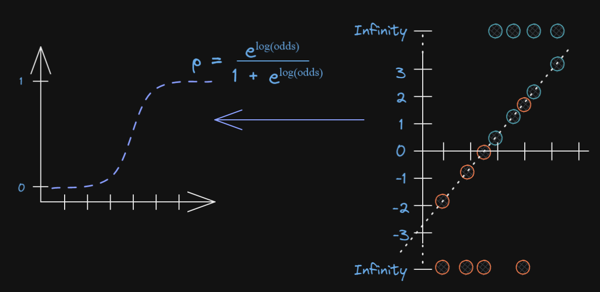

```{r xaringan-extra-styles, echo=FALSE}
library(xaringanExtra)
xaringanExtra::use_extra_styles(
  hover_code_line = TRUE,         #<<
  mute_unhighlighted_code = TRUE  #<<
)
```

```{html, echo=FALSE}
<div style = "position:fixed; visibility: hidden">
$$\require{color}\definecolor{yellow}{rgb}{1, 0.8, 0.16078431372549}$$
$$\require{color}\definecolor{orange}{rgb}{0.96078431372549, 0.525490196078431, 0.203921568627451}$$
$$\require{color}\definecolor{green}{rgb}{0, 0.474509803921569, 0.396078431372549}$$
</div>
<script type="text/x-mathjax-config">
MathJax.Hub.Config({
  TeX: {
    Macros: {
      yellow: ["{\\color{yellow}{#1}}", 1],
      orange: ["{\\color{orange}{#1}}", 1],
      green: ["{\\color{green}{#1}}", 1]
    },
    loader: {load: ['[tex]/color']},
    tex: {packages: {'[+]': ['color']}}
  }
});
</script>
<style>
.yellow {color: #FFCC29;}
.orange {color: #F58634;}
.green {color: #007965;}
</style>
```{r, echo=FALSE}
library(flair)
yellow <- "#FFCC29"
orange <- "#F58634"
green <- "#007965"
```


```{r setup, include=FALSE}
options(htmltools.dir.version = FALSE)
knitr::opts_chunk$set(
  fig.width=9, fig.height=5, fig.retina=3,
  out.width = "80%",
  tidy.opts=list(width.cutoff=80),tidy=TRUE, 
  cache = FALSE,
  echo = TRUE,
  message = FALSE, 
  warning = FALSE,
  fig.show = TRUE,
  hiline = TRUE
)
hook_source <- knitr::knit_hooks$get('source')
knitr::knit_hooks$set(source = function(x, options) {
  x <- stringr::str_replace(x, "^[[:blank:]]?([^*].+?)[[:blank:]]*#<<[[:blank:]]*$", "*\\1")
  hook_source(x, options)
})
```

```{r xaringan-themer, include=FALSE, warning=FALSE}
library(xaringanthemer)
style_solarized_dark(
  header_font_google = google_font("Work Sans"),
  header_h1_font_size = "36px",
  header_color = "black",
  text_font_google = google_font("Work Sans"),
  text_font_size = "30px",
  text_color = "black", 
  background_color = "white", 
  code_font_google = google_font("Share Tech Mono"),
  extra_css = list(
    ".remark-slide-content h2" = list(
      "margin-top" = "2em",
      "margin-bottom" = "2em"
    ),
    .big = list("font-size" = "150%"),
    .small = list("font-size" = "75%"),
    .subtle = list(opacity = "0.6"),
    ".countdown-has-style h3, .countdown-has-style h3 ~ p, .countdown-has-style h3 ~ ul" = list(
      "margin" = "0"
    ),
    ".countdown-has-style pre" = list(
      "margin-top" = "-10px"
    ),
    "p .remark-inline-code" = list(
      "background-color" = "white",
      "padding" = "2px 2px",
      "margin" = "0 -2px"
    ),
    blockquote = list("margin-left" = 0),
    "em" = list(color = "#2aa198")
  ),
)
```

```{r, echo=FALSE}
library(parameters)
library(effectsize) 
library(papaja)
library(tidyverse)
library(performance)
library(see)
library(equatiomatic)
library(kableExtra)
library(broom)
library(report)
library(emmeans)
library(flextable)
library(huxtable)
library(skimr)
library(papaja)
library(moderndive)
library(tidyverse)
library(fivethirtyeight)
library(broom)
library(ggdist)
```
# Today

- Finishing cat x cat interactions

- Introduction to logistic regression
  
    - Fitting the model: 
        - Binomial distribution
        - Logit Link
        - Maximum Likelihood
        - Paramater interpretation
         
    - Statistical inference: 
      - Model fit and model diagnoistics
      - Comparing models

---
#  Linear Model

- Model $y$ as a linear function of predictors

$$ y = b_0 + b_1*x $$

--

$$y\sim~Normal(\mu, \sigma)$$
---
- What about if $y$ is not normal?

  - What if $y$ is categorical with two possible outcomes?

<br>
<br>

$$y = b_0 + b_1*x$$
$$y\sim~Bernoulli(p)$$
$$y\sim~Binomial(n,p)$$
--

- 🤯

--

*Logistic regression*

---
# Binomial Distribution

The simplest kind of categorical data is each case is binary

```{r, echo=FALSE, fig.align='center', out.width="100%"}

```

--

0–1
Pass/fail
Choose/Don’t choose
Support/Not support
Relapse/Not relapse

---
# Binomial Distribution

> Distribution of discrete counts of independent outcomes over a certain set of trials

.pull-left[

$$y\sim binomial(N,p)$$
- N = number of trials
- p = probability of “y = 1”
- y = {0, 1}

  - $\mu=E(X)=np$
  - $Var(X)=np(1-p)$
  - $SD(X)=\sqrt{np(1-p)} \text{, where \(p\) is the probability of the “success"}$
]

.pull-right[

```{r, echo=FALSE, fig.align='center', out.width="100%"}


```
]

---

background-image: url(images/bour.jpg)
background-size: contain


---
# Bernoulli Distribution

>  Distribution of a single, discrete binary outcome

.pull-left[
$$y\sim Bernoulli(p)$$]
.pull-right[
```{r, echo=FALSE,fig.align='center', out.width="100%"}


```
]
---

```{r, echo=FALSE,fig.align='center', out.width="80%"}


```
---
# Generalized Linear Model

- Regression models with non-normal response likelihoods

$$\begin{align*}
  Y_i & \sim \mathrm{Dist}(\mu_i, \tau)  \\
  g(\mu_i) & = \eta_i \\
  \eta_i & = \beta_0 + \beta_1 X_{1i} + \beta_2 X_{2i} + \ldots
\end{align*}$$

- Where: 

  - $y$ is referenced with $\mu$ 
  
  - $g$ is link function

$$p(y = 1)  = p$$
$$log(\frac{p}{1 - p})$$
---
# Fitting a Logistic Regression in R

```{r, eval=FALSE}
# use GLM istead of LM
# family changes
bi_model <- glm(
  rvote ~ income,
  family = binomial(
    link = "logit"))

```

---
# Logit Link

- The logit link transforms a linear model in the log-odds metric:

$$\begin{equation*}
\log\left(\frac{p}{1 - p}\right)=\beta_0+\beta_1X 
 \end{equation*}$$

- To a non-linear model in the probability metric: 
$$\begin{equation*} 
p(logit)=\frac{e^{logit}}{1+e^{logit}}
\end{equation*}=\frac{exp(logit)}{1+exp(logit)}$$
---
# Logit Link 

- Step 1

  - Transform probability into odds
  
    - The "odds" of an event are just the probability it happens divided by the probability it does not happen

$$\textrm{Odds} = \frac{\# \textrm{successes}}{\# \textrm{failures}}=
\frac{\# \textrm{successes}/n}{\# \textrm{failures}/n}=
\frac{p}{1-p}$$

---
# Logit Link 

- Step 2

.pull-left[

  - When we convert a probability to odds, odds always  > 0 
  
  - Problematic for linear model 

  -  Take log of the odds
  
  $$ logit = log(\frac{p}{1-p})$$
]

.pull-right[

```{r, echo=FALSE,fig.align='center', out.width="100%"}


```
]

---
# Logit Link 

.pull-left[

- This log odds conversion has a nice property

  - It converts odds of less than one to negative numbers, because the log of a number between 0 and 1 is always negative
  
  - Our data is now linear!
]

.pull-right[
            
```{r, echo=FALSE, fig.align='center', out.width="100%"}
# Manually calculate the logit values and tidy data for the plot

bechdel=fivethirtyeight::bechdel

bechdel <- bechdel  %>% 
  mutate(pass = ifelse(binary == "FAIL", 0, 1)) 

bechdel_lin<- bechdel %>%
  dplyr::select(pass, budget_2013)

fit <- glm(
  data = bechdel,
  family = binomial,
  pass ~ 1 + budget_2013)

bechdel_lin$prob <- fit$fitted.values

df_model <- bechdel_lin %>%
  mutate(logit = log(prob/(1-prob)))
        
  ggplot(df_model, aes(y = logit, x = budget_2013))+
  geom_point(size = 0.5, alpha = 0.5) +
  geom_smooth(method = "loess") + 
  theme_bw()

```

]
---
# However...

- We need a function that scrunches the output of the linear predictor into a range appropriate for this parameter

```{r, echo=FALSE, fig.align='center', out.width="50%"}

```
---
# Squiggles

- We need a function that scrunches the output of the linear predictor into a range appropriate for this parameter

--

- A squiggle (logistic or Sigmoid curve) to the rescue!

```{r, echo=FALSE, fig.align='center', out.width="100%"}


```

---
```{r, echo=FALSE, fig.align='center', out.width="100%"}


```
---
```{r, echo=FALSE, fig.align='center', out.width="100%"}


```
$$p(logit)=\frac{e^{logit}}{1+e^{{logit}}}$$
---
# Probabilities, Odds, and Log Odds

```{r, echo=FALSE, fig.align='center', out.width="100%"}


```
---
```{r, echo=FALSE, out.width="100%"}
tibble(`log-odds` = seq(from = -4.5, to = 4.5, length.out = 200)) %>% 
  # transform with the inverse of the logit function
  mutate(probability = exp(`log-odds`) / (1 + exp(`log-odds`))) %>% 

  ggplot(aes(x = `log-odds`, y = probability)) +
  geom_line(size = 1.5) +
  scale_x_continuous(breaks = -2:2 * 2, expand = c(0, 0)) +
  scale_y_continuous(expand = c(0, 0), limits = 0:1)
```

---
```{r, echo=FALSE, fig.align='center', out.width="100%", out.height="100%"}


```
---
# Best Fitting Squiggle

- In standard linear regression we use least squares to find the best fitting line


```{r, echo=FALSE, fig.align='center', out.width="60%"}


```

---
# Likelihood

-  In logistic regression we try to maximize the likelihood of the data

  - Minimize the *deviance*

- Similar, but not the same as probability

--
.pull-left[
  - Probability

> How probable it is to draw a sample from a given distribution with certain parameters 

  - Here distribution is fixed and data can change
  
]

.pull-right[

```{r, echo=FALSE, fig.align='center', out.width="100%"}


```

]
---
# Likelihood

.pull-left[

> Computes how likely the parameters are given the observed data – in a practical context, we change the parameters of the distribution and see how it affects the likelihood

  - Here data is fixed and distribution can change
]

.pull-right[
```{r, echo=FALSE, fig.align='center', out.width="90%"}


```
]

---
# Likelihood

.pull-left[
> Computes how likely the parameters are given the observed data

  - Here data is fixed and distribution can change
]

.pull-right[
```{r, echo=FALSE, fig.align='center', out.width="100%"}


```
]

---

- We need find where points lie on line and get corresponding logits 

<br>
<br>
<br>
.pull-left[

```{r, echo=FALSE, fig.align='center', out.width="100%"}


```
]


.pull-right[

```{r, echo=FALSE, fig.align='center', out.width="100%"}


```
]
---
# Likelihood

- Then plot them 

<br>
<br>

```{r,echo=FALSE, fig.align='center', out.width="50%"}



```
---
# Likelihood

```{r,echo=FALSE, fig.align='center', out.width="90%"}


```
---
# Now What?

- We keep rotating the log odds(line) and projecting data on to it and transforming into probabilities

  - Until we find maximum likelihood!

```{r, echo=FALSE, fig.align='center', out.width="70%"}


```
---

.pull-left[

```{r, echo=FALSE, fig.align='center', out.width="100%"}


```
]
.pull-right[
```{r, echo=FALSE, fig.align='center', out.width="100%"}


```
]
---
# Dataset

- The Bechdel test

```{r, echo=FALSE, fig.align='center', out.width="100%"}

```

---
# Data

```{r}
#install.packages(fivethirtyeight)
bechdel=fivethirtyeight::bechdel
glimpse(bechdel)
```

---
# Linear Model?

Not good for two reasons: 
 
1. Outcome is non-normal
2. The predicted regression line is unbounded, meaning that it can go from ∞to-∞

.pull-left[
```{r, echo=FALSE}

# compute
bechdel <- bechdel  %>% 
  mutate(pass = ifelse(binary == "FAIL", 0, 1)) 

# compare
#bechdel %>% 
 # select(binary, pass) %>% 
 # head()

fit <- glm(
  data = bechdel,
  family = binomial,
  pass ~ 1 + budget_2013)

# define the new data
nd <- tibble(budget_2013 = seq(from = 0, to = 500000000, length.out = 100))

p <-
  # compute the fitted lines and SE's
  predict(fit,
          newdata = nd,
          type = "link",
          se.fit = TRUE) %>% 
  # wrangle
  data.frame() %>% 
  mutate(ll = fit - 1.96 * se.fit,
         ul = fit + 1.96 * se.fit) %>% 
  select(-residual.scale, -se.fit) %>% 
  mutate_all(plogis) %>%
  bind_cols(nd)

```
]

.pull-right[
```{r, echo=FALSE, fig.align='center', out.width="100%"}
p %>% 
  ggplot(aes(x = budget_2013, y = fit)) +
  geom_smooth(method='lm') +
  geom_point(data = bechdel,
             aes(y = pass),
             alpha = 1/2)

```
]
---
# Model

$$\begin{align*}
\text{pass}_i & \sim \operatorname{Bernoulli}(n = 1, p_i) \\
\operatorname{logit}(p_i) & = \beta_0 + \beta_1 \text{budget_2013}_i,
\end{align*}$$

```{r}
fit <- glm(
  data = bechdel,
  family = binomial(link="logit"),
  pass ~ 1 + budget_2013)

new=-5.972374e-09*1e8


```

---
# Logistic Regression in R 

```{r}

fit <- glm(
  data = bechdel,
  family = binomial(link = "logit"),
  pass ~ 1 + budget_2013) %>%
  tidy()

fit

```

---
# Summary Output

```{r, echo=FALSE}

fit <- glm(
  data = bechdel,
  family = binomial(link = "logit"),
  pass ~ 1 + budget)

summary(fit)
```


---
# Interpreting the intercept: $\beta_0$

```{r, echo=FALSE}
tidy(fit,exponentiate = FALSE) # get log odds
```

- Intercept

  - When budget = 0, log-odds of Y are 0.04
  
    -  A movie with a budget of zero has a 51% passing the test
    
---
# Interpreting slope: $\beta_1$

- If X is quantitative predictor: 

  - As $X_i$ increases by 1 unit, log-odds of Y increases by $\beta_1$

  - As $X_i$ increases by 1 unit, the odds of Y multiply by a factor of  exp{$\beta_1$}

    - Budget_2013 = pretty small so change to `r new` which is interpreted as the expected change in log odds for every 100,000,000 spent on movie budget
    
      - Divide by 4 rule to get upper limit of max probability change (Gelman & Hill, 2007) (every 1 unit increase in X,P(y) will increase by no more than $B/4$)
---
# Interpreting slope: β1

- If X is a categorical predictor

  - The difference in the log-odds between group X and the baseline is $\beta_1$
  
  - The odds of Y for group X are expected to be exp{β1} times the odds of Y for the baseline group.

---
# Coffiencet Effect Size: Odd's Ratio

```{r, echo=FALSE}
tidy(fit,exponentiate = TRUE) # odds ratio from tidy object 
```
- For every 100,000,000 spent in movie budget, the odds of passing are decreased by a factor of .55:1

  - Describe as percentage increase/decrease

    - *Remember how to interpret logs for DV* 

```{r}
exp(new)-1 # get probability of increase/decrease
```

- For every 100,000,000 spent on movie budget, the odds of passing the test is reduced by 45% 

---
# Hypothesis test for $\beta_j$

.vocab[Hypotheses]: $H_0: \beta_j = 0 \hspace{2mm} \text{ vs } \hspace{2mm} H_a: \beta_j \neq 0$

--

.vocab[Test Statistic]: $$z = \frac{\hat{\beta}_j - 0}{SE_{\hat{\beta}_j}}$$
--

.vocab[P-value]: $P(|Z| > |z|)$, 

where $Z \sim N(0, 1)$, the Standard Normal distribution


---
# Confidence interval for $\beta_j$

We can calculate the .vocab[C% confidence interval] for $\beta_j$ as the following: 

.eq[
$$\Large{\hat{\beta}_j \pm z^* SE_{\hat{\beta}_j}}$$

where $z^*$ is calculated from the $N(0,1)$ distribution

]

--

$$\exp\{\hat{\beta}_1 \pm z^* SE(\hat{\beta}_1)\}$$
---
# Log likelihood

.eq[
$$\log L = \sum\limits_{i=1}^n[y_i \log(\hat{\pi}_i) + (1 - y_i)\log(1 - \hat{\pi}_i)]$$
]

--

- Measure of how well the model fits the data 

--

- Higher values of $\log L$ are better

--

- .vocab[Deviance] = $-2 \log L$
  - $-2 \log L$ follows a $\chi^2$ distribution with $n - p - 1$ degrees of freedom
  
---
# $\chi^2$ distribution 

```{r, echo=F, fig.height = 6}
x <- seq(from =0, to = 10, length = 100)
# Evaluate the densities
y_1 <- dchisq(x, 1)
y_2 <- dchisq(x,2)
y_3 <- dchisq(x,3)
y_4 <- dchisq(x,5)
# Plot the densities
plot(x, y_1, col = 1, type = "l", ylab="",lwd=3, ylim = c(0, 0.5), 
     main  = "Chi-square Distribution")
lines(x,y_2, col = 2,lwd=3)
lines(x, y_3, col = 3,lwd=3)
lines(x, y_4, col = 4,lwd=3)
# Add the legend
legend("topright",
       c("df = 1", "df = 2 ", "df = 3", "df = 5"), 
       col = c(1, 2, 3, 4), lty = 1)
```
---
# Comparing Nested Models

- Suppose there are two models: 

    - Reduced model includes predictors $x_1, \ldots, x_q$
    - Full model includes predictors $x_1, \ldots, x_q, x_{q+1}, \ldots, x_p$

--

- We want to test the hypotheses
$$\begin{aligned}&H_0: \beta_{q+1} = \dots = \beta_p = 0 \\
& H_a: \text{ at least 1 }\beta_j \text{ is not } 0\end{aligned}$$

--

- To do so, we will use the .vocab[Drop-in-deviance test] (also known as the Nested Likelihood Ratio test)

---
# Drop-In-Deviance Test

.vocab[Hypotheses]:
$$\begin{aligned}&H_0: \beta_{q+1} = \dots = \beta_p = 0 \\
& H_a: \text{ at least 1 }\beta_j \text{ is not } 0\end{aligned}$$

--

.vocab[Test Statistic]: $$G = (-2 \log L_{reduced}) - (-2 \log L_{full})$$

--
.vocab[P-value]: $P(\chi^2 > G)$, 

calculated using a $\chi^2$ distribution

- df = $df_1$ - $df_2$
---
# Testing Deviance

- We can use the anova function to conduct this test

  - Add test = "Chisq" to conduct the drop-in-deviance test
  
```{r, eval=FALSE}

anova(model1, model2, test = "Chisq")

```

- `Performance` package

```{rm eval=FALSE}

test_likelihoodratio(model1, model2)

```

---

# Model Fit

- McFadden Psuedo $R^2$

$$R^2 = \frac{SSM}{SST} = \frac{SST-SSE}{SST}=1-\frac{SSE}{SST}$$
$$R_{MF}^2 = 1-\frac{D_{\rm residual}}{D_{\rm null}}$$

- Tjur's R2 (`easystats`)

```{r, eval=FALSE}

r2_tjur(model)

```

- Both a ratio indicating how "good" the model fit
---
# Logistic Diagnostics

```{r, eval=FALSE, fig.align='center', out.width="100%"}

check_model(model)

```
---
# Visualzing Logistic Data

- How boring!

.pull-left[
```{r, eval=FALSE}

p %>% 
  ggplot(aes(x = budget_2013, y = fit)) +
  geom_ribbon(aes(ymin = ll, ymax = ul),
              alpha = 1/2) +
  geom_line() +
  geom_point(data = bechdel,
             aes(y = pass),
             alpha = 1/2) +
  scale_y_continuous("probability of passing", 
                     expand = expansion(mult = 0.01))


```
]

.pull-right[

```{r, echo=FALSE, fig.align="100%", out.width="100%"}

p %>% 
  ggplot(aes(x = budget_2013, y = fit)) +
  geom_ribbon(aes(ymin = ll, ymax = ul),
              alpha = 1/2) +
  geom_line() +
  geom_point(data = bechdel,
             aes(y = pass),
             alpha = 1/2) +
  scale_y_continuous("probability of passing", 
                     expand = expansion(mult = 0.01))


```
]
---
# Better?

.pull-left[
```{r, eval=FALSE}


p %>% 
  ggplot(aes(x = budget_2013, y = fit)) +
  geom_ribbon(aes(ymin = ll, ymax = ul),
              alpha = 1/2) +
  geom_line() +
  geom_jitter(data = bechdel,
              aes(y = pass),
              size = 1/4, alpha = 1/2, height = 0.05) +
  scale_y_continuous("probability of passing", 
                     expand = c(0, 0))


```

]


.pull-right[
```{r, echo=FALSE, fig.align="100%", out.width="100%"}

p %>% 
  ggplot(aes(x = budget_2013, y = fit)) +
  geom_ribbon(aes(ymin = ll, ymax = ul),
              alpha = 1/2) +
  geom_line() +
  geom_jitter(data = bechdel,
              aes(y = pass),
              size = 1/4, alpha = 1/2, height = 0.05) +
  scale_y_continuous("probability of passing", 
                     expand = c(0, 0))

```

]

---
# Better?

.pull-left[
```{r, eval=FALSE}

p %>% 
  ggplot(aes(x = budget_2013)) +
  geom_ribbon(aes(ymin = ll, ymax = ul),
              alpha = 1/2) +
  geom_line(aes(y = fit)) +
  stat_dots(data = bechdel,
            aes(y = pass, side = ifelse(pass == 0, "top", "bottom")),
            scale = 1/3) +
  scale_y_continuous("probability of passing",
                     expand = c(0, 0))


```

]

.pull-right[
```{r, echo=FALSE, fig.align="100%", out.width="100%", out.height="80%"}

p %>% 
  ggplot(aes(x = budget_2013)) +
  geom_ribbon(aes(ymin = ll, ymax = ul),
              alpha = 1/2) +
  geom_line(aes(y = fit)) +
  stat_dots(data = bechdel,
            aes(y = pass, side = ifelse(pass == 0, "top", "bottom")),
            scale = 1/3) +
  scale_y_continuous("probability of passing",
                     expand = c(0, 0))


```

]

---
# Better?

.pull-left[

```{r, echo=TRUE, eval=FALSE}
p %>% 
  ggplot(aes(x = budget_2013)) +
  geom_ribbon(aes(ymin = ll, ymax = ul),
              alpha = 1/2) +
  geom_line(aes(y = fit)) +
  stat_dots(data = bechdel %>% 
              mutate(binary = factor(binary, levels = c("PASS", "FAIL"))),
            aes(y = pass, 
                side = ifelse(pass == 0, "top", "bottom"),
                color = binary),
            scale = 0.4, shape = 19) +
  scale_color_manual("Bechdel test", values = c("#009E73", "#D55E00")) +
  scale_x_continuous("budget (in 2013 dollars)",
                     breaks = c(0, 1e8, 2e8, 3e8, 4e8),
                     labels = c(0, str_c(1:4 * 100, " mill")),
                     expand = c(0, 0), limits = c(0, 48e7)) +
  scale_y_continuous("probability of passing",
                     expand = c(0, 0)) +
  theme(panel.grid = element_blank())
```

]

.pull-right[

```{r, echo=FALSE, fig.align='center', out.width="100%"}
p %>% 
  ggplot(aes(x = budget_2013)) +
  geom_ribbon(aes(ymin = ll, ymax = ul),
              alpha = 1/2) +
  geom_line(aes(y = fit)) +
  stat_dots(data = bechdel %>% 
              mutate(binary = factor(binary, levels = c("PASS", "FAIL"))),
            aes(y = pass, 
                side = ifelse(pass == 0, "top", "bottom"),
                color = binary),
            scale = 0.4, shape = 19) +
  scale_color_manual("Bechdel test", values = c("#009E73", "#D55E00")) +
  scale_x_continuous("budget (in 2013 dollars)",
                     breaks = c(0, 1e8, 2e8, 3e8, 4e8),
                     labels = c(0, str_c(1:4 * 100, " mill")),
                     expand = c(0, 0), limits = c(0, 48e7)) +
  scale_y_continuous("probability of passing",
                     expand = c(0, 0)) +
  theme(panel.grid = element_blank())
```


]

---
# Case Study: Loseing Weight

- These data are a sample of 500 teens from data collected in 2009 through the U.S. Youth Risk Behavior Surveillance System (YRBSS)

- Are the odds that young females report trying to lose weight greater than the odds that males do? Is increasing BMI associated with an interest in losing weight, regardless of sex? 

```{r}
risk2009.data <- foreign::read.spss(
  file = "https://github.com/proback/BeyondMLR/blob/master/data/yrbs09.sav?raw=true",
  to.data.frame = TRUE)

set.seed(33)

risk2009.samp <- risk2009.data %>%
  sample_n(500)

dim(risk2009.samp)
```
---
# Trying to lose weight

```{r}
risk2009 <- risk2009.samp %>% 
  transmute(lose.wt    = ifelse(Q66 == "Lose weight", "Lose weight", "No weight loss") %>% factor(),
            lose.wt.01 = ifelse(Q66 == "Lose weight", 1, 0),
            sex        = Q2,
            sport      = ifelse(Q84 == "0 teams", "No sports", "Sports") %>% factor(),
            sport_fac  = Q84,
            sport_num  = str_extract(Q84, "\\d") %>% as.double(),
            media      = as.numeric(Q81) - 2,
            media      = ifelse(media == 0, 0.5, media),
            media      = ifelse(media == -1, 0, media),
            bmipct     = bmipct) %>%
  mutate(female = ifelse(sex == "Female", 1, 0)) %>% 
  filter(complete.cases(.))

# what have we done?
glimpse(risk2009)
```
---
# Trying to lose weight


*`lose.wt.01`, which is coded 1 when someone indicated they were trying to lost weight and 0 when they were not trying to. This is a dichotomized version of the `lose.wt` factor variable.

- Our two predictor variables will be:

* `sex` and its related dummy variable `female` and `male`
* `bmipct`, which is the percentile for a given BMI for members of the same sex

---
# Exploratory Data Analysis

- Here are two versions of comparing `lose.wt.01` by `sex`

.pull-left[
```{r, echo=FALSE, fig.align='center', out.width="70%"}
risk2009 %>% 
  mutate(lose.wt.01 = factor(lose.wt.01)) %>% 
  ggplot(aes(x = lose.wt.01)) +
  geom_bar() +
  facet_wrap(~ sex)
```
]

.pull-left[
```{r, echo=FALSE, fig.align='center', out.width="70%"}
risk2009 %>% 
  ggplot(aes(x = sex, fill = lose.wt)) +
  geom_bar(position = "fill") +
  scale_fill_viridis_d(option = "C", begin = .2) +
  labs(x = NULL, 
       y = "Proportion")
```      
]
---
# Exploratory Data Analysis

- Here are the histograms for `bmipct`, faceted by `lose.wt`.

```{r, echo=FALSE, out.width="80%", fig.align='center'}

risk2009 %>% 
  ggplot(aes(x = bmipct)) +
  geom_histogram(binwidth = 5) +
  facet_wrap(~ lose.wt, ncol = 1)
```
---
# Exploratory Data Analysis

- Here are the histograms for `bmipct`, faceted by both `lose.wt` and `sex`.

```{r, echo=FALSE, out.width="80%", fig.align='center'}

risk2009 %>% 
  ggplot(aes(x = bmipct)) +
  geom_histogram(binwidth = 5) +
  facet_grid(lose.wt ~ sex)
```
---
# Logistic Regression: Fitting Model

- Let's fit an intercept-only model

$$
\begin{align*}
\text{lose.wt.01}_i & \sim \operatorname{Binomial}(n = 1, p_i)\\
\text{logit}(p_i) & = \beta_0
\end{align*}
$$
---
# Logistic Regression: Fitting Model

```{r}
# fit
fit1 <- glm(
  data = risk2009,
  family = binomial,
  lose.wt.01 ~ 1
  ) 
fit1 %>% 
  tidy()
```

---
# Interpreting $\beta_0$

```{r, echo=FALSE}

tidy(fit1)

```

- The intercept $\beta_0$ is in the log-odds metric 
- We can convert it to probability

```{r}
b0 <- coef(fit1)

exp(b0) / (1 + exp(b0))

```

- Thus, the overall probability of students wanting to lose weight was about .45
---
- Let's check that with the empirical proportions

```{r}
risk2009 %>% 
  count(lose.wt.01) %>% 
  mutate(proportion = n / sum(n))
```

- We can actually do that transformation with the base **R** `plogis()` function.

```{r}
plogis(b0)
```

---
# Logistic Regression

- Add our binary predictor `female`, which gives us the model

$$
\begin{align*}
\text{lose.wt.01}_i & \sim \operatorname{Binomial}(n = 1, p_i) \\
\text{logit}(p_i) & = \beta_0 + \beta_1 \text{female}_i,
\end{align*}
$$

where `female` is an 0/1 dummy variable.
---
# Fit Model

```{r}
# fit
fit2 <- glm(
  data = risk2009,
  family = binomial,
  lose.wt.01 ~ 1 + female
  )

# summarize
fit2 %>%
  tidy()

```
---
- Now we can compute the probabilities for young men and women as follows

```{r}
b0 <- coef(fit2)[1] %>% as.double()
b1 <- coef(fit2)[2] %>% as.double()

# young men
plogis(b0 + b1 * 0)

# young women
plogis(b0 + b1 * 1)
```

- Check these with the empirical probabilities

```{r}
risk2009 %>% 
  group_by(sex) %>% 
  count(lose.wt.01) %>% 
  mutate(proportion_by_sex = n / sum(n))
```

---
# `Emmeans`

- Can use `emmeans` to get probabilities directly from model

  - Can also get odds ratios for comparisons!
```{r}

emm <- emmeans(fit2, "female", type = "response")

pairs(emm, reverse=TRUE)
emm
```
---
# Logistic Regression Continuous 

Now we add our continuous predictor `bmipct`, which gives us the model:

$$
\begin{align*}
\text{lose.wt.01}_i & \sim \operatorname{Binomial}(n = 1, p_i) \\
\text{logit}(p_i) & = \beta_0 + \beta_1 \text{bmipct}_i,
\end{align*}
$$

```{r}
# fit
fit3 <- glm(
  data = risk2009,
  family = binomial,
  lose.wt.01 ~ 1 + bmipct
  )

# summarize
fit3 %>%
  tidy()
```

The coefficient for `bmipct` seems small at 0.036, but recall that `bmipct` ranges from 0 to 100.

```{r}
range(risk2009$bmipct)
```

- Thus a one point increase being a one percentile increase in BMI, which isn't very much

---
# Logistic Multiple Predictors

- The first will have both `female` and `bmipct` as predictors:

$$
\begin{align*}
\text{lose.wt.01}_i & \sim \operatorname{Binomial}(n = 1, p_i) \\
\text{logit}(p_i) & = \beta_0 + \beta_1 \text{female}_i + \beta_2 \text{bmipct}_i.
\end{align*}
$$

---
# Logistic Multiple Predictors

- The second multivariable model will add an interaction term between the two predictors:

$$
\begin{align*}
\text{lose.wt.01}_i & \sim \operatorname{Binomial}(n = 1, p_i) \\
\text{logit}(p_i) & = \beta_0 + \beta_1 \text{female}_i + \beta_2 \text{bmipct}_i + \beta_3 \text{female}_i \cdot \text{bmipct}_i.
\end{align*}
$$

---
# Fitting Both Models
```{r, echo=TRUE}
fit4 <- glm(
  data = risk2009,
  family = binomial,
  lose.wt.01 ~ 1 + female + bmipct
  )

fit5 <- glm(
  data = risk2009,
  family = binomial,
  lose.wt.01 ~ 1 + female + bmipct + female:bmipct
  )
```
---
# Model Comparisons 

```{r, echo=FALSE, out.width="70%", fig.align='center'}
levels <- c("(Intercept)", "female", "bmipct", "female:bmipct")

bind_rows(
  tidy(fit1, conf.int = TRUE) %>% mutate(fit = "fit1"),
  tidy(fit2, conf.int = TRUE) %>% mutate(fit = "fit2"),
  tidy(fit3, conf.int = TRUE) %>% mutate(fit = "fit3"),
  tidy(fit4, conf.int = TRUE) %>% mutate(fit = "fit4"),
  tidy(fit5, conf.int = TRUE) %>% mutate(fit = "fit5")
) %>% 
  mutate(term = factor(term, levels = levels)) %>% 
  
  ggplot(aes(x = estimate, xmin = conf.low, xmax = conf.high, y = 0)) +
  geom_vline(xintercept = 0, size = 1/2, linetype = 2, color = "grey50") +
  geom_pointrange(fatten = 2) +
  scale_y_continuous(NULL, breaks = NULL) +
  labs(title = "Coefficient plot",
       x = "log-odds scale") +
  theme(strip.text.y = element_text(angle = 0)) +
  facet_grid(fit ~ term, scales = "free_x")
```

The interaction term `female:bmipct` (i.e., $\beta_3$) would not be statistically significant. Let's compare the models by their information criteria

```{r}
bind_rows(
  glance(fit1),
  glance(fit2),
  glance(fit3),
  glance(fit4),
  glance(fit5)
) %>% 
  mutate(fit = str_c("fit", 1:5)) %>% 
  select(fit, everything())
```

- when you compare the multivariable model `fit4` with the interaction model `fit5`, it appears that the interaction term does not add anything

Let's plot the results from `fit4`.

```{r, echo=FALSE}
nd <- risk2009 %>% 
  distinct(female, sex) %>% 
  expand(nesting(female, sex),
         bmipct = 1:100)

predict(
  fit4,
  newdata = nd,
  se.fit = TRUE
) %>% 
  data.frame() %>% 
  # define the 95% CIs
  mutate(lwr = fit - 1.96 * se.fit,
         upr = fit + 1.96 * se.fit) %>% 
  # drop unneeded columns
  select(fit, lwr, upr) %>% 
  # transform to the probability metric
  mutate_all(.funs = plogis) %>% 
  # add in the predictor values
  bind_cols(nd) %>% 
  
  ggplot(aes(x = bmipct, y = fit, ymin = lwr, ymax = upr,
             group = sex, color = sex, fill = sex)) +
  geom_ribbon(alpha = 1/2, size = 0) +
  geom_line() +
  scale_fill_manual(NULL, values = c("red", "blue")) +
  scale_color_manual(NULL, values = c("red", "blue")) +
  scale_y_continuous("probability of trying to lose weight",
                     limits = 0:1, expand = c(0, 0)) +
  xlab("BMI percentile (by sex)")

```

---
# Visualization

```{r}

library(sjPlot) # need to plot predictors
library(sjmisc)

plot_model(fit4, type="pred", terms=c("bmipct", "female")) + theme_bw() # pred is predictors 

```

---
# Visualization

```{r}

library(sjPlot) # need to plot predictors
library(sjmisc)

plot_model(fit4, type="pred", terms=c("bmipct")) + theme_bw() # pred is predictors 

```
---
# Visualization

```{r, fig.align="center", out.width="80%"}

library(ggeffects)

plot(ggpredict(fit4, "bmipct"), ci = FALSE, add.data = TRUE) 

```

---
# Table

```{r, fig.align="center", out.width="80%"}
#library(sjplot)
fit3 %>%
  tab_model()
```

---

```{r}

data=read_csv("https://raw.githubusercontent.com/jgeller112/psy503-psych_stats/master/static/slides/14-Logistic_Regression/data/gss.csv")

```


DV: Attended a religious service in the last week

Independent Variables:

  - Age

  - Sex

  - Socioeconomic Status (SES)

  - Negative attitudes toward  premarital sex

---

# Report Logistic Regression


- State your hypothesis, statistical test, its link function, and
justify the use of a logistic regression

> We hypothesized that people who were against premarital
sex would be more likely to have attended a religious event
in the previous week. Religious event attendance was a
binary outcome as the person either attended an event or
they did not, which violated the normality assumption
required for traditional regression. Thus, a logistic
regression with a logit link function was used to model
religious event attendance using R 4.0.4 (R Core Team,
2020).


---
# Report Logistic Regression


- State the full model and your results, including the Odds Ratio


> Religious event attendance was modelled as a function of attitudes about premarital sex, controlling for the age, sex, and
socioeconomic status of the respondent. As shown in Figure 1, this analysis revealed that attitudes about premarital sex
significantly predicted religious event attendance, b = 0.72, SE
= 0.05, z(1303) = 13.24, p < 0.01, Odds Ratio = 2.05:1. This implies that every 1-unit increase in negative attitudes toward premarital sex predicted a 2-fold increase in the likelihood that the person had attended religious services in the previous week. Table 1 provides the model estimates for all predictors.

---

